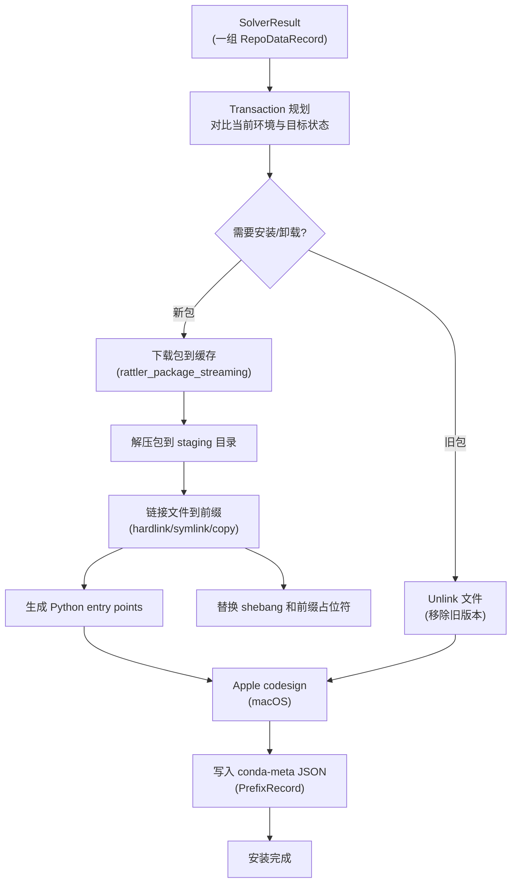

# 安装事务

`rattler` crate 的 `install` 模块负责将求解结果（一组 `RepoDataRecord`）实际安装到环境前缀中。它管理完整的安装生命周期：从包下载解压、文件链接、Python entry points 生成，到卸载时的文件清理。整个安装过程以**事务（Transaction）** 方式执行——要么全部成功，要么回滚到之前的一致状态。

## 安装流程概览

从求解结果到可用环境的完整流程：



## Transaction：事务规划

`Transaction` 是安装的核心类型，它对比当前环境状态和目标状态，生成操作列表：

```rust
use rattler::install::{Transaction, TransactionOperation};

// 从已安装的包和求解结果创建事务
let installed_prefix_records = /* 读取 <prefix>/conda-meta/ 中的所有 PrefixRecord */;
let target_records = solver_result.records;

let transaction = Transaction::from_current_and_desired(
    installed_prefix_records,
    target_records,
    Platform::current(),
)?;

// 遍历操作
for op in transaction.operations {
    match op {
        TransactionOperation::Install(record) => {
            println!("安装: {}={}", record.package_record.name, record.package_record.version);
        }
        TransactionOperation::Change { old, new } => {
            println!("更新: {} {} -> {}",
                old.repodata_record.package_record.name,
                old.repodata_record.package_record.version,
                new.package_record.version);
        }
        TransactionOperation::Remove(record) => {
            println!("卸载: {}={}",
                record.repodata_record.package_record.name,
                record.repodata_record.package_record.version);
        }
        TransactionOperation::Reinstall(record) => {
            println!("重装: {}={}",
                record.repodata_record.package_record.name,
                record.repodata_record.package_record.version);
        }
    }
}
```

### 事务操作类型

| 操作 | 说明 |
|------|------|
| `Install` | 新包安装（包不在环境中） |
| `Remove` | 包卸载（目标中不存在但已安装） |
| `Change` | 版本更新（同一包不同版本） |
| `Reinstall` | 重新安装（文件校验失败或强制重装） |

## Installer：安装执行器

`Installer` 是执行安装事务的高层 API：

```rust
use rattler::install::{Installer, InstallerError, LinkOptions, PythonInfo};
use rattler::install::AppleCodeSignBehavior;

let installer = Installer::new()
    .with_target_prefix(target_prefix.clone())
    .with_package_cache_dir(cache_dir.join("pkgs"))
    .with_download_client(reqwest_client)
    .with_link_options(LinkOptions {
        allow_symlinks: true,            // 允许符号链接
        allow_hardlinks: true,           // 允许硬链接
        allow_copy: true,                // 允许复制
        python_info: Some(PythonInfo::from_prefix(&target_prefix).await?),
        apple_codesign_behavior: AppleCodeSignBehavior::AdHoc,  // macOS 签名
        ..Default::default()
    })
    .with_execute_link_scripts(true);    // 执行 link/unlink 脚本

// 执行安装
let result = installer
    .install(solver_result.records, None)  // None = 无取消令牌
    .await?;
```

### 安装过程详解

#### 1. 包下载与缓存

Installer 自动处理包的下载：
- 首先检查包缓存（`<cache_dir>/pkgs/<sha256>/`）是否已有该包
- 如果缓存命中且验证通过，跳过下载
- 如果缓存未命中，使用 `rattler_package_streaming` 异步下载
- 下载后验证 MD5/SHA256 哈希
- 解压到缓存目录

#### 2. 文件链接（link）

解压后的包通过 `link::link_file()` 链接到目标前缀：

- **Hardlink**（优先）：如果包缓存和目标前缀在同一文件系统，使用硬链接。硬链接共享 inode，不占用额外磁盘空间，速度极快（只需创建目录项）。
- **Symlink**（次选）：跨文件系统时使用符号链接。
- **Copy**（兜底）：当链接都不可用时（如某些文件系统不支持），复制文件。

#### 3. 前缀占位符替换

conda 包中的文本文件可能包含前缀占位符（如 `/opt/conda` 或 `/home/user/miniconda3`），链接时需要替换为实际前缀路径。`link.rs` 中的前缀替换逻辑处理：
- shebang 行（`#!/opt/conda/bin/python` → `#!/home/user/env/bin/python`）
- `__PREFIX__` 占位符替换
- 二进制文件中的前缀路径替换（Windows 短路径处理）

#### 4. Python entry points 生成

对于包含 `info/run_exports.json` 或在 `info/recipe/entry_points.yaml`/`info/about.json` 中声明了 entry points 的 Python 包，Installer 生成对应的启动脚本：

- **Unix**：创建可执行 shell 脚本或无扩展名的可执行文件（`bin/conda`）
- **Windows**：创建 `.exe` 启动器（使用 Python 的 launcher）或 `.bat` 脚本

`entry_point.rs` 提供 `python_entry_point_template()` 函数生成脚本模板。

#### 5. Python 配置

`python.rs` 模块处理 Python 环境的特殊配置：
- 生成 `pyvenv.cfg`（虚拟环境标记）
- 设置 `sys.prefix` 路径
- 处理 noarch: python 包的 `.pyc` 编译

#### 6. Apple codesign（macOS）

在 macOS 上，修改二进制文件（如替换 shebang 中的前缀路径）会破坏代码签名。`apple_codesign.rs` 使用 `codesign` 命令行工具重新进行 ad-hoc 签名：

```rust
pub enum AppleCodeSignBehavior {
    Ignore,    // 不签名（可能导致 Gatekeeper 警告）
    AdHoc,     // Ad-hoc 签名（推荐）
    DoNothing, // 什么都不做
}
```

#### 7. conda-meta 写入

安装完成后，每个包的元数据写入 `<prefix>/conda-meta/<name>-<version>-<build>.json`：

```json
{
  "name": "numpy",
  "version": "1.26.0",
  "build": "py312habcd_0",
  "subdir": "linux-64",
  "url": "https://conda.anaconda.org/.../numpy-1.26.0-py312habcd_0.conda",
  "files": ["lib/python3.12/site-packages/numpy/__init__.py", "..."],
  "paths_data": {
    "paths": [
      {
        "_path": "lib/python3.12/site-packages/numpy/__init__.py",
        "path_type": "hardlink",
        "sha256": "..."
      }
    ]
  }
}
```

这使得以后可以准确地知道哪些文件属于哪个包，便于卸载。

## Clobber 处理

当多个包安装相同路径的文件时，会发生 "clobber"（覆盖）。`clobber_registry.rs` 管理这种情况：

- 跟踪哪些文件被多个包共享
- 第一个安装的包写入文件，后续包记录在 `.clobber-metadata.json`
- 卸载时，如果文件被其他包使用则保留
- `ClobberMode` 控制处理策略

## Unlink：卸载

`unlink::unlink_package()` 从环境前缀中移除包：
- 读取 `conda-meta` 中的 `paths_data`
- 检查文件是否被其他包使用（clobber registry）
- 删除不被其他包使用的文件
- 删除空目录
- 移动文件到 `.trash/` 目录而非直接删除（可选，用于恢复）

`unlink::empty_trash()` 清空垃圾目录。

## InstallDriver：并发安装驱动

`InstallDriver` 是底层驱动，管理并发安装过程，处理：
- 多线程/并发文件操作（使用 rayon 并行迭代器）
- 临时目录管理
- clobber registry 线程安全访问
- 进度报告聚合

## 进度报告

`Reporter` trait 用于报告安装进度：

```rust
pub trait Reporter: Send + Sync {
    fn on_download_start(&self, pkg_name: &str, total: Option<u64>);
    fn on_download_progress(&self, pkg_name: &str, bytes: u64, total: Option<u64>);
    fn on_download_complete(&self, pkg_name: &str, bytes: u64);
    fn on_install_start(&self, pkg_name: &str);
    fn on_install_complete(&self, pkg_name: &str);
    fn on_unlink_start(&self, pkg_name: &str);
    fn on_unlink_complete(&self, pkg_name: &str);
}
```

`IndicatifReporter` 提供 CLI 进度条实现。

## 相关概念

- [包流式处理](08-package-streaming.md)
- [Shell 激活与环境执行](10-shell-activation.md)
- [Repodata 网关](07-repodata-gateway.md)
