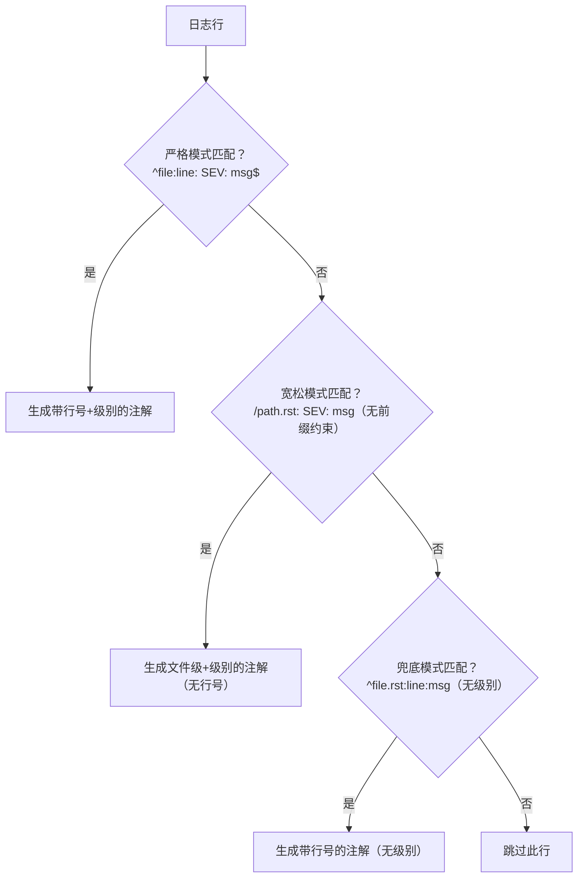

# 三种正则模式详解

sphinx_matcher.json 包含三个正则匹配模式，形成**严格→宽松→兜底**的分层覆盖策略，以捕获 Sphinx 输出的不同格式的警告信息。

## 模式一：严格模式（sphinx-problem-matcher）

```json
{
    "owner": "sphinx-problem-matcher",
    "pattern": [{
        "regexp": "^(.*):(\\d+):\\s+(\\w*):\\s+(.*)$",
        "file": 1,
        "line": 2,
        "severity": 3,
        "message": 4
    }]
}
```

### 正则逐字符解析

| 部分 | 含义 |
|------|------|
| `^` | 行首锚定 |
| `(.*)` | **捕获组 1 (file)**：匹配任意字符（除换行符），直到遇到第一个冒号+数字模式 |
| `:` | 字面冒号，分隔文件路径和行号 |
| `(\\d+)` | **捕获组 2 (line)**：匹配一个或多个数字（行号） |
| `:` | 字面冒号，分隔行号和级别 |
| `\\s+` | 一个或多个空白字符（空格/制表符） |
| `(\\w*)` | **捕获组 3 (severity)**：匹配零个或多个单词字符（WARNING/ERROR等） |
| `:` | 字面冒号，分隔级别和消息 |
| `\\s+` | 一个或多个空白字符 |
| `(.*)` | **捕获组 4 (message)**：匹配剩余的所有字符（消息内容） |
| `$` | 行尾锚定 |

### 匹配的日志格式

```
<文件路径>:<行号>: <级别>: <消息>
```

### 匹配示例

测试脚本中的前三条日志都被此模式匹配：

```
/tmp/spam/warnings_and_errors/index.rst:16: WARNING: Error in "code-block" directive:
/tmp/spam/warnings/index.rst:22: WARNING: Problems with "include" directive path:
/tmp/spam/warnings/index.rst:24: WARNING: Unknown directive type "BADDIRECTIVE".
```

解析结果：
- file: `/tmp/spam/warnings_and_errors/index.rst`
- line: `16`
- severity: `WARNING`
- message: `Error in "code-block" directive:`

### 设计要点

- `(.*)` 用于文件路径：Sphinx 输出的文件路径可能是绝对路径（以 `/` 开头）或相对路径，`.*` 两种都能匹配
- `(\\d+)` 严格要求数字行号：这是区分"文件路径中的冒号"和"文件:行号分隔符"的关键——路径中的冒号后不会紧跟纯数字
- `(\\w*)` 匹配级别：Sphinx 使用 WARNING 和 ERROR 两个级别，都是纯单词字符；使用 `*`（零或多）而非 `+`（一或多）以处理级别缺失的情况
- `^` 和 `$` 锚定：确保整行匹配，避免部分匹配导致的误报

## 模式二：宽松模式（sphinx-problem-matcher-loose）

```json
{
    "owner": "sphinx-problem-matcher-loose",
    "pattern": [{
        "_comment": "A bit of a looser pattern, doesn't look for line numbers, just looks for file names relying on them to start with / and end with .rst",
        "regexp": "(/.*\\.rst):\\s+(\\w*):\\s+(.*)$",
        "file": 1,
        "severity": 2,
        "message": 3
    }]
}
```

### 正则逐字符解析

| 部分 | 含义 |
|------|------|
| `(/` | 以斜杠开头（绝对路径特征） |
| `.*` | 匹配路径中间的任意字符 |
| `\\.rst)` | **捕获组 1 (file)**：以 `.rst` 结尾（字面点号需要转义） |
| `:` | 字面冒号 |
| `\\s+` | 一个或多个空白字符 |
| `(\\w*)` | **捕获组 2 (severity)**：严重级别 |
| `:` | 字面冒号 |
| `\\s+` | 一个或多个空白字符 |
| `(.*)` | **捕获组 3 (message)**：消息内容 |
| `$` | 行尾锚定 |

### 匹配的日志格式

```
<任意前缀>/<路径>.rst: <级别>: <消息>
```

注意：此模式**不要求行首锚定**（没有 `^`），也**不捕获行号**（没有 `line` 映射）。

### 匹配示例

测试脚本中的第四条日志被此模式匹配：

```
checking consistency... /tmp/spam/warnings/notintoc.rst: WARNING: document isn't included in any toctree
```

解析结果：
- file: `/tmp/spam/warnings/notintoc.rst`
- line: null（无行号映射）
- severity: `WARNING`
- message: `document isn't included in any toctree`

### 为什么需要宽松模式

Sphinx 的 "checking consistency" 阶段输出的警告格式不同：
- 行首有 `checking consistency... ` 前缀文本
- 文件路径前面有其他文字
- 没有行号信息（因为这是文档级别的全局问题，不关联到特定行）

严格模式要求行首就是文件路径（`^` 锚定），无法匹配这种带有前缀的格式。宽松模式通过：
1. 去掉 `^` 锚定，允许路径出现在行中任意位置
2. 不要求行号（去掉 `(\\d+):` 部分）
3. 要求路径以 `/` 开头、`.rst` 结尾（通过 `(/.*\\.rst)` 约束），减少误报

### 设计要点

- 以 `/` 开头、`.rst` 结尾是关键约束：这防止匹配到行中其他包含冒号的文本（如代码示例中的 `warning:`）
- 无 `^` 锚定：允许前缀文本存在
- 无 `line` 字段：注解不会关联到具体行号，显示在文件级别

## 模式三：兜底模式（sphinx-problem-matcher-loose-no-severity）

```json
{
    "owner": "sphinx-problem-matcher-loose-no-severity",
    "pattern": [{
        "_comment": "Looks for file names ending with .rst and line numbers but without severity",
        "regexp": "^(.*\\.rst):(\\d+):(.*)$",
        "file": 1,
        "line": 2,
        "message": 3
    }]
}
```

### 正则逐字符解析

| 部分 | 含义 |
|------|------|
| `^` | 行首锚定 |
| `(.*\\.rst)` | **捕获组 1 (file)**：任意字符开头，以 `.rst` 结尾（文件路径） |
| `:` | 字面冒号 |
| `(\\d+)` | **捕获组 2 (line)**：行号 |
| `:` | 字面冒号 |
| `(.*)` | **捕获组 3 (message)**：消息内容（无级别前缀） |
| `$` | 行尾锚定 |

### 匹配的日志格式

```
<文件.rst>:<行号>:<消息>
```

注意：此模式**不要求级别字段**（没有 `WARNING:`/`ERROR:` 前缀），消息紧跟在行号后的冒号之后。

### 匹配场景

此模式捕获 Sphinx 输出中不使用标准 `WARNING:`/`ERROR:` 前缀的警告格式，例如：

```
config.rst:42:Undefined label or reference target
index.rst:10:Duplicate explicit target name: "example"
```

这些消息可能来自 Sphinx 扩展或特定构建阶段，格式不如标准警告统一。

### 设计要点

- 文件路径必须以 `.rst` 结尾（`.*\\.rst`）：提供路径识别约束，避免匹配到其他含冒号数字的行
- 有行号（`\\d+`）：保留精确的行定位
- 无 severity 字段：消息中不提取级别信息，注解将使用默认级别（notice/warning）
- 行首锚定（`^`）：路径必须出现在行首

## 三种模式的协作关系



注意：实际上 GitHub runner **不是顺序尝试**的——所有 matcher 是并行评估的，同一行可能被多个 matcher 匹配。上图只是逻辑上的覆盖层次。

## 三种模式对比

| 特性 | 严格模式 | 宽松模式 | 兜底模式 |
|------|---------|---------|---------|
| owner | sphinx-problem-matcher | sphinx-problem-matcher-loose | sphinx-problem-matcher-loose-no-severity |
| 行首锚定 | ✅ `^` | ❌ 无 | ✅ `^` |
| 文件路径约束 | `.*`（任意） | `/.*\.rst`（绝对路径+.rst） | `.*\.rst`（任意路径+.rst） |
| 行号捕获 | ✅ `(\d+)` | ❌ 无 | ✅ `(\d+)` |
| 严重级别捕获 | ✅ `(\w*)` | ✅ `(\w*)` | ❌ 无 |
| 注解精度 | 文件+行号+级别 | 文件+级别 | 文件+行号 |
| 覆盖场景 | 标准警告/错误 | consistency 检查、前缀文本 | 无级别前缀的警告 |
| 误报风险 | 低（锚定严格） | 中（无行首锚定但有路径约束） | 中（无级别约束） |

## 相关概念

- [Problem Matcher JSON 格式](/concepts/03-matcher-json.md)
- [测试 Problem Matcher](/concepts/05-testing.md)
- [Action 结构解析](/concepts/02-action-structure.md)
- [自定义 Problem Matcher 示例](/examples/custom-matcher.md)
- [源码信源登记](/references/github-problem-matcher-source.md)
