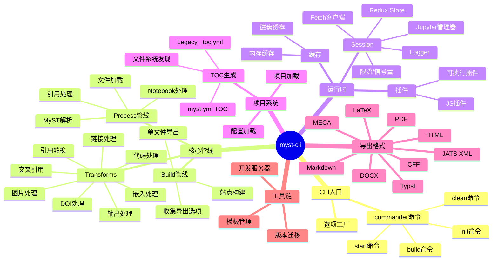
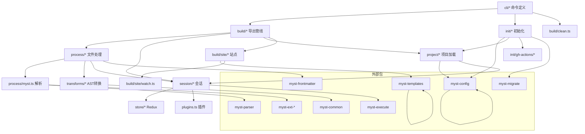

# myst-cli 架构洞察与知识地图

## 架构洞察

### 洞察一：Session 作为依赖注入容器

myst-cli 采用 **Session 对象作为全局依赖注入容器** 的架构模式。Session 不仅是日志和配置的持有者，还聚合了 Redux Store、HTTP 客户端（含代理）、并发控制器（p-limit + Semaphore）、Jupyter 内核管理器、插件系统等全部运行时依赖。所有处理函数（build/process/transforms）都通过 `ISession` 参数获取所需能力，而非通过模块级单例或全局变量。

**设计意义**：
- 支持 `clone()` 创建隔离的子会话（共享资源但独立状态），适用于多项目并行构建
- 便于测试——可以注入 mock logger、mock store
- 资源生命周期统一管理——`dispose()` 一次清理所有克隆和 Jupyter 连接

**代价**：ISession 接口持续膨胀（目前约 15 个方法/属性），存在成为"上帝对象"的风险。缓存相关属性通过 `ISessionWithCache` 类型扩展（castSession 动态挂载），部分缓解了接口膨胀。

### 洞察二：Redux 驱动的状态管理而非事件总线

CLI 工具通常使用事件发射器或简单的对象传参来管理状态，但 myst-cli 选择了 **Redux 单向数据流**。Projects、Config、Affiliations 等 slice 通过 dispatch action 更新，selectors 提供只读查询。

**设计意义**：
- 状态变更可追踪、可回放——对调试复杂的多项目构建链路有价值
- Selector 模式提供了派生状态的缓存点
- 时间旅行调试理论上可行

**代价**：相比简单对象，Redux 引入了样板代码（slice、reducer、action），对 CLI 场景来说偏重。这反映了 myst-cli 从一开始就被设计为支持长生命周期服务（start 开发服务器），而非仅仅一次性脚本。

### 洞察三：格式无关的 Build 管线

build 命令的 `collectAllBuildExportOptions()` → `localArticleExport()` 管线采用 **收集→分发** 模式：先统一收集所有导出任务（含格式、输入文件、输出路径），再按格式分发给具体导出器（pdf/docx/tex/html等）。

**关键设计**：
- `ExportFormats` 枚举在 myst-frontmatter 包中定义，CLI 层只做格式路由
- 格式选项解析与实际导出解耦——`getAllowedExportFormats()` 决定"建什么"，各格式模块决定"怎么建"
- `--force` 标志覆盖 frontmatter 中的 exports 声明，支持命令行临时导出

**值得注意**：PDF 导出实际上会触发三种格式（pdf + pdftex + typst），这是因为 PDF 有多种生成路径（LaTeX 和 Typst 两种后端）。

### 洞察四：分层缓存策略

myst-cli 实现了 **双层缓存**：
1. **内存缓存**（ISessionWithCache 的 $ 前缀属性）：缓存 MDAST 树、引用渲染器、DOI 数据、外部引用——避免同一文件重复解析
2. **磁盘缓存**（`_build/cache/`）：跨构建会话持久化，支持 maxAge 过期策略

**设计哲学**：内存缓存按路径/DOI/ID 细粒度索引，磁盘缓存以文件名为单位（适合存储 HTTP 响应、模板等大件）。两者互补，内存层解决同一会话内的重复计算，磁盘层解决跨会话的重复 IO。

### 洞察五：插件的双协议设计

插件系统支持 executable 和 javascript 两种协议，这反映了**多语言扩展**的设计意图：
- **javascript (.mjs)**：直接动态 import，适合 Node.js 生态扩展
- **executable**：通过 stdin/stdout JSON-RPC 风格通信，支持任意语言编写的插件（Python、Rust 等）

这让 myst-cli 不局限于 JS 生态，为未来支持其他语言的指令/角色扩展留下了空间。

## 知识地图

## 模块依赖关系

## 学习路径建议

1. **入门**：阅读 [CLI 架构](/concepts/00-cli-architecture.md) 理解命令注册机制，然后跟着 [初始化项目](/examples/01-init-project.md) 实操
2. **构建流程**：[Build 管线](/concepts/01-build-pipeline.md) → [构建站点](/examples/02-build-site.md)
3. **开发服务**：[Start 开发服务器](/concepts/02-start-dev-server.md) → [启动开发服务器](/examples/03-dev-server.md)
4. **深入理解**：项目加载 → Session 缓存 → Store 状态 → 模板系统 → 版本迁移
