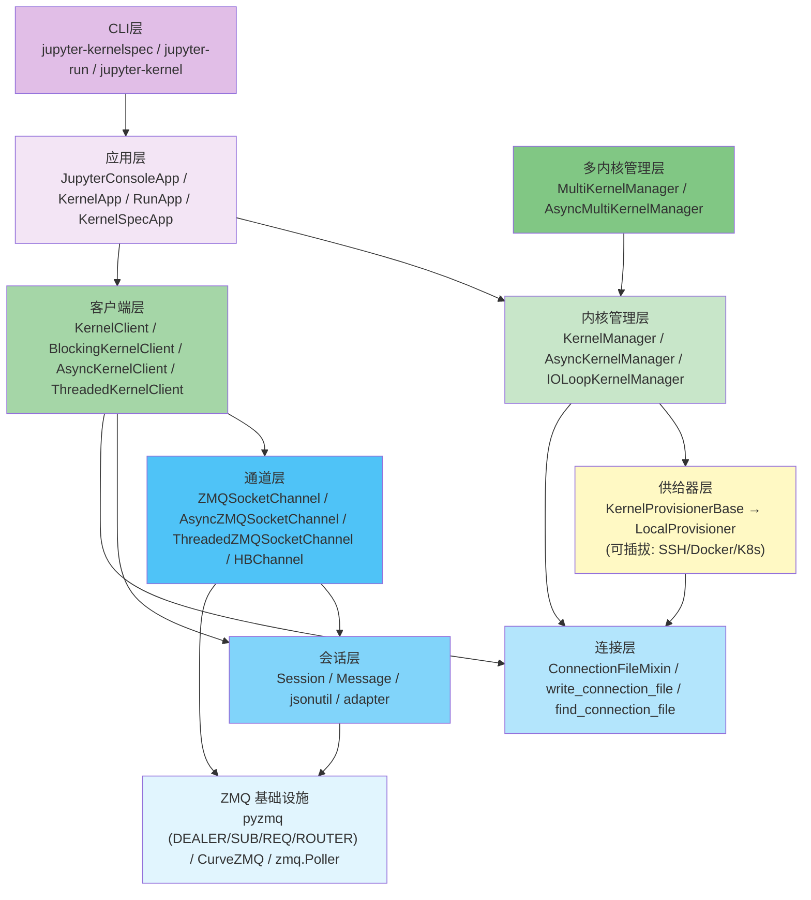

# 架构总览

jupyter_client 采用**五层分层架构**，底层为 ZMQ 通信基础设施，上层为应用级 API。同时采用 Manager-Client 分离模式，将内核生命周期管理与通信职责清晰划分。

## 分层架构图



## 各层职责详解

### 第0层：ZMQ 基础设施

底层通信基于 pyzmq（≥25.0），使用五种 ZMQ socket 类型：

| Socket 类型 | 用途 | 通信模式 |
|------------|------|---------|
| `zmq.DEALER` | shell/stdin/control 通道 | 异步请求-应答，支持负载均衡 |
| `zmq.SUB` | iopub 通道 | 订阅-发布，前端订阅内核广播 |
| `zmq.REQ` | hb 通道 | 简单请求-应答，ping/pong 心跳 |

可选 CurveZMQ 加密，提供安全的内核通信。

### 第1层：连接层 (connect.py)

`ConnectionFileMixin` 是连接管理的核心 Mixin，被 KernelClient 和 KernelManager 共同继承：

- **连接文件读写**：JSON 格式的连接文件包含 IP、端口、HMAC key、传输协议、CurveZMQ 密钥
- **端口自动发现**：通过 `bind((ip, 0))` 让 OS 分配随机端口，`LocalPortCache` 防止多内核竞争
- **Socket 工厂**：`connect_shell()`/`connect_iopub()`/`connect_stdin()`/`connect_control()`/`connect_hb()` 方法创建并连接 ZMQ socket
- **传输协议**：支持 `tcp`（默认）和 `ipc`（Unix domain socket）

### 第2层：会话层 (session.py, jsonutil.py, adapter.py)

`Session` 类是消息协议的实现核心：

- **消息构建**：`msg(msg_type, content)` 构建符合 Jupyter 消息协议的消息字典
- **序列化**：自动选择 orjson（最快）→ json（标准）→ msgpack（二进制）→ pickle（Python专用）
- **HMAC 签名**：HMAC-SHA256 签名验证，`compare_digest` 防时序攻击；key 为空时不签名
- **ZMQ 帧收发**：多帧格式 `[idents..., DELIM, HMAC, header, parent, metadata, content, buffers...]`
- **版本适配**：`adapt_version` 非零时通过 `adapter.py` 在 v4/v5 协议间转换

`jsonutil.py` 提供日期处理（`extract_dates`/`squash_dates`）、NaN清理（`json_clean`）等 JSON 兼容工具。

### 第3层：通道层 (channels.py, threaded.py)

通道层封装 ZMQ socket 的消息收发：

| 通道类 | 基类 | Socket类型 | 特点 |
|--------|------|-----------|------|
| `ZMQSocketChannel` | object | zmq.Socket | 同步阻塞收发 |
| `AsyncZMQSocketChannel` | ZMQSocketChannel | zmq.asyncio.Socket | async/await 收发 |
| `ThreadedZMQSocketChannel` | ZMQSocketChannel | ZMQStream | IOLoop 线程安全收发 |
| `HBChannel` | Thread | zmq.REQ | 守护线程心跳监控 |

### 第4层：客户端层 (client.py, blocking/client.py, asynchronous/client.py, threaded.py)

客户端层提供消息发送 API：

- **`KernelClient`**（基类）：继承 `ConnectionFileMixin`，定义五个通道类 trait，提供 `execute()`/`complete()`/`inspect()`/`history()`/`kernel_info()`/`shutdown()` 等消息发送方法，以及 `execute_interactive()` 交互执行方法
- **`BlockingKernelClient`**：通过 `run_sync` 包装异步方法，提供阻塞式 `get_shell_msg()`/`wait_for_ready()` 等方法
- **`AsyncKernelClient`**：使用 `zmq.asyncio.Context`，所有方法原生 async/await
- **`ThreadedKernelClient`**：在独立线程运行 ZMQ IOLoop，支持从任意线程安全调用

### 第5层：供给器层 (provisioning/)

供给器层抽象内核进程的启动与管理：

- **`KernelProvisionerBase`**（ABC）：定义8个抽象生命周期方法——`pre_launch()`/`launch_kernel()`/`post_launch()`/`poll()`/`wait()`/`send_signal()`/`kill()`/`terminate()`/`cleanup()`
- **`LocalProvisioner`**：默认实现，使用 `subprocess.Popen` 管理本地进程
- **`KernelProvisionerFactory`**：单例工厂，通过 entry_points（`jupyter_client.kernel_provisioners`）发现供给器

### 第6层：内核管理层 (manager.py, multikernelmanager.py, restarter.py, ioloop/)

- **`KernelManager`**：继承 `ConnectionFileMixin` 和 `KernelClientFactory`，管理单个内核的完整生命周期，将进程操作委托给 Provisioner
- **`AsyncKernelManager`**：异步版本，使用 `zmq.asyncio.Context`
- **`IOLoopKernelManager`**：基于 Tornado IOLoop 的管理器，配合 `IOLoopKernelRestarter` 实现自动重启
- **`MultiKernelManager`**/`AsyncMultiKernelManager`：管理多个内核实例，通过 `kernel_id` 字典索引
- **`KernelRestarter`**：心跳监控自动重启，支持 `restart_limit` 和 `stable_start_time` 启发式

### 第7层：应用层 (consoleapp.py, kernelapp.py, runapp.py, kernelspecapp.py)

基于 `traitlets.config.Application` 的 CLI 应用：
- `JupyterConsoleApp`：Jupyter 控制台应用基类
- `KernelApp`：`jupyter-kernel` 命令，启动内核进程
- `RunApp`：`jupyter-run` 命令，运行脚本文件
- `KernelSpecApp`：`jupyter-kernelspec` 命令，管理内核规范

## 核心设计模式

### Manager-Client 分离

```
┌──────────────────┐         ┌──────────────────┐
│  KernelManager   │         │   KernelClient   │
│                  │         │                  │
│ · 启动/停止内核   │◀─parent──│ · 发送消息       │
│ · 管理进程生命周期 │         │ · 接收应答       │
│ · 委托 Provisioner│         │ · 通道管理       │
│ · 创建 Client     │──create─▶│ · output_hook    │
└──────────────────┘         └──────────────────┘
```

`KernelManager` 负责内核"生死"（启动/停止/重启/信号），`KernelClient` 负责"说话"（消息收发）。两者通过 `parent` 引用关联，Client 可以通过 `self.parent` 访问 Manager（如检查内核存活）。

### 可插拔 Provisioner

```
KernelManager ──使用──▶ KernelProvisionerFactory ──创建──▶ KernelProvisionerBase
                                                              │
                                           ┌──────────────────┼──────────────────┐
                                           ▼                  ▼                  ▼
                                    LocalProvisioner    SSHProvisioner    DockerProvisioner
                                    (subprocess.Popen)  (第三方)           (第三方)
```

通过 entry_points 机制，第三方可以注册自定义 Provisioner 而无需修改 jupyter_client 代码。

### Traitlets 配置系统

所有核心类（Session、ConnectionFileMixin、KernelManager、KernelClient）都继承自 `traitlets.config.Configurable`/`LoggingConfigurable`，支持：
- 类型安全的配置属性（Unicode/Integer/Bool/Instance/Type）
- 配置文件和命令行参数统一配置
- `@observe` 响应式属性变更监听
- `@default` 默认值工厂方法

### 通道懒加载

KernelClient 的五个通道属性均为 **lazy property**：首次访问时才创建 ZMQ socket 和 channel 对象，避免不必要的资源占用。

## 数据流：代码执行全过程

用户执行 `kc.execute("2+2")` 时的完整数据流：

1. **构建消息**：`Session.msg("execute_request", {"code": "2+2", ...})` 构建消息字典，生成 msg_id、时间戳、session 信息
2. **序列化签名**：Session 将消息序列化为 bytes 帧，计算 HMAC-SHA256 签名
3. **发送**：`shell_channel.send(msg)` 通过 ZMQ DEALER socket 发送多帧消息
4. **内核处理**：ipykernel 接收消息，执行代码，通过 iopub 广播 `status: busy` → `execute_input` → `stream`/`execute_result`/`error` → `status: idle`
5. **shell 应答**：内核通过 shell 通道发送 `execute_reply`（含 execution_count、status）
6. **接收**：Client 通过 `get_iopub_msg()`/`get_shell_msg()` 从通道拉取消息，反序列化并验证 HMAC
7. **回调**：`execute_interactive()` 的 `output_hook` 被调用处理输出

## 相关概念

- [jupyter_client 简介](00-introduction.md)
- [5分钟快速上手](01-getting-started.md)
- [五通道系统](03-channels-system.md)
- [连接管理与消息协议](04-connection-and-session.md)
