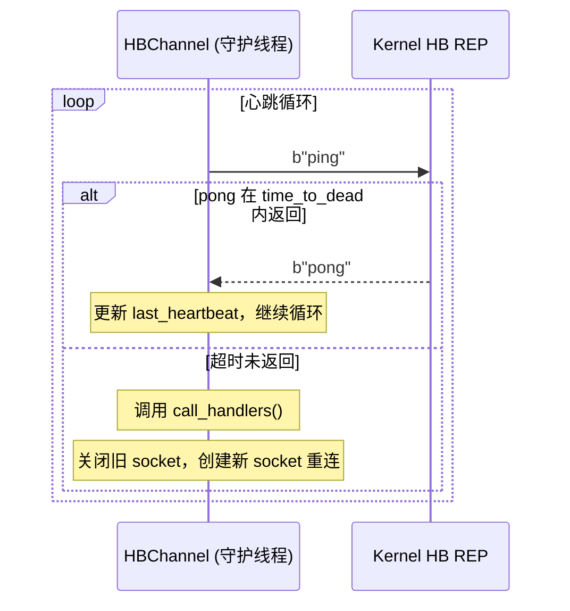
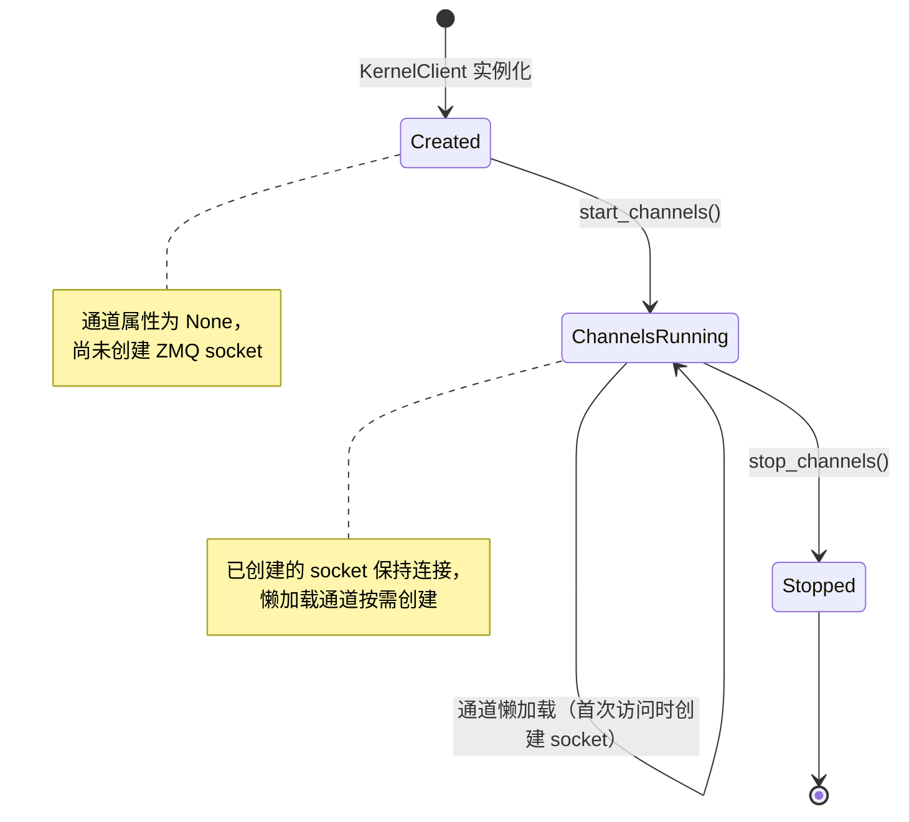

# 五通道系统

jupyter_client 使用五个独立的 ZeroMQ 通道与内核通信。每个通道使用不同的 ZMQ socket 类型，具有不同的消息流向和职责，构成了 Jupyter 消息协议的通信骨架。

## 五通道总览

```mermaid
graph LR
    subgraph "前端 (jupyter_client)"
        SHELL_C["shell_channel<br/>DEALER"]
        IOPUB_C["iopub_channel<br/>SUB"]
        STDIN_C["stdin_channel<br/>DEALER"]
        HB_C["hb_channel<br/>REQ"]
        CTRL_C["control_channel<br/>DEALER"]
    end

    subgraph "内核 (Kernel)"
        SHELL_S["shell_router<br/>ROUTER"]
        IOPUB_S["iopub_pub<br/>PUB"]
        STDIN_S["stdin_router<br/>ROUTER"]
        HB_S["hb_rep<br/>REP"]
        CTRL_S["control_router<br/>ROUTER"]
    end

    SHELL_C <-->|"请求/应答"| SHELL_S
    IOPUB_C <--|"订阅广播"| IOPUB_S
    STDIN_C <-->|"输入请求/回传"| STDIN_S
    HB_C <-->|"ping/pong"| HB_S
    CTRL_C <-->|"控制命令"| CTRL_S

    style SHELL_C fill:#a5d6a7
    style IOPUB_C fill:#fff9c4
    style STDIN_C fill:#b3e5fc
    style HB_C fill:#ffccbc
    style CTRL_C fill:#e1bee7
```

## 通道详解

### 1. Shell 通道（DEALER-ROUTER）

**Socket 类型**：客户端 DEALER，服务端 ROUTER

**职责**：处理前端与内核之间的请求-应答交互，是代码执行和查询的主要通道。

**支持的请求类型**：

| 请求消息类型 | 说明 |
|------------|------|
| `execute_request` | 执行代码 |
| `complete_request` | 代码补全 |
| `inspect_request` | 对象内省（？操作符） |
| `history_request` | 历史查询 |
| `kernel_info_request` | 获取内核信息 |
| `comm_info_request` | 获取 Comm 通信通道信息 |
| `is_complete_request` | 检查代码是否完整（多行输入判断） |

**Shell 通道的消息模式**：每个请求都有对应的 reply（`execute_reply`、`complete_reply` 等），通过 `msg_id` 关联请求与应答。

**为什么用 DEALER 而不是 REQ？**：
- REQ socket 强制严格的 send→recv 交替模式，不适合前端可能需要发送多个请求再依次接收的场景
- DEALER 是异步的，支持多个请求并发（通过 msg_id 区分），与 ROUTER 配对提供请求路由能力
- KernelClient 在 shell 通道发送消息时自动添加 session ID 作为 ZMQ identity frame

```python
# client.py: Shell 通道消息发送示例
def execute(self, code, silent=False, store_history=True,
            user_expressions=None, allow_stdin=None, stop_on_error=True):
    """执行代码，返回 msg_id（不等待结果）"""
    content = {
        "code": code,
        "silent": silent,
        "store_history": store_history,
        "user_expressions": user_expressions or {},
        "allow_stdin": allow_stdin if allow_stdin is not None else self.allow_stdin,
        "stop_on_error": stop_on_error,
    }
    msg = self.session.msg("execute_request", content)
    self.shell_channel.send(msg)
    return msg["header"]["msg_id"]
```

### 2. IOPub 通道（SUB-PUB）

**Socket 类型**：客户端 SUB，服务端 PUB

**职责**：内核广播所有输出和状态更新，前端订阅接收。这是**唯一**的数据广播通道，所有 stdout/stderr/display data/状态变化都通过此通道发布。

**广播的消息类型**：

| 消息类型 | 说明 |
|---------|------|
| `stream` | stdout/stderr 文本输出 |
| `display_data` | 富媒体显示数据（HTML/PNG/SVG等） |
| `update_display_data` | 更新已显示的 display data |
| `execute_result` | 代码执行结果（最后一个表达式的值） |
| `error` | 执行错误（traceback） |
| `status` | 执行状态变化（busy/idle/starting） |
| `clear_output` | 清除当前输出区域 |
| `execute_input` | 正在执行的代码（用于输入历史记录） |
| `comm_open/comm_msg/comm_close` | Comm 通道消息（ipywidgets 等） |

**为什么用 SUB-PUB？**：
- PUB-SUB 是一对多广播模式，内核只发一次，多个前端（Notebook多个视图、Console连接）都能收到
- SUB 必须设置订阅过滤——jupyter_client 订阅所有消息（`setsockopt(zmq.SUBSCRIBE, b"")`），不做 topic 过滤
- PUB 是 fire-and-forget，如果 SUB 来不及接收会丢消息（慢速消费者问题），但 Jupyter 协议接受这个特性——输出本身是流式的，丢失不会破坏协议一致性

```python
# channels.py: IOPub 通道连接时设置订阅
def connect_iopub(self, identity=None):
    sock = self._create_connected_socket("iopub", identity=identity)
    sock.setsockopt(zmq.SUBSCRIBE, b"")  # 订阅所有消息
    return sock
```

### 3. Stdin 通道（DEALER-ROUTER）

**Socket 类型**：客户端 DEALER，服务端 ROUTER

**职责**：处理内核请求前端输入的场景。与 shell 通道方向相反——**内核发起请求，前端回传输入**。

**消息类型**：

| 消息类型 | 方向 | 说明 |
|---------|------|------|
| `input_request` | 内核→前端 | 请求标准输入（`input()`/`getpass()` 触发） |
| `input_reply` | 前端→内核 | 回传用户输入的字符串 |

**典型场景**：代码中调用 `name = input("Enter your name: ")` 时：
1. 内核通过 stdin 通道发送 `input_request`（含 prompt 文本）
2. 前端显示 prompt，等待用户输入
3. 用户输入后，前端通过 stdin 通道发送 `input_reply`（含用户输入的字符串）
4. 内核收到 input_reply，`input()` 函数返回用户输入

```python
# client.py: Stdin 输入回传
def input(self, string):
    """向 stdin 通道发送 input_reply"""
    content = {"value": string}
    msg = self.session.msg("input_reply", content)
    self.stdin_channel.send(msg)
```

### 4. Heartbeat 通道（REQ-REP）

**Socket 类型**：客户端 REQ，服务端 REP

**职责**：心跳监控，检测内核是否存活。这是唯一一个使用独立线程和 REQ-REP 模式的通道。

**工作机制**：



**关键特性**：
- **守护线程**：`daemon = True`，主进程退出时自动终止
- **`time_to_dead = 1.0` 秒**：1秒内未收到 pong 判定心跳失败
- **失败处理**：调用 `call_handlers(since_last_heartbeat)` 回调，由 KernelRestarter 监听触发自动重启
- **REQ-REP 选择原因**：心跳是简单的 ping-pong 模式，REQ-REP 的严格 send→recv 交替正好匹配，不需要并发
- **自动重连**：心跳失败时关闭旧 socket，创建新 socket 重连到内核

```python
# channels.py: HBChannel 核心心跳循环（异步版本）
async def _async_run(self):
    while not self._exiting:
        try:
            await self._async_send(b"ping")
            # 等待 pong，超时 time_to_dead 秒
            poller = zmq.asyncio.Poller()
            poller.register(self.socket, zmq.POLLIN)
            events = dict(await poller.poll(self.time_to_dead * 1000))
            if events.get(self.socket) == zmq.POLLIN:
                await self._async_recv()  # b"pong"
                self._beating = True
            else:
                raise zmq.ZMQError("heartbeat timeout")
        except Exception:
            self._beating = False
            self.call_handlers(...)  # 触发回调
            self._reconnect()  # 重建 socket
        await asyncio.sleep(0)  # 让出事件循环
```

### 5. Control 通道（DEALER-ROUTER）

**Socket 类型**：客户端 DEALER，服务端 ROUTER（与 shell 通道相同）

**职责**：处理高优先级控制命令，**优先级高于 shell 通道**。当 shell 通道被长时间执行的代码阻塞时，control 通道仍然可以响应。

**消息类型**：

| 消息类型 | 说明 |
|---------|------|
| `shutdown_request` | 关闭/重启内核请求 |
| `interrupt_request` | 中断当前执行 |
| `debug_request` | 调试器请求 |

**为什么独立 control 通道？**：
- Shell 通道的 ROUTER 可能正在处理一个长时间运行的 execute_request，此时前端发送 shutdown 或 interrupt 需要能立即到达
- 内核侧通常使用独立线程/优先级队列处理 control 通道消息
- 如果 shutdown 走 shell 通道，在内核忙于执行代码时无法响应关闭请求

```python
# client.py: shutdown 通过 control 通道发送
def shutdown(self, restart=False):
    content = {"restart": restart}
    msg = self.session.msg("shutdown_request", content)
    self.control_channel.send(msg)
    return msg["header"]["msg_id"]
```

## 通道生命周期



### start_channels()

```python
# client.py
def start_channels(self, shell=True, iopub=True, stdin=True, hb=True, control=True):
    """启动指定的通道"""
    if shell:
        self.shell_channel.start()
    if iopub:
        self.iopub_channel.start()
    if stdin:
        self.stdin_channel.start()
    if hb:
        self.hb_channel.start()  # 启动心跳线程
    if control:
        self.control_channel.start()
```

### 通道懒加载机制

```python
# client.py: 通道属性使用 lazy property
@property
def shell_channel(self):
    if getattr(self, "_shell_channel", None) is None:
        url = self._make_url("shell")
        self._shell_channel = self.shell_channel_class(
            self.connect_shell(self.session.bsession),
            self.session,
            self.loop,
        )
    return self._shell_channel
```

注意：`connect_shell()` 传入 `self.session.bsession` 作为 ZMQ identity frame，用于 ROUTER socket 的路由识别。

## 通道配置与参数

每个通道的创建遵循 `channel_socket_types` 映射：

```python
# connect.py
channel_socket_types = {
    "hb": zmq.REQ,
    "shell": zmq.DEALER,
    "iopub": zmq.SUB,
    "stdin": zmq.DEALER,
    "control": zmq.DEALER,
}
```

Socket 创建时统一配置：
- **LINGER**：设置为内核进程生命周期内合理值，防止关闭时 hang
- **Identity**：shell/stdin/control 通道使用 session UUID 作为 ZMQ identity
- **CurveZMQ**：配置 `curve_secretkey`/`curve_publickey`/`curve_serverkey`（如启用）
- **IOPub SUBSCRIBE**：`setsockopt(zmq.SUBSCRIBE, b"")` 订阅全部消息

## 相关概念

- [架构总览](02-architecture-overview.md)
- [连接管理与消息协议](04-connection-and-session.md)
- [客户端体系](05-client-hierarchy.md)
