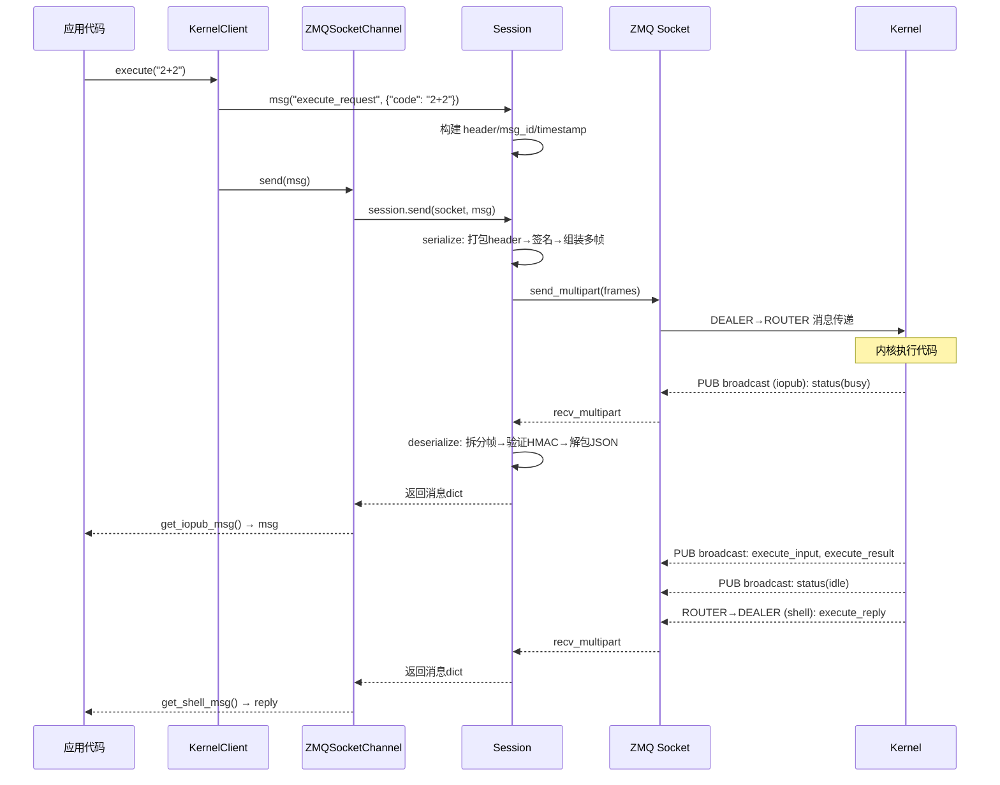

# 连接管理与消息协议

连接管理和消息协议是 jupyter_client 通信层的两大基石：**ConnectionFileMixin** 负责连接参数的持久化和 Socket 创建，**Session** 负责消息的构建、序列化、签名和收发。

## 一、连接文件管理

### 连接文件格式

连接文件是一个 JSON 文件，存储了连接到内核所需的全部参数。通常位于 `jupyter_runtime_dir()` 目录（如 `~/.local/share/jupyter/runtime/kernel-<uuid>.json`）。

```json
{
  "shell_port": 59876,
  "iopub_port": 59877,
  "stdin_port": 59878,
  "control_port": 59879,
  "hb_port": 59880,
  "ip": "127.0.0.1",
  "key": "a1b2c3d4-e5f6-7890-abcd-ef1234567890",
  "transport": "tcp",
  "signature_scheme": "hmac-sha256",
  "kernel_name": "python3"
}
```

| 字段 | 类型 | 说明 |
|------|------|------|
| `shell_port`/`iopub_port`/`stdin_port`/`control_port`/`hb_port` | int | 五个通道的端口号（0表示自动分配） |
| `ip` | string | 内核监听的 IP 地址（默认 localhost/127.0.0.1） |
| `key` | string | HMAC 签名密钥（UUID 格式，空字符串表示不签名） |
| `transport` | string | 传输协议：`"tcp"` 或 `"ipc"`（Unix domain socket） |
| `signature_scheme` | string | 签名方案：`"hmac-sha256"`（默认）或 `"hmac-HASH"` 其他格式 |
| `kernel_name` | string | 内核名称 |
| `curve_publickey`/`curve_secretkey` | string (可选) | CurveZMQ 加密密钥（Z85 编码） |

### 端口自动发现

当端口号为 0 时，`write_connection_file()` 会自动发现可用端口：

```python
def write_connection_file(fname=None, shell_port=0, iopub_port=0, ...):
    # 将端口为0的通道绑定到临时 socket 获取随机端口
    # 然后立即关闭这些 socket，记录端口号
    # 内核启动后会绑定到这些端口
```

为防止多内核同时启动导致的端口竞争，使用 `LocalPortCache` 单例：
1. 第一个内核 bind 到 (ip, 0) → OS 分配端口 P → 记录到缓存
2. 第二个内核请求端口时先检查缓存，避免重复使用刚释放的端口

### 连接文件安全

- **安全写入**：通过 `jupyter_core.paths.secure_write()` 确保文件权限为 0o600（仅用户可读写）
- **Sticky Bit**：对运行时目录设置 sticky bit（`os.chmod(path, 0o1777)`），防止其他用户删除
- **自动清理**：`cleanup_connection_file()` 在 `shutdown_kernel()` 时删除连接文件
- **查找策略**：`find_connection_file()` 使用 glob 匹配 `kernel-*.json`，返回最近访问的文件

### ConnectionFileMixin

`ConnectionFileMixin` 是 `KernelClient` 和 `KernelManager` 的共同基类，提供连接管理能力：

```python
class ConnectionFileMixin(LoggingConfigurable):
    # 配置属性
    transport = CaselessStrEnum(["tcp", "ipc"], default_value="tcp")
    ip = Unicode(default_value=localhost())
    connection_file = Unicode("")
    shell_port = Integer(0)
    iopub_port = Integer(0)
    stdin_port = Integer(0)
    hb_port = Integer(0)
    control_port = Integer(0)
    key = CBytes(allow_none=False)
    signature_scheme = Unicode("hmac-sha256")
    session = Instance(Session, allow_none=True)

    # URL 构建
    def _make_url(self, channel) -> str:
        """tcp://ip:port 或 ipc://ip-port"""
        if self.transport == "tcp":
            return f"tcp://{self.ip}:{port}"
        return f"ipc://{self.ip}-{port}"

    # Socket 创建（统一配置 linger/identity/CurveZMQ）
    def _create_connected_socket(self, channel, identity=None): ...

    # 各通道连接方法
    def connect_shell(self, identity=None): ...    # DEALER
    def connect_iopub(self, identity=None): ...    # SUB + SUBSCRIBE
    def connect_stdin(self, identity=None): ...    # DEALER
    def connect_control(self, identity=None): ...  # DEALER
    def connect_hb(self, identity=None): ...       # REQ
```

## 二、消息协议 (Session)

### 消息结构

Jupyter 消息是一个四层嵌套字典：

```python
{
    "header": {
        "msg_id": "uuid-string",          # 消息唯一标识
        "msg_type": "execute_request",    # 消息类型
        "username": "username",           # 用户名
        "session": "uuid-string",         # Session UUID
        "date": "2024-01-01T00:00:00Z",  # ISO8601 时间戳
        "version": "5.4",                 # 协议版本
    },
    "parent_header": {},    # 父消息的 header（应答/输出关联请求）
    "metadata": {},         # 元数据（扩展字段）
    "content": {},          # 消息内容（与 msg_type 相关）
    "buffers": [],          # 二进制数据缓冲区（如图像 bytes）
}
```

**parent_header 关联机制**：iopub 通道的输出消息（stream/result/error/status）通过 `parent_header.msg_id` 关联到触发它们的 execute_request，前端据此判断哪些输出属于哪个请求。

### ZMQ 多帧线格式

消息通过 ZMQ 发送时被序列化为多帧（multipart message），格式如下：

```
[ identity frames... ]  <IDS|MSG>  [ HMAC signature ]  [ header ]  [ parent_header ]  [ metadata ]  [ content ]  [ buffer frames... ]
```

| 帧位置 | 内容 | 说明 |
|--------|------|------|
| identity frames | ZMQ 路由标识 | DEALER/ROUTER 的 identity，可能有多个 |
| DELIM | `b"<IDS|MSG>"` | 分隔符，区分路由帧和消息体 |
| HMAC signature | bytes | 消息签名（hex 编码），key 为空时为空 bytes |
| header | bytes | JSON 序列化的 header 字典 |
| parent_header | bytes | JSON 序列化的 parent_header |
| metadata | bytes | JSON 序列化的 metadata |
| content | bytes | JSON 序列化的 content |
| buffer frames | bytes... | 二进制缓冲区（可选，0或多个） |

```python
# session.py: serialize 方法核心逻辑
def serialize(self, msg):
    header = self.pack(msg["header"])
    parent = self.pack(msg.get("parent_header", {}))
    metadata = self.pack(msg.get("metadata", {}))
    content = self.pack(msg["content"])
    to_sign = [header, parent, metadata, content]
    if msg.get("buffers"):
        to_sign.extend(msg["buffers"])

    signature = self.sign(to_sign) if self.key else b""

    frames = [DELIM, signature, header, parent, metadata, content]
    frames.extend(msg.get("buffers", []))
    return frames
```

### HMAC 签名验证

```python
def sign(self, msg_list):
    """计算 HMAC-SHA256 签名"""
    h = authlib.HMAC(self.key, digestmod=self.digest_mod)
    for m in msg_list:
        h.update(m)
    return h.hexdigest().encode("ascii")
```

**安全要点**：
- 使用 `hmac.compare_digest()` 比较签名，防止时序攻击（timing attack）
- 签名覆盖 header + parent_header + metadata + content + buffers，**不包含** DELIM 和身份帧
- `key` 为空字符串时跳过签名（空签名 `b""`），但仍发送 DELIM 帧以保持协议一致性
- `digest_history` 集合记录已处理的消息签名，防止重放攻击（在 `adapt_version` 场景下使用）

### 序列化器选择

Session 支持多种序列化格式，通过 `packer`/`unpacker` trait 配置：

| 序列化器 | 速度 | 兼容性 | 二进制支持 | 安装 |
|---------|------|--------|-----------|------|
| **orjson** | ⚡ 最快 | JSON 兼容 | ❌ | `pip install jupyter_client[orjson]` |
| **json**（默认回退） | 🐢 标准 | JSON 兼容 | ❌ | Python 内置 |
| **msgpack** | 🚀 快 | MessagePack | ✅ | `pip install msgpack` |
| **pickle** | 🔄 中等 | Python 专用 | ✅ | Python 内置（不推荐跨进程） |

```python
# 序列化器选择逻辑（session.py）
if has_orjson:
    _default_packer = "orjson"
else:
    _default_packer = "json"

class Session(Configurable):
    packer = DottedObjectName(_default_packer)
    unpacker = DottedObjectName(_default_packer)
```

**JSON 特殊处理**：`jsonutil.extract_dates()` 和 `jsonutil.squash_dates()` 在序列化/反序列化时处理日期对象，`json_clean()` 清理 NaN/Infinity（JSON 标准不支持但 Python json 模块允许）。

### Message 包装类

`Message` 类将消息字典包装为属性访问对象，提供更友好的 API：

```python
class Message:
    """消息包装器：msg.header.msg_type 而非 msg['header']['msg_type']"""
    def __init__(self, msg_dict):
        if isinstance(msg_dict.get("header"), dict):
            self.header = Message(msg_dict["header"])
        if isinstance(msg_dict.get("parent_header"), dict):
            self.parent_header = Message(msg_dict["parent_header"])
        if isinstance(msg_dict.get("metadata"), dict):
            self.metadata = Message(msg_dict["metadata"])
        if isinstance(msg_dict.get("content"), dict):
            self.content = Message(msg_dict["content"])
        self.buffers = msg_dict.get("buffers", [])
        # 原始 dict 也保留
        for key, value in msg_dict.items():
            setattr(self, key, value)

    def __getitem__(self, key):
        return getattr(self, key)
```

递归包装嵌套字典，使得可以用点号访问：`msg.header.msg_type`、`msg.content.code`、`msg.parent_header.msg_id`。

### 协议版本适配

Session 支持协议版本自适应：

```python
class Session(Configurable):
    adapt_version = Integer(0)

    def msg(self, msg_type, content=None, parent=None, ...):
        msg = self._msg(msg_type, content=content, parent=parent, ...)
        if self.adapt_version and int(msg["header"]["version"].split(".")[0]) > self.adapt_version:
            # 通过 adapter.py 的 adapt() 函数降级到旧协议版本
            msg = adapt(msg, self.adapt_version)
        return msg
```

这允许前端使用 v5 协议与 v4 内核通信（或反之），自动在协议版本间转换消息格式。

### Fork 安全（PID 检查）

```python
class Session(Configurable):
    check_pid = Bool(True)
    _pid = Integer()
    _auth = Any()

    def _get_pid(self):
        return self._pid

    @property
    def auth(self):
        # 如果 fork 导致 PID 变化，重建 auth 对象
        if self.check_pid and os.getpid() != self._pid:
            self._auth = self._new_auth()
            self._pid = os.getpid()
        return self._auth
```

在多进程 fork 场景下（如 multiprocessing），HMAC 对象不可跨进程共享，`check_pid` 检测 PID 变化后自动重建 auth。

## 三、消息收发完整流程



## 相关概念

- [五通道系统](03-channels-system.md)
- [客户端体系](05-client-hierarchy.md)
- [架构总览](02-architecture-overview.md)
