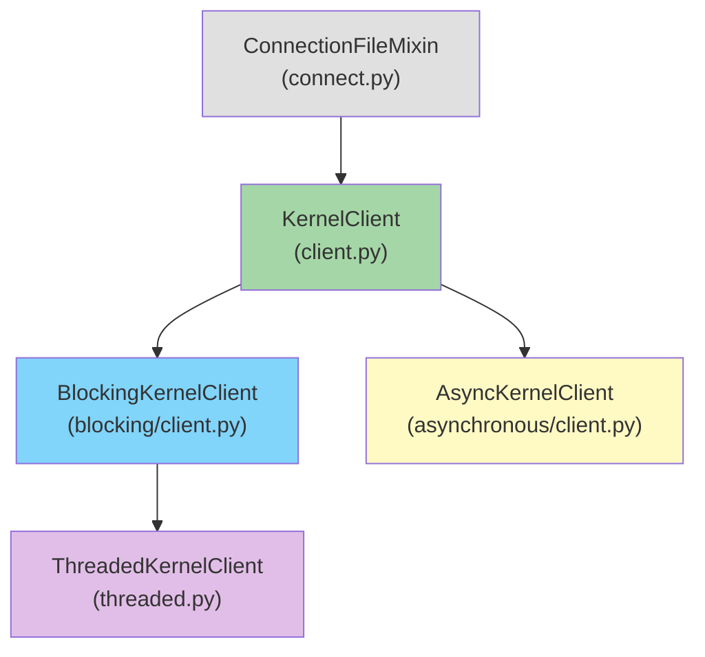

# 客户端体系

jupyter_client 提供四种客户端类以适配不同的编程模型和并发场景。它们构成一个清晰的继承层次，基类提供统一的消息发送 API，变体类处理消息接收的同步/异步/线程化差异。

## 继承关系



| 客户端类 | 文件 | 通道类 | Context | 编程模型 | 线程安全 |
|---------|------|--------|---------|---------|---------|
| `KernelClient` | `client.py` | `ZMQSocketChannel` | `zmq.Context` | 混合（同步发送+异步方法） | ❌ |
| `BlockingKernelClient` | `blocking/client.py` | `ZMQSocketChannel` | `zmq.Context` | 同步阻塞 | ❌ |
| `AsyncKernelClient` | `asynchronous/client.py` | `AsyncZMQSocketChannel` | `zmq.asyncio.Context` | async/await | ❌（仅单线程 event loop） |
| `ThreadedKernelClient` | `threaded.py` | `ThreadedZMQSocketChannel` | `zmq.Context` | 同步（后台线程 I/O） | ✅（任意线程调用） |

## KernelClient 基类

`KernelClient` 是所有客户端的基类，继承 `ConnectionFileMixin`，定义了核心的消息发送方法和通道管理。

### 通道类可配置性

```python
class KernelClient(ConnectionFileMixin):
    # 五个通道类 trait——子类覆盖为不同通道实现
    shell_channel_class = Type(ChannelABC)
    iopub_channel_class = Type(ChannelABC)
    stdin_channel_class = Type(ChannelABC)
    hb_channel_class = Type(HBChannelABC)
    control_channel_class = Type(ChannelABC)
```

每个客户端变体通过覆盖这些 trait 指定自己的通道类：
- BlockingKernelClient → `shell_channel_class = Type(ZMQSocketChannel)`
- AsyncKernelClient → `shell_channel_class = Type(AsyncZMQSocketChannel)`
- ThreadedKernelClient → `shell_channel_class = Type(ThreadedZMQSocketChannel)`

### 消息发送方法（所有客户端共享）

| 方法 | 返回值 | 通道 | 说明 |
|------|--------|------|------|
| `execute(code, ...)` | msg_id: str | shell | 执行代码 |
| `complete(code, cursor_pos)` | msg_id: str | shell | 代码补全 |
| `inspect(code, cursor_pos, detail_level)` | msg_id: str | shell | 对象内省 |
| `history(...)` | msg_id: str | shell | 历史查询 |
| `kernel_info()` | msg_id: str | shell | 获取内核信息 |
| `comm_info(target_name)` | msg_id: str | shell | 查询 Comm 信息 |
| `is_complete(code)` | msg_id: str | shell | 代码完整性检查 |
| `shutdown(restart)` | msg_id: str | control | 关闭/重启内核 |
| `input(string)` | None | stdin | 回传标准输入 |

**重要**：所有发送方法只发送消息并返回 `msg_id`，**不等待应答**。需要通过对应通道的 `get_msg()` 方法主动拉取应答。

### execute 参数详解

```python
def execute(self, code, silent=False, store_history=True,
            user_expressions=None, allow_stdin=None, stop_on_error=True):
```

| 参数 | 默认值 | 说明 |
|------|--------|------|
| `code` | 必填 | 要执行的代码字符串 |
| `silent` | False | True 时不广播 execute_input 和 execute_result，但仍发送 status/idle 和 reply |
| `store_history` | True | 是否将代码存入内核历史 |
| `user_expressions` | None | 字典，执行后计算的表达式（如 `{"result": "x+1"}`） |
| `allow_stdin` | None | 是否允许 stdin 输入请求（None 使用 self.allow_stdin） |
| `stop_on_error` | True | 出错时是否停止执行后续代码（仅 multi-statement） |

### execute_interactive 方法

`execute_interactive()` 是一个高层方法，封装了"发送→等待→收集输出→处理 stdin"的完整流程：

```python
async def _async_execute_interactive(self, code, timeout=None,
                                     output_hook=None, stdin_hook=None,
                                     allow_stdin=None, **kwargs):
    """交互式执行代码，自动处理 iopub 输出和 stdin 输入请求"""
    msg_id = self.execute(code, allow_stdin=allow_stdin, **kwargs)

    # 使用 Poller 同时监听 iopub 和 stdin
    poller = zmq.asyncio.Poller()
    poller.register(self.iopub_channel.socket, zmq.POLLIN)
    if allow_stdin:
        poller.register(self.stdin_channel.socket, zmq.POLLIN)

    while True:
        events = await poller.poll(timeout_ms)
        for socket, _ in events:
            if socket is self.iopub_channel.socket:
                msg = await self.iopub_channel.get_msg()
                if msg["header"]["msg_type"] == "status" and \
                   msg["content"]["execution_state"] == "idle" and \
                   msg["parent_header"]["msg_id"] == msg_id:
                    return reply  # 执行完毕
                if output_hook:
                    output_hook(msg)
            elif socket is self.stdin_channel.socket:
                msg = await self.stdin_channel.get_msg()
                if stdin_hook:
                    stdin_hook(msg)  # 回调处理 stdin 请求
```

同步版本 `execute_interactive()` 是异步版本的 `run_sync` 包装。

### 内核就绪等待

```python
async def _async_wait_for_ready(self, timeout=None):
    """等待内核就绪：发送 kernel_info_request 并等待有效的 kernel_info_reply"""
    deadline = None if timeout is None else time.monotonic() + timeout
    while True:
        self.kernel_info()  # 发送 kernel_info_request
        try:
            msg = await self._async_recv_reply(
                self._msg_id, timeout=self._ready_timeout, channel="shell"
            )
            if msg["content"].get("status") == "ok":
                return  # 内核就绪
        except (TimeoutError, Empty):
            if deadline and time.monotonic() > deadline:
                raise TimeoutError("Kernel did not respond in time")
            await asyncio.sleep(0.1)
```

内核启动后需要时间完成初始化（导入模块、注册 magics 等），`wait_for_ready()` 通过反复发送 `kernel_info_request` 直到收到有效回复来确认内核就绪。

## BlockingKernelClient（同步阻塞客户端）

`BlockingKernelClient` 是最常用的客户端，提供阻塞式的消息接收 API。

```python
class BlockingKernelClient(KernelClient):
    """同步阻塞客户端"""

    shell_channel_class = Type(ZMQSocketChannel)
    iopub_channel_class = Type(ZMQSocketChannel)
    stdin_channel_class = Type(ZMQSocketChannel)
    hb_channel_class = Type(HBChannel)
    control_channel_class = Type(ZMQSocketChannel)

    # 阻塞式消息接收方法
    def get_shell_msg(self, timeout=None) -> dict: ...
    def get_iopub_msg(self, timeout=None) -> dict: ...
    def get_stdin_msg(self, timeout=None) -> dict: ...
    def get_control_msg(self, timeout=None) -> dict: ...

    # 阻塞式等待就绪
    def wait_for_ready(self, timeout=None): ...

    # 阻塞式交互执行
    def execute_interactive(self, code, **kwargs) -> dict: ...
```

**工作原理**：`BlockingKernelClient` 使用 `run_sync` 工具将 KernelClient 中的异步方法包装为同步方法，内部创建临时 event loop 执行 async 函数然后关闭 loop。

```python
# 示例：同步模式执行代码
kc = BlockingKernelClient()
kc.load_connection_file("kernel-xxx.json")
kc.start_channels()
kc.wait_for_ready()

msg_id = kc.execute("print('hello')")
while True:
    msg = kc.get_iopub_msg(timeout=10)
    if (msg["parent_header"].get("msg_id") == msg_id and
        msg["header"]["msg_type"] == "status" and
        msg["content"]["execution_state"] == "idle"):
        break
```

## AsyncKernelClient（异步客户端）

`AsyncKernelClient` 为 asyncio 应用设计，所有 I/O 操作都是原生异步。

```python
class AsyncKernelClient(KernelClient):
    """原生异步客户端，使用 zmq.asyncio.Context"""

    shell_channel_class = Type(AsyncZMQSocketChannel)
    iopub_channel_class = Type(AsyncZMQSocketChannel)
    stdin_channel_class = Type(AsyncZMQSocketChannel)
    hb_channel_class = Type(HBChannel)
    control_channel_class = Type(AsyncZMQSocketChannel)

    # 异步消息接收（私有方法，实际API与同步一致）
    async def _async_get_shell_msg(self, timeout=None): ...
    async def _async_get_iopub_msg(self, timeout=None): ...
    async def _async_wait_for_ready(self, timeout=None): ...
    async def _async_execute_interactive(self, code, **kwargs): ...
```

关键区别：
- 使用 `zmq.asyncio.Context` 替代 `zmq.Context`
- 通道使用 `AsyncZMQSocketChannel`（async/await 原生 ZMQ）
- 消息接收方法为 `async def`，需要 `await` 调用
- **不创建后台线程**，所有 I/O 在调用方的 event loop 中执行

```python
# 示例：异步模式执行代码
kc = AsyncKernelClient()
kc.load_connection_file("kernel-xxx.json")
kc.start_channels()
await kc._async_wait_for_ready()

msg_id = kc.execute("print('hello')")
while True:
    msg = await kc._async_get_iopub_msg(timeout=10)
    if (msg["parent_header"].get("msg_id") == msg_id and
        msg["header"]["msg_type"] == "status" and
        msg["content"]["execution_state"] == "idle"):
        break
```

## ThreadedKernelClient（线程化客户端）

`ThreadedKernelClient` 是线程安全的客户端，在后台线程中运行 ZMQ IOLoop，允许从任意线程安全调用。

```python
class ThreadedKernelClient(BlockingKernelClient):
    """线程化客户端——后台 IOLoop 线程处理 ZMQ 事件"""

    shell_channel_class = Type(ThreadedZMQSocketChannel)
    iopub_channel_class = Type(ThreadedZMQSocketChannel)
    stdin_channel_class = Type(ThreadedZMQSocketChannel)
    control_channel_class = Type(ThreadedZMQSocketChannel)

    def start_channels(self, **kwargs):
        """在独立线程中启动 IOLoop"""
        self.ioloop = ioloop.IOLoop()
        self.ioloop_thread = threading.Thread(target=self.ioloop.start, daemon=True)
        self.ioloop_thread.start()
        # 在 IOLoop 线程中初始化通道

    def stop_channels(self):
        """停止 IOLoop 线程"""
        self.ioloop.add_callback(self.ioloop.stop)
        self.ioloop_thread.join(timeout=5)
```

**ThreadedZMQSocketChannel** 使用 `ZMQStream`（Tornado 的 ZMQ 包装器）在 IOLoop 线程中处理消息，主线程通过 `IOLoop.add_callback()` 线程安全地发送消息，通过 `queue.Queue` 传递接收到的消息到调用线程。

```python
class ThreadedZMQSocketChannel(ZMQSocketChannel):
    """线程安全的 ZMQ 通道"""
    def __init__(self, socket, session, loop):
        super().__init__(socket, session, loop)
        self._recv_q = queue.Queue()  # 消息队列
        self._stream = ZMQStream(socket, loop)
        self._stream.on_recv(self._handle_recv)  # IOLoop 线程接收回调

    def _handle_recv(self, msg_frames):
        # 在 IOLoop 线程中反序列化，放入队列
        msg = self.session.deserialize(msg_frames)
        self._recv_q.put(msg)

    def get_msg(self, timeout=None):
        # 从主线程/任意线程从队列取消息
        try:
            return self._recv_q.get(timeout=timeout)
        except queue.Empty:
            raise Empty("Channel timeout")

    def send(self, msg):
        # 线程安全：通过 IOLoop.add_callback 发送
        self.ioloop.add_callback(self._stream.send_multipart, self.session.serialize(msg))
```

## 选择合适的客户端

| 场景 | 推荐客户端 | 理由 |
|------|-----------|------|
| 简单脚本/一次性执行 | `BlockingKernelClient` | API 简单直观，不需要理解 asyncio |
| Jupyter 控制台/REPL | `BlockingKernelClient` + 线程处理 stdin | 交互式输入需要阻塞 |
| asyncio Web 服务（JupyterLab 后端） | `AsyncKernelClient` | 与 asyncio 生态集成，高并发 |
| GUI 应用（Qt/Jupyter Widgets） | `ThreadedKernelClient` | 主线程处理 UI，后台线程处理 ZMQ |
| 多线程数据管道 | `ThreadedKernelClient` | 线程安全，可从任意线程调用 |
| 需要细粒度控制 | `KernelClient` 基类 | 自定义通道/序列化等 |

## 方法对照表

以下是三种客户端变体的方法差异对照：

| 操作 | KernelClient | BlockingKernelClient | AsyncKernelClient | ThreadedKernelClient |
|------|-------------|---------------------|-------------------|---------------------|
| 执行代码 | `execute()` | `execute()` | `execute()` | `execute()` |
| 接收 shell 消息 | `_async_recv_reply()` | `get_shell_msg(timeout)` | `_async_get_shell_msg()` (await) | `get_shell_msg(timeout)` |
| 接收 iopub 消息 | 异步内部方法 | `get_iopub_msg(timeout)` | `_async_get_iopub_msg()` (await) | `get_iopub_msg(timeout)` |
| 等待就绪 | `_async_wait_for_ready()` | `wait_for_ready(timeout)` | `_async_wait_for_ready()` (await) | `wait_for_ready(timeout)` |
| 交互执行 | `_async_execute_interactive()` | `execute_interactive()` | `_async_execute_interactive()` (await) | `execute_interactive()` |
| 启动通道 | `start_channels()` | `start_channels()` | `start_channels()` | `start_channels()` (启IOLoop线程) |
| 关闭通道 | `stop_channels()` | `stop_channels()` | `stop_channels()` | `stop_channels()` (停IOLoop线程) |
| 通道类 | ZMQSocketChannel | ZMQSocketChannel | AsyncZMQSocketChannel | ThreadedZMQSocketChannel |
| Context类型 | zmq.Context | zmq.Context | zmq.asyncio.Context | zmq.Context |

## 相关概念

- [五通道系统](03-channels-system.md)
- [连接管理与消息协议](04-connection-and-session.md)
- [内核管理器](06-kernel-manager.md)
- [异步与线程模型](11-async-and-threading.md)
