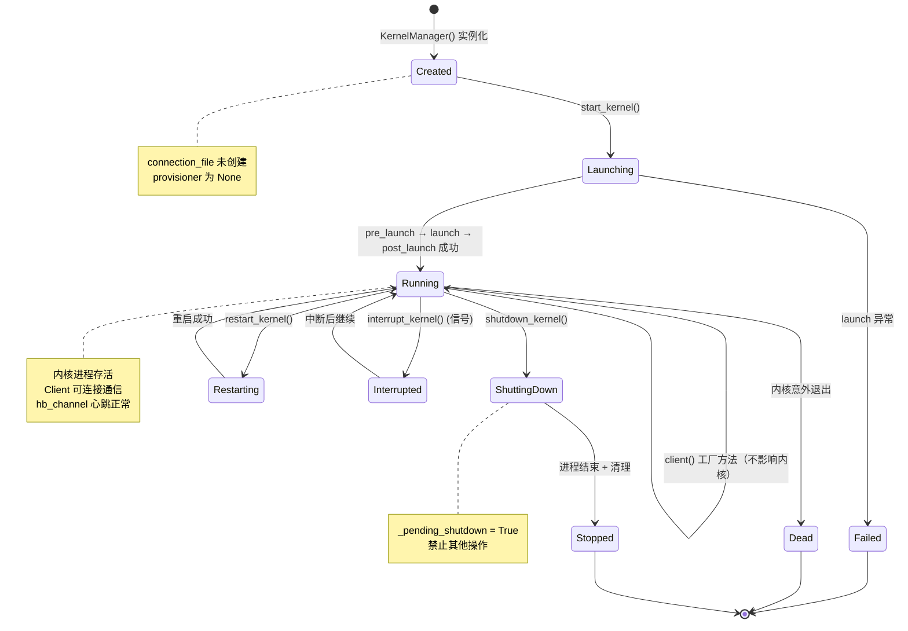
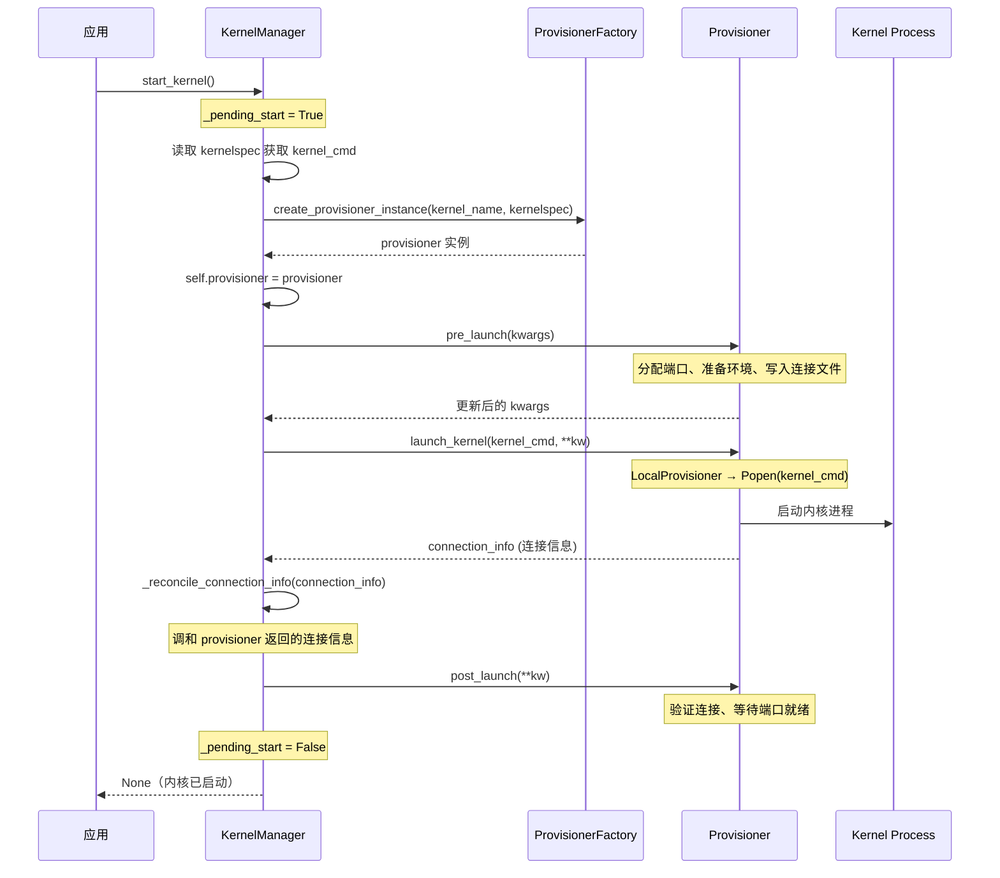

# 内核管理器

`KernelManager` 是 jupyter_client 中负责内核进程**生命周期管理**的核心类。它不直接操作 ZMQ 通道（那是 KernelClient 的职责），而是专注于内核进程的启动、停止、重启、中断和状态检查。

## 生命周期状态机



## KernelManager 核心 API

```python
class KernelManager(ConnectionFileMixin, KernelClientFactory):
    """管理单个内核的生命周期"""

    # ---- 配置属性 ----
    kernel_name = Unicode("python3")      # 内核名称
    provisioner = Instance(...)           # 当前供给器实例
    _pending_start = Bool(False)          # 启动中标志
    _pending_shutdown = Bool(False)       # 关闭中标志

    # ---- 生命周期方法 ----
    def start_kernel(self, **kw) -> None: ...
    def shutdown_kernel(self, now=False, restart=False) -> None: ...
    def restart_kernel(self, now=False, **kw) -> None: ...
    def interrupt_kernel(self) -> None: ...
    def signal_kernel(self, signum: int) -> None: ...

    # ---- 状态查询 ----
    def is_alive(self) -> bool: ...       # 内核是否存活
    def has_kernel(self) -> bool: ...     # 是否有关联的内核进程

    # ---- Client 工厂 ----
    def client(self, **kwargs) -> KernelClient: ...  # 默认返回 BlockingKernelClient
```

## 启动内核：start_kernel()

`start_kernel()` 的内部流程分为三个阶段，全部通过 Provisioner 委托执行：



### 关键步骤详解

**1. pre_launch（启动前准备）**

LocalProvisioner 在 pre_launch 阶段：
- 若端口未指定，通过 `write_connection_file()` 自动发现端口
- 准备环境变量（设置 `JPY_PARENT_PID`、`PYTHONEXECUTABLE` 等）
- 在 Windows 上设置 `CREATE_NEW_PROCESS_GROUP` 标志
- 可选生成 CurveZMQ 密钥对

**2. launch_kernel（进程启动）**

```python
# local_provisioner.py 核心逻辑（简化）
async def launch_kernel(self, cmd, **kwargs):
    # 构建 Popen 参数
    kwargs["stdin"] = subprocess.PIPE
    kwargs["stdout"] = subprocess.PIPE
    kwargs["stderr"] = subprocess.STDOUT
    kwargs["env"] = env

    if sys.platform == "win32":
        kwargs["creationflags"] = subprocess.CREATE_NEW_PROCESS_GROUP
    else:
        kwargs["start_new_session"] = True  # 新进程组，独立于父进程信号

    # 启动进程
    self.proc = Popen(cmd, **kwargs)
    self.pid = self.proc.pid

    # 返回连接信息
    return self.connection_info
```

**3. _reconcile_connection_info（连接信息调和）**

这是一个重要的安全机制：Provisioner 返回的 connection_info 可能与本地连接文件不同（尤其是远程 Provisioner），`_reconcile_connection_info()` 确保两者一致：

```python
def _reconcile_connection_info(self, connection_info):
    if not connection_info:
        # Provisioner 未返回连接信息，读取本地连接文件
        connection_info = self._record_connection_info()
    self.cleanup_random_ports()  # 清理预分配但未使用的端口
    self.load_connection_info(connection_info)  # 加载连接信息
```

## 关闭内核：shutdown_kernel()

关闭流程采用"优雅→强制"两阶段策略：

```python
def shutdown_kernel(self, now=False, restart=False):
    if not self.has_kernel():
        return

    self._pending_shutdown = True
    try:
        if not now:
            # 阶段1：尝试优雅关闭（发送 shutdown_request）
            try:
                self.provisioner.shutdown_kernel(restart=restart)
            except Exception:
                self.log.warning("Graceful shutdown failed", exc_info=True)
                now = True  # 降级到强制杀死

        if now:
            # 阶段2：强制杀死（SIGKILL/TerminateProcess）
            try:
                self.provisioner.kill(restart=restart)
            except Exception:
                self.log.warning("Force kill failed", exc_info=True)

        # 等待进程退出
        self.provisioner.wait()
        # 清理连接文件
        self.provisioner.cleanup(restart=restart)
    finally:
        self._pending_shutdown = False
```

**shutdown 消息 vs 信号**：
- `now=False`：通过 control 通道发送 `shutdown_request` 消息，内核自行清理后退出
- `now=True`：直接发送 SIGKILL（Unix）或 TerminateProcess（Windows）强制终止
- 重启时（`restart=True`）不删除连接文件（因为新内核会使用同一端口）

## 重启内核：restart_kernel()

```python
def restart_kernel(self, now=False, **kwargs):
    # 1. 关闭旧内核
    self.shutdown_kernel(now=now, restart=True)
    # 2. 清理旧 provisioner
    self.provisioner = None
    # 3. 启动新内核
    self.start_kernel(**kwargs)
```

注意 `restart=True` 参数传递给 shutdown，确保连接文件保留供新内核使用。

## 中断内核：interrupt_kernel()

```python
def interrupt_kernel(self):
    """发送中断信号到内核进程"""
    if not self.has_kernel():
        raise RuntimeError("Cannot interrupt: no kernel")
    self.provisioner.send_signal(signal.SIGINT)
```

**平台差异**：
- **Unix**：发送 SIGINT 到进程组（`os.killpg(pid, SIGINT)`）
- **Windows**：使用 `win_interrupt.py` 中的中断事件机制（Windows 不支持 SIGINT 信号），通过 `interrupt_event` 写入 Ctrl+C 事件

## pending 状态保护

`@in_pending_state` 装饰器防止在内核启动/关闭过程中执行冲突操作：

```python
def in_pending_state(method):
    @functools.wraps(method)
    def wrapped(self, *args, **kwargs):
        if self._pending_shutdown:
            raise RuntimeError("Kernel is in a pending shutdown state")
        if self._pending_start:
            raise RuntimeError("Kernel is in a pending start state")
        return method(self, *args, **kwargs)
    return wrapped
```

被 `@in_pending_state` 保护的方法：`start_kernel()`、`shutdown_kernel()`、`restart_kernel()`、`interrupt_kernel()`、`signal_kernel()`、`client()`。

## Client 工厂方法

KernelManager 通过 `client()` 方法创建连接到自己的 KernelClient：

```python
def client(self, **kwargs):
    """创建并返回连接到此内核的 client"""
    # 继承连接信息（session、key、ports等）
    kwargs.setdefault("session", self.session.clone())
    kwargs.setdefault("ip", self.ip)
    kwargs.setdefault("transport", self.transport)
    kwargs.setdefault("key", self.key)
    # ...
    return self.blocking_client(**kwargs)  # 默认 BlockingKernelClient
```

Client 通过 `self.parent` 引用回 KernelManager，可以检查内核状态。

## AsyncKernelManager

异步版本的所有生命周期方法使用 `async/await`：

```python
class AsyncKernelManager(KernelManager):
    context = Instance(zmq.asyncio.Context)  # 使用 asyncio Context

    async def start_kernel(self, **kw): ...
    async def shutdown_kernel(self, now=False, restart=False): ...
    async def restart_kernel(self, now=False, **kw): ...
    async def interrupt_kernel(self): ...
    async def _async_is_alive(self) -> bool: ...
```

## 便捷函数

```python
def start_new_kernel(startup_timeout=60, kernel_name="python3", **kwargs):
    """启动新内核，返回 (km, kc) 元组"""
    km = KernelManager(kernel_name=kernel_name)
    km.start_kernel(**kwargs)
    kc = km.client()
    kc.start_channels()
    kc.wait_for_ready(timeout=startup_timeout)
    kc.allow_stdin = False
    return km, kc
```

这是最常用的启动入口，封装了"启动→创建Client→启动通道→等待就绪"的完整流程。

## 典型使用模式

```python
from jupyter_client import KernelManager
import atexit

km = KernelManager(kernel_name="python3")
km.start_kernel()
atexit.register(km.shutdown_kernel)

kc = km.client()
kc.start_channels()
kc.wait_for_ready()

# 执行代码...
msg_id = kc.execute("print('hello')")
# ... 收集结果 ...

# 清理
kc.stop_channels()
km.shutdown_kernel()
```

## 相关概念

- [内核供给器框架](08-kernel-provisioner.md)
- [客户端体系](05-client-hierarchy.md)
- [内核启动与自动重启](10-kernel-launch-and-restart.md)
