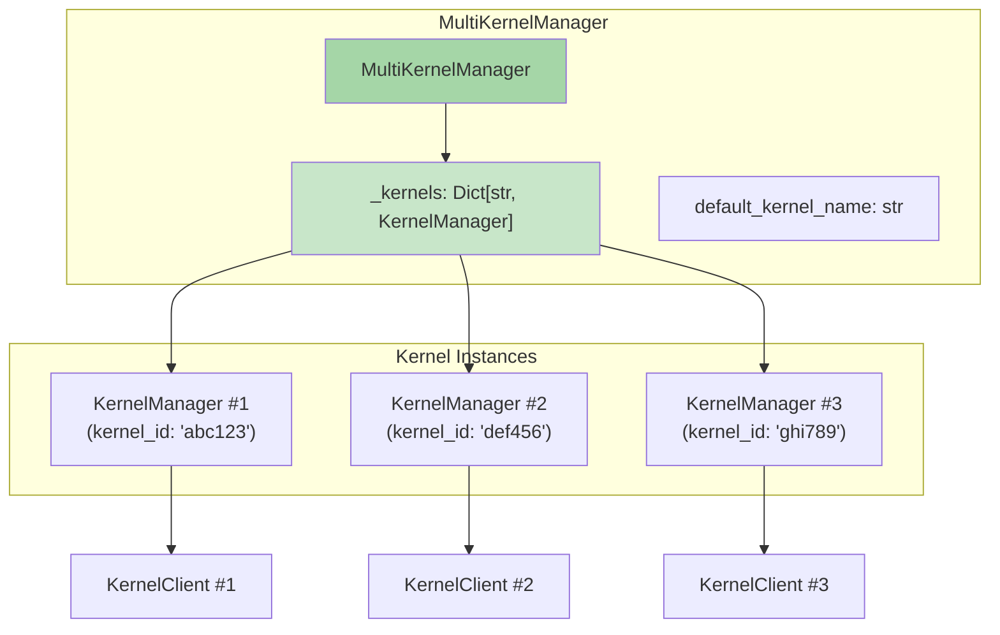

# 多内核管理

`MultiKernelManager` 用于同时管理多个内核实例，典型场景包括 Jupyter Server（多个 Notebook 各有自己的内核）、JupyterHub（多用户内核管理）和需要并行运行多个内核的应用。

## 设计模型



MultiKernelManager 维护一个 `kernel_id → KernelManager` 的字典，通过统一的 API 管理所有内核的生命周期。

## 核心 API

```python
class MultiKernelManager(LoggingConfigurable):
    """管理多个 KernelManager 实例"""

    # ---- 配置 ----
    default_kernel_name = Unicode("")           # 默认内核名
    kernel_manager_class = Type(klass=KernelManager)  # KM 类（可替换）
    shared_context = Bool(False)                # 是否共享 ZMQ Context

    # ---- 核心操作 ----
    def start_kernel(self, kernel_name=None, **kwargs) -> str:
        """启动新内核，返回 kernel_id"""

    def shutdown_kernel(self, kernel_id: str, now=False, restart=False):
        """关闭指定内核"""

    def shutdown_all(self, now=False):
        """关闭所有内核"""

    def restart_kernel(self, kernel_id: str, now=False, **kwargs):
        """重启指定内核"""

    def interrupt_kernel(self, kernel_id: str):
        """中断指定内核"""

    def get_kernel(self, kernel_id: str) -> KernelManager:
        """获取指定内核的 KernelManager"""

    def list_kernel_ids(self) -> list[str]:
        """列出所有内核 ID"""

    def kernel_info(self, kernel_id: str) -> dict:
        """获取指定内核的状态信息"""

    def client(self, kernel_id: str, **kwargs) -> KernelClient:
        """为指定内核创建 Client"""

    # ---- 内核移除与清理 ----
    def remove_kernel(self, kernel_id: str) -> KernelManager:
        """从字典中移除内核（不关闭）"""

    def cleanup_resources(self, **kwargs):
        """清理所有子进程和资源（atexit 注册）"""
```

## 启动新内核

```python
def start_kernel(self, kernel_name=None, **kwargs):
    # 1. 生成唯一 kernel_id
    kernel_id = kwargs.pop("kernel_id", None) or uuid.uuid4().hex
    kwargs.setdefault("kernel_name", kernel_name or self.default_kernel_name)

    # 2. 创建 KernelManager 实例（可注入父MKM）
    km = self.kernel_manager_class(
        parent=self,
        **self._kernel_constructor_kwargs(kwargs.pop("kernel_constructor_kwargs", {}))
    )

    # 3. 启动内核
    km.start_kernel(**kwargs)

    # 4. 注册到字典
    self._kernels[kernel_id] = km
    self._kernel_creation_time[kernel_id] = datetime.now()

    return kernel_id
```

**注意**：每个内核的 KernelManager 实例通过 `parent=self` 关联到 MultiKernelManager，使得配置可以继承。

## 操作委托模式

MultiKernelManager 对单个内核的操作全部委托给对应的 KernelManager：

```python
def shutdown_kernel(self, kernel_id, now=False, restart=False):
    km = self.get_kernel(kernel_id)
    km.shutdown_kernel(now=now, restart=restart)
    if not restart:
        self.remove_kernel(kernel_id)

def interrupt_kernel(self, kernel_id):
    km = self.get_kernel(kernel_id)
    km.interrupt_kernel()

def client(self, kernel_id, **kwargs):
    km = self.get_kernel(kernel_id)
    return km.client(**kwargs)
```

这是典型的**注册表+委托模式**：MultiKernelManager 是容器，实际操作由单个 KernelManager 执行。

## 关闭所有内核

```python
def shutdown_all(self, now=False):
    """关闭所有内核"""
    for kernel_id in list(self._kernels.keys()):
        try:
            self.shutdown_kernel(kernel_id, now=now)
        except Exception as e:
            self.log.error("Error shutting down kernel %s: %s", kernel_id, e)
```

`shutdown_all()` 通常在应用退出时调用，通过 `atexit.register()` 注册。

## 子进程清理

MultiKernelManager 确保在垃圾回收或程序退出时清理所有内核子进程：

```python
def __del__(self):
    """析构时尝试清理所有内核"""
    try:
        self.cleanup_resources()
    except Exception:
        pass

def cleanup_resources(self, **kwargs):
    self.shutdown_all(now=True)  # 强制关闭所有内核
    self._kernels.clear()
```

```python
# 在模块初始化时注册 atexit 清理
atexit.register(MultiKernelManager().cleanup_resources)  # 避免孤儿进程
```

实际上，每个 MultiKernelManager 实例在 `__init__` 中会将自己注册到全局列表，`cleanup_resources` 类方法遍历清理所有实例。

## 内核信息查询

```python
def kernel_info(self, kernel_id):
    """返回内核的状态信息字典"""
    km = self.get_kernel(kernel_id)
    return {
        "id": kernel_id,
        "name": km.kernel_name,
        "last_activity": self._kernel_activity.get(kernel_id),
        "execution_state": self._kernel_state.get(kernel_id, "unknown"),
        "connections": self._kernel_connections.get(kernel_id, 0),
    }
```

## AsyncMultiKernelManager

异步版本使用 `AsyncKernelManager` 作为默认 kernel_manager_class：

```python
class AsyncMultiKernelManager(MultiKernelManager):
    kernel_manager_class = Type(
        default_value=AsyncKernelManager,
        klass=AsyncKernelManager,
    )

    async def start_kernel(self, kernel_name=None, **kwargs): ...
    async def shutdown_kernel(self, kernel_id, now=False, restart=False): ...
    async def shutdown_all(self, now=False): ...
    async def restart_kernel(self, kernel_id, now=False, **kwargs): ...
    async def interrupt_kernel(self, kernel_id): ...
    async def cleanup_resources(self, **kwargs): ...
```

所有方法均为 async，支持并发启动/关闭多个内核。

## 共享 ZMQ Context

当 `shared_context=True` 时，所有 KernelManager 共享同一个 ZMQ Context：

```python
def __init__(self, **kwargs):
    super().__init__(**kwargs)
    if self.shared_context:
        self.context = zmq.Context()
    # ...
```

共享 Context 可以减少资源开销（ZMQ Context 是线程安全的，每个进程通常只需一个）。

## 典型使用场景

### 多内核并行执行

```python
from jupyter_client import MultiKernelManager
import concurrent.futures

mkm = MultiKernelManager()
try:
    # 启动多个内核
    kid1 = mkm.start_kernel(kernel_name="python3")
    kid2 = mkm.start_kernel(kernel_name="python3")

    # 分别创建 Client
    kc1 = mkm.client(kid1)
    kc2 = mkm.client(kid2)

    kc1.start_channels()
    kc2.start_channels()
    kc1.wait_for_ready()
    kc2.wait_for_ready()

    # 在不同内核中并行执行
    kc1.execute("import time; time.sleep(1); print('Kernel 1 done')")
    kc2.execute("import time; time.sleep(1); print('Kernel 2 done')")

    # ... 收集输出 ...

    kc1.stop_channels()
    kc2.stop_channels()
finally:
    mkm.shutdown_all()
```

### Jupyter Server 场景

在 Jupyter Server 中，每个 Notebook 对应一个内核，MultiKernelManager 负责管理：

1. 用户打开 Notebook → 调用 `start_kernel()` 获得 kernel_id
2. WebSocket 连接通过 kernel_id 路由到对应 Client
3. 用户关闭 Notebook → 调用 `shutdown_kernel(kernel_id)`
4. Server 关闭 → 调用 `shutdown_all()`

## 相关概念

- [内核管理器](06-kernel-manager.md)
- [内核供给器框架](08-kernel-provisioner.md)
