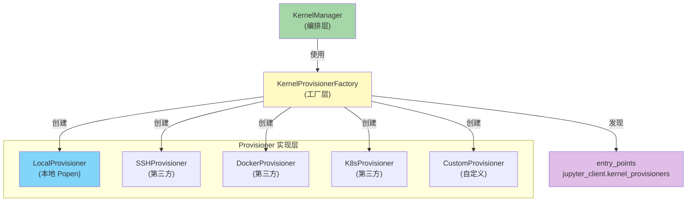
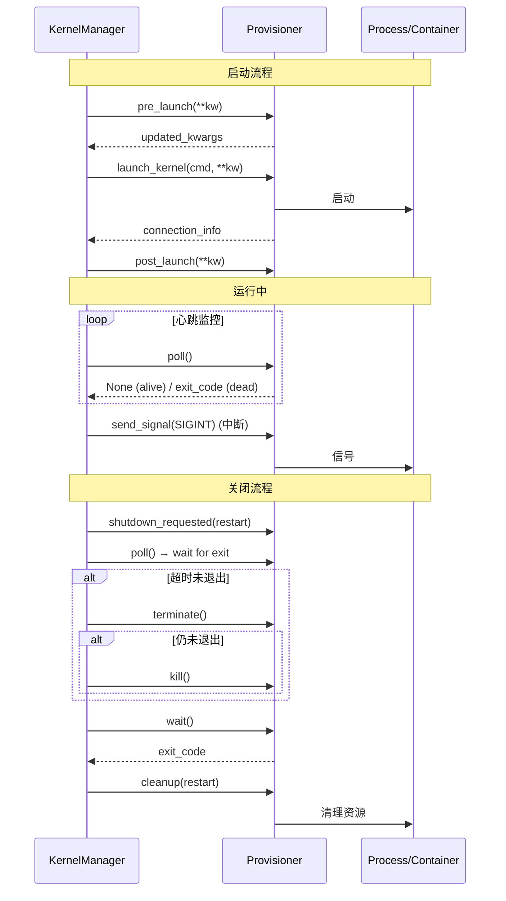

# 内核供给器框架

Provisioner 是 jupyter_client 的**可插拔内核生命周期抽象层**。它将"内核进程如何启动、在哪里运行、如何通信"从 KernelManager 中分离出来，使得内核可以运行在本地进程、远程服务器、Docker 容器、Kubernetes Pod 等多种环境中。

## 设计动机

在 jupyter_client 7.x 之前，KernelManager 直接使用 `subprocess.Popen` 启动本地进程。这意味着：
- 无法支持远程内核（SSH/Docker/K8s）
- 启动逻辑硬编码，无法自定义
- 第三方需要继承 KernelManager 并重写大量方法

Provisioner 框架将"如何启动和管理内核进程"抽象为独立的可插拔组件，KernelManager 只负责高层编排，具体的进程管理委托给 Provisioner。

## 架构层次



## KernelProvisionerBase 抽象基类

所有供给器必须继承 `KernelProvisionerBase`，实现以下抽象方法：

### 生命周期方法

```python
class KernelProvisionerBase(Configurable, metaclass=abc.ABCMeta):
    """内核供给器抽象基类"""

    # ---- 属性 ----
    kernel_id: str = ""                    # 内核唯一 ID
    kernel_spec: KernelSpec | None = None  # 内核规范
    connection_info: KernelConnectionInfo = {}  # 连接信息
    process: Any = None                    # 进程句柄（Popen/SSH/docker-py）
    log: Logger | None = None

    # ========== 抽象方法（必须实现） ==========

    async def pre_launch(self, **kwargs) -> dict:
        """启动前准备：端口分配、环境变量、认证配置
        返回更新后的 kwargs 字典"""

    async def launch_kernel(self, cmd: list[str], **kwargs) -> KernelConnectionInfo:
        """启动内核进程，返回连接信息字典
        这是核心方法：创建进程/容器/Pod 并确保它开始监听"""

    async def post_launch(self, **kwargs) -> None:
        """启动后操作：连接验证、就绪检查"""

    async def poll(self) -> int | None:
        """检查进程是否结束，返回退出码（None=仍在运行）"""

    async def wait(self) -> int | None:
        """等待进程结束，返回退出码"""

    async def send_signal(self, signum: int) -> None:
        """发送信号到内核进程（SIGINT/SIGTERM/SIGKILL）"""

    async def kill(self, restart: bool = False) -> None:
        """强制杀死内核（SIGKILL / TerminateProcess）"""

    async def terminate(self, restart: bool = False) -> None:
        """优雅终止内核（SIGTERM）"""

    async def cleanup(self, restart: bool = False) -> None:
        """清理资源：连接文件、端口、容器、临时文件"""

    # ========== 可选方法（有默认实现） ==========

    async def shutdown_requested(self, restart: bool = False) -> None:
        """内核请求关闭时的钩子（如发送 shutdown_request 消息）"""

    def get_shutdown_wait_time(self, recommended: float = 5.0) -> float:
        """返回优雅关闭的等待时间（秒）"""
        return recommended

    def get_stable_start_time(self, recommended: float = 10.0) -> float:
        """返回内核稳定启动的等待时间（秒，避免重启循环）"""
        return recommended

    def has_process(self) -> bool:
        return self.process is not None
```

### 生命周期时序



## LocalProvisioner：默认本地实现

`LocalProvisioner` 是 jupyter_client 内置的供给器，使用 `subprocess.Popen` 在本地启动内核进程。

### pre_launch

```python
async def pre_launch(self, **kwargs):
    kwargs = await super().pre_launch(**kwargs)

    # 写入连接文件（端口自动发现）
    self.write_connection_file()
    self.connection_info = self.get_connection_info()

    # 准备环境变量
    env = kwargs.get("env", os.environ).copy()
    env["JPY_PARENT_PID"] = str(os.getpid())
    if sys.platform == "win32":
        env["PYTHONEXECUTABLE"] = sys.executable
    kwargs["env"] = env

    return kwargs
```

### launch_kernel

```python
async def launch_kernel(self, cmd, **kwargs):
    # 配置 Popen 参数
    popen_kwargs = {
        "stdin": subprocess.PIPE,
        "stdout": subprocess.PIPE,
        "stderr": subprocess.STDOUT,
        "env": kwargs.get("env"),
        "cwd": kwargs.get("cwd"),
    }

    # 平台特定标志
    if sys.platform == "win32":
        popen_kwargs["creationflags"] = subprocess.CREATE_NEW_PROCESS_GROUP
    else:
        popen_kwargs["start_new_session"] = True  # 新进程组

    # 启动进程
    self.proc = subprocess.Popen(cmd, **popen_kwargs)
    self.pid = self.proc.pid

    return self.connection_info
```

**为什么使用新进程组？**
- Unix：`start_new_session=True` 创建新会话，使得内核进程不会接收父进程终端的信号（如 Ctrl+C），只有通过 `send_signal()` 显式发送的信号才到达内核
- Windows：`CREATE_NEW_PROCESS_GROUP` 类似效果，使得 Ctrl+C 不直接传递给内核

### 信号发送

```python
async def send_signal(self, signum):
    if self.proc.poll() is not None:
        return  # 进程已退出

    if sys.platform == "win32":
        if signum == signal.SIGINT:
            # Windows 使用中断事件机制
            from .win_interrupt import send_interrupt
            send_interrupt(self.proc)
        elif signum in (signal.SIGTERM, signal.SIGKILL):
            self.proc.terminate() if signum == signal.SIGTERM else self.proc.kill()
    else:
        # Unix：发送信号到进程组
        if self.proc.pgid:
            os.killpg(self.proc.pgid, signum)
        else:
            os.kill(self.proc.pid, signum)
```

### cleanup

```python
async def cleanup(self, restart=False):
    if not restart:
        self.cleanup_connection_file()
        self.cleanup_random_ports()
```

重启时（`restart=True`）保留连接文件和端口，因为新内核会使用相同配置。

## KernelProvisionerFactory：供给器工厂

```python
class KernelProvisionerFactory(SingletonConfigurable):
    """供给器工厂——单例，通过 entry_points 发现可用供给器"""

    GROUP_NAME = "jupyter_client.kernel_provisioners"
    default_provisioner_name = "local-provisioner"

    def __init__(self, **kwargs):
        super().__init__(**kwargs)
        self._provisioners: dict[str, EntryPoint] = {}
        self._load_provisioners()

    def _load_provisioners(self):
        """通过 importlib.metadata 发现注册的供给器"""
        from importlib.metadata import entry_points
        for ep in entry_points(group=self.GROUP_NAME):
            self._provisioners[ep.name] = ep
        # 确保默认供给器存在
        if self.default_provisioner_name not in self._provisioners:
            # 注册内置 LocalProvisioner
            self._provisioners[self.default_provisioner_name] = ...

    def create_provisioner_instance(self, kernel_id, kernel_spec, parent):
        """根据 kernelspec 的配置创建供给器实例"""
        provisioner_name = self.default_provisioner_name
        # 检查 kernelspec metadata 是否指定了自定义供给器
        if kernel_spec.metadata.get("kernel_provisioner"):
            provisioner_name = kernel_spec.metadata["kernel_provisioner"]["provisioner_name"]

        # 查找 entry point
        ep = self._provisioners.get(provisioner_name)
        if ep is None:
            raise ValueError(f"Unknown provisioner: {provisioner_name}")

        # 加载供给器类
        provisioner_class = ep.load()
        return provisioner_class(kernel_id=kernel_id, kernel_spec=kernel_spec, parent=parent)
```

### Entry Points 注册

第三方供给器通过 Python package 的 `entry_points` 注册到 `jupyter_client.kernel_provisioners` group。例如，一个 SSH 供给器的 pyproject.toml：

```toml
[project.entry-points."jupyter_client.kernel_provisioners"]
ssh-provisioner = "ssh_provisioner:SSHProvisioner"
```

对应 kernelspec 的 kernel.json 配置：

```json
{
  "argv": ["python", "-m", "ipykernel_launcher", "-f", "{connection_file}"],
  "display_name": "Python 3 (Remote SSH)",
  "language": "python",
  "metadata": {
    "kernel_provisioner": {
      "provisioner_name": "ssh-provisioner",
      "config": {
        "host": "remote-server.example.com",
        "user": "jupyter"
      }
    }
  }
}
```

## 自定义供给器开发

实现自定义供给器的步骤：

1. **继承 KernelProvisionerBase**
2. **实现所有抽象方法**（pre_launch/launch_kernel/post_launch/poll/wait/send_signal/kill/terminate/cleanup）
3. **注册 entry_point**
4. **在 kernelspec 中引用**

```python
from jupyter_client.provisioning import KernelProvisionerBase

class MyCustomProvisioner(KernelProvisionerBase):
    async def pre_launch(self, **kwargs):
        kwargs = await super().pre_launch(**kwargs)
        # 自定义准备逻辑（如创建容器、建立 SSH 隧道）
        return kwargs

    async def launch_kernel(self, cmd, **kwargs):
        # 自定义启动逻辑
        # 返回 connection_info（必须包含端口、key等）
        return self.connection_info

    async def poll(self):
        # 返回 None 或退出码
        ...

    async def wait(self):
        # 等待进程/容器结束
        ...

    async def send_signal(self, signum):
        # 发送信号（API调用、docker kill、SSH命令等）
        ...

    async def kill(self, restart=False):
        # 强制停止
        ...

    async def terminate(self, restart=False):
        # 优雅停止
        ...

    async def cleanup(self, restart=False):
        # 清理资源
        ...
```

## 内置供给器

| 供给器 | 注册名 | 说明 |
|--------|--------|------|
| `LocalProvisioner` | `local-provisioner` | 本地 subprocess.Popen（默认） |

第三方供给器生态：
- **ssh-provisioner**：通过 SSH 启动远程内核
- **docker-provisioner**：在 Docker 容器中运行内核
- **k8s-provisioner**：在 Kubernetes Pod 中运行内核（Enterprise Gateway）

## 相关概念

- [内核管理器](06-kernel-manager.md)
- [内核规范管理](09-kernel-spec.md)
- [架构总览](02-architecture-overview.md)
