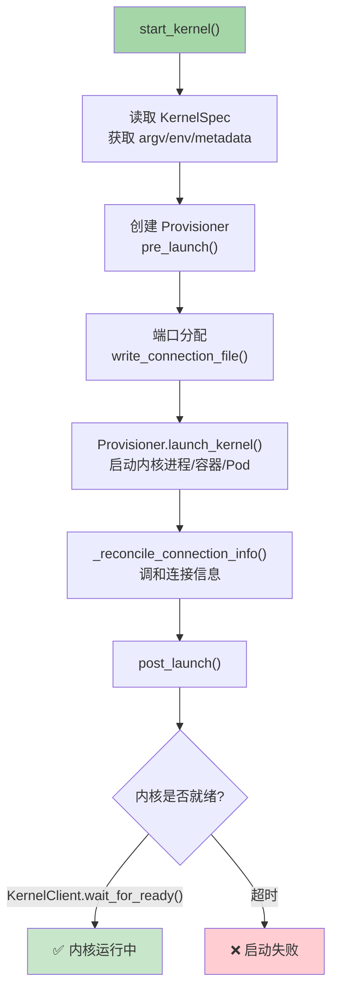
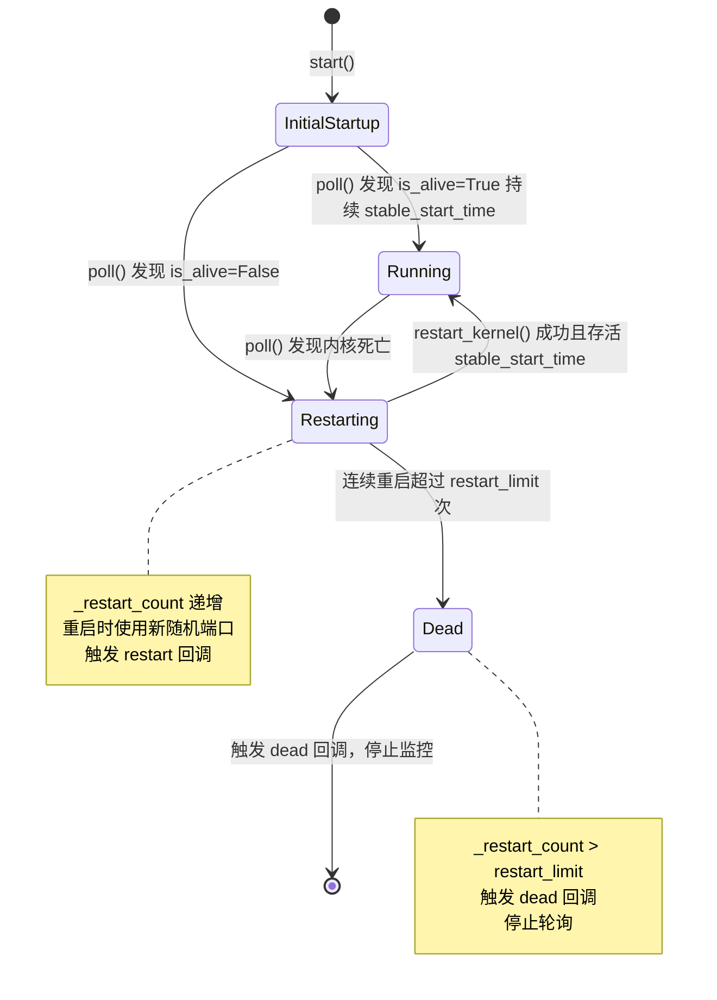

# 内核启动与自动重启

jupyter_client 提供了完整的内核启动流程和自动重启机制，确保内核意外退出时能够自动恢复，同时通过启发式策略防止重启风暴。

## 内核启动全流程



### 1. 读取 KernelSpec

启动前从 KernelSpecManager 获取内核规范：

```python
spec = self.kernel_spec_manager.get_kernel_spec(kernel_name)
# spec.argv, spec.env, spec.metadata, spec.interrupt_mode, ...
```

### 2. Provisioner 创建与 pre_launch

KernelManager 通过 KernelProvisionerFactory 创建 Provisioner，调用 `pre_launch()`：
- 分配随机端口
- 写入连接文件（JSON格式，权限600）
- 准备环境变量（JPY_PARENT_PID、PATH等）
- 配置 CurveZMQ 密钥（如启用）

### 3. launch_kernel

Provisioner 执行实际启动：
- LocalProvisioner：`subprocess.Popen(argv, ...)` 创建本地进程
- 远程 Provisioner：通过 SSH/Docker API/K8s API 启动

### 4. wait_for_ready

启动后 KernelClient 通过反复发送 `kernel_info_request` 等待内核就绪：

```python
async def _async_wait_for_ready(self, timeout=None):
    deadline = time.monotonic() + timeout if timeout else None
    while True:
        self.kernel_info()
        try:
            reply = await self._async_recv_reply(self._msg_id, timeout=1.0)
            if reply["content"].get("status") == "ok":
                return  # 内核响应正常，就绪
        except (TimeoutError, Empty):
            if deadline and time.monotonic() > deadline:
                raise TimeoutError("Kernel did not become ready in time")
```

## 内核启动器：launcher.py

`launcher.py` 提供底层的进程启动函数：

```python
def launch_kernel(cmd, stdin=None, stdout=None, stderr=None,
                  env=None, cwd=None, **kw):
    """启动内核进程（底层 Popen 封装）"""
    # Windows 平台特殊处理
    if sys.platform == "win32":
        from .win_interrupt import create_interrupt_event
        # 创建中断事件句柄
        interrupt_event = create_interrupt_event()
        env["JPY_INTERRUPT_EVENT"] = str(interrupt_event)
        # CREATE_NEW_PROCESS_GROUP 确保 Ctrl+C 不直接传递给子进程
        creationflags = subprocess.CREATE_NEW_PROCESS_GROUP
    else:
        # Unix：start_new_session 创建独立进程组
        start_new_session = True

    # 启动进程
    proc = subprocess.Popen(
        cmd,
        stdin=stdin or subprocess.PIPE,
        stdout=stdout or subprocess.PIPE,
        stderr=stderr or subprocess.STDOUT,
        env=env,
        cwd=cwd,
        creationflags=creationflags if sys.platform == "win32" else 0,
        start_new_session=start_new_session if sys.platform != "win32" else False,
        **kw
    )
    return proc
```

## KernelRestarter：心跳监控与自动重启

`KernelRestarter` 监控内核存活状态，在内核意外退出时自动重启。它通过轮询 `kernel_manager.is_alive()` 检测内核状态。

### 核心配置参数

```python
class KernelRestarter(LoggingConfigurable):
    time_to_dead = Float(3.0, config=True)          # 心跳超时时间（秒）
    stable_start_time = Float(10.0, config=True)    # 稳定启动判定时间（秒）
    restart_limit = Integer(5, config=True)         # 连续重启次数上限
    random_ports_until_alive = Bool(True, config=True)  # 稳定前使用新端口
    debug = Bool(False, config=True)                # 调试日志开关
```

### 重启逻辑



### poll() 核心逻辑

```python
def poll(self):
    if self.kernel_manager.shutting_down:
        return  # 正在主动关闭，不触发重启

    if not self.kernel_manager.is_alive():
        # 内核死亡
        self._last_dead = time.time()
        if self._restarting:
            self._restart_count += 1
        else:
            self._restart_count = 1

        if self._restart_count > self.restart_limit:
            # 重启次数超限，放弃
            self.log.warning("KernelRestarter: restart failed")
            self._fire_callbacks("dead")
            self._restarting = False
            self._restart_count = 0
            self.stop()
        else:
            # 尝试重启
            newports = self.random_ports_until_alive and self._initial_startup
            self.log.info("KernelRestarter: restarting kernel (%i/%i)",
                         self._restart_count, self.restart_limit)
            self._fire_callbacks("restart")
            self.kernel_manager.restart_kernel(now=True, newports=newports)
            self._restarting = True
    else:
        # 内核存活，检查是否达到稳定状态
        stable_time = self.stable_start_time
        if self.kernel_manager.provisioner:
            stable_time = self.kernel_manager.provisioner.get_stable_start_time(
                recommended=stable_time
            )
        # 持续存活 stable_start_time 后视为稳定启动
        if self._initial_startup and time.time() - self._last_dead >= stable_time:
            self._initial_startup = False
            self._restarting = False
            self._restart_count = 0
```

### 为什么需要 stable_start_time？

内核进程启动后需要时间完成初始化（导入模块、注册 ZMQ socket、加载扩展等）。如果进程在启动后立即崩溃（例如配置错误），`is_alive()` 会先返回 True（进程刚启动），然后很快返回 False。`stable_start_time` 启发式要求进程**持续存活**一定时间才认为启动成功，防止误判。

参见 [jupyter_client PR #717](https://github.com/jupyter/jupyter_client/pull/717) 的详细讨论。

### 回调系统

```python
def add_callback(self, f, event="restart"):
    """注册事件回调"""
    self.callbacks[event].append(f)

def remove_callback(self, f, event="restart"):
    """移除事件回调"""
    self.callbacks[event].remove(f)
```

支持的事件：
- **"restart"**：内核死亡即将重启时触发
- **"dead"**：重启次数超限，内核被判定为死亡时触发

## IOLoopKernelManager：基于 Tornado 的自动重启

`IOLoopKernelManager` 配合 `IOLoopKernelRestarter` 在 Tornado IOLoop 中实现定时轮询：

```python
# ioloop/restarter.py
class IOLoopKernelRestarter(KernelRestarter):
    """基于 Tornado IOLoop 的重启器"""

    _pcallback = None

    def start(self):
        """启动 PeriodicCallback 定时轮询"""
        self._pcallback = ioloop.PeriodicCallback(
            self.poll,
            self.time_to_dead * 1000,  # 毫秒
        )
        self._pcallback.start()

    def stop(self):
        """停止轮询"""
        if self._pcallback:
            self._pcallback.stop()
            self._pcallback = None

# ioloop/manager.py
class IOLoopKernelManager(KernelManager):
    """使用 IOLoopKernelRestarter 的内核管理器"""

    def start_kernel(self, **kw):
        super().start_kernel(**kw)
        # 创建并启动重启器
        self._restarter = IOLoopKernelRestarter(
            kernel_manager=self,
            parent=self,
            log=self.log,
        )
        self._restarter.start()

    def shutdown_kernel(self, now=False, restart=False):
        # 停止重启器后关闭内核
        if self._restarter:
            self._restarter.stop()
        super().shutdown_kernel(now=now, restart=restart)
```

`PeriodicCallback` 以 `time_to_dead` 为间隔定期调用 `poll()`，实现自动监控。

## 心跳通道与重启器的关系

注意：KernelRestarter 有两种检测内核存活的方式：

1. **进程轮询（默认）**：`kernel_manager.is_alive()` → `provisioner.poll()` 检查进程是否存在
2. **心跳通道（HBChannel）**：通过 ZMQ 心跳 ping/pong 检测

两种方式互补：
- 进程轮询可靠但有延迟（进程崩溃后 poll 才发现）
- 心跳检测更快（ping 超时立刻发现）但需要 ZMQ 连接正常
- HBChannel 的 `call_handlers` 回调可以触发 KernelRestarter 的重启逻辑

## 重启时的端口策略

| 阶段 | random_ports_until_alive | 端口策略 |
|------|--------------------------|---------|
| 首次启动（_initial_startup=True） | True（默认） | 使用新随机端口 |
| 启动后崩溃重启 | False | 保持原端口 |
| 稳定后重启（用户触发） | 不适用 | 保持原端口 |

**为什么首次启动使用新端口？**：如果内核因为端口冲突崩溃，使用新端口可以避免立即再次崩溃；稳定后端口已经绑定成功，不需要改变。

## 典型使用模式

```python
from jupyter_client.ioloop import IOLoopKernelManager, IOLoopKernelRestarter

km = IOLoopKernelManager(kernel_name="python3")

def on_restart():
    print("Kernel died, restarting...")

def on_dead():
    print("Kernel is dead, giving up.")

km.start_kernel()
km._restarter.add_callback(on_restart, event="restart")
km._restarter.add_callback(on_dead, event="dead")

# 启动后内核意外退出时会自动重启
# 连续失败5次后触发 dead 回调并停止
```

## 相关概念

- [内核管理器](06-kernel-manager.md)
- [五通道系统](03-channels-system.md)（hb通道心跳）
- [内核供给器框架](08-kernel-provisioner.md)
