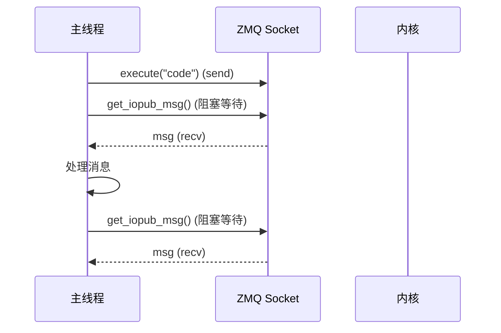
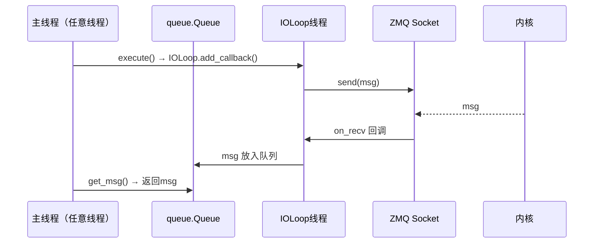

# 异步与线程模型

jupyter_client 提供三种并发模型：同步阻塞、异步 asyncio 和线程化 IOLoop。理解它们的区别和 ZMQ 的线程安全规则对于正确使用 jupyter_client 至关重要。

## ZMQ 线程安全规则

在深入客户端模型之前，必须理解 ZeroMQ 的核心线程安全规则：

> **ZMQ Context 是线程安全的，但 ZMQ Socket 不是。**

- 一个 ZMQ Context 可以在多线程间安全共享
- 一个 ZMQ Socket **只能**在创建它的线程中使用
- 在一个线程中创建的 Socket，不能在另一个线程中 send/recv/close
- 违反此规则会导致不可预测的行为（崩溃、数据丢失、死锁）

这直接决定了三种客户端的架构设计。

## 三种并发模型对比

| 特性 | BlockingKernelClient | AsyncKernelClient | ThreadedKernelClient |
|------|---------------------|-------------------|---------------------|
| **ZMQ Context** | `zmq.Context` | `zmq.asyncio.Context` | `zmq.Context` |
| **Socket 类型** | `zmq.Socket` | `zmq.asyncio.Socket` | `zmq.Socket`（包装为 ZMQStream） |
| **线程模型** | 单线程（调用线程） | 单线程（event loop 线程） | 双线程（主线程 + IOLoop 线程） |
| **消息接收** | 阻塞 `recv()` | `await recv()` | 队列传递（queue.Queue） |
| **消息发送** | 直接 send | await send | `IOLoop.add_callback` 线程安全发送 |
| **线程安全** | ❌ 仅创建线程可用 | ❌ 仅 event loop 线程可用 | ✅ 任意线程可调用 |
| **适用场景** | 脚本/REPL/简单工具 | asyncio 服务/Web后端 | GUI应用/多线程程序 |

## 同步阻塞模型：BlockingKernelClient



**特点**：
- 所有 ZMQ 操作在调用线程执行
- `get_msg()` 阻塞调用线程直到消息到达或超时
- 使用 `zmq.Poller` 实现超时机制
- 不创建额外线程，模型最简单
- 阻塞期间无法处理其他事件（如 GUI 更新、信号处理）

```python
# 同步模型——注意阻塞
kc = BlockingKernelClient()
kc.start_channels()
kc.wait_for_ready()

msg_id = kc.execute("import time; time.sleep(5); print('done')")

# 这里阻塞 5 秒等待输出
while True:
    msg = kc.get_iopub_msg(timeout=10)  # 阻塞
    # ...
```

## 异步 asyncio 模型：AsyncKernelClient

```mermaid
sequenceDiagram
    participant Loop as Event Loop
    participant Socket as asyncio.Socket
    participant Kernel as 内核
    participant Other as 其他协程

    Loop->>Socket: execute("code") (send)
    Note over Loop: 事件循环继续执行
    Other-->>Loop: 其他协程在此期间运行
    Socket-->>Loop: msg (await recv)
    Loop->>Loop: 处理消息
```

**特点**：
- 使用 `zmq.asyncio.Context` 创建异步 Socket
- 所有消息 I/O 使用 `async/await` 非阻塞
- 单 event loop 线程中多路复用多个 Socket
- 可以同时等待多个内核的消息、HTTP 请求、定时器等
- **Socket 只能在 event loop 线程中使用**

```python
# 异步模型——非阻塞，事件循环可处理其他任务
import asyncio

async def main():
    kc = AsyncKernelClient()
    kc.start_channels()
    await kc._async_wait_for_ready()

    kc.execute("import time; time.sleep(5); print('done')")

    # await 期间事件循环可以运行其他协程
    while True:
        msg = await kc._async_get_iopub_msg(timeout=10)  # 非阻塞等待
        # ...

asyncio.run(main())
```

### AsyncZMQSocketChannel

```python
class AsyncZMQSocketChannel(ZMQSocketChannel):
    """异步 ZMQ 通道"""

    def __init__(self, socket, session, loop=None):
        super().__init__(socket, session, loop)
        self._recv_future = None  # 避免并发 recv

    async def get_msg(self, timeout=None):
        """异步接收消息"""
        if timeout is not None:
            try:
                timeout_ms = int(timeout * 1000)
                events = dict(await self.socket.poll(timeout_ms))
                if events.get(self.socket) != zmq.POLLIN:
                    raise Empty
            except zmq.Again:
                raise Empty

        # 反序列化
        msg = await self.socket.recv_multipart()
        return self.session.deserialize(msg, content=True)
```

## 线程化模型：ThreadedKernelClient



**特点**：
- ZMQ I/O 在独立的 **IOLoop 线程**中运行
- 主线程通过线程安全队列接收消息
- 发送消息通过 `IOLoop.add_callback()` 线程安全委托
- **任意线程都可以调用 client 的方法**
- 适用于 GUI（Qt/Tkinter）、多线程数据管道等场景

### ThreadedZMQSocketChannel 实现

```python
class ThreadedZMQSocketChannel(ZMQSocketChannel):
    """线程安全的 ZMQ 通道"""

    def __init__(self, socket, session, loop):
        super().__init__(socket, session, loop)
        self._recv_q = queue.Queue()  # 线程安全队列
        self._thread = None
        self._ioloop = None

    def start(self):
        """在独立线程中启动 IOLoop"""
        self._ioloop = ioloop.IOLoop(make_current=False)
        self._stream = ZMQStream(self.socket, self._ioloop)
        self._stream.on_recv(self._handle_recv)
        self._thread = threading.Thread(target=self._ioloop.start, daemon=True)
        self._thread.start()

    def _handle_recv(self, frames):
        """IOLoop线程中的接收回调"""
        msg = self.session.deserialize(frames)
        self._recv_q.put(msg)  # 放入队列，主线程取走

    def get_msg(self, timeout=None):
        """主线程调用——从队列取消息（线程安全）"""
        try:
            return self._recv_q.get(timeout=timeout)
        except queue.Empty:
            raise Empty("Channel timeout")

    def send(self, msg):
        """线程安全发送——委托给 IOLoop"""
        if self._ioloop and self._thread.is_alive():
            self._ioloop.add_callback(self._send_in_ioloop, msg)

    def _send_in_ioloop(self, msg):
        """在 IOLoop 线程中实际发送"""
        self._stream.send_multipart(self.session.serialize(msg))
```

### ThreadedKernelClient 启动流程

```python
class ThreadedKernelClient(BlockingKernelClient):
    shell_channel_class = Type(ThreadedZMQSocketChannel)
    iopub_channel_class = Type(ThreadedZMQSocketChannel)
    stdin_channel_class = Type(ThreadedZMQSocketChannel)
    control_channel_class = Type(ThreadedZMQSocketChannel)
    hb_channel_class = Type(HBChannel)

    def start_channels(self, **kwargs):
        """启动通道（在IOLoop线程中创建 Socket）"""
        self._ioloop = ioloop.IOLoop(make_current=False)
        self._ioloop_thread = threading.Thread(
            target=self._ioloop.start, daemon=True
        )
        self._ioloop_thread.start()
        # 在 IOLoop 线程中初始化所有通道
        self.ioloop.add_callback(self._start_channels_in_ioloop)

    def _start_channels_in_ioloop(self):
        """IOLoop 线程中创建和连接 Socket"""
        # 创建 socket、连接、设置 stream...
```

## Context 管理

### zmq.Context vs zmq.asyncio.Context

| Context 类型 | 线程安全 | Socket 类型 | 适用客户端 |
|-------------|---------|------------|-----------|
| `zmq.Context` | ✅ | `zmq.Socket`（同步） | BlockingKernelClient, ThreadedKernelClient |
| `zmq.asyncio.Context` | ✅ | `zmq.asyncio.Socket`（异步） | AsyncKernelClient |

`zmq.asyncio.Context` 创建的 Socket 集成了 asyncio，可以直接 `await socket.recv_multipart()`。

### Context 共享

多内核场景下可以共享 Context 减少资源开销：

```python
import zmq

# 共享 Context
context = zmq.Context()

km1 = KernelManager()
km1.context = context
km1.start_kernel()

km2 = KernelManager()
km2.context = context
km2.start_kernel()
```

## HBChannel 的线程模型

心跳通道（HBChannel）是一个特殊情况——它始终在**独立的守护线程**中运行，无论使用哪种客户端：

```python
class HBChannel(Thread):
    daemon = True  # 守护线程，主进程退出自动终止

    def run(self):
        """在独立线程中运行心跳循环"""
        loop = asyncio.new_event_loop()
        asyncio.set_event_loop(loop)
        loop.run_until_complete(self._async_run())
        loop.close()

    async def _async_run(self):
        while not self._exiting:
            await self._async_send(b"ping")
            # 等待 pong 或超时
            ready = await self._poll(self.time_to_dead * 1000)
            if ready:
                await self._async_recv()
                self._beating = True
            else:
                self._beating = False
                self.call_handlers(...)
                self._reconnect()
```

这是因为心跳需要持续监控，如果在 event loop 中运行会阻塞主事件循环；如果在主线程中运行会阻塞应用逻辑。独立线程是最合理的选择。

## run_sync：异步方法的同步包装

BlockingKernelClient 使用 tornado 的 `IOLoop.run_sync` 将异步方法包装为同步方法：

```python
class BlockingKernelClient(KernelClient):
    def wait_for_ready(self, timeout=None):
        """同步等待内核就绪"""
        return self.run_sync(self._async_wait_for_ready, timeout=timeout)

    def run_sync(self, coro, timeout=None):
        """在临时 event loop 中运行协程"""
        loop = asyncio.new_event_loop()
        try:
            return loop.run_until_complete(
                asyncio.wait_for(coro(), timeout=timeout)
            )
        finally:
            loop.close()
```

## 模型选择决策树

```
你的应用是？
├─ 简单脚本/一次性执行
│   └─ BlockingKernelClient（最简单）
├─ asyncio 应用（FastAPI/aiohttp/Tornado）
│   └─ AsyncKernelClient（原生异步）
├─ GUI 应用（Qt/Tkinter/wxPython）
│   └─ ThreadedKernelClient（线程安全）
├─ Jupyter 控制台/REPL
│   └─ BlockingKernelClient + 线程处理stdin
├─ 多线程数据管道
│   └─ ThreadedKernelClient
└─ 需要同时管理多个内核
    ├─ 同步环境 → MultiKernelManager（内部管理多个KernelManager）
    └─ 异步环境 → AsyncMultiKernelManager
```

## 常见陷阱

1. **在错误的线程中使用 Socket**：AsyncKernelClient 的方法只能在 event loop 线程中 await，从其他线程调用会导致未定义行为
2. **阻塞 event loop**：在 async 回调中执行阻塞操作（如 `time.sleep()`）会冻结整个 event loop，包括心跳
3. **忘记启动 IOLoop 线程**：ThreadedKernelClient 需要调用 `start_channels()` 才会启动 IOLoop 线程
4. **共享 Socket 跨线程**：永远不要在多个线程间传递或使用同一个 ZMQ Socket
5. **过早关闭 Context**：确保所有 Socket 关闭后再销毁 Context，否则会导致 C 层崩溃

## 相关概念

- [客户端体系](05-client-hierarchy.md)
- [五通道系统](03-channels-system.md)
