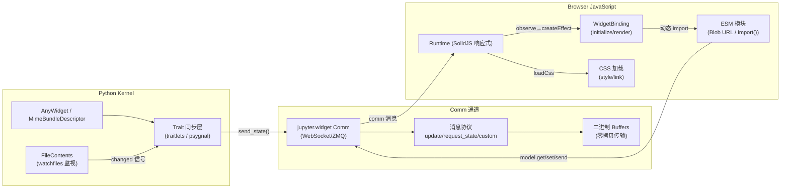

# 整体架构与 ESM 协议

## 什么是 anywidget

anywidget 是一个用于创建自定义 Jupyter Widgets 的 Python 库，核心理念是 **"custom jupyter widgets made easy"**。它极大简化了传统 ipywidgets 的开发流程，让开发者无需配置 webpack/rollup 等构建工具即可创建功能完整的交互式 Widget。

### 设计哲学

anywidget 围绕三个核心设计原则构建：

1. **零构建步骤（No Build Step）**：前端代码以 ESM（ECMAScript Module）字符串形式直接从 Python 传入浏览器，通过 Blob URL + 动态 `import()` 加载，无需任何打包工具。
2. **ESM 优先（ESM-first）**：前端代码原生使用 ES Modules，与现代浏览器模块系统一致，而非传统 ipywidgets 使用的 AMD 格式。
3. **渐进式复杂度**：入门只需继承一个基类并写几行 JS；高级用法支持热更新、多框架集成、RPC 命令调用等。

### 与传统 ipywidgets 的对比

| 特性 | 传统 ipywidgets | anywidget |
|------|----------------|-----------|
| 前端构建 | 必须 webpack/rollup 打包为 AMD Bundle | 零构建，ESM 字符串直接运行 |
| 开发体验 | 修改后需重新构建+刷新 Notebook | 内置 HMR 热更新，保存即生效 |
| 前端模块格式 | AMD（RequireJS define） | ESM（export default） |
| Python 基类 | 必须继承 DOMWidget | 继承 AnyWidget **或** 使用装饰器/描述符 |
| 数据模型 | 强依赖 traitlets | 自动适配 traitlets/dataclass/pydantic/msgspec |
| 前端框架 | 需手动集成 | 提供 @anywidget/react、@anywidget/svelte 等官方桥接包 |

## 双 API 层架构

anywidget 提供两套并行 API，满足不同场景需求：

### 第一层：AnyWidget 继承基类

基于 `ipywidgets.DOMWidget` 的便捷基类，适合熟悉 ipywidgets 生态的开发者：

```python
import anywidget
import traitlets as t

class CounterWidget(anywidget.AnyWidget):
    _esm = """
    export default {
      render({ model, el }) {
        let count = () => model.get("value");
        el.innerHTML = `<button>${count()}</button>`;
        el.querySelector("button").onclick = () => {
          model.set("value", count() + 1);
          model.save_changes();
        };
        model.on("change:value", () => {
          el.querySelector("button").textContent = count();
        });
      }
    }
    """
    value = t.Int(0).tag(sync=True)
```

### 第二层：MimeBundleDescriptor 描述符协议

更通用的底层 API，可将**任意 Python 对象**变为 Jupyter Widget，无需继承 ipywidgets：

```python
from anywidget.experimental import widget, dataclass

# @widget 装饰器方式
@widget(esm="export default { render({ el }) { el.textContent = 'Hello'; } }")
class SimpleWidget:
    value: str = "Hello"

# @dataclass 方式（完全脱离 traitlets）
@dataclass(esm="export default { render({ model, el }) { /* ... */ } }")
class Counter:
    value: int = 0
```

`@dataclass` 装饰器内部通过 `psygnal.evented` 注入事件信号，再挂载 `MimeBundleDescriptor`，完全不依赖 traitlets。

> **关键洞察**：创建 anywidget 不必继承 `AnyWidget` 基类。描述符协议是更本质、更通用的 API，`experimental.@widget` 和 `@dataclass` 装饰器均基于此构建。

## 核心架构：Python Kernel ↔ Comm ↔ JS ESM



### 通信链路解析

1. **Python 端**：Widget 对象通过 traitlets 或 psygnal 管理状态。当状态变更时，`ReprMimeBundle.send_state()` 将状态序列化，分离二进制 buffer，通过 Comm 通道发送 `update` 消息。
2. **Comm 通道**：使用 Jupyter 标准的 `"jupyter.widget"` comm target，基于 WebSocket（JupyterLab）或 ZMQ（经典 Notebook）传输，支持结构化 JSON 消息和二进制 buffer。
3. **JS 端**：`Runtime` 类通过 SolidJS `createRoot`/`createEffect` 构建响应式系统。`observe()` 函数将 model trait 变更包装为 SolidJS signal，`createEffect` 自动追踪 `_esm`/`_css` 依赖并在变更时重新加载。
4. **ESM 加载**：内联 ESM 通过 `Blob` + `URL.createObjectURL` 创建 Blob URL 后动态 `import()`，加载后立即 `revokeObjectURL`；文件路径 ESM 在开发模式下可通过 Vite dev server 加载。

## ESM 前后端契约

ESM 模块是 Python 和 JavaScript 之间的**唯一契约**。Python 端通过 `_esm` 属性传入前端代码，JS 端加载后执行约定的生命周期函数。

### `_esm` 属性的四种形式

| 形式 | 类型 | 示例 | 说明 |
|------|------|------|------|
| 内联字符串 | `str` | `_esm = "export default { render({el}){...} }"` | 多行字符串直接作为 ESM 代码 |
| 路径字符串 | `str` | `_esm = "widget.js"` | 单行带文件后缀，自动解析为文件路径 |
| Path 对象 | `pathlib.Path` | `_esm = Path(__file__)/"widget.js"` | 显式路径对象 |
| 文件内容对象 | `FileContents`/`VirtualFileContents` | 通过 `try_file_contents` 自动转换 | 支持文件监视和热更新 |

### ESM 模块格式约定

ESM 模块需 `export default` 一个包含可选 `initialize` 和 `render` 的对象：

```javascript
// 推荐格式：export default { initialize?, render? }
export default {
  async initialize({ model, signal, experimental }) {
    // model 级别初始化（无 el），可选
    return () => { /* cleanup */ };
  },
  async render({ model, el, signal, host, experimental }) {
    // 视图渲染，必需
    el.innerHTML = "<div>Hello anywidget</div>";
    return () => { /* cleanup */ };
  }
}
```

也支持异步函数形式（用于异步导入）：

```javascript
export default async function() {
  const { someUtil } = await import("some-lib");
  return { render({ model, el }) { /* ... */ } };
}
```

> **注意**：直接 `export function render()` 的旧格式仍被兼容但已弃用，会在控制台发出警告。

### Blob URL 加载机制

内联 ESM 字符串通过以下机制在浏览器中执行：

```typescript
async function loadEsm(esm: string): Promise<any> {
  // 内联字符串 → Blob → ObjectURL → 动态 import
  const blob = new Blob([esm], { type: "text/javascript" });
  const url = URL.createObjectURL(blob);
  try {
    return await import(/* @vite-ignore */ url);
  } finally {
    URL.revokeObjectURL(url);  // 加载后立即释放，避免内存泄漏
  }
}
```

这种"字符串即模块"的设计使得 Python 字符串直接变为浏览器中可执行的 ESM 模块，是零构建体验的关键。

## 核心特性概览

### 热模块替换（HMR）

设置 `ANYWIDGET_HMR=1` 环境变量后，anywidget 使用 watchfiles 库在后台线程监视 ESM/CSS 文件变更。文件保存后，变更通过 Comm 通道实时推送到前端，SolidJS 响应式系统自动重新加载模块并执行新的 render，无需刷新页面。详见 [04-hmr-dev](04-hmr-dev.md)。

### 框架桥接

anywidget 生态提供官方框架适配包，让开发者可以用熟悉的前端框架编写 Widget 视图：

- `@anywidget/react`：React Hooks 集成
- `@anywidget/svelte`：Svelte Store 集成
- `@anywidget/vue`：Vue Composition API 集成
- `@anywidget/signals`：通用 Signals 集成

详见 [05-framework-bridges](05-framework-bridges.md)。

### Trait 双向同步

标记为 `.tag(sync=True)` 的 trait 在 Python 和 JS 之间自动双向同步。支持 traitlets Unicode/Int/Float/Bool/List/Dict/Instance/Bytes/Any 类型，以及自定义 `WidgetTrait`（用于 Widget 间组合引用）。详见 [02-trait-sync](02-trait-sync.md)。

### Custom Messages 与命令调用

除了 trait 同步，JS 端可通过 `model.send()` 发送自定义消息，Python 端通过 `on_msg` 回调处理。更进一步，`@command` 装饰器 + `experimental.invoke()` 提供基于 UUID 匹配的 RPC 模式，支持 JS 调用 Python 函数并获取返回值。详见 [03-frontend-communication](03-frontend-communication.md)。

## 最小 "Hello World" 示例

```python
import anywidget

class HelloWidget(anywidget.AnyWidget):
    _esm = """
    export default {
      render({ el }) {
        el.classList.add("hello-widget");
        el.innerHTML = "<h1>Hello, anywidget! 👋</h1>";
      }
    }
    """
    _css = """
    .hello-widget h1 {
      color: #ff6b6b;
      font-family: system-ui;
    }
    """

# 在 Jupyter 中实例化即可显示
HelloWidget()
```

## 版本与协议

- **Python 依赖**：`ipywidgets>=7.6.0`、`psygnal>=0.8.1`、`typing-extensions>=4.2.0`
- **可选依赖**：`watchfiles>=1.1.0`（HMR 文件监视）
- **协议版本**：Jupyter Widgets Protocol v2.1（`application/vnd.jupyter.widget-view+json`）
- **JS 模块注册**：通过 AMD `define(["@jupyter-widgets/base"], create)` 注册到经典 Notebook，通过 JupyterLab 插件 `registry.registerWidget()` 注册到 JupyterLab

## 相关示例

- [Counter Widget 入门示例](../examples/counter-widget.md) — 跑通第一个 anywidget，理解 render + model.get/set 基础用法
