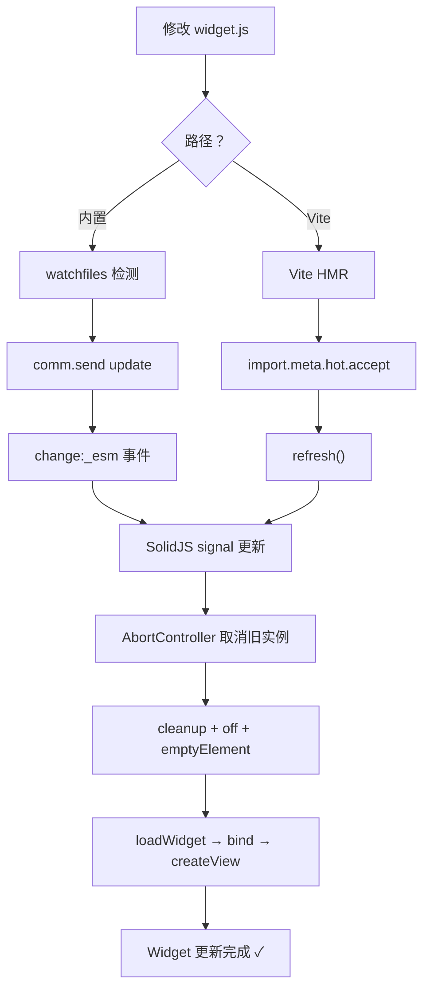

# HMR 热更新机制与开发工作流

热模块替换（HMR）是 anywidget 最具差异化的开发体验——修改 ESM/CSS 文件保存后，浏览器中的 Widget 立即更新，无需刷新页面或重新执行单元格。本文档解析两条 HMR 路径（内置 watchfiles 路径和 Vite 增强路径）以及 SolidJS 响应式内核驱动热更新的原理。

## HMR 两条路径概览

| 路径 | 依赖 | 机制 | 特点 |
|------|------|------|------|
| **内置 HMR** | `watchfiles` | 文件监视 → Python changed 信号 → comm update → JS 响应式重载 | 零配置、纯 Python 驱动 |
| **Vite 增强 HMR** | Vite dev server + anywidget Vite 插件 | Vite 中间件 → import.meta.hot.accept() → refresh | 错误遮罩、npm 包导入、模块缓存 |

两条路径最终在 JS 端汇合：ESM 内容变更触发 Runtime 的 SolidJS `createEffect` 重新执行加载流程。

> **注意**：`anywidget/_serve.py` 在当前版本中不存在。anywidget 不提供独立开发服务器，HMR 通过文件监视 + comm 通道实现。

## ANYWIDGET_HMR 环境变量

HMR 默认关闭，需通过环境变量启用：

```bash
# Linux/macOS
export ANYWIDGET_HMR=1

# Windows PowerShell
$env:ANYWIDGET_HMR=1

# 启动 Jupyter 时
ANYWIDGET_HMR=1 jupyter lab
```

`_should_start_thread()` 决定是否启动文件监视线程：site-packages/dist-packages 中的文件不监视、HMR 未启用时不启动、watchfiles 未安装时发出警告。watchfiles 是可选依赖（`pip install watchfiles`）。

## 内置 HMR 路径

### Python 端：FileContents 文件监视

`FileContents` 在 daemon 后台线程中使用 watchfiles 监视文件变更：

```python
class FileContents:
    changed = Signal(str)   # 文件修改时发射新内容
    deleted = Signal()      # 文件删除时发射

    def watch(self):
        for changes in watchfiles.watch(str(self._path), stop_event=self._stop_event):
            for change_type, path in changes:
                if change_type == watchfiles.Change.deleted:
                    self.deleted.emit(); return
                self._contents = None  # 清空懒加载缓存
                self.changed.emit(str(self))  # str(self) 重新读取文件
                yield (change_type, path)
```

文件内容懒加载——`__str__` 时才读取并缓存，变更时清空缓存触发重新读取。

### 信号连接链

```text
文件保存 → watchfiles 检测 → FileContents.changed 信号
  → setattr(self, "_esm", new_val) 或 send_state(key)
  → traitlets/psygnal 观察者触发 send_state()
  → comm.send({"method":"update","state":{"_esm":"..."}})
  → JS model.set("_esm",...) → "change:_esm" 事件
```

### VirtualFileContents：Notebook 内虚拟文件

`%%vfile` cell magic 创建内存文件，同样支持热更新：

```python
%load_ext anywidget

%%vfile widget.js
export default { render({ model, el }) { el.textContent = "Hello"; } }

class MyWidget(anywidget.AnyWidget):
    _esm = "vfile:widget.js"
```

重新执行 `%%vfile` cell 时，`VirtualFileContents.contents` setter 发射 `changed` 信号，触发与文件监视相同的更新流程。

## JS 端：SolidJS 响应式内核

JS Runtime 内部使用 [SolidJS](https://www.solidjs.com/) 的 `createRoot`/`createEffect` 驱动热更新。**SolidJS 是纯内部实现细节，用户写 ESM 时无需了解其 API。**

### Runtime 响应式初始化

```typescript
class Runtime {
  constructor(model, { signal }) {
    const binding = BINDINGS.getOrCreate(model);

    solid.createRoot((dispose) => {
      signal.addEventListener("abort", dispose);

      // observe 将 model trait 包装为 SolidJS signal（Accessor）
      const css = observe(model, "_css", { signal });
      const esm = observe(model, "_esm", { signal });

      // CSS 变更 → 自动重载
      solid.createEffect(() => {
        if (css()) loadCss(css(), String(model.get("_anywidget_id")));
      });

      // ESM 变更 → 重新加载 + 重新绑定
      solid.createEffect(() => {
        const controller = new AbortController();  // 取消前一次加载
        loadWidget(esm(), id).then(widgetDef => {
          binding.bind(widgetDef, { signal: controller.signal, experimental });
        });
      });
    });
  }
}
```

SolidJS `createEffect` 自动追踪依赖——effect 中访问的 signal 变化时自动重跑。`observe()` 将 `change:_esm` 事件桥接到 SolidJS signal。

### observe 函数

```typescript
function observe<T>(model, name, { signal }): solid.Accessor<T> {
  const [accessor, setter] = solid.createSignal(model.get(name));
  const onChange = () => setter(model.get(name));
  model.on(`change:${name}`, onChange);
  signal.addEventListener("abort", () => model.off(`change:${name}`, onChange));
  return accessor;
}
```

## ESM 热更新 5 步流程

1. **AbortController 取消旧实例**：createEffect 重跑时创建新 controller，WidgetBinding.bind 显式 abort 旧 controller
2. **loadWidget 加载新模块**：内联 ESM 通过 Blob URL 动态 import，每次创建新 URL 避免缓存
3. **binding.bind 重新 initialize**：abort 旧 controller、清除 INITIALIZE_MARKER 上下文的监听器、执行新 initialize
4. **createView 重新 render**：`emptyElement(el)` 清空 DOM、`model.off(null, null, view)` 清除监听器、新建 AbortController、执行新 render
5. **旧 cleanup 自动执行**：旧 AbortController abort 触发 signal abort 事件，用户 cleanup 函数和事件监听被自动清理

## CSS 热更新：无闪烁

- **CSS 文本**：替换 `<style>` 元素的 textContent，浏览器立即重新应用
- **CSS URL**：创建新 `<link>` 元素，等待 onload 后再移除旧 link，避免 FOUC（样式闪烁）

```typescript
async function loadCssHref(href, id) {
  const existing = document.getElementById(id);
  const link = document.createElement("link");
  link.rel = "stylesheet"; link.href = href;
  await new Promise((res, rej) => { link.onload = res; link.onerror = rej; document.head.appendChild(link); });
  existing?.remove();  // 新样式就绪后才移除旧链接
}
```

## Vite 增强 HMR

Vite 插件提供更强大的开发体验：npm 包导入、错误遮罩、模块缓存。

### 工作原理

```text
浏览器请求 http://localhost:5173/widget.js?anywidget
  → Vite 中间件拦截 ?anywidget 参数
  → URL 重写为 anywidget:widget.js（虚拟模块）
  → resolveId 解析为 \0anywidget:widget.js
  → load 返回 hmr.js 运行时模板
  → import.meta.hot.accept() 监听源文件变更 → refresh()
```

### Vite 配置

```javascript
// vite.config.js
import { defineConfig } from "vite";
import anywidget from "anywidget/vite";

export default defineConfig({
  plugins: [anywidget()],
});
```

```python
class MyWidget(anywidget.AnyWidget):
    _esm = "http://localhost:5173/widget.js?anywidget"
```

`?anywidget` 查询参数是关键——Vite 插件通过它识别需要特殊处理的 anywidget 入口。插件 `apply: "serve"` 表示仅在 dev 模式生效。

### Vite HMR Runtime refresh 流程

```javascript
let contexts = [];  // 所有 widget 实例上下文

import.meta.hot.accept("__ANYWIDGET_HMR_SRC__", (newModule) => {
  refresh(getAFM(newModule));
});

async function refresh(afm) {
  for (const ctx of contexts) {
    safeCleanup(ctx.cleanup);       // 1. 执行旧 cleanup
    ctx.model.off(null, null, ctx); // 2. 移除旧监听器
    emptyElement(ctx.el);           // 3. 清空 DOM
    const controller = new AbortController();
    await initializeAndRender(afm, { ...ctx, controller }); // 4. 重新初始化+渲染
  }
}
```

Vite HMR runtime 还监听 window error/unhandledrejection 显示错误遮罩，修复后自动恢复。

### 开发工作流图



## AbortSignal 在 HMR 中的关键角色

AbortSignal 是 HMR 正确清理资源的核心原语。在四种场景触发 abort：

| 场景 | 触发位置 |
|------|---------|
| ESM 重新加载 | Runtime createEffect 新建 AbortController |
| View 移除 | AnyView.#controller.abort() |
| Model 销毁 | AnyModel "destroy" 事件 |
| HMR refresh | Vite hmr.js 新建 controller |

### 正确的清理模式

```javascript
export default {
  render({ el, signal }) {
    const button = document.createElement("button");
    el.appendChild(button);
    const interval = setInterval(() => {}, 1000);
    button.addEventListener("click", () => {});

    // 返回 cleanup 函数（框架在 HMR/销毁时自动调用）
    return () => {
      button.remove();
      clearInterval(interval);
    };
  }
}
```

## 相关示例

- [Vite 集成开发与 HMR](../examples/vite-integration.md) — 搭建 Vite 环境，体验完整 HMR 工作流
