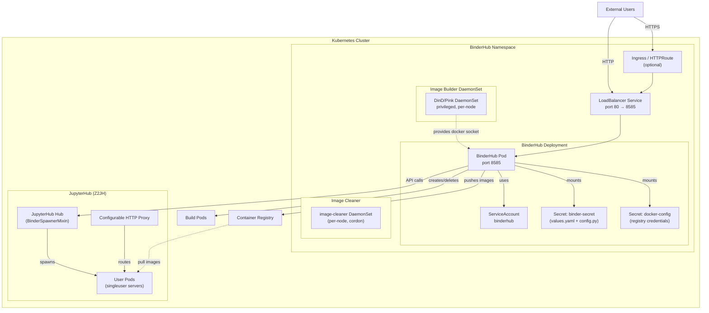

# Helm Chart 部署架构

## 概述

BinderHub 的生产部署通过 Helm Chart 实现，Chart 位于 [helm-chart/binderhub/](file:///D:/spaces/SpecWeave/external/libs/jupyter/binderhub/helm-chart/binderhub/) 目录。该 Chart 依赖 Zero-to-JupyterHub (Z2JH) Helm Chart 提供 JupyterHub 服务，自身负责 BinderHub API 服务、构建基础设施、镜像清理和 RBAC 权限配置。Chart 使用 chartpress 工具自动构建和发布镜像。

## Chart 元数据

[Chart.yaml](file:///D:/spaces/SpecWeave/external/libs/jupyter/binderhub/helm-chart/binderhub/Chart.yaml) 定义了 Chart 的基本信息：

```yaml
apiVersion: v2
name: binderhub
version: 0.0.1-set.by.chartpress
dependencies:
  - name: jupyterhub
    version: "4.3.5"
    repository: "https://jupyterhub.github.io/helm-chart"
description: |-
  BinderHub is like a JupyterHub that automatically builds environments for the
  users based on repo2docker.
keywords: [jupyter, jupyterhub, binderhub]
kubeVersion: ">=1.28.0-0"
```

关键点：

| 字段 | 值 | 说明 |
|---|---|---|
| `apiVersion` | `v2` | Helm 3 Chart 格式 |
| `dependencies` | jupyterhub 4.3.5 | 依赖 Z2JH Chart，提供 JupyterHub Hub、Proxy、用户Spawner等核心组件 |
| `version` | `set.by.chartpress` | 版本号由 chartpress 在构建时自动注入 |
| `kubeVersion` | `>=1.28.0-0` | 要求 Kubernetes 1.28+（支持 policy/v1 PodDisruptionBudget 等稳定API） |

## values.yaml 配置结构

[values.yaml](file:///D:/spaces/SpecWeave/external/libs/jupyter/binderhub/helm-chart/binderhub/values.yaml) 是 Chart 的核心配置文件，分为多个配置段。

### 顶层配置段

| 配置段 | 类型 | 默认值 | 说明 |
|---|---|---|---|
| `pdb` | object | enabled: true, maxUnavailable: 1 | PodDisruptionBudget 配置 |
| `replicas` | int | 1 | BinderHub 副本数 |
| `resources` | object | cpu: 0.2, memory: 512Mi | 容器资源请求 |
| `rbac` | object | enabled: true | 是否创建 RBAC 资源 |
| `nodeSelector` | object | {} | Pod 节点选择器 |
| `tolerations` | list | [] | Pod 容忍度 |
| `image` | object | quay.io/jupyterhub/k8s-binderhub | BinderHub 镜像配置 |
| `registry` | object | url/username/password | Docker 注册表凭证（用于生成 config.json） |
| `service` | object | type: LoadBalancer, prometheus.io/scrape: "true" | Kubernetes Service 配置 |
| `config` | object | BinderHub/KubernetesBuildExecutor 配置 | BinderHub 应用配置 |
| `extraConfig` | object | {} | 额外 Python 配置片段（按key排序执行） |
| `extraFiles` | object | {} | 额外配置文件（通过Secret挂载） |
| `extraPodSpec` | object | {} | 额外 Pod 规范字段 |
| `jupyterhub` | object | Z2JH 子配置 | JupyterHub 相关配置（传递给依赖Chart） |
| `deployment` | object | readiness/liveness probes | 部署探针配置 |
| `imageBuilderType` | string | `"host"` | 镜像构建方式：host/dind/pink |
| `dind` | object | DinD 配置 | Docker-in-Docker 构建配置 |
| `pink` | object | Podman-in-Kubernetes 配置 | Podman 构建配置 |
| `imageCleaner` | object | enabled: true | 镜像清理 CronJob/DaemonSet 配置 |
| `httpRoute` | object | enabled: false | Gateway API HTTPRoute |
| `ingress` | object | enabled: false | Ingress 配置 |
| `initContainers` | list | [] | 初始化容器 |
| `extraVolumes`/`extraVolumeMounts` | list | [] | 额外卷和挂载 |
| `extraEnv` | object | {} | 额外环境变量 |
| `podAnnotations` | object | {} | Pod 注解 |

### config.BinderHub 配置段

```yaml
config:
  BinderHub:
    base_url: /
    build_node_selector: {}
    use_registry: true
  KubernetesBuildExecutor: {}
```

这是直接映射到 BinderHub Python 应用 `c.BinderHub.*` 配置的部分，通过 Secret 挂载到容器内，由 `binderhub_config.py` 加载。

### jupyterhub 配置段

`jupyterhub` 段配置传递给 Z2JH 依赖 Chart，控制 JupyterHub 的行为：

```yaml
jupyterhub:
  cull:
    enabled: true
    users: true
  hub:
    config:
      JupyterHub:
        authenticator_class: "null"
      BinderSpawner:
        auth_enabled: false
    loadRoles:
      binder:
        services:
          - binder
        scopes:
          - servers
          - admin:users
    extraConfig:
      0-binderspawnermixin: |
        # BinderSpawnerMixin 源码（自动从 binderspawner_mixin.py 复制）
        ...
      00-binder: |
        from kubespawner import KubeSpawner
        class BinderSpawner(BinderSpawnerMixin, KubeSpawner):
            pass
        c.JupyterHub.spawner_class = BinderSpawner
    services:
      binder:
        display: false
  singleuser:
    cmd: [...]  # 智能选择 jupyter-lab 或 jupyter-notebook
    storage:
      type: none
```

关键配置说明：

1. **authenticator_class: "null"**（[values.yaml:81](file:///D:/spaces/SpecWeave/external/libs/jupyter/binderhub/helm-chart/binderhub/values.yaml#L81)）：使用 NullAuthenticator，即无认证（任何人都可以访问，匿名模式）；
2. **BinderSpawner.auth_enabled: false**（[values.yaml:83](file:///D:/spaces/SpecWeave/external/libs/jupyter/binderhub/helm-chart/binderhub/values.yaml#L83)）：Spawner 不使用 JupyterHub 认证，使用 BinderHub 传递的 Token；
3. **loadRoles.binder**（[values.yaml:84-95](file:///D:/spaces/SpecWeave/external/libs/jupyter/binderhub/helm-chart/binderhub/values.yaml#L84-L95)）：为 `binder` 服务授予 `servers` 和 `admin:users` 权限。`servers` 范围允许启动/停止服务器；`admin:users` 范围允许创建临时用户（匿名模式必需），认证模式下需要 `read:users` 范围；
4. **BinderSpawnerMixin 内嵌**：`0-binderspawnermixin` 是 BinderSpawnerMixin 类的完整 Python 源码，通过 CI 脚本从 `binderhub/binderspawner_mixin.py` 自动复制；
5. **00-binder**：定义 `BinderSpawner` 类（继承 BinderSpawnerMixin 和 KubeSpawner），并设置为 JupyterHub 的 spawner_class；
6. **singleuser.cmd**：启动命令优先使用 jupyterlab（版本≥3时），回退到 jupyter-notebook；
7. **singleuser.storage.type: none**：不挂载持久存储（Binder 环境是临时的）。

### imageBuilderType：三种构建模式

| 模式 | 说明 | Docker Host |
|---|---|---|
| `"host"`（默认） | 使用节点上的宿主机 Docker | `/var/run/docker.sock` |
| `"dind"` | Docker-in-Docker DaemonSet 提供独立 Docker | `/var/run/dind/docker.sock` |
| `"pink"` | Podman-in-Kubernetes DaemonSet | `/var/run/pink/podman.sock` |

**DinD 模式**配置：

```yaml
dind:
  daemonset:
    image:
      name: docker.io/library/docker
      tag: "28.3.3-dind"
    extraArgs: []
  storageDriver: overlay2
  hostSocketDir: /var/run/dind
  hostLibDir: /var/lib/dind
  hostSocketName: docker.sock
```

DinD 以特权 DaemonSet 运行，在每个节点上启动独立的 dockerd 进程，通过 hostPath 挂载套接字和存储目录，避免与宿主机 Docker 冲突。

**Pink (Podman) 模式**配置：

```yaml
pink:
  daemonset:
    image:
      name: quay.io/podman/stable
      tag: "v5.8.2"
  hostStorageDir: /var/lib/pink/storage
  hostSocketDir: /var/run/pink
  hostSocketName: podman.sock
```

### imageCleaner：镜像清理

```yaml
imageCleaner:
  enabled: true
  image:
    name: quay.io/jupyterhub/docker-image-cleaner
    tag: "1.0.0-beta.3"
  cordon: true
  delay: 5
  imageGCThresholdType: "relative"
  imageGCThresholdHigh: 80
  imageGCThresholdLow: 60
```

镜像清理以 DaemonSet 方式运行在每个节点上：
- `cordon: true`：清理期间临时封锁节点（防止新Pod调度到正在清理的节点）；
- `delay: 5`：每5秒最多删除一个镜像；
- 阈值：磁盘/inode使用率超过80%时开始清理，清理到60%以下停止；
- 需要 ClusterRole 权限来 patch 节点（cordon/uncordon）。

## binderhub_config.py：运行时配置加载

[files/binderhub_config.py](file:///D:/spaces/SpecWeave/external/libs/jupyter/binderhub/helm-chart/binderhub/files/binderhub_config.py) 是容器内的主配置入口，挂载到 `/etc/binderhub/config/binderhub_config.py`，通过 `--config` 参数传递给 BinderHub。

### _load_values()：值文件加载

```python
@lru_cache
def _load_values():
    """Load configuration from disk, memoized to only load once"""
    path = "/etc/binderhub/config/values.yaml"
    print(f"Loading {path}")
    with open(path) as f:
        return yaml.load(f)
```

使用 `functools.lru_cache` 装饰器缓存配置加载结果，确保 `values.yaml` 只被读取一次（YAML 解析是幂等的，但缓存避免重复IO和解析开销）。values.yaml 通过 Secret 挂载到 `/etc/binderhub/config/values.yaml`。

### get_value()：点分键查找

```python
def get_value(key, default=None):
    """Find an item in values.yaml, get_value("a.b.c") returns values['a']['b']['c']"""
    value = _load_values()
    for level in key.split("."):
        if not isinstance(value, dict):
            return default
        if level not in value:
            return default
        else:
            value = value[level]
    return value
```

支持点分表示法访问嵌套 YAML 键。例如 `get_value("config.BinderHub.base_url")` 等价于访问 `values["config"]["BinderHub"]["base_url"]`。如果中间路径不存在或遇到非字典值，返回 `default`。

### 模板路径设置

```python
c.BinderHub.template_path = "/etc/binderhub/templates"
```

设置 Jinja2 模板搜索路径为 `/etc/binderhub/templates/`（可通过 extraFiles 挂载自定义模板）。

### config 段加载循环

```python
for section, sub_cfg in get_value("config", {}).items():
    c[section].update(sub_cfg)
```

遍历 `config` 字典中的所有节（如 `BinderHub`、`KubernetesBuildExecutor`），将子配置合并到对应 traitlets 配置类中。这允许通过 values.yaml 的 `config.BinderHub.*` 直接设置任何 BinderHub trait。

### 镜像构建器套接字配置

```python
imageBuilderType = get_value("imageBuilderType")
if imageBuilderType in ["dind", "pink"]:
    hostSocketDir = get_value(f"{imageBuilderType}.hostSocketDir")
    if hostSocketDir:
        socketname = "docker" if imageBuilderType == "dind" else "podman"
        c.BinderHub.build_docker_host = f"unix://{hostSocketDir}/{socketname}.sock"
```

当使用 dind 或 pink 模式时，自动配置 `build_docker_host` 指向 DaemonSet 提供的 Unix 套接字。

### HubOAuth 认证配置

```python
if c.BinderHub.auth_enabled:
    if "hub_url" not in c.BinderHub:
        c.BinderHub.hub_url = ""
    hub_url = urlparse(c.BinderHub.hub_url)
    c.HubOAuth.hub_host = f"{hub_url.scheme}://{hub_url.netloc}"
    if "base_url" in c.BinderHub:
        c.HubOAuth.base_url = c.BinderHub.base_url
```

当启用认证模式时，自动配置 HubOAuth：
1. 从 `hub_url` 解析出 scheme 和 netloc，设置 `c.HubOAuth.hub_host`；
2. 将 BinderHub 的 `base_url` 传递给 HubOAuth（用于 OAuth 回调 URL 构造）。

### extraConfig 执行循环

```python
for key, snippet in sorted((get_value("extraConfig") or {}).items()):
    print(f"Loading extra config: {key}")
    exec(snippet)
```

按 key 的字典序（排序后）执行 `extraConfig` 中的所有 Python 代码片段。key 的命名约定使用数字前缀（如 `00-`、`01-`）控制执行顺序。`exec()` 在当前配置命名空间中执行代码，可以修改 `c` 对象来调整任何配置。

## Kubernetes 模板

### templates/deployment.yaml：BinderHub 部署

[deployment.yaml](file:///D:/spaces/SpecWeave/external/libs/jupyter/binderhub/helm-chart/binderhub/templates/deployment.yaml) 定义了 BinderHub 的 Deployment 资源。

#### 关键结构

```yaml
apiVersion: apps/v1
kind: Deployment
metadata:
  name: binder
spec:
  replicas: {{ .Values.replicas }}
  strategy:
    rollingUpdate:
      {{- if eq (.Values.replicas | int) 1 }}
      maxSurge: 1
      maxUnavailable: 0
      {{- end }}
  template:
    spec:
      serviceAccountName: binderhub  # RBAC启用时
      volumes:
        - name: config
          secret:
            secretName: binder-secret
        - name: docker-secret  # 或 docker-socket (hostPath)
      containers:
        - name: binder
          image: {{ .Values.image.name }}:{{ .Values.image.tag }}
          args:
            - --config
            - /etc/binderhub/config/binderhub_config.py
          volumeMounts:
            - mountPath: /etc/binderhub/config/
              name: config
              readOnly: true
            - mountPath: /root/.docker  # 注册表凭证
              name: docker-secret
          env:
            - name: BUILD_NAMESPACE
              valueFrom:
                fieldRef:
                  fieldPath: metadata.namespace
            - name: JUPYTERHUB_API_TOKEN
              valueFrom:
                secretKeyRef:
                  name: "{{ include "jupyterhub.hub.fullname" . }}"
                  key: hub.services.binder.apiToken
          ports:
            - containerPort: 8585
          readinessProbe:
            httpGet:
              path: {{ .Values.config.BinderHub.base_url }}versions
              port: binder
            periodSeconds: 5
            failureThreshold: 1000
          livenessProbe:
            httpGet:
              path: {{ .Values.config.BinderHub.base_url }}versions
              port: binder
            initialDelaySeconds: 10
            periodSeconds: 5
            failureThreshold: 3
```

重要细节：

1. **滚动更新策略**：单副本时使用 `maxSurge: 1, maxUnavailable: 0`（先启动新Pod再停止旧Pod，零停机）；
2. **Config Secret 挂载**：`binder-secret` 包含 values.yaml 和 binderhub_config.py，挂载到 `/etc/binderhub/config/`；
3. **Docker 凭证**：使用注册表时挂载 `docker-config.json` 到 `/root/.docker/`；否则挂载宿主机 docker.sock；
4. **JUPYTERHUB_API_TOKEN**：从 JupyterHub Hub 的 Secret 中获取 API Token（Z2JH 自动生成）；
5. **认证模式环境变量**：当 `auth_enabled=true` 时，额外设置 `JUPYTERHUB_SERVICE_NAME`、`JUPYTERHUB_API_URL`、`JUPYTERHUB_BASE_URL`、`JUPYTERHUB_CLIENT_ID`、`JUPYTERHUB_OAUTH_CALLBACK_URL` 等；
6. **readinessProbe**：`failureThreshold: 1000` 设置非常大的值（基本不在readiness层失败），依赖 livenessProbe 处理问题；
7. **livenessProbe**：10秒初始延迟后每5秒检查 `/versions` 端点，3次失败后重启容器；
8. **容器端口**：8585（BinderHub 默认端口）。

### templates/rbac.yaml：RBAC 权限

[rbac.yaml](file:///D:/spaces/SpecWeave/external/libs/jupyter/binderhub/helm-chart/binderhub/templates/rbac.yaml) 定义 ServiceAccount、Role 和 RoleBinding。

```yaml
# BinderHub 主服务的 Role
rules:
  - apiGroups: [""]
    resources: ["pods"]
    verbs: ["get", "watch", "list", "create", "delete"]
  - apiGroups: [""]
    resources: ["pods/log"]
    verbs: ["get"]
```

BinderHub 需要以下 Kubernetes API 权限：
- **pods**：get/watch/list/create/delete（创建和管理构建Pod、查询用户服务器Pod）；
- **pods/log**：get（获取构建Pod的日志流）。

ImageCleaner 需要额外的 ClusterRole 权限：
- **nodes**：get/patch（cordon/uncordon节点）。

### templates/service.yaml：服务

```yaml
apiVersion: v1
kind: Service
metadata:
  name: binder
  annotations: {{ .Values.service.annotations | toJson }}
    # prometheus.io/scrape: "true"
spec:
  type: {{ .Values.service.type }}  # LoadBalancer
  selector:
    app: binder
    component: binder
  ports:
    - protocol: TCP
      port: 80
      targetPort: 8585
```

Service 将端口80映射到容器的8585端口。默认类型为 LoadBalancer（云环境）。`prometheus.io/scrape: "true"` 注解让 Prometheus 自动发现 `/metrics` 端点。

### templates/secret.yaml：配置Secret

Secret 采用"一Secret多用途"设计：

1. **binder-secret**：包含 values.yaml 字符串、files/ 目录下的所有文件、extraFiles 中定义的文件；
2. **binder-build-docker-config**：包含 docker config.json（注册表凭证），base64编码。

values.yaml 通过 `pick` 函数选择性嵌入，只包含运行时需要的配置段：

```yaml
values.yaml: |
  {{- pick .Values "config" "imageBuilderType" "cors" "dind" "pink" "extraConfig" | toYaml | nindent 4 }}
```

Secret 内容变化会触发 Pod 滚动重启（通过 deployment.yaml 中的 `checksum/config` 注解）：

```yaml
annotations:
  checksum/config: {{ include (print $.Template.BasePath "/secret.yaml") . | sha256sum }}
```

### templates/pdb.yaml：PodDisruptionBudget

```yaml
apiVersion: policy/v1
kind: PodDisruptionBudget
metadata:
  name: binderhub
spec:
  maxUnavailable: {{ .Values.pdb.maxUnavailable }}  # 默认1
  selector:
    matchLabels:
      app: binder
      component: binder
```

确保在节点维护（drain）期间，BinderHub 服务始终有至少 `replicas - maxUnavailable` 个副本可用。默认 `maxUnavailable: 1`。

### templates/ingress.yaml：Ingress

Ingress 模板支持：
- 自定义 ingressClassName；
- 多主机名配置；
- TLS 终止（kube-lego 自动或手动配置secret）；
- 路径后缀（pathSuffix）和路径类型（pathType）配置。

### templates/image-cleaner.yaml：镜像清理DaemonSet

ImageCleaner 以 DaemonSet 方式运行在每个节点上：
- 使用 `docker-image-cleaner` 镜像；
- 可以 cordon 节点（需要ClusterRole）；
- 挂载 hostPath 的 Docker/Podman 存储和套接字目录；
- 通过环境变量配置阈值和延迟参数；
- 容忍用户节点的 taint（`hub.jupyter.org/dedicated=user`）。

### templates/container-builder/daemonset.yaml：DinD/Pink DaemonSet

当 `imageBuilderType` 为 `"dind"` 或 `"pink"` 时创建：

1. **initContainer**：特权容器，清理可能存在的套接字目录（防止旧socket导致启动失败）；
2. **主容器**：
   - DinD：运行 `dockerd --storage-driver=overlay2 -H unix://...`，需要 `privileged: true`；
   - Pink：运行 `podman system service --time=0 unix://...`，需要 `privileged: true, runAsUser: 0`；
3. **hostPath 卷**：挂载套接字目录和容器存储目录到宿主机；
4. **容忍**：容忍用户节点的 taint（因为构建需要在可以运行构建的节点上执行）。

### templates/_helpers.tpl：命名助手

Helm 命名约定辅助模板，定义资源名称、标签等的标准格式。

### templates/NOTES.txt：安装后提示

Helm install/upgrade 后显示的使用说明。

### templates/httproute.yaml：Gateway API

支持 Kubernetes Gateway API（`httpRoute.enabled: true`），作为 Ingress 的替代方案。

### schema.yaml：值验证

[schema.yaml](file:///D:/spaces/SpecWeave/external/libs/jupyter/binderhub/helm-chart/binderhub/schema.yaml) 提供 values.yaml 的 JSON Schema 验证，Helm 3 会在安装时自动验证配置值。

## 部署架构图



## 与 Zero-to-JupyterHub 的集成

BinderHub Chart 依赖 Z2JH Chart 提供完整的 JupyterHub 环境。集成要点：

### 1. Binder 服务注册

在 `jupyterhub.hub.services.binder` 中注册 BinderHub 为 JupyterHub 服务，Z2JH 自动生成 API Token 并通过 Secret 共享。

### 2. 角色授权

`jupyterhub.hub.loadRoles.binder` 授予 binder 服务必要的 OAuth scope：
- `servers`：启动/停止用户服务器；
- `admin:users`：创建用户（匿名模式）或读取用户信息（认证模式）。

### 3. BinderSpawnerMixin 注入

BinderSpawnerMixin 的 Python 源码通过 `jupyterhub.hub.extraConfig.0-binderspawnermixin` 以多行字符串方式嵌入 values.yaml，在 JupyterHub Pod 启动时 `exec()` 执行，将 mixin 类注册到 JupyterHub 运行时中。CI 脚本 `ci/check_embedded_chart_code.py` 确保嵌入代码与 `binderhub/binderspawner_mixin.py` 保持同步。

### 4. Spawner 类组合

`00-binder` extraConfig 创建实际的 Spawner 类：

```python
from kubespawner import KubeSpawner
class BinderSpawner(BinderSpawnerMixin, KubeSpawner):
    pass
c.JupyterHub.spawner_class = BinderSpawner
```

使用多继承将 BinderSpawnerMixin 的 Binder 特定逻辑与 KubeSpawner 的 Kubernetes 容器管理组合在一起。

### 5. 单用户服务器命令

`jupyterhub.singleuser.cmd` 配置智能启动命令：优先 jupyterlab（≥3.0），回退 jupyter-notebook。这确保了 Binder 环境在不同版本的 Jupyter 上都能正常工作。

## 环境变量映射

BinderHub Pod 中的关键环境变量：

| 环境变量 | 来源 | 说明 |
|---|---|---|
| `BUILD_NAMESPACE` | metadata.namespace | Pod 所在命名空间 |
| `JUPYTERHUB_API_TOKEN` | JupyterHub Secret | Hub API 认证 Token |
| `JUPYTERHUB_API_URL` | 内部服务URL（auth_enabled） | Hub API 内部访问地址 |
| `JUPYTERHUB_BASE_URL` | Z2JH baseUrl（auth_enabled） | Hub 基础 URL |
| `JUPYTERHUB_CLIENT_ID` | 自动生成（auth_enabled） | OAuth 客户端 ID |
| `JUPYTERHUB_OAUTH_CALLBACK_URL` | 自动生成（auth_enabled） | OAuth 回调地址 |
| `JUPYTERHUB_ALLOW_NAMED_SERVERS` | `"true"`（auth_enabled+命名服务器） | 启用命名服务器 |
| `JUPYTERHUB_NAMED_SERVER_LIMIT_PER_USER` | 配置值 | 每用户命名服务器限制 |
| `JUPYTERHUB_SERVICE_NAME` | `"binder"`（auth_enabled） | 服务名称 |

## 部署流程

使用 Helm 部署 BinderHub 的典型流程：

```bash
# 1. 添加 JupyterHub Helm 仓库
helm repo add jupyterhub https://jupyterhub.github.io/helm-chart/
helm repo update

# 2. 创建配置文件
cat > config.yaml <<EOF
config:
  BinderHub:
    hub_url: https://hub.example.com
    image_prefix: gcr.io/my-project/binder-
EOF

# 3. 安装（或升级）
helm upgrade --install binderhub \\
    jupyterhub/binderhub \\
    --version <chart-version> \\
    -f config.yaml \\
    --namespace binderhub \\
    --create-namespace
```

## 关键源码引用

- Chart.yaml：[helm-chart/binderhub/Chart.yaml](file:///D:/spaces/SpecWeave/external/libs/jupyter/binderhub/helm-chart/binderhub/Chart.yaml)
- values.yaml 主配置：[helm-chart/binderhub/values.yaml](file:///D:/spaces/SpecWeave/external/libs/jupyter/binderhub/helm-chart/binderhub/values.yaml)
- binderhub_config.py 运行时配置：[helm-chart/binderhub/files/binderhub_config.py](file:///D:/spaces/SpecWeave/external/libs/jupyter/binderhub/helm-chart/binderhub/files/binderhub_config.py)
- Deployment 模板：[helm-chart/binderhub/templates/deployment.yaml](file:///D:/spaces/SpecWeave/external/libs/jupyter/binderhub/helm-chart/binderhub/templates/deployment.yaml)
- RBAC 模板：[helm-chart/binderhub/templates/rbac.yaml](file:///D:/spaces/SpecWeave/external/libs/jupyter/binderhub/helm-chart/binderhub/templates/rbac.yaml)
- Service 模板：[helm-chart/binderhub/templates/service.yaml](file:///D:/spaces/SpecWeave/external/libs/jupyter/binderhub/helm-chart/binderhub/templates/service.yaml)
- Secret 模板：[helm-chart/binderhub/templates/secret.yaml](file:///D:/spaces/SpecWeave/external/libs/jupyter/binderhub/helm-chart/binderhub/templates/secret.yaml)
- PDB 模板：[helm-chart/binderhub/templates/pdb.yaml](file:///D:/spaces/SpecWeave/external/libs/jupyter/binderhub/helm-chart/binderhub/templates/pdb.yaml)
- Ingress 模板：[helm-chart/binderhub/templates/ingress.yaml](file:///D:/spaces/SpecWeave/external/libs/jupyter/binderhub/helm-chart/binderhub/templates/ingress.yaml)
- Image Cleaner 模板：[helm-chart/binderhub/templates/image-cleaner.yaml](file:///D:/spaces/SpecWeave/external/libs/jupyter/binderhub/helm-chart/binderhub/templates/image-cleaner.yaml)
- DinD/Pink DaemonSet 模板：[helm-chart/binderhub/templates/container-builder/daemonset.yaml](file:///D:/spaces/SpecWeave/external/libs/jupyter/binderhub/helm-chart/binderhub/templates/container-builder/daemonset.yaml)
- BinderSpawnerMixin 内嵌代码位置：[helm-chart/binderhub/values.yaml#L97-L214](file:///D:/spaces/SpecWeave/external/libs/jupyter/binderhub/helm-chart/binderhub/values.yaml#L97-L214)
- BinderSpawnerMixin 源码：[binderspawner_mixin.py](file:///D:/spaces/SpecWeave/external/libs/jupyter/binderhub/binderhub/binderspawner_mixin.py)
- Launcher 初始化（create_user 设置）：[app.py:950-956](file:///D:/spaces/SpecWeave/external/libs/jupyter/binderhub/binderhub/app.py#L950-L956)
