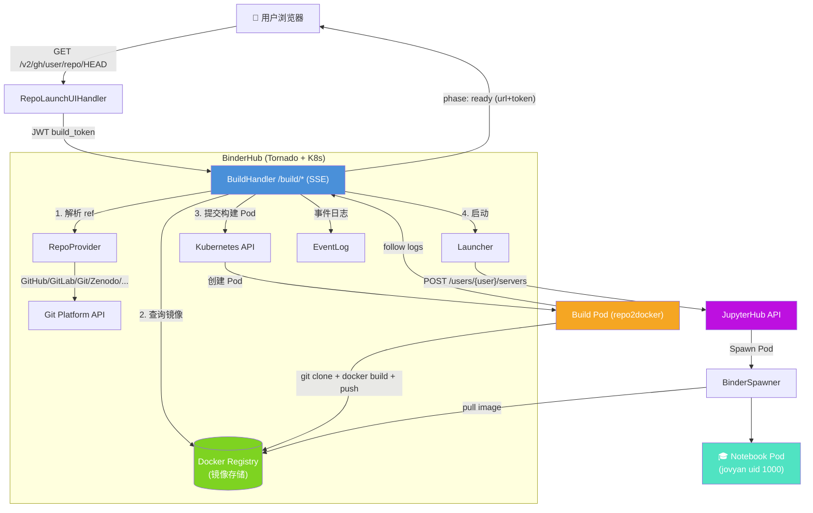

# BinderHub 架构洞察

## 架构总览

---

## 洞察一：构建-推送-启动流水线：以镜像为不可变工件的三级缓存架构

### 陈述

BinderHub 的核心是一个**三阶段有状态流水线**：ref 解析 → 镜像构建/缓存查询 → JupyterHub 启动。关键设计是将 Git commit SHA 映射为 Docker 镜像 tag，使得镜像本身成为不可变的缓存工件。整个流水线不是简单的"接收请求→构建→启动"，而是一个**多级缓存查找 + 按需构建**的乐观模型：先查 Registry 是否已有镜像（F-097），有则跳过构建直接启动；无则提交 K8s 构建 Pod（F-034），利用 K8s API 的 409 Conflict 做分布式去重锁（F-039），同一 (repo, ref) 的并发请求会共享同一个构建 Pod。

构建 Pod 中 repo2docker 以 `--json-logs` 模式输出结构化日志（F-033, F-041），通过 `kubectl logs --follow` 实时流式传回 BinderHub，再通过 SSE 转发给前端。构建完成后镜像 push 到 Registry，后续请求直接命中缓存。

启动阶段 Launcher 通过 JupyterHub REST API 创建临时用户（用户名含8位随机后缀避免冲突）并 POST 启动服务器（F-073, F-074），然后通过 JupyterHub 的 progress SSE 端点监听 Spawner 事件，直到 Pod ready。整个过程有完整的指数退避重试（F-071, F-098）。

### 证据

- 缓存查找：F-097（构建前先查 Registry manifest，3次重试）
- 构建去重：F-039（利用 K8s 409 Conflict 作为分布式锁）
- 构建执行：F-034, F-035, F-038（Pod 定义、repo2docker 镜像、Volume 挂载）
- 日志流：F-041（follow logs → Queue → SSE）
- 启动流程：F-074（创建用户→启动服务器→SSE 监听 progress）
- 重试机制：F-071（4次指数退避）、F-098（Launch 阶段重试记录 metrics）

### 反常识

1. **构建去重不依赖应用层锁，而是利用 Kubernetes API 本身的幂等性**。同一 build name 的 Pod 重复 create 时返回 409，BinderHub 直接视为"已有构建在进行中"并加入 watch 队列（F-039）。这避免了在多副本 BinderHub 部署中引入 Redis 等外部锁服务，但也意味着 BinderHub 无状态设计依赖 K8s 作为协调系统。

2. **服务器端主动延迟关闭 SSE 连接以避免重复构建**。SSE 协议下客户端（EventSource）在连接断开时自动重连，如果服务器在构建完成后立即关闭连接，浏览器会重连并触发新的构建请求。因此 BinderHub 在构建/启动完成后故意 sleep 60 秒才关闭连接（F-093），等待客户端先断开。这是一个反直觉但必要的设计，将连接生命周期管理的主动权交给了服务端等待。

### 行动建议

- **缓存预热策略**：对于已知热门仓库，可通过定期触发 /build/ API 预热 Registry 镜像，将首次用户等待时间从数分钟降至秒级。
- **构建观察窗口**：sticky_builds 模式（F-037）通过 Rendezvous hashing 将同仓库构建调度到同节点复用 Docker 层缓存，但默认关闭。在高并发公共实例中应评估开启。
- **Registry 鉴权特例**：Docker Hub 对不存在的镜像返回 401 而非 404（F-061），自定义 Registry 需正确配置 `not_found_401` 否则会导致缓存查找误判。

---

## 洞察二：Repo Provider 插件化：从 VCS 到数据仓库的统一抽象

### 陈述

BinderHub 通过 `RepoProvider` 抽象基类将"代码/数据源"统一为五个核心操作：`get_resolved_ref()`（将分支/tag 解析为不可变 SHA/版本号）、`get_repo_url()`（获取 repo2docker 可克隆的 URL）、`get_resolved_ref_url()`（获取可浏览的 commit URL）、`get_resolved_spec()`（获取含解析后 ref 的 spec）、`get_build_slug()`（生成唯一构建标识）（F-046）。默认注册了 9 个 Provider（F-048），涵盖 Git 平台（GitHub/GitLab/Gist/通用 Git）和学术数据仓库（Zenodo/Figshare/Dataverse/Hydroshare/CKAN）。

每个 Provider 通过 `display_config` 字典声明式描述前端 UI 表现——显示名称、验证正则、URL 编码选项、ref 输入框配置等——这些配置通过 `/api/repoproviders` 端点一次性下发给前端 React 应用（F-088），前端据此动态渲染输入表单。Provider 注册表是一个 `{prefix: ProviderClass}` 字典（F-048），通过 traitlets 配置可添加自定义 Provider。

Provider 内置了仓库级访问控制（`banned_specs`/`allowed_specs` 正则）、高配额配置（`high_quota_specs`）和细粒度 per-repo 配置覆盖（`spec_config`）（F-047），均基于大小写不敏感的正则匹配。GitHub Provider 还实现了双层 LRU 缓存（F-050）和 ETag 条件请求（F-049），以及 API rate limit 监控（F-051）。

### 证据

- Provider 基类与接口：F-046, F-047
- 默认 9 个 Provider：F-048
- GitHub 双层缓存与 ETag：F-049, F-050, F-051
- GitLab 自定义 hostname 与认证：F-053
- 通用 Git 通过 `git ls-remote` 解析：F-054
- 学术数据仓库 DOI/API 解析：F-055, F-056
- 前端 display_config 下发：F-088
- Gist 默认禁止 secret：F-052

### 反常识

1. **"Repo" 不限于 Git 仓库**。Zenodo/Figshare/Dataverse 等学术数据仓库 Provider 的 `get_repo_url()` 直接返回 DOI 字符串而非 Git URL（F-055），repo2docker 本身支持从 DOI 下载内容作为构建上下文。这意味着 BinderHub 构建的不一定是 Git 仓库，可以是任何带配置文件的数据包。

2. **ref 解析是 Provider 的核心责任，而非 repo2docker 的责任**。每个 Provider 必须自行将人类可读的 ref（如 "main"、"HEAD"、版本号）解析为不可变标识符（Git SHA、Zenodo record_id、时间戳版本号），这个解析结果作为 Docker 镜像 tag（F-044）。GitRepoProvider 甚至通过子进程执行 `git ls-remote` 来做解析（F-054），这意味着 BinderHub 进程本身需要安装 git。

### 行动建议

- **自定义 Provider 扩展**：新增数据源只需继承 RepoProvider 实现五个抽象方法，在 repo_providers 配置中注册 prefix 即可，无需修改核心代码。display_config 字典会自动驱动前端 UI。
- **认证配置**：GitHub/GitLab 的 token 通过环境变量（GITHUB_ACCESS_TOKEN、GITLAB_ACCESS_TOKEN）加载（F-051, F-053），用于提高 API rate limit 和访问私有仓库，部署时务必配置。
- **404 缓存的双刃剑**：GitHub 404 缓存 5 分钟（F-050）会导致新建仓库/分支在 5 分钟内无法构建，可考虑在接收到用户显式"重试"时绕过缓存。

---

## 洞察三：全链路 Server-Sent Events 构建日志推送

### 陈述

BinderHub 的构建体验建立在**三层嵌套 SSE 流**之上：(1) 前端 ↔ BinderHub BuildHandler（SSE），(2) BinderHub ↔ K8s Pod Watch API（长轮询），(3) BinderHub ↔ JupyterHub progress endpoint（SSE）。前端使用 `@microsoft/fetch-event-source` 库建立 SSE 连接，返回 AsyncIterator 供 React 组件逐步消费构建事件（F-090）。

BuildHandler 将 SSE 作为唯一通信通道——所有状态变化（waiting → running → built → launching → ready）和日志行都通过 `data: {json}\n\n` 格式推送（F-091）。SSE 无法设置 HTTP 错误状态码，因此错误也以 JSON 事件形式发送 `{phase: "failed", message: "...", status_code: N}`（F-094）。为防止中间代理（Nginx、LB）因空闲连接超时断连，每 25 秒发送 SSE 注释行 `:keepalive\n\n` 作为心跳（F-091）。

日志管道从 repo2docker 开始：repo2docker 以 `--json-logs` 模式运行，每行输出一个 JSON 对象（包含 phase 和 message 字段）（F-033）。K8s BuildExecutor 通过 `read_namespaced_pod_log(follow=True)` 实时尾随日志（F-041），放入 tornado Queue。BuildHandler 的主循环从 Queue 取出 ProgressEvent 并 emit 到 SSE（F-100）。非 JSON 行被包装为 `{phase: "unknown", message: "..."}` 防止前端解析失败。

启动阶段 Launcher 连接 JupyterHub 的 `/users/{name}/server/progress` SSE 端点（F-074），将 Spawner 进度事件转发给前端，直到收到 ready 或 failed 事件。

### 证据

- SSE 协议设置：F-091, F-092
- Keepalive 机制：F-091
- 错误通过事件发送：F-094
- 服务端延迟关闭：F-093
- JS 客户端 AsyncIterator：F-090
- K8s 日志尾随：F-041
- Queue 传递 ProgressEvent：F-100
- JupyterHub progress SSE：F-074
- repo2docker --json-logs：F-033
- Accept 头校验和 Bot 拦截：F-096

### 反常识

1. **构建日志不经过日志采集系统（如 ELK/Fluentd）**，而是直接通过 K8s API 的 log follow 实时传输到 BinderHub 进程，再转发给用户浏览器。这是一个"直接管道"而非"存储-转发"模型——构建日志不持久化，一旦 SSE 连接断开，已传输的日志无法恢复。`log_tail_lines`（默认 100 行）仅用于新加入的同构建 Pod 观察者获取最近日志（F-041 上下文中）。

2. **Accept 头是 SSE 端点的"门禁"**。/build/ 端点要求 `Accept: text/event-stream`（F-096），非 EventSource 请求直接返回 400。这不是标准 REST 设计——通常 Accept 头用于内容协商，这里被用作请求来源校验，防止普通 HTTP 客户端（如爬虫、curl）误触发构建。配合 User-Agent 黑名单（F-026）和 build_token JWT（F-077）形成多层防护。

### 行动建议

- **反向代理配置**：部署在 Nginx/Ingress 后时，需禁用缓冲（`proxy_buffering off`）并设置足够大的超时时间（>build_max_age=4h），否则 SSE 流会被缓存或中断。
- **日志持久化**：如果需要事后分析构建失败原因，应配置 EventLog handlers_maker（F-066）将结构化事件写入持久存储，而非依赖实时 SSE 流。
- **build_token 安全**：JWT build_token 默认有效期 5 分钟（F-024），包含 audience 和 origin 校验（F-077），可防止 CSRF 和热链攻击，但不要将其作为 API 认证替代方案。

---

## 洞察四：JupyterHub Service 集成模式：外部构建器 + Spawner Mixin

### 陈述

BinderHub 不是一个独立的 JupyterHub 插件或扩展，而是一个**独立的 Tornado 应用，作为 JupyterHub 的一个注册 Service 运行**（F-080, F-082）。它通过 JupyterHub REST API（使用 hub_api_token 认证）执行两个核心操作：创建临时用户（F-072, F-074）和启动用户服务器（F-074），本身不运行 Notebook。

JupyterHub 侧通过 `BinderSpawnerMixin` 类（F-076）配置 Spawner 行为：从 `user_options` 中读取 image 和 token，设置 BINDER_REPO_URL、binder_ref_url 等环境变量注入到 Notebook Pod。这个 Mixin 设计允许 BinderHub 与任何容器 Spawner（如 KubeSpawner、DockerSpawner）组合使用，只需将 Mixin 混入对应的 Spawner 类即可。

在认证模式（auth_enabled=True）下，BinderHub 使用 HubOAuth 进行用户认证（F-077），不创建临时用户，而是为已登录用户启动 named server（F-020），支持 `allow_named_servers` 让同一用户同时运行多个 Binder 环境（F-076 上下文中）。非认证模式下，所有用户都是匿名的，Launcher 为每次启动创建带随机后缀的临时用户（F-073），这些用户在 JupyterHub 中持续存在但服务器会随 culling 策略被回收。

Helm Chart 通过依赖机制将 BinderHub 和 JupyterHub 作为子 chart 一起部署（F-081），共享 RBAC 配置和 Secret。BinderHub Pod 挂载 JupyterHub 的 apiToken Secret 作为认证凭据（F-082）。构建后端支持两种模式（F-085）：挂载宿主机 Docker socket 或运行 dind/pink DaemonSet 提供构建引擎。

### 证据

- Launcher 初始化：F-080
- 创建临时用户：F-072, F-073
- 通过 API 启动服务器：F-074
- BinderSpawnerMixin：F-076
- HubOAuth 认证：F-077
- auth_enabled 模式：F-020
- Helm 依赖 JupyterHub chart：F-081
- JUPYTERHUB_API_TOKEN 挂载：F-082
- dind/pink 构建后端：F-085, F-086
- RBAC 权限：F-084
- Spawner 环境变量注入：F-076

### 反常识

1. **BinderHub 不包含 Spawner 代码**。`binderspawner_mixin.py` 文件注释明确说明该文件仅通过 BinderHub 仓库分发，通过 CI 脚本复制到 Helm chart 的 values.yaml 中（F-076 文件头注释），BinderHub 自身运行时不使用它。这是一种"代码分发"而非"代码依赖"的关系——Spawner Mixin 运行在 JupyterHub 的 Pod 中，而非 BinderHub Pod 中。

2. **临时用户不自动清理**。Launcher 创建的临时 JupyterHub 用户（`prefix-random8chars`格式，F-073）不会在 Notebook 关闭后被 BinderHub 删除，而是依赖 JupyterHub 的 culling 机制或外部清理脚本。用户名的 8 位随机后缀（36^8 ≈ 2^41 种组合）是为了在用户/服务器不被即时清理的情况下避免命名冲突，而非安全机制。

### 行动建议

- **部署拓扑**：BinderHub 和 JupyterHub 可以部署在同一 K8s 集群（标准 Helm 方式，F-081），也可以分离部署，只需配置 hub_url/hub_api_token 即可。
- **用户清理**：生产环境应配置 JupyterHub 的 `cull` 服务定期清理不活跃的临时用户和服务器，否则用户数据库会持续增长。
- **认证模式价值**：auth_enabled=True 模式（F-020）避免了临时用户膨胀问题，并能利用 JupyterHub 的鉴权体系做权限控制，适合内部/私有部署。公共 mybinder.org 规模的部署则使用匿名临时用户模式。
- **构建引擎选择**：dind（Docker-in-Docker）需要 privileged 容器，pink（Podman-in-Kubernetes）是更安全的替代方案（F-086），均以 DaemonSet 方式在每个节点提供 socket。

---

## 核心模式提炼

| 模式 | 描述 | BinderHub 实例 |
|------|------|----------------|
| **不可变工件缓存** | 将内容地址（commit SHA）映射为不可变镜像 tag，以 Registry 为缓存层 | 镜像 tag = {prefix}{safe_slug}:{ref}（F-044） |
| **乐观并发控制** | 利用底层系统（K8s API）的幂等性做分布式锁，避免外部协调服务 | 409 Conflict 去重构建（F-039） |
| **声明式插件注册** | 通过 traitlets Dict 注册表 + display_config 元数据驱动前后端扩展 | RepoProvider dict（F-048） |
| **全链路流式推送** | 从构建引擎到 K8s API 到 SSE 到浏览器，所有中间状态实时流式传输 | Queue → ProgressEvent → SSE（F-100, F-091） |
| **Service 侧车集成** | 独立应用通过 REST API + 配置 Mixin 与主系统（JupyterHub）集成 | BinderHub Service + BinderSpawnerMixin（F-076, F-080） |
| **延迟关闭防重连** | 服务端在完成后主动等待，避免客户端自动重连触发重复操作 | 60 秒 sleep 后关闭 SSE（F-093） |
