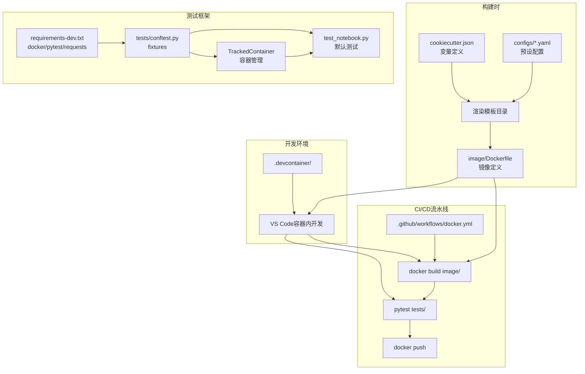

# 模板结构解析

本章详细解析 cookiecutter-docker-stacks 生成的项目结构，理解每个文件和目录的职责。

## 整体结构

```
{{cookiecutter.stack_name}}/
├── image/                          # 镜像构建目录
│   └── Dockerfile                  # Docker镜像定义
├── tests/                          # 测试目录
│   ├── __init__.py                 # Python包标记
│   ├── conftest.py                 # pytest fixtures定义
│   ├── test_notebook.py            # 默认测试用例
│   └── utils/
│       ├── __init__.py             # Python包标记
│       └── tracked_container.py    # Docker容器管理工具类
├── .devcontainer/                  # VS Code开发容器
│   ├── Dockerfile                  # 开发容器镜像
│   └── devcontainer.json           # 开发容器配置
├── .github/
│   └── workflows/
│       └── docker.yml              # GitHub Actions CI/CD
├── requirements-dev.txt            # 开发/测试依赖
├── README.md                       # 项目说明文档
├── .gitignore                      # Git忽略规则
└── .gitattributes                  # Git属性配置
```

模板本身（cookiecutter-docker-stacks 仓库）还包含以下文件：

```
cookiecutter-docker-stacks/         # 模板仓库根目录
├── cookiecutter.json               # 模板变量定义
├── configs/                        # 预设配置文件（14个YAML）
│   ├── foundation.yaml
│   ├── base.yaml
│   ├── minimal.yaml
│   ├── scipy.yaml
│   └── ...（共14个）
├── {{cookiecutter.stack_name}}/    # 模板目录（cookiecutter渲染）
│   └── ...（上述项目文件）
├── requirements-test.txt           # 模板自身测试依赖（cookiecutter）
├── .pre-commit-config.yaml         # pre-commit钩子配置
├── pytest.ini                      # pytest配置
├── mypy.ini                        # mypy配置
├── .flake8                         # flake8配置
├── .github/
│   ├── dependabot.yml              # Dependabot配置
│   └── workflows/
│       ├── tests.yml               # 模板自身测试矩阵
│       └── pre-commit.yml          # pre-commit CI
└── README.md                       # 模板仓库说明
```

## 核心目录详解

### image/ —— 镜像构建目录

这是项目的核心目录，包含定义 Docker 镜像的 Dockerfile。

**image/Dockerfile**：

```dockerfile
FROM {{cookiecutter.stack_base_image}}

# Add RUN statements to install packages as the ${NB_USER} defined in the base images.

# Add a "USER root" statement followed by RUN statements
# to install system packages using apt-get, change file permissions, etc.

# If you do switch to root, always be sure to add a "USER ${NB_UID}" command
# at the end of the file to ensure the image runs as a unprivileged user by default.
```

Dockerfile 设计要点：
- 从用户选择的 `stack_base_image` 开始
- 注释明确指导了两种安装方式：以NB_USER安装Python包、以root安装系统包
- **强制提醒**切换root后必须切回非特权用户
- 极简设计——用户只需添加RUN语句即可

### tests/ —— 测试目录

测试目录使用 pytest 框架，配合 Docker SDK 对镜像进行集成测试。

| 文件 | 职责 |
|------|------|
| tests/conftest.py | 定义pytest fixtures：http_client、docker_client、image_name、container、free_host_port |
| tests/test_notebook.py | 默认测试用例test_secured_server，验证Jupyter Server登录页面 |
| tests/utils/tracked_container.py | TrackedContainer工具类，封装Docker容器生命周期管理 |
| tests/__init__.py | 空文件，标记tests为Python包 |
| tests/utils/__init__.py | 空文件，标记utils为Python包 |

测试执行流程：
1. conftest.py 创建 Docker 客户端和 HTTP 客户端
2. TrackedContainer 启动被测镜像的容器
3. 测试用例通过 HTTP 请求验证 Jupyter Server 行为
4. 测试结束后 TrackedContainer 自动清理容器

### .devcontainer/ —— 开发容器目录

为 VS Code Dev Containers 扩展提供配置，让你可以在容器内开发项目。

**.devcontainer/Dockerfile**：

```dockerfile
FROM mcr.microsoft.com/devcontainers/python:3.13
COPY requirements-dev.txt /tmp/requirements-test.txt
RUN pip install --no-cache-dir -r /tmp/requirements-test.txt
```

**.devcontainer/devcontainer.json** 关键配置：

| 配置项 | 值 | 说明 |
|--------|-----|------|
| build.context | ".." | 构建上下文为项目根目录 |
| features.docker-in-docker | {moby: false} | 启用Docker-in-Docker（使用宿主机Docker） |
| vscode.extensions | 8个扩展 | Copilot、GitHub Actions、Docker、Python等推荐扩展 |

使用方式：在 VS Code 中打开项目，点击 "Reopen in Container"。

### .github/workflows/ —— CI/CD 目录

**docker.yml** 是生成项目的完整 CI/CD 流水线，包含：

| 阶段 | 触发条件 | 操作 |
|------|---------|------|
| 构建 | 所有触发事件 | docker build（双tag） |
| 测试 | 所有触发事件 | pytest tests/ |
| 登录Docker Hub | main推送/定时 | docker/login-action |
| 推送镜像 | main推送/定时 | docker push --all-tags |

触发事件：
- **schedule**：每周一 07:00 UTC（保持镜像更新）
- **pull_request**：修改docker.yml、image/、tests/、requirements-dev.txt时
- **push (main)**：同上路径
- **workflow_dispatch**：手动触发

## 配置文件详解

### requirements-dev.txt

```
docker
pytest
requests
```

三个运行时依赖：
- `docker`：Docker SDK for Python，用于在测试中管理容器
- `pytest`：测试框架
- `requests`：HTTP客户端，用于测试中发送请求到Jupyter Server

### .gitignore

基于 GitHub 官方 Python .gitignore 模板，额外添加：
- `.DS_Store`（Mac OS X）
- `.vscode/`（VS Code配置）
- `.idea/`（PyCharm配置）

### .gitattributes

```
* text=auto eol=lf
```

统一所有文本文件使用 LF 行尾符，确保跨平台一致性（避免 Windows CRLF 导致的问题）。

### README.md

模板生成的 README 非常简洁，只包含项目名和描述：

```markdown
# {{cookiecutter.stack_name}}

{{cookiecutter.stack_description}}
```

用户应根据自己的项目添加更详细的文档。

## 文件间的协同关系



## 与模板仓库自身文件的区别

| 文件类别 | 生成项目中 | 模板仓库自身 |
|---------|-----------|-------------|
| 测试依赖 | requirements-dev.txt（docker/pytest/requests） | requirements-test.txt（cookiecutter） |
| CI工作流 | docker.yml（构建/测试/推送镜像） | tests.yml（14配置矩阵测试模板自身） |
| pre-commit | 不包含 | .pre-commit-config.yaml（模板开发质量检查） |
| Lint配置 | 不包含 | pytest.ini/mypy.ini/.flake8（模板开发用） |

模板仓库自身的 tests.yml 使用矩阵策略对14个预设配置逐一测试，确保所有基础镜像组合都能正常工作。这是模板质量保障的关键——每次修改模板后，CI会验证所有14种配置都能成功生成、构建和测试。

## 相关概念

- [项目介绍](00-introduction.md)
- [快速上手](01-getting-started.md)
- [模板变量详解](03-cookiecutter-variables.md)
- [Dockerfile模板与编写指南](04-dockerfile-template.md)
- [测试框架详解](05-testing-framework.md)
- [CI/CD工作流](06-cicd-workflow.md)
