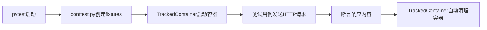

# 测试框架详解

cookiecutter-docker-stacks 生成的项目包含一套完整的 Docker 镜像集成测试框架，基于 pytest + Docker SDK + requests 实现。本章详细解析测试框架的架构和使用方法。

## 测试依赖

测试框架只依赖三个Python包（requirements-dev.txt）：

| 包 | 用途 |
|----|------|
| docker | Docker SDK for Python，管理容器生命周期 |
| pytest | 测试框架 |
| requests | HTTP客户端，发送请求到Jupyter Server |

安装：

```bash
pip install -r requirements-dev.txt
```

## 架构概览

```
tests/
├── conftest.py              # pytest fixtures（测试基础设施）
├── test_notebook.py         # 默认测试用例
└── utils/
    └── tracked_container.py # TrackedContainer（容器管理工具类）
```

测试执行流程：



## TrackedContainer 类详解

TrackedContainer 是测试框架的核心工具类，封装了 Docker SDK 的容器操作，提供安全的容器生命周期管理。

### 初始化

```python
from tests.utils.tracked_container import TrackedContainer
import docker

client = docker.from_env()
container = TrackedContainer(client, "my-project/my-jupyter-stack")
```

参数：
- `docker_client`：`docker.DockerClient` 实例
- `image_name`：要测试的镜像名称

### 核心方法

#### run_detached — 后台运行容器

```python
container.run_detached(ports={"8888/tcp": 8888})
```

- 默认参数：`detach=True`、`tty=True`
- 支持传递所有 `docker.containers.run` 的参数（ports、environment、volumes等）
- 容器实例保存在 `container.container` 属性中

#### exec_cmd — 在容器内执行命令

```python
output = container.exec_cmd("python -c 'import polars; print(polars.__version__)'")
```

- 在运行中的容器内执行命令
- 命令失败（exit_code != 0）时抛出 AssertionError
- 返回命令输出的字符串

#### run_and_wait — 运行容器并等待退出

```python
logs = container.run_and_wait(
    timeout=30,
    no_warnings=True,
    no_errors=True,
    no_failure=True,
    command="echo hello"
)
```

参数：
- `timeout`：等待超时秒数
- `no_warnings`：断言日志中无WARNING行（默认True）
- `no_errors`：断言日志中无ERROR行（默认True）
- `no_failure`：断言退出码为0（默认True）
- `**kwargs`：传递给run_detached的参数

执行完毕后自动调用 `remove()` 清理容器。

#### get_logs / get_health

```python
logs = container.get_logs()      # 获取容器日志
health = container.get_health()  # 获取容器健康状态（需要HEALTHCHECK）
```

#### remove — 强制删除容器

```python
container.remove()
```

- 调用 `container.remove(force=True)` 强制删除
- 将 `self.container` 重置为 None
- 多次调用安全（container为None时无操作）

### 静态工具方法

```python
errors = TrackedContainer.get_errors(logs)    # 提取ERROR行
warnings = TrackedContainer.get_warnings(logs) # 提取WARNING行
```

## pytest Fixtures 详解

conftest.py 定义了5个fixture，分为session级（整个测试会话共享）和function级（每个测试函数独立）。

### session级fixtures

#### http_client

```python
@pytest.fixture(scope="session")
def http_client() -> requests.Session:
```

- 返回配置了重试策略的 requests.Session
- 重试配置：total=5次，backoff_factor=1（指数退避）
- 同时挂载到 http:// 和 https://

为什么需要重试？容器启动需要时间，Jupyter Server不是瞬间就绪的，重试机制避免测试因启动延迟而失败。

#### docker_client

```python
@pytest.fixture(scope="session")
def docker_client() -> docker.DockerClient:
```

- 通过 `docker.from_env()` 从环境变量创建Docker客户端
- 自动读取 DOCKER_HOST 等环境变量

#### image_name

```python
@pytest.fixture(scope="session")
def image_name() -> str:
```

- 从环境变量 `TEST_IMAGE` 读取要测试的镜像名
- 运行测试时必须设置：`TEST_IMAGE=my-image pytest tests/`

### function级fixtures

#### container

```python
@pytest.fixture(scope="function")
def container(docker_client, image_name) -> Generator[TrackedContainer]:
```

- 为每个测试函数创建独立的 TrackedContainer 实例
- yield 后自动调用 `container.remove()` 清理
- 保证测试间容器隔离，避免状态泄漏

#### free_host_port

```python
@pytest.fixture(scope="function")
def free_host_port() -> Generator[int]:
```

- 查找主机上的空闲TCP端口
- 实现方式：绑定端口0让OS分配，设置SO_REUSEADDR，返回分配的端口号
- 解决并行测试时端口冲突问题

## 默认测试用例

### test_secured_server

```python
def test_secured_server(
    container: TrackedContainer,
    http_client: requests.Session,
    free_host_port: int
) -> None:
    """Jupyter Server should eventually request user login."""
    container.run_detached(ports={"8888/tcp": free_host_port})
    resp = http_client.get(f"http://localhost:{free_host_port}")
    resp.raise_for_status()
    assert "login_submit" in resp.text, "User login not requested"
```

测试逻辑：
1. 启动容器，将容器8888端口映射到主机空闲端口
2. 发送HTTP GET请求到Jupyter Server
3. 断言HTTP状态码为200
4. 断言响应HTML中包含"login_submit"（Jupyter默认启用token认证，会显示登录页面）

这个测试验证了：
- 镜像能够成功启动
- Jupyter Server正常监听8888端口
- 默认启用了认证（安全配置正确）

## 编写自定义测试

### 测试Python包是否安装

```python
# tests/test_packages.py
import requests
from tests.utils.tracked_container import TrackedContainer

def test_polars_installed(container: TrackedContainer, free_host_port: int):
    """验证polars包已安装且可导入"""
    container.run_detached()
    output = container.exec_cmd("python -c 'import polars; print(polars.__version__)'")
    assert output.strip() != ""
    assert "." in output  # 版本号格式验证

def test_custom_config(container: TrackedContainer, free_host_port: int):
    """验证自定义Jupyter配置生效"""
    container.run_detached(ports={"8888/tcp": free_host_port})
    # 可以发送HTTP请求验证特定配置
```

### 测试容器启动日志

```python
def test_startup_no_errors(container: TrackedContainer):
    """验证容器启动日志中无ERROR"""
    container.run_detached()
    import time
    time.sleep(5)  # 等待Jupyter启动
    logs = container.get_logs()
    errors = TrackedContainer.get_errors(logs)
    assert len(errors) == 0, f"Startup errors found: {errors}"
```

### 测试环境变量

```python
def test_environment_variables(container: TrackedContainer):
    """验证必要环境变量设置正确"""
    container.run_detached()
    nb_user = container.exec_cmd("echo $NB_USER")
    assert nb_user.strip() == "jovyan"
```

### 使用run_and_wait测试一次性命令

```python
def test_python_version(container: TrackedContainer):
    """验证Python版本"""
    logs = container.run_and_wait(
        timeout=10,
        command="python --version"
    )
    assert "Python 3" in logs
```

## 运行测试

### 基本运行

```bash
TEST_IMAGE=my-project/my-jupyter-stack pytest tests/ -v
```

### 只运行特定测试

```bash
pytest tests/ -v -k "test_secured_server"
```

### 显示日志输出

```bash
pytest tests/ -v -s  # -s显示print输出
```

pytest.ini已配置日志级别为INFO，测试过程中会显示容器创建/删除等操作日志：

```
2026-08-22 10:00:00 [    INFO] Creating a container for the image: ...
2026-08-22 10:00:01 [    INFO] Container xxx created
2026-08-22 10:00:05 [    INFO] Removing container xxx ...
```

### CI中运行测试

CI/CD流水线中测试步骤：

```yaml
- name: Run tests ✅
  run: python3 -m pytest tests
  env:
    TEST_IMAGE: "{{cookiecutter.stack_org}}/{{cookiecutter.stack_name}}"
```

## 测试最佳实践

| 实践 | 说明 |
|------|------|
| 每个测试独立创建容器 | 使用function级container fixture，保证隔离 |
| 使用free_host_port避免端口冲突 | 不要硬编码端口号 |
| 使用exec_cmd验证包安装 | 在容器内执行import语句验证 |
| 使用run_and_wait测试短命令 | 自动处理等待、日志检查和清理 |
| 测试后自动清理 | container fixture的yield后自动remove |
| 添加合理的等待时间 | Jupyter启动需要时间，可用time.sleep或重试机制 |
| 日志断言检查ERROR/WARNING | 使用TrackedContainer.get_errors/get_warnings |

## 相关概念

- [Dockerfile模板与编写指南](04-dockerfile-template.md)
- [CI/CD工作流](06-cicd-workflow.md)
- [快速上手](01-getting-started.md)
