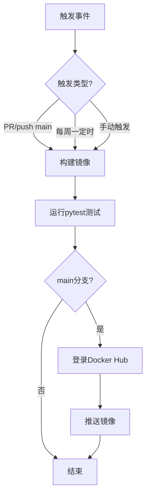

# CI/CD 工作流

cookiecutter-docker-stacks 生成的项目包含一个开箱即用的 GitHub Actions 工作流（`.github/workflows/docker.yml`），实现从代码提交到镜像推送的完整自动化流程。

## 工作流概览



## 触发条件

工作流定义了4种触发事件：

| 事件 | 条件 | 目的 |
|------|------|------|
| `schedule` | 每周一 07:00 UTC（cron: `"0 7 * * 1"`） | 定期重建镜像，获取基础镜像安全更新 |
| `pull_request` | 路径匹配：docker.yml、image/**、tests/**、requirements-dev.txt | PR验证：确保修改不破坏构建和测试 |
| `push` (main分支) | 同上路径匹配 | 合并后自动构建并推送 |
| `workflow_dispatch` | 手动触发 | 需要时手动构建/推送 |

路径过滤确保只有修改了相关文件才触发工作流，避免修改README等无关文件时浪费CI资源。

## 环境变量

工作流在env级别定义了两个变量：

```yaml
env:
  OWNER: ${{ github.repository_owner }}
  IMAGE_NAME: ${{ github.event.repository.name }}
```

| 变量 | 值 | 说明 |
|------|-----|------|
| OWNER | 仓库所有者 | GitHub用户名/组织名，用作Docker Hub用户名 |
| IMAGE_NAME | 仓库名 | 用作Docker镜像名 |

这意味着镜像标签格式为 `<GitHub用户名>/<仓库名>`。如果你的GitHub用户名和Docker Hub用户名不同，需要修改这里的配置。

## 并发控制

```yaml
concurrency:
  group: ${{ github.workflow }}-${{ github.ref }}
  cancel-in-progress: true
```

- 同一分支/PR的多个工作流实例只保留最新的一个
- 取消正在进行的旧任务，节省CI时间
- 例如：快速连续push两次到main分支，第一次构建会被取消，只执行第二次

## Job 详解

### 运行环境

```yaml
jobs:
  build-test-publish-image:
    runs-on: ubuntu-24.04
    permissions:
      contents: write
```

- 使用 `ubuntu-24.04` 运行器（与Jupyter Docker Stacks基础镜像OS版本一致）
- `contents: write` 权限允许工作流写仓库内容

### 步骤1：检出代码

```yaml
- name: Checkout Repo ⚡️
  uses: actions/checkout@9c091bb... # v7.0.0
```

使用固定SHA hash的action版本，确保安全和可复现性。

### 步骤2：设置Python

```yaml
- name: Set Up Python 🐍
  uses: actions/setup-python@ece7cb0... # v6.3.0
  with:
    python-version: 3.12
```

安装Python 3.12用于运行测试（pytest需要Python环境）。

### 步骤3：安装开发依赖

```yaml
- name: Install Dev Dependencies 📦
  run: |
    pip install --upgrade pip
    pip install --upgrade -r requirements-dev.txt
```

安装docker、pytest、requests三个测试依赖包。

### 步骤4：获取Commit SHA

```yaml
- name: Get commit sha 🏷
  shell: bash
  run: |
    echo "sha12=$(echo ${GITHUB_SHA} | cut -c1-12)" >> $GITHUB_OUTPUT
  id: get_sha
```

截取commit SHA的前12位，用作镜像的版本标签。这保证了每个构建的镜像都有唯一的可追溯标签。

### 步骤5：构建镜像

```yaml
- name: Build image 🛠
  run: >
    docker build
    --rm --force-rm
    --tag ${{ env.OWNER }}/${{ env.IMAGE_NAME }}
    --tag ${{ env.OWNER }}/${{ env.IMAGE_NAME }}:${{steps.get_sha.outputs.sha12}}
    image/
  env:
    DOCKER_BUILDKIT: 1
    BUILDKIT_PROGRESS: plain
```

关键配置：
- 构建上下文为 `image/` 目录
- 打两个标签：`owner/name`（latest）和 `owner/name:sha12`（版本）
- 启用BuildKit加速构建
- `BUILDKIT_PROGRESS: plain` 输出完整构建日志（便于调试）

### 步骤6：运行测试

```yaml
- name: Run tests ✅
  run: python3 -m pytest tests
  env:
    TEST_IMAGE: "{{cookiecutter.stack_org}}/{{cookiecutter.stack_name}}"
```

使用cookiecutter渲染后的组织名和镜像名作为`TEST_IMAGE`环境变量，运行pytest测试套件。

> **注意**：TEST_IMAGE使用cookiecutter变量而非GitHub环境变量。如果GitHub仓库名和cookiecutter生成时的stack_org/stack_name不一致，需要修改此处。

### 步骤7：登录Docker Hub（条件执行）

```yaml
- name: Login to Docker Hub 🔐
  if: github.ref == 'refs/heads/main' || github.event_name == 'schedule'
  uses: docker/login-action@af1e73f... # v4.4.0
  with:
    username: ${{ env.OWNER }}
    password: ${{ secrets.DOCKERHUB_TOKEN }}
```

- **只在main分支或定时任务时执行**（PR不推送镜像）
- 使用 `secrets.DOCKERHUB_TOKEN` 进行认证（需要在仓库Settings中配置）
- 用户名使用 `env.OWNER`（即GitHub仓库所有者）

### 步骤8：推送镜像（条件执行）

```yaml
- name: Push Image to Docker Hub 📤
  if: github.ref == 'refs/heads/main' || github.event_name == 'schedule'
  run: docker push --all-tags ${{ env.OWNER }}/${{ env.IMAGE_NAME }}
```

- 同样只在main分支或定时任务时执行
- `--all-tags` 推送所有标签（latest + sha12版本标签）

## 配置 Docker Hub 认证

### 步骤1：创建Docker Hub Access Token

1. 登录 [Docker Hub](https://hub.docker.com/)
2. 进入 Account Settings → Security
3. 点击 "New Access Token"
4. 给token命名（如"github-actions"），选择权限（Read & Write）
5. 复制生成的token（只显示一次）

### 步骤2：在GitHub仓库配置Secret

1. 打开GitHub仓库页面
2. 进入 Settings → Secrets and variables → Actions
3. 点击 "New repository secret"
4. Name填 `DOCKERHUB_TOKEN`，Value填刚才复制的token
5. 点击 "Add secret"

### 步骤3：确保用户名匹配

如果GitHub用户名和Docker Hub用户名不同，需要修改docker.yml：

```yaml
env:
  OWNER: your-dockerhub-username  # 改为你的Docker Hub用户名
  IMAGE_NAME: ${{ github.event.repository.name }}
```

## 镜像标签策略

| 标签 | 格式 | 示例 | 用途 |
|------|------|------|------|
| latest | `owner/name` | `myuser/my-jupyter-stack` | 最新版本，每次main分支更新 |
| 版本 | `owner/name:sha12` | `myuser/my-jupyter-stack:a1b2c3d4e5f6` | 不可变标签，对应特定commit |

使用建议：
- 开发/测试使用latest标签（自动获取最新更新）
- 生产环境使用sha12标签（确保可复现）

## 修改工作流

### 添加更多测试

在"Run tests"步骤前添加额外的测试步骤：

```yaml
- name: Run additional tests
  run: |
    # 添加自定义测试
    docker run --rm ${{ env.OWNER }}/${{ env.IMAGE_NAME }} python -c "import polars"
```

### 添加多架构构建

如需构建ARM64镜像（支持Apple Silicon），修改build步骤：

```yaml
- name: Set up QEMU
  uses: docker/setup-qemu-action@v3

- name: Set up Docker Buildx
  uses: docker/setup-buildx-action@v3

- name: Build and push
  uses: docker/build-push-action@v6
  with:
    context: image/
    platforms: linux/amd64,linux/arm64
    tags: |
      ${{ env.OWNER }}/${{ env.IMAGE_NAME }}
      ${{ env.OWNER }}/${{ env.IMAGE_NAME }}:${{steps.get_sha.outputs.sha12}}
    push: true
```

### 修改构建触发频率

修改cron表达式调整定时构建频率：

```yaml
schedule:
  - cron: "0 7 * * 1"   # 每周一07:00 UTC
  # - cron: "0 7 * * *" # 每天07:00 UTC（更频繁）
```

### 推送到GHCR（GitHub Container Registry）

除了Docker Hub，也可以推送到GHCR：

```yaml
- name: Login to GHCR
  uses: docker/login-action@v3
  with:
    registry: ghcr.io
    username: ${{ github.actor }}
    password: ${{ secrets.GITHUB_TOKEN }}

- name: Push to GHCR
  run: |
    docker tag ${{ env.OWNER }}/${{ env.IMAGE_NAME }} ghcr.io/${{ env.OWNER }}/${{ env.IMAGE_NAME }}
    docker push ghcr.io/${{ env.OWNER }}/${{ env.IMAGE_NAME }}
```

GHCR 使用 `secrets.GITHUB_TOKEN` 自动认证，无需手动配置token。

## 本地测试工作流

可以使用 [act](https://github.com/nektos/act) 工具在本地运行GitHub Actions工作流：

```bash
# 安装act
brew install act  # macOS
# 或参考 https://github.com/nektos/act 安装

# 在项目根目录运行
act -j build-test-publish-image
```

## 相关概念

- [快速上手](01-getting-started.md)
- [测试框架详解](05-testing-framework.md)
- [Dev Container开发环境](07-devcontainer.md)
- [最佳实践](09-best-practices.md)
