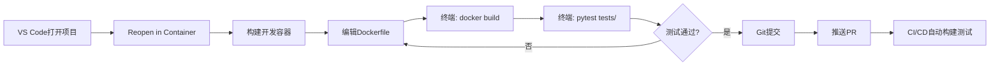

# Dev Container 开发环境

cookiecutter-docker-stacks 生成的项目包含 VS Code Dev Container 配置，让你可以在容器内进行开发，获得一致的开发环境。

## 什么是 Dev Container

Dev Container 是 VS Code 的一个功能，允许你使用 Docker 容器作为完整的开发环境。它的优势：

- **环境一致性**：所有开发者使用相同的工具链和依赖版本
- **快速启动**：新成员一键启动开发环境，无需手动安装依赖
- **隔离性**：开发环境与主机系统隔离，不会污染主机
- **Docker支持**：内置Docker-in-Docker，可以在容器内构建和运行Docker镜像

## 配置文件解析

### .devcontainer/Dockerfile

```dockerfile
FROM mcr.microsoft.com/devcontainers/python:3.13

COPY requirements-dev.txt /tmp/requirements-test.txt

RUN pip install --no-cache-dir -r /tmp/requirements-test.txt
```

基于微软官方的Python Dev Container镜像：
- **基础镜像**：`mcr.microsoft.com/devcontainers/python:3.13`（包含Python 3.13、常用开发工具）
- **安装依赖**：复制requirements-dev.txt并安装docker、pytest、requests

### .devcontainer/devcontainer.json

```json
{
  "name": "Jupyter Cookiecutter Docker Stacks",
  "build": {
    "context": "..",
    "dockerfile": "Dockerfile"
  },
  "features": {
    "ghcr.io/devcontainers/features/docker-in-docker:2": {
      "moby": false
    }
  },
  "customizations": {
    "vscode": {
      "extensions": [...]
    }
  }
}
```

关键配置项：

| 配置 | 值 | 说明 |
|------|-----|------|
| build.context | ".." | 构建上下文为项目根目录（相对于.devcontainer/） |
| build.dockerfile | "Dockerfile" | 使用.devcontainer/Dockerfile构建开发容器 |
| features | docker-in-docker:2 | 启用Docker-in-Docker功能 |
| features[docker-in-docker].moby | false | 使用宿主机Docker（而非容器内Moby） |

### Docker-in-Docker 配置

`moby: false` 是关键设置——它表示不使用容器内独立的Docker daemon，而是挂载宿主机的Docker socket。这意味着：

- 在开发容器内运行 `docker` 命令，实际操作的是宿主机的Docker
- 构建的镜像存储在宿主机上，容器停止后不丢失
- 性能比容器内独立Docker更好
- 需要宿主机已安装并运行Docker

### 推荐VS Code扩展

模板预装了8个VS Code扩展：

| 扩展ID | 用途 |
|--------|------|
| `github.copilot-chat` | GitHub Copilot Chat（AI辅助编程） |
| `github.copilot` | GitHub Copilot（AI代码补全） |
| `github.vscode-github-actions` | GitHub Actions语法支持 |
| `github.vscode-pull-request-github` | PR和GitHub集成 |
| `ms-azuretools.vscode-containers` | 容器管理工具 |
| `ms-azuretools.vscode-docker` | Docker镜像/容器管理 |
| `ms-python.autopep8` | Python代码格式化 |

## 使用 Dev Container

### 前置条件

- VS Code
- [Dev Containers扩展](https://marketplace.visualstudio.com/items?itemName=ms-vscode-remote.remote-containers)
- Docker Desktop（或Docker Engine）

### 启动开发容器

**方法1：VS Code自动提示**

1. 用VS Code打开生成的项目目录
2. VS Code检测到.devcontainer配置，右下角弹出提示
3. 点击 "Reopen in Container"

**方法2：命令面板**

1. 按 `Ctrl+Shift+P`（macOS: `Cmd+Shift+P`）打开命令面板
2. 输入 "Dev Containers: Reopen in Container"
3. 按回车

首次启动需要构建开发容器镜像，可能需要几分钟时间。

### 在容器内开发

容器启动后，你就可以在VS Code中进行开发：

- **终端**：VS Code集成终端运行在容器内
- **文件编辑**：编辑的文件自动映射到容器中
- **运行命令**：在终端执行docker build、pytest等命令
- **扩展**：预装的扩展自动可用

### 构建和测试镜像

在开发容器终端中：

```bash
# 构建Jupyter镜像（使用宿主机Docker）
docker build --rm -t my-project/my-jupyter-stack image/

# 运行测试
TEST_IMAGE=my-project/my-jupyter-stack pytest tests/ -v

# 运行容器
docker run -it --rm -p 8888:8888 my-project/my-jupyter-stack
```

## 自定义 Dev Container

### 添加系统依赖

修改 `.devcontainer/Dockerfile` 添加需要的系统包：

```dockerfile
FROM mcr.microsoft.com/devcontainers/python:3.13

COPY requirements-dev.txt /tmp/requirements-test.txt
RUN pip install --no-cache-dir -r /tmp/requirements-test.txt

# 添加额外系统依赖
RUN apt-get update && \
    apt-get install -y --no-install-recommends \
        jq \
        yq \
        && \
    apt-get clean && \
    rm -rf /var/lib/apt/lists/*
```

### 添加VS Code扩展

在 `.devcontainer/devcontainer.json` 的 `customizations.vscode.extensions` 数组中添加扩展ID：

```json
{
  "customizations": {
    "vscode": {
      "extensions": [
        "github.copilot-chat",
        "github.copilot",
        "ms-python.python",
        "ms-toolsai.jupyter",
        "charliermarsh.ruff"
      ]
    }
  }
}
```

推荐添加的额外扩展：

| 扩展ID | 用途 |
|--------|------|
| `ms-python.python` | Python语言支持 |
| `ms-toolsai.jupyter` | Jupyter Notebook支持 |
| `charliermarsh.ruff` | Ruff linter（替代flake8） |
| `timonwong.shellcheck` | Shell脚本检查 |
| `redhat.vscode-yaml` | YAML语言支持 |

### 添加容器创建后执行命令

使用 `postCreateCommand` 在容器创建后自动执行命令：

```json
{
  "postCreateCommand": "pip install -r requirements-dev.txt && pre-commit install",
  "postStartCommand": "echo 'Dev container ready!'"
}
```

### 端口转发

开发容器需要访问Jupyter Server时，可以配置自动端口转发：

```json
{
  "forwardPorts": [8888],
  "portsAttributes": {
    "8888": {
      "label": "Jupyter Server",
      "onAutoForward": "openBrowser"
    }
  }
}
```

### 挂载额外目录

使用 `mounts` 挂载主机目录到容器：

```json
{
  "mounts": [
    "source=${localEnv:HOME}/.docker,target=/home/vscode/.docker,type=bind,consistency=cached"
  ]
}
```

## 开发工作流

使用Dev Container的推荐工作流：



### 日常开发命令

```bash
# 构建镜像
docker build -t my-project/my-jupyter-stack image/

# 运行测试
TEST_IMAGE=my-project/my-jupyter-stack pytest tests/ -v

# 运行容器测试
docker run --rm -it -p 8888:8888 my-project/my-jupyter-stack

# 查看镜像大小
docker images my-project/my-jupyter-stack

# 查看容器日志
docker logs <container-id>
```

## 常见问题

### Q: Docker命令报权限错误？

A: Dev Container需要访问宿主机Docker socket。确保Docker Desktop正在运行，并且你的用户有docker权限。

### Q: 构建镜像很慢？

A: 首次构建需要下载基础镜像层，后续构建会利用缓存。确保Docker BuildKit已启用（默认启用）。

### Q: 如何重新构建开发容器？

A: 命令面板 → "Dev Containers: Rebuild Container" 或 "Rebuild Container Without Cache"。

### Q: 容器内Docker镜像和容器会丢失吗？

A: 使用 `moby: false` 配置时，Docker操作的是宿主机Docker，镜像和容器保存在宿主机上。

### Q: 可以不使用Dev Container吗？

A: 完全可以。Dev Container是可选的开发便利功能，不影响项目的构建和发布。直接在主机上安装Python、Docker等依赖即可开发。

## 相关概念

- [快速上手](01-getting-started.md)
- [CI/CD工作流](06-cicd-workflow.md)
- [最佳实践](09-best-practices.md)
