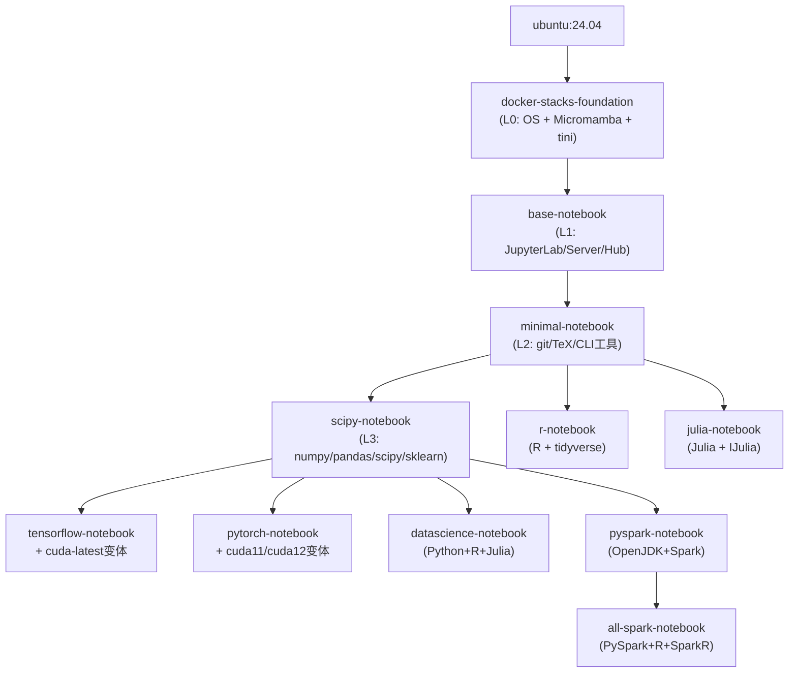

# 预设配置与基础镜像选择

cookiecutter-docker-stacks 提供14个YAML预设配置文件，每个文件对应一个Jupyter Docker Stacks官方镜像。选择合适的基础镜像是创建自定义镜像的第一步。

## 预设配置文件一览

模板仓库的 `configs/` 目录包含14个配置文件：

| 配置文件 | 基础镜像 | 层级 |
|---------|---------|------|
| foundation.yaml | quay.io/jupyter/docker-stacks-foundation | L0 基础层 |
| base.yaml | quay.io/jupyter/base-notebook | L1 Jupyter层 |
| minimal.yaml | quay.io/jupyter/minimal-notebook | L2 CLI层 |
| scipy.yaml | quay.io/jupyter/scipy-notebook | L3 科学计算层 |
| r.yaml | quay.io/jupyter/r-notebook | L2 专业分支（R） |
| julia.yaml | quay.io/jupyter/julia-notebook | L2 专业分支（Julia） |
| tensorflow.yaml | quay.io/jupyter/tensorflow-notebook | L3 深度学习（TF CPU） |
| tensorflow-cuda.yaml | quay.io/jupyter/tensorflow-notebook:cuda-latest | L3 深度学习（TF GPU） |
| pytorch.yaml | quay.io/jupyter/pytorch-notebook | L3 深度学习（PyTorch CPU） |
| pytorch-cuda11.yaml | quay.io/jupyter/pytorch-notebook:cuda11-latest | L3 深度学习（PyTorch CUDA11） |
| pytorch-cuda12.yaml | quay.io/jupyter/pytorch-notebook:cuda12-latest | L3 深度学习（PyTorch CUDA12） |
| datascience.yaml | quay.io/jupyter/datascience-notebook | L3 全栈数据科学 |
| pyspark.yaml | quay.io/jupyter/pyspark-notebook | L3 大数据 |
| all-spark.yaml | quay.io/jupyter/all-spark-notebook | L4 Spark全语言 |

## 镜像继承关系



## 逐层详解

### L0: docker-stacks-foundation

**配置**：foundation.yaml

最底层的基础镜像，包含：
- Ubuntu 24.04 操作系统
- Micromamba 包管理器（conda-forge源）
- Python 3.12+
- tini（PID 1 init进程）
- start.sh 入口脚本
- jovyan 用户（UID 1000）
- **不包含** Jupyter 本身

**适用场景**：
- 需要完全控制环境安装
- 构建非Jupyter应用但需要Jupyter的用户模型和启动脚本
- 对镜像体积有极致要求

**注意**：基于foundation的镜像无法通过默认的`test_secured_server`测试（因为没有Jupyter Server），模板CI中对此做了特殊处理（跳过测试）。

### L1: base-notebook

**配置**：base.yaml

在foundation基础上添加：
- JupyterLab
- Jupyter Server
- JupyterHub（singleuser模式）
- pandoc（Notebook导出）
- HEALTHCHECK 健康检查
- Jupyter Server默认配置

**适用场景**：
- 只需要Jupyter基础环境，想自己安装所有数据科学包
- 教学/培训环境需要精确控制包版本
- 作为自定义镜像的基础（推荐从这里开始，而非foundation）

### L2: minimal-notebook

**配置**：minimal.yaml

在base基础上添加：
- 命令行工具：git、curl、wget、vim、nano
- TeX Live（Notebook导出PDF）
- SSH客户端
- 常用构建工具

**适用场景**：
- 需要基本的命令行工具
- 需要导出PDF
- 不需要预安装的数据科学包

### L3: scipy-notebook

**配置**：scipy.yaml

在minimal基础上添加核心Python数据科学栈：
- numpy
- pandas
- scipy
- matplotlib
- scikit-learn
- seaborn
- sympy
- cython
- 以及其他常用科学计算包

**适用场景**：
- Python数据科学的默认选择
- 大多数数据分析/机器学习场景
- 作为PyTorch/TensorFlow等专业镜像的基础

### L3专业分支

#### R 语言

**配置**：r.yaml
- 基于minimal-notebook（非scipy）
- R 语言环境
- IRKernel（Jupyter R内核）
- tidyverse 系列包
- tidymodels 机器学习包

#### Julia 语言

**配置**：julia.yaml
- 基于minimal-notebook
- Julia 语言环境
- IJulia 内核
- Pluto.jl 笔记本

#### TensorFlow

**配置**：tensorflow.yaml / tensorflow-cuda.yaml
- 基于scipy-notebook
- TensorFlow（pip安装）
- CUDA变体包含NVIDIA CUDA运行时
- `:cuda-latest`标签跟踪最新CUDA版本

#### PyTorch

**配置**：pytorch.yaml / pytorch-cuda11.yaml / pytorch-cuda12.yaml
- 基于scipy-notebook
- PyTorch（pip安装）
- 三个CUDA变体：无CUDA（CPU）、CUDA 11、CUDA 12
- CUDA 12是最新推荐版本

#### Datascience（全栈）

**配置**：datascience.yaml
- 基于scipy-notebook
- 额外添加R语言和Julia语言支持
- rpy2（Python-R桥接）
- 三语言内核（Python + R + Julia）

**适用场景**：
- 多语言数据分析
- 教学环境需要支持多种语言
- 不确定用什么语言的数据探索

#### PySpark

**配置**：pyspark.yaml
- 基于scipy-notebook
- OpenJDK 21
- Apache Spark
- PyArrow
- PySpark Python包

#### All Spark

**配置**：all-spark.yaml
- 基于pyspark-notebook
- 额外添加R的Spark支持（sparklyr、SparkR）
- 支持Scala、Python、R三种Spark API

### L4: all-spark-notebook

在pyspark基础上添加R语言Spark支持，是最顶层的镜像。

## 场景化选择指南

### 场景1：我只想跑Jupyter

→ **base-notebook**。最小的Jupyter环境，按需自己装包。

### 场景2：Python数据分析（pandas/numpy/matplotlib）

→ **scipy-notebook**。预装了完整的Python数据科学栈。

### 场景3：深度学习训练（GPU）

→ 根据框架选择：
- PyTorch + 新GPU（A100/H100/40系）→ **pytorch-notebook:cuda12-latest**
- PyTorch + 旧GPU（V100/T4/20系）→ **pytorch-notebook:cuda11-latest**
- PyTorch CPU推理 → **pytorch-notebook**
- TensorFlow GPU → **tensorflow-notebook:cuda-latest**
- TensorFlow CPU → **tensorflow-notebook**

### 场景4：多语言数据科学

→ **datascience-notebook**。Python+R+Julia三语言一站式。

### 场景5：大数据处理

→ **pyspark-notebook**（仅PySpark）或 **all-spark-notebook**（PySpark+R Spark）。

### 场景6：R语言统计分析

→ **r-notebook**。

### 场景7：Julia科学计算

→ **julia-notebook**。

### 场景8：企业内部定制镜像

→ 根据需求选择基础层，推荐从 **minimal-notebook** 或 **scipy-notebook** 开始，保留足够的工具链同时避免不需要的专业包。

## 使用预设配置

### 命令行使用

```bash
# 交互式：在列表中选择
cookiecutter https://github.com/jupyter/cookiecutter-docker-stacks
# 选择stack_base_image时会显示编号列表

# 非交互式：使用预设配置
cookiecutter https://github.com/jupyter/cookiecutter-docker-stacks \
  --config-file configs/pytorch-cuda12.yaml \
  --no-input
```

### 创建自定义预设

可以创建自己的YAML配置文件，预填所有变量：

```yaml
# my-team-stack.yaml
default_context:
  stack_name: "team-ml-platform"
  stack_org: "mycompany"
  stack_base_image: "quay.io/jupyter/pytorch-notebook:cuda12-latest"
  stack_description: "MyCompany's ML platform with PyTorch CUDA 12"
```

```bash
cookiecutter https://github.com/jupyter/cookiecutter-docker-stacks \
  --config-file my-team-stack.yaml \
  --no-input \
  --output-dir ./projects
```

## 版本标签策略

官方镜像使用日期标签保证可复现性：

```
quay.io/jupyter/scipy-notebook:2026-07-28    # 特定日期构建
quay.io/jupyter/scipy-notebook:latest         # 最新构建（不推荐生产）
quay.io/jupyter/scipy-notebook:cuda12-latest  # CUDA变体的最新版
```

在cookiecutter选择基础镜像时，默认选择的是不带日期标签的浮动标签（如`quay.io/jupyter/scipy-notebook`）。生产环境建议：

1. 生成项目后修改Dockerfile，固定日期标签
2. 或通过CI/CD定期构建获取安全更新

```dockerfile
# 生产推荐：固定日期标签
FROM quay.io/jupyter/scipy-notebook:2026-07-28
```

## 相关概念

- [模板变量详解](03-cookiecutter-variables.md)
- [Dockerfile模板与编写指南](04-dockerfile-template.md)
- [快速上手](01-getting-started.md)
