# enterprise-gateway 架构洞察

## 洞察一：Process Proxy 抽象层——以"进程代理"统一异构资源调度

### 陈述

Enterprise Gateway（EG）通过 **Process Proxy** 抽象层将"内核进程"的概念从操作系统本地进程解耦，使其可以映射到 Kubernetes Pod、YARN Container、Docker Container、SSH 远程进程、IBM Conductor 应用等任意执行载体。这一抽象不是简单的适配器模式，而是一个**三层继承体系**：`BaseProcessProxyABC`（定义接口）→ `LocalProcessProxy`/`RemoteProcessProxy`（分离本地/远程语义）→ `ContainerProcessProxy`（容器共性）→ 具体后端实现。每个 Process Proxy 实例在 RemoteKernelManager 中替代了 jupyter_client 原生的 `self.kernel`（即 `subprocess.Popen`），使得上层 KernelManager 无需感知内核运行在何处。

关键设计点在于：Process Proxy 伪装成进程对象——它实现了 `poll()`、`wait()`、`send_signal()`、`kill()`、`terminate()` 等与 `Popen` 兼容的接口，同时 RemoteProcessProxy 额外引入了 `confirm_remote_startup()`（等待远程就绪）、`receive_connection_info()`（接收回传的 ZMQ 连接信息）、`comm_port` 通信通道（通过 socket 向 launcher 发信号）等远程特有能力。内核实际由远端的 **kernel launcher** 脚本（Python/R/Scala）启动，launcher 启动内核后，将 ZMQ 连接信息（5个端口+IP+key）通过 AES 加密回传到 EG 的 ResponseManager 单例 socket。

### 证据

- F-072、F-073、F-076、F-077、F-078：BaseProcessProxyABC 定义了 launch_process/poll/wait/send_signal/kill/terminate 等 Popen 兼容接口。
- F-084、F-085：LocalProcessProxy 直接使用 subprocess.Popen 管理本地进程。
- F-086、F-087、F-093：RemoteProcessProxy 引入 ResponseManager、confirm_remote_startup、receive_connection_info 等远程机制。
- F-019、F-070：ContainerProcessProxy 作为容器类代理基类，KubernetesProcessProxy 和 DockerProcessProxy 均继承自它。
- F-096、F-108、F-123、F-116：K8s/YARN/Distributed/Docker 各自实现 get_container_status/poll/kill/confirm_remote_startup 等后端特定逻辑。
- F-088、F-089、F-090、F-091：ResponseManager 单例管理 RSA 密钥对和响应 socket，负责加密接收 launcher 回传的连接信息。
- F-069：_get_process_proxy() 从 kernelspec metadata 动态加载 process proxy 类名，实现声明式后端选择。

### 反常识

1. **Process Proxy 不是远程 RPC 代理，而是"本地替身"**：它不通过 RPC 调用远程内核管理器，而是在本地维护进程的 pid/ip/pgid 等元数据，通过 SSH 命令（`kill -<signum>`）、容器 API、K8s API 等对远端实体发信号。这意味着即使 K8s API 或 YARN RM 不可用，EG 仍可通过 SSH 兜底发送信号（F-079、F-113、F-155）。
2. **内核连接信息不是 EG 主动拉取的，而是 launcher 主动回推的**：EG 在启动时创建一个 Response socket 并将公钥和地址传给 launcher，launcher 启动内核后主动连接该 socket 并回传加密的连接信息。这是一种"反向连接"模式，避免了 EG 需要访问每个远程节点的网络端口（F-090、F-091、F-093）。

### 行动建议

- 新增资源调度后端（如 Nomad、Slurm）时，继承 RemoteProcessProxy 或 ContainerProcessProxy，实现 `confirm_remote_startup()`、`get_container_status()`、`poll()`、`kill()`/`terminate_container_resources()` 即可，无需修改 KernelManager 层。
- kernelspec 的 `metadata.process_proxy.class_name` 是扩展点，自定义 Process Proxy 只需在 Python path 上可导入即可被 EG 加载。
- comm_port 是比 SSH 信号更可靠的信号通道——它通过 launcher listener 直接在内核所在节点执行信号操作，不受用户权限切换影响，新后端应优先实现 comm_port 回传。

---

## 洞察二：与 jupyter_server 的关系——作为"上游内核供给者"而非独立服务器

### 陈述

Enterprise Gateway **不是** jupyter_server 的替代者，而是 jupyter_server 的一个**特化配置**：它直接继承 `JupyterApp`（而非 `ServerApp`），但复用了 jupyter_server 的 `AsyncMappingKernelManager`、handler 体系和认证框架。EG 通过 Mixin 模式（TokenAuthorizationMixin + CORSMixin + JSONErrorsMixin）动态包装 jupyter_server 的所有 HTTP/WebSocket handler，使其在保持 API 兼容性的同时增加企业级能力。

EG 的核心定位是**远程内核提供者**：当 jupyter_server（或 Notebook/Lab）配置了 `GatewayClient` 指向 EG 时，jupyter_server 将内核启动请求转发给 EG，EG 在远程集群上启动内核后，将 ZMQ 连接信息返回给 jupyter_server，后者再代理 Notebook 前端的 WebSocket 流量到远程内核。从 API 层面看，EG 暴露的 `/api/kernels`、`/api/sessions`、`/api/kernelspecs` 端点与 jupyter_server 完全兼容，使得 Notebook/Lab 前端无需任何修改即可使用远程内核。

EG 故意将 `contents_manager` 设为 `None`（F-043），明确划清边界：EG 只负责内核生命周期管理，Notebook 文件管理由对接的 jupyter_server 负责。这种设计让 EG 可以作为独立微服务部署，被多个 jupyter_server 实例共享。

### 证据

- F-007、F-008：EG 依赖 jupyter_client<7 和 jupyter_server<2，注释明确提到待支持 kernel provisioners 后升级。
- F-033、F-036：EnterpriseGatewayApp 继承 JupyterApp（非 ServerApp），但 init_configurables 中直接复用 jupyter_client 的 KernelSpecManager。
- F-136、F-139：所有 handler 通过 Mixin 动态包装 jupyter_server 的 handler 类，路径完全兼容。
- F-014：mixins.py 中 CORSMixin、TokenAuthorizationMixin、JSONErrorsMixin 是独立的可组合 Mixin，插入到 jupyter_server handler 继承链中。
- F-043：contents_manager 设为 None，EG 不处理文件内容。
- F-044：API 路由组合 api + kernel + kernelspec + session + base 五组 handler，挂载在 base_url 下，API 路径与 jupyter_server 一致。
- F-029、F-020-F-081：client/gateway_client.py 是实验性客户端，用于集成测试；实际生产中由 jupyter_server 的 GatewayClient 连接 EG。

### 反常识

1. **EG 不是"增强版 Kernel Gateway"**：尽管名字相似且都叫 Gateway，Jupyter Kernel Gateway（kernel_gateway）是 headless notebook server，专注于将 kernel 暴露为 HTTP/WebSocket API；而 EG 的核心创新是远程内核生命周期管理——它将 kernel 的执行位置从本地进程扩展到远程集群，两者解决的是完全不同的问题。EG 代码中保留的 `KG_*` 环境变量前缀（F-172、F-185、F-199 等）仅是历史遗留兼容。
2. **EG 自己不代理 ZMQ 流量**：EG 启动远程内核后，将连接信息（IP+端口+key）返回给客户端（jupyter_server），由 jupyter_server 直接建立到远程内核的 ZMQ/WebSocket 通道。EG 本身在 kernel 启动后仅负责生命周期管理（轮询、信号、清理），不转发执行请求/结果数据——这是它能支撑大规模内核的关键架构决策。

### 行动建议

- 部署 EG 作为独立微服务时，需确保 jupyter_server 到内核 Pod/Container 的网络可达（ZMQ 5 端口直连），或启用 SSH 隧道（EG_TUNNELING=True）通过 EG 中转。
- 从 jupyter_server 迁移到纯 EG 部署时，需要额外部署文件管理服务（如 Contents Service），因为 EG 不提供 Notebook 文件 API。
- 关注 Jupyter 生态的 Kernel Provisioner 架构演进——EG 依赖的 jupyter_client<7 上限（F-007）表明当前 Process Proxy 抽象最终可能迁移到 jupyter_client 的 Kernel Provisioner 标准接口。

---

## 洞察三：内核生命周期的"远程化"——反向连接 + 加密通道 + 会话持久化的三重奏

### 陈述

EG 将 Jupyter 内核生命周期从"本地子进程"模型彻底重构为"远程编排实体"模型，解决了三个核心问题：

**（1）启动阶段的反向连接与加密协商**：EG 启动内核时，不直接连接到远程节点获取端口，而是创建一个 RSA 密钥对（1024位），将公钥和 ResponseManager 的地址（IP:Port）通过内核命令行参数（`{response_address}`、`{public_key}` 模板替换）传给远端 launcher。launcher 在远端启动内核后，随机生成 AES 密钥，用 RSA 公钥加密 AES 密钥，再用 AES 加密 ZMQ 连接信息（5个端口+session key），回传给 ResponseManager。EG 用私钥解密 AES 密钥，再解密连接信息（F-091）。这一设计避免了在命令行或环境变量中传递敏感的连接密钥。

**（2）运行阶段的信号与心跳双通道**：远程内核的信号传递有两条路径——优先使用 comm_port（launcher 监听的 TCP 端口，通过 socket 发送 JSON 信号指令），comm_port 不可用时回退到 SSH `kill` 命令（F-155、F-094）。轮询（poll）则通过后端 API（K8s Pod phase、YARN app state、Docker container status）或 SSH signal 0 实现。WebSocket ping 间隔可配置（F-066），用于检测僵尸连接。

**（3）故障恢复的会话持久化与 HA**：KernelSessionManager 将内核会话（connection_info + process_info + launch_args）持久化到文件系统或 Webhook 服务。在 replication 模式下，多个 EG 实例共享持久化存储，当一个 EG 实例收到对未知 kernel_id 的请求时，会尝试从持久化存储加载会话并重建 Process Proxy（F-059）。standalone 模式下 EG 重启后自动尝试恢复所有持久化会话。恢复时通过 Process Proxy 的 `poll()` 和 `load_process_info()` 验证远程内核是否仍然存活。

### 证据

- F-062、F-064：format_kernel_cmd() 替换 {response_address}、{public_key}、{port_range}、{kernel_id} 模板。
- F-088-F-091：ResponseManager 单例管理 RSA 密钥对、监听响应 socket、处理 v0/v1 两种加密协议。
- F-093、F-1297：receive_connection_info() 异步等待连接信息，超时则 kill 内核。
- F-094、F-095：_send_listener_request() 通过 comm_port 发送 JSON 信号；F-155 send_signal 优先用 comm_port。
- F-131-F-135：KernelSessionManager 持久化 connection_info、process_info、launch_args，支持文件和 Webhook 两种后端。
- F-041、F-042：availability_mode 与 session persistence 联动，standalone 启动时自动恢复会话。
- F-059：start_kernel_from_session() 重建 Process Proxy、加载连接信息、验证 poll()、重启活动监控。
- F-066：无客户端连接的远程内核在自动重启时会被跳过（避免孤儿进程）。

### 反常识

1. **内核启动超时不代表启动失败**：YARN 场景下，Application ID 可能在提交后很久才被分配，EG 在超时前先区分"应用未提交"（500错误）和"应用已 RUNNING 但连接信息未到"（503错误，表示资源不足）（F-112、F-113、F-411）。这是一种精细的失败分类——不是所有超时都等同。
2. **HA 恢复不保证内核仍然可用**：start_kernel_from_session() 仅通过 `poll()` 验证进程是否存活，无法验证内核的 ZMQ 端口是否仍然可连接或内核是否处于健康状态。如果内核进程存在但已死锁，恢复的会话将无法执行代码。这是一种"尽力而为"的恢复策略（F-399）。

### 行动建议

- 生产环境部署 EG 时务必启用 session persistence（EG_KERNEL_SESSION_PERSISTENCE=True），选择 Webhook 后端共享存储以支持多实例 replication 模式。
- 调整 EG_KERNEL_LAUNCH_TIMEOUT 时需考虑后端类型：YARN 场景默认 30s 可能不够，建议根据集群负载调整到 60-120s。
- comm_port 是远程信号的首选通道，自定义 launcher 务必实现 comm_port listener 以支持跨用户 impersonation 场景下的信号传递（SSH kill 在 impersonation 时可能因权限不足失败）。
- 注意 SSH 隧道模式下的 keep-alive 配置——默认 cull_idle_timeout+60s，COMM/CONTROL 通道使用 100 年保活（F-1289），长时间空闲内核可能因网络设备超时断开连接。

---

## 洞察四：多资源管理器适配——声明式配置驱动的统一调度抽象

### 陈述

EG 的多后端支持不是通过 hard-coded 的 if/else 分支实现的，而是通过**kernelspec metadata 声明式配置**驱动的。每个内核规格（kernel.json）的 `metadata.process_proxy` 字段指定了该内核应使用的 Process Proxy 类名和配置参数，EG 在启动内核时动态加载并实例化对应的代理。这意味着：同一个 EG 实例可以同时服务 K8s、YARN、Docker、SSH、Conductor 等多种后端的内核，选择哪个后端完全由 kernelspec 决定，而非全局配置。

更深层的抽象体现在各后端的共性提取上：
- **ContainerProcessProxy**（F-019）抽取了容器类后端的通用逻辑：镜像确定、UID/GID 安全检查、容器状态轮询、容器资源终止。K8s 和 Docker 都继承自它。
- **RemoteProcessProxy**（F-086）抽取了远程后端的通用逻辑：ResponseManager 注册、SSH 隧道、comm_port 信号、连接信息接收、超时处理、进程信息持久化。
- 每个后端的差异被压缩到几个抽象方法中：`get_initial_states()`、`get_error_states()`、`get_container_status()`、`terminate_container_resources()`（容器类）或 `confirm_remote_startup()`（所有远程类）。

YARN 和 Conductor 的 Process Proxy 还有一个独特模式：它们不是直接通过 API 启动容器/Pod，而是在本地执行一个 `launch_kernel` 脚本（如 spark-submit），该脚本向集群提交应用后，Process Proxy 通过集群 API 轮询应用状态。这是一种"本地提交+远程执行"的混合模式，EG 进程本身不直接与 YARN NM 或 K8s kubelet 通信。

### 证据

- F-070：get_process_proxy_config() 从 kernelspec.metadata.process_proxy 读取 class_name 和 config，默认 LocalProcessProxy。
- F-069：_get_process_proxy() 使用 import_item() 动态导入 process proxy 类。
- F-030-F-031：etc/kernelspecs/ 下有 25+ 种预配置 kernelspec，每种对应不同后端（python_kubernetes、python_docker、spark_python_yarn_cluster 等）。
- F-019、F-291-F-308：ContainerProcessProxy 定义了容器类代理的 4 个抽象方法。
- F-099-F-101：K8s 代理实现 get_initial_states→{pending, running}、get_error_states→{failed}、get_container_status→查询 Pod phase、terminate_container_resources→删除 Pod/Namespace。
- F-117-F-119：Docker Swarm 和 Docker 代理各自定义不同的状态集。
- F-110、F-124：YARN 和 Distributed 代理通过本地 Popen 执行提交脚本，再轮询集群状态。
- F-105-F-107：CRD/SparkOperator 代理通过继承 K8s 代理扩展，仅覆写 object_kind、CRD group/version/plural 和状态查询逻辑。
- F-120-F-121：容器代理强制检查 UID/GID 不在禁止列表中（默认禁止 root）。
- F-124：DistributedProcessProxy 内置 round-robin 和 least-connection 两种负载均衡算法。

### 反常识

1. **YARN 内核的"本地进程"不是内核本身**：YarnClusterProcessProxy 启动时通过 Popen 执行的是 spark-submit 客户端进程，不是 Spark Driver（内核）。这个本地进程提交应用后很快退出，但 EG 将其 `local_proc.pid` 记录下来，真正的内核运行在 YARN Container 中。这也是为什么 YarnClusterProcessProxy 需要额外的 cleanup() 来清理这个"提交客户端"僵尸进程（F-338-F-347）。
2. **K8s 代理不直接创建 Pod，而是通过 launcher 脚本创建**：launch_kubernetes.py 使用 Jinja2 模板渲染 Pod YAML 并调用 kubectl 创建 Pod，而不是通过 kubernetes Python 客户端直接创建 Pod。kubernetes 客户端仅用于查询 Pod 状态和删除 Pod（F-110、F-146）。这意味着 kernel-pod.yaml.j2 模板可以被用户自定义修改，提供了极大的灵活性。

### 行动建议

- 多后端混部场景下，利用 kernelspec 的 process_proxy.config 可为每个 kernelspec 单独配置后端参数（如 YARN endpoint、image_name、remote_hosts），覆盖全局配置。
- 自定义后端时优先选择继承路径：新容器编排平台→继承 ContainerProcessProxy；新 SSH 类集群→继承 DistributedProcessProxy；新 API 驱动的调度系统→直接继承 RemoteProcessProxy。
- 安全性方面，EG_PROHIBITED_UIDS/EG_PROHIBITED_GIDS（F-120）和环境变量注入防护（F-137、F-138）是重要的纵深防御层，容器部署务必保留 root 禁止默认值。
- Spark on K8s 场景优先使用 SparkOperatorProcessProxy（F-107）而非普通 KubernetesProcessProxy，前者通过 Spark Operator CRD 管理应用，能更好地处理 Driver/Executor 生命周期。

---

## 架构总览

```mermaid
graph TB
    subgraph Client["客户端层"]
        NB["Jupyter Notebook/Lab"]
        JS["jupyter_server<br/>(GatewayClient)"]
    end

    subgraph EG["Enterprise Gateway"]
        APP["EnterpriseGatewayApp<br/>(Tornado HTTPServer)"]
        RMKM["RemoteMappingKernelManager"]
        RKM["RemoteKernelManager"]
        KSM["KernelSessionManager<br/>(File/Webhook)"]
        RSM["ResponseManager<br/>(RSA+AES Socket)"]

        subgraph Handlers["API Handlers"]
            KH["Kernel Handlers<br/>(Token+CORS+JSON)"]
            SH["Session Handlers"]
            KSH["Kernelspec Handlers"]
        end

        subgraph PP["Process Proxy 层"]
            LPP["LocalProcessProxy"]
            CPP["ContainerProcessProxy"]
            RPP["RemoteProcessProxy"]

            K8S["KubernetesProcessProxy"]
            DOCKER["DockerProcessProxy"]
            SWARM["DockerSwarmProcessProxy"]
            CRD["CustomResourceProcessProxy"]
            SPARKOP["SparkOperatorProcessProxy"]
            YARN["YarnClusterProcessProxy"]
            DIST["DistributedProcessProxy<br/>(SSH Round-Robin/Least-Conn)"]
            COND["ConductorClusterProcessProxy"]
        end
    end

    subgraph Launchers["远程 Kernel Launchers"]
        LPY["launch_ipykernel.py"]
        LR["launch_IRkernel.R"]
        LSC["ToreeLauncher.scala"]
        LK8S["launch_kubernetes.py"]
        LDOCKER["launch_docker.py"]
        LCRD["launch_custom_resource.py"]
    end

    subgraph Clusters["集群后端"]
        K8SAPI["Kubernetes API<br/>(Pods/CRD/SparkApplication)"]
        YARNAPI["YARN ResourceManager"]
        DOCKERAPI["Docker Daemon/Swarm"]
        SSHHOSTS["Remote Hosts<br/>(SSH)"]
        CONDAPI["IBM Conductor"]
    end

    NB -->|HTTP/WS| JS
    JS -->|HTTP API<br/>/api/kernels| APP
    APP --> Handlers
    KH --> RMKM
    RMKM -->|"start_kernel()"| RKM
    RKM -->|"_get_process_proxy()"| PP
    KSM <-.->|"persist/load"| RMKM

    RPP -->|"register_event"| RSM

    LPP -->|"Popen"| LPY
    K8S -->|"kubectl apply<br/>(launcher script)"| LK8S
    DOCKER -->|"docker run<br/>(launcher script)"| LDOCKER
    CRD -->|"kubectl apply CRD"| LCRD
    SPARKOP --> CRD
    YARN -->|"spark-submit"| LSC
    DIST -->|"SSH nohup"| LPY
    COND -->|"REST curl"| LSC

    LK8S --> K8SAPI
    LDOCKER --> DOCKERAPI
    LCRD --> K8SAPI
    LSC --> YARNAPI
    LPY --> SSHHOSTS
    LSC --> CONDAPI

    Launchers -->|"回传加密连接信息<br/>(AES+RSA)"| RSM

    K8S -->|"list/delete Pod"| K8SAPI
    DOCKER -->|"list/remove Container"| DOCKERAPI
    SWARM -->|"list/remove Service"| DOCKERAPI
    YARN -->|"query/kill App"| YARNAPI
    DIST -->|"SSH kill"| SSHHOSTS
    COND -->|"REST API"| CONDAPI

    style PP fill:#e1f5fe
    style RSM fill:#fff3e0
    style Launchers fill:#f3e5f5
    style Clusters fill:#e8f5e9
```

## 核心模式提炼

| 模式名称 | 所在位置 | 核心思想 |
|---------|---------|---------|
| **Process Proxy（进程代理）** | services/processproxies/ | 以兼容 Popen 接口的代理对象抽象异构执行环境，上层 KernelManager 无感知 |
| **Reverse Connection（反向连接）** | ResponseManager + launcher | 内核启动后主动回连 EG 推送连接信息，避免 EG 访问远程节点端口 |
| **Hybrid Encryption（混合加密）** | ResponseManager._decode_payload | RSA 传递 AES 密钥 + AES 加密连接信息，v1 协议；v0 用 kernel_id 前16字节作 AES 密钥（兼容旧版） |
| **Declarative Backend（声明式后端）** | kernelspec metadata.process_proxy | 通过 kernel.json 声明选择后端，同一 EG 实例多后端共存 |
| **Signal Channel Fallback（信号通道降级）** | RemoteProcessProxy.send_signal | comm_port → SSH kill 两级信号路径，优先 socket 兜底 SSH |
| **Session Persistence（会话持久化）** | KernelSessionManager | 将内核会话序列化到外部存储，支持 HA 故障恢复 |
| **Template Command（命令模板）** | RemoteKernelManager.format_kernel_cmd | `{response_address}`、`{public_key}`、`{port_range}`、`{kernel_id}` 模板变量注入启动命令 |
| **Mixin-based Handler Composition** | mixins.py + handlers.py | Token/CORS/JSON 错误作为独立 Mixin 动态组合到 jupyter_server handler |
| **Polling State Machine（轮询状态机）** | ContainerProcessProxy/YarnClusterProcessProxy | 轮询后端状态（Pod phase/App state/Container status），区分初始/运行/错误状态集 |
| **Config Synchronization via directional_link** | RemoteKernelManager._link_dependent_props | 使用 traitlets directional_link 自动同步父应用配置到 KernelManager 实例 |
