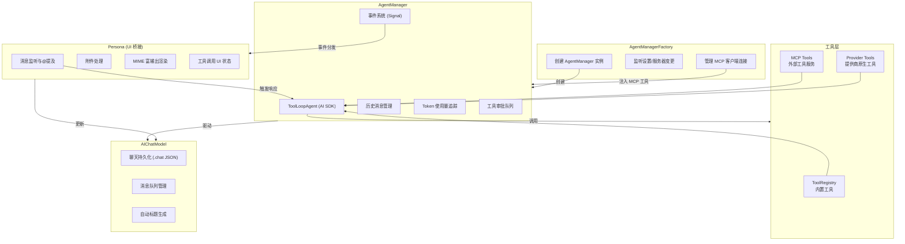

# jupyter-ai 架构洞察

## 洞察一：基于 AI SDK ToolLoopAgent 的多轮工具调用代理架构

jupyter-ai 的核心代理引擎构建在 Vercel AI SDK 的 `ToolLoopAgent` 之上，形成了一个完整的**工具循环执行架构**。AgentManager 类封装了代理的完整生命周期：初始化配置（模型、工具、参数）→ 流式执行 → 事件分发 → 历史管理。

**关键设计要点：**

1. **工厂模式管理共享资源**：`AgentManagerFactory` 集中管理 MCP 客户端连接、SecretsManager 和 SkillRegistry，多个 AgentManager 实例共享这些资源，避免重复连接。
2. **异步初始化队列**：使用 `_initQueue` Promise 链确保初始化操作串行执行，防止竞态条件（设置变更和 MCP 连接可能同时触发重新初始化）。
3. **事件驱动 UI 更新**：代理通过 Lumino Signal 发射 8 种事件（message_start/chunk/complete、tool_call_start/complete、approval_request/resolved、error），Persona 层监听这些事件更新聊天 UI，实现了核心逻辑与 UI 的解耦。
4. **三级工具合并**：运行时工具 = Provider 原生工具（web_search/web_fetch）+ 内置函数工具（commands/skills/browser_fetch）+ MCP 外部工具，通过 `_buildRuntimeTools()` 统一合并。

## 洞察二：可扩展的提供商注册与模型抽象

jupyter-ai 实现了一个高度可扩展的 LLM 提供商注册系统，通过 `IProviderRegistry` 接口和 `IProviderInfo` 元数据描述，支持内置 5 种提供商（Anthropic/Google/Mistral/OpenAI/Generic）以及第三方扩展注册。

**提供商能力描述维度：**

| 能力维度 | 说明 | 设计价值 |
|---------|------|---------|
| `apiKeyRequirement` | required/optional/none 三档 | 控制 UI 中 API Key 字段显隐和验证逻辑 |
| `defaultModels` | 默认模型列表 | UI 模型选择器的初始选项 |
| `modelInfo` | 每模型元数据（上下文窗口/多模态支持） | 附件处理和 token 计数依据 |
| `supportsBaseURL/Headers` | 是否支持自定义端点和头 | 兼容本地部署和代理场景 |
| `providerToolCapabilities` | 提供商原生工具能力（webSearch/webFetch） | 避免重复注册函数工具 |
| `cacheProviderOptions` | Prompt 缓存配置 | 利用 Anthropic 等提供商的缓存能力降低成本 |
| `factory` | 模型工厂函数 | 统一创建 LanguageModel 实例 |

**多模态感知的附件处理**：Persona 在发送消息前通过 `modelSupportsImages/Pdf/Audio()` 查询当前模型能力，只有模型支持时才将附件编码发送，否则附件被剥离，避免 API 报错。切换提供商/模型时会触发 `_rebuildHistory()` 重新处理历史附件。

## 洞察三：MCP 协议集成与安全审批机制

jupyter-ai 深度集成了 MCP（Model Context Protocol）协议，实现了外部工具服务的动态发现和调用，同时构建了分层安全审批机制。

**MCP 连接生命周期：**

1. **初始化**：工厂从 `IMcpManager` 获取已配置服务器列表，仅连接 HTTP 类型服务器。
2. **容错连接**：单个 MCP 服务器连接失败不影响其他服务器，错误仅打印警告。
3. **动态更新**：监听 MCP 服务器配置变更，关闭旧连接重建新连接，已创建的聊天实例自动获得新工具。
4. **延迟注入**：新聊天在 MCP 连接完成前即可创建，连接建立后自动重新初始化代理。

**安全审批链：**

- **命令级审批**：`createExecuteCommandApprovalPolicy()` 根据 `commandsRequiringApproval` 配置决定哪些命令需要用户批准。
- **异步审批流**：工具调用遇到需审批命令时，代理暂停执行并通过 `tool_approval_request` 事件通知 UI，用户通过 `approveToolCall/rejectToolCall()` 响应，Promise 机制确保流程正确挂起/恢复。
- **自动中断清理**：`stopStreaming()` 时自动拒绝所有待审批项，防止悬挂 Promise。

**消息完整性保证**：`sanitizeModelMessages()` 在消息入历史前执行配对校验——每个 tool-call 必须有对应的 tool-result，每个 approval-request 必须有对应的 approval-response，不完整的消息对被移除以防止后续 API 调用因消息序列不合法而失败。不可序列化的消息通过 JSON 往返检测被丢弃，确保历史始终可安全传输。
