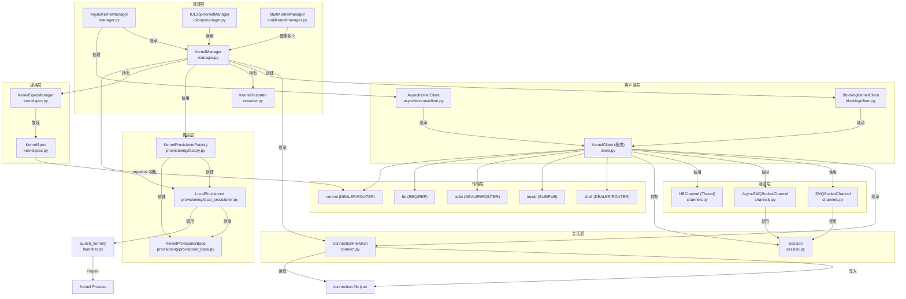

# jupyter-client Insights

## 洞察一：KernelManager 与 KernelClient 的职责分离是进程隔离的核心架构决策

**陈述**：jupyter-client 将内核生命周期管理（启动/关闭/重启/信号）与消息通信（发送请求/接收回复/订阅输出）严格分离为两个独立类层次——`KernelManager` 负责进程生命周期，`KernelClient` 负责 ZMQ 通道通信。两者通过 JSON 连接文件解耦，而非内存引用。

**证据**：
- F-033: KernelManager 继承 ConnectionFileMixin，管理内核子进程生命周期
- F-030: KernelClient 继承 ConnectionFileMixin，通过五个 ZMQ 通道通信
- F-078: KernelManager.client() 方法通过 get_connection_info(session=True) 创建独立客户端
- F-052: write_connection_file() 将端口/密钥/IP 写入 JSON 文件
- F-098: owns_kernel 标志允许 KernelClient 连接到非自己启动的内核（external_connection_dir 场景）
- F-033/F-034: KernelManager 和 AsyncKernelManager 使用不同的 zmq.Context（同步 vs asyncio）

**反常识**：
1. **Manager 和 Client 不共享 ZMQ Context**：KernelManager 使用自己的 context 创建 control socket（用于 shutdown_request），而 KernelClient 创建独立 context 和五个通道 socket。这意味着两者之间没有进程内直通，所有通信必须经过 ZMQ 套接字——即使是在同一个 Python 进程中。
2. **Client 可以脱离 Manager 独立存在**：F-165 显示 _async_is_alive() 在 parent 不是 KernelManager 时退化为心跳检测，这使得前端可以仅通过连接文件连接到远程内核，完全不需要 Manager。连接文件是唯一的"握手凭证"。

**行动建议**：
- 当需要"连接到已有内核"场景时，直接用 KernelClient.load_connection_file() 即可，无需构造 KernelManager
- 不要试图通过内存引用在 Manager 和 Client 之间传递消息——架构设计明确要求走 ZMQ 通道
- MultiKernelManager 通过 `owns_kernel=False` 管理外部内核（F-098/F-161），这是 Jupyter Server/Gateway 的关键扩展点

---

## 洞察二：五通道 ZMQ 架构实现了控制面与数据面的物理分离

**陈述**：Jupyter 协议使用五个独立的 ZMQ 套接字通道，每个通道有不同的 socket type 和语义：shell（DEALER/ROUTER，请求-回复）、iopub（SUB/PUB，广播输出）、stdin（DEALER/ROUTER，输入请求）、hb（REQ/REP，心跳）、control（DEALER/ROUTER，管理命令）。shutdown 和 interrupt 走 control 通道而非 shell 通道。

**证据**：
- F-105: channel_socket_types 定义了五个通道的 ZMQ socket 类型映射
- F-120: 五个通道各自的功能分工
- F-067: shutdown() 方法在 control 通道发送 shutdown_request
- F-097: interrupt_kernel() 在 interrupt_mode="message" 时通过 control 通道发送 interrupt_request
- F-059/F-066: execute/complete/inspect/history/kernel_info/comm_info/is_complete 走 shell 通道
- F-122: iopub 通道连接后必须 SUBSCRIBE b"" 订阅所有消息
- F-124: HBChannel 使用独立 Thread 运行 REQ/REP 心跳循环
- F-068: execute_interactive() 使用 zmq.asyncio.Poller 同时监听 iopub 和 stdin

**反常识**：
1. **heartbeat 通道不使用 DEALER/ROUTER，而是 REQ/REP**：这是唯一使用 REQ/REP 模式的通道（F-105）。REQ/REP 强制严格的 send→recv→send 顺序，心跳失败时必须销毁并重建 socket（F-166）——这是因为 REP 状态机在超时后无法恢复。这使得心跳通道在实现上比其他通道复杂得多（需要 _create_socket() 重建逻辑）。
2. **control 通道不是"带外"通道，它与 shell 通道共享同一个 ROUTER**：在 kernel 端，control 和 shell 是两个独立的 ROUTER socket，但它们都接收 DEALER 客户端的消息。关键区别在于 kernel 端对 control 消息有独立的处理线程/队列，这确保 shutdown_request 不会被前面排队的 execute_request 阻塞。但客户端侧 control 和 shell 使用相同类型的 socket（DEALER），没有任何优先级机制。

**行动建议**：
- 不要通过 shell 通道发送 shutdown——这可能被长 execute 请求阻塞，必须走 control 通道
- iopub 通道必须先 SUBSCRIBE 才能收到任何消息（F-122），忘记订阅是常见的"客户端无输出"bug
- 心跳通道是唯一有自己线程的通道（F-042），其他通道依赖调用者的线程或事件循环

---

## 洞察三：Session 的 HMAC 签名+摘要历史是纵深防御而非单一安全边界

**陈述**：Session 层实现了基于 HMAC 的消息签名机制，使用共享密钥对消息头/父头/元数据/内容四部分计算签名，并通过 digest_history 集合检测重放攻击。签名不覆盖 buffers 部分。默认签名方案为 hmac-sha256，密钥默认为随机生成。

**证据**：
- F-111: 默认签名方案 "hmac-sha256"，必须以 "hmac-" 开头
- F-074: sign() 对 [p_header, p_parent, p_metadata, p_content] 四部分签名
- F-110: buffers 不参与签名计算
- F-112/F-113: digest_history 防止重放攻击，默认 65536 条，超限时随机淘汰 10%
- F-118: 使用 hmac.compare_digest 防止时序攻击
- F-127: 默认密钥为 new_id_bytes() 随机生成
- F-132: key 为空时发出 "insecure" 警告但仍允许运行
- F-128: check_pid 检测 fork 后发送消息
- F-075: clone() 方法 fork digest_history 以避免多连接误报

**反常识**：
1. **签名不覆盖 buffers 意味着二进制数据（如图像、大数组）在传输中可被篡改而不被检测到**：F-110 明确签名仅覆盖前四部分。这是性能权衡——buffer 可能是数 MB 的二进制数据，HMAC 计算开销大。但这意味着如果攻击者能篡改 wire 数据，他们可以替换 display_data 的 PNG 数据而不被发现。真正的安全需要依赖 CurveZMQ 加密层（F-101/F-123）。
2. **digest_history 的重放防护是概率性的，不是确定性的**：F-113 显示超限时随机淘汰 10% 而非淘汰最旧的条目。结合 F-112 的 65536 默认大小，在高吞吐场景下（每秒数千条消息），历史条目可能在几秒内就被淘汰，重放攻击窗口虽然短但理论上存在。此外，F-075 的 clone() 会复制历史——但这意味着不同 Session 实例之间不共享历史，跨进程重放无法检测。

**行动建议**：
- 生产环境务必启用 CurveZMQ 加密（transport_encryption="required"），HMAC 签名只能防篡改不能防窃听
- 不要信任没有签名的消息——F-132 显示空 key 时消息可以伪造
- digest_history 不是强安全保证，跨进程/跨连接场景下重放防护依赖连接级加密而非 Session 签名

---

## 洞察四：Kernel Spec 发现+Provisioner 插件化使内核启动成为可扩展的契约系统

**陈述**：KernelSpec 是一个声明式数据模型（argv, env, language, interrupt_mode, metadata），描述如何启动一个内核。KernelSpecManager 按搜索路径发现 kernel.json 文件。KernelProvisionerFactory 通过 entry points 插件化地选择 provisioner——默认 LocalProvisioner 使用 subprocess.Popen，但第三方可以注册自定义 provisioner 实现远程内核、容器化内核等。

**证据**：
- F-136: KernelSpec.interrupt_mode 支持 "signal" 和 "message" 两种中断方式
- F-137: from_resource_dir() 从 kernel.json 反序列化
- F-140: 搜索路径包含 jupyter_path("kernels") 和 IPython kernels 目录
- F-047: KernelProvisionerFactory 是单例，通过 entry points 发现 provisioner
- F-146: entry point group 为 "jupyter_client.kernel_provisioners"
- F-144/F-145: provisioner 配置从 kernel_spec.metadata["kernel_provisioner"] 读取，默认 local-provisioner
- F-045: KernelProvisionerBase 是抽象基类，定义了 poll/wait/send_signal/kill/terminate/launch_kernel/cleanup 等抽象方法
- F-149: LocalProvisioner.pre_launch() 处理端口缓存、CurveZMQ 密钥生成、连接文件写入
- F-099: format_kernel_cmd() 替换 {connection_file} 等模板变量
- F-162: _finalize_env() 为 Python 内核移除 PYTHONEXECUTABLE 环境变量
- F-141: ensure_native_kernel 自动注册 ipykernel 的 python3 spec

**反常识**：
1. **KernelSpec 不直接知道如何启动进程——它只提供 argv 模板，启动逻辑在 Provisioner 中**：KernelSpec 是纯数据，KernelManager 通过 format_kernel_cmd() 替换模板变量后交给 Provisioner。这意味着同一个 KernelSpec 可以被不同的 Provisioner 以完全不同的方式"启动"——LocalProvisioner 用 Popen 本地启动，而远程 Provisioner 可能通过 SSH/Kubernetes API 启动。KernelSpec 与 Provisioner 的绑定是通过 metadata.kernel_provisioner 声明式配置的（F-144），而非代码硬编码。
2. **interrupt_mode="message" 不是默认行为，默认是 "signal"**：F-136 显示默认 interrupt_mode 是 "signal"（即 SIGINT），这在 Windows 上需要特殊处理（F-163 使用 win_interrupt.send_interrupt）。"message" 模式通过 control 通道发送 interrupt_request，是远程内核的唯一可行方式，但本地默认仍用信号。这导致本地和远程内核的中断路径完全不同。

**行动建议**：
- 自定义内核必须正确设置 interrupt_mode——远程内核必须用 "message"，否则 SIGINT 无法发送到远程进程
- 第三方 provisioner 通过注册 entry point `jupyter_client.kernel_provisioners` 即可扩展，无需修改 jupyter_client 代码
- KernelSpec 的 argv 支持 {connection_file}、{prefix}、{resource_dir} 模板替换（F-099），自定义内核启动命令应使用这些变量而非硬编码路径

---

## 洞察五：同步/异步双客户端层次通过 run_sync 和继承实现零代码复用

**陈述**：jupyter-client 维护三个客户端变体——KernelClient（基类，含 async 核心实现）、BlockingKernelClient（同步包装）、AsyncKernelClient（纯异步）。阻塞客户端通过 `run_sync()` 工具函数将 async 方法转换为同步方法，而非重新实现。reqrep 装饰器为请求方法统一添加 reply/timeout 参数。

**证据**：
- F-030: KernelClient 是基类，核心方法（_async_get_shell_msg、_async_execute_interactive 等）是 async
- F-031/F-083: BlockingKernelClient 用 run_sync() 将 async 方法转为同步
- F-032: AsyncKernelClient 直接引用 KernelClient 的 async 方法
- F-084: BlockingKernelClient 的 channel class 使用 ZMQSocketChannel（同步）
- F-055/F-056/F-057/F-058: AsyncKernelClient 的 channel class 使用 AsyncZMQSocketChannel
- F-082/F-083: reqrep(wrapped, ...) 装饰器统一添加 reply 参数支持
- F-039/F-041: KernelManager 的异步内部方法通过 run_sync() 暴露同步版本（如 _async_start_kernel → start_kernel）
- F-034/F-164: AsyncKernelManager 直接将 async 方法赋值为公开方法，不做 run_sync 包装
- F-035/F-036: IOLoopKernelManager/AsyncIOLoopKernelManager 将 connect_* 方法包装为 ZMQStream
- F-167: as_zmqstream 装饰器在创建 socket 时临时替换 context._socket_class

**反常识**：
1. **KernelClient 基类的核心方法都是 async 实现，同步版本是派生出来的**：F-030 中 KernelClient 定义了 `_async_get_shell_msg`、`_async_recv_reply`、`_async_wait_for_ready` 等 async 方法，但它自身并不直接暴露 async API——这些 async 方法前缀是 `_async_`。BlockingKernelClient 通过 run_sync() 包装它们（F-044-F-049），而 AsyncKernelClient 直接将它们赋值为公开方法（F-047-F-052）。这意味着"基类即 async 实现"，同步是派生特性。
2. **BlockingKernelClient 和 AsyncKernelClient 几乎不添加新逻辑，纯靠方法赋值和 channel class 替换**：两个子类的代码量极小（blocking/client.py 72 行，asynchronous/client.py 76 行），差异主要在 channel class（ZMQSocketChannel vs AsyncZMQSocketChannel）和是否用 run_sync 包装。execute/complete/inspect 等业务方法通过 reqrep 装饰器从基类继承，没有任何代码重复。

**行动建议**：
- 新建客户端变体时，只需替换 channel_class 和选择是否 run_sync 包装即可，不需要重写业务方法
- run_sync 来自 jupyter_core.utils，它在已有 event loop 时会抛错——在异步应用中必须使用 AsyncKernelClient/AsyncKernelManager
- execute_interactive() 是唯一包含复杂轮询逻辑的方法（F-068），使用 zmq.Poller 同时监听 iopub 和 stdin——不要在阻塞客户端的主线程中调用它处理 stdin

---

## 架构图

## 核心模式提炼

| 模式 | 实现位置 | 核心思想 |
|------|----------|----------|
| **连接文件解耦** | connect.py | 所有跨进程连接信息（端口/密钥/IP）序列化到 JSON 文件，Manager 和 Client 通过文件而非内存交换配置，实现了进程无关的内核发现 |
| **五通道分离** | client.py, channels.py | shell（请求-回复）、iopub（广播）、stdin（输入）、hb（心跳）、control（管理）物理隔离，避免长请求阻塞管理命令 |
| **Mixin 组合** | connect.py | ConnectionFileMixin 将连接文件读写、socket 创建、端口管理封装为可复用组件，KernelClient 和 KernelManager 都继承它 |
| **Sync/Auto 双轨** | client.py, manager.py, utils.py | 核心逻辑以 async 实现，通过 run_sync() 派生同步版本；子类通过替换 channel_class 和方法赋值实现变体，零代码重复 |
| **Provisioner 插件** | provisioning/ | KernelSpec 声明式描述内核，Provisioner 通过 entry points 可插拔地实现启动机制（本地/远程/容器），Manager 不感知进程启动细节 |
| **HMAC + Digest History** | session.py | 消息级签名防篡改，摘要历史防重放，概率性淘汰策略平衡内存与安全；CurveZMQ 提供传输层加密补充 |
| **优雅降级关闭** | manager.py | 三阶段关闭：shutdown_request（礼貌请求）→ SIGTERM（终止）→ SIGKILL（强杀），每阶段有超时等待 |
| **Future-based 就绪状态** | manager.py | in_pending_state 装饰器通过 Future 跟踪内核启动/关闭状态，支持异步等待和异常传播 |
