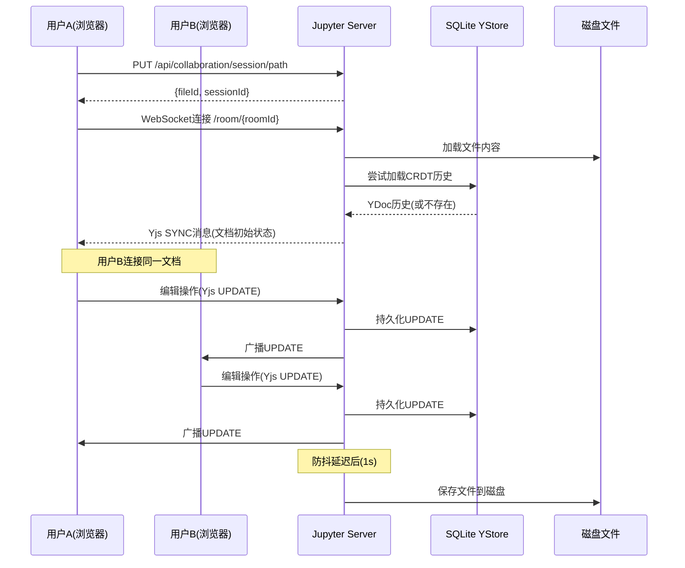

# Jupyter 实时协作简介

## 什么是 Jupyter 实时协作？

Jupyter Real-Time Collaboration（简称 RTC 或 jupyter-collaboration）是 JupyterLab 的官方协作扩展，允许多个用户**同时编辑同一个 Jupyter 文档**（Notebook、文件等），实现类似 Google Docs 的实时协作体验。

版本：**5.0.0**（基于本源码分析）

### 核心能力

| 能力 | 说明 |
|---|---|
| **实时同步编辑** | 多人同时编辑同一文档，更改实时同步到所有客户端 |
| **冲突自动合并** | 基于 CRDT 算法，无需手动解决编辑冲突 |
| **共享光标与选区** | 看到其他用户的光标位置和文本选区 |
| **用户在线状态** | 显示当前谁在查看/编辑文档 |
| **文档持久化** | CRDT 更新历史持久化到 SQLite，支持服务器重启恢复 |
| **文档分叉（Fork）** | 支持创建文档分支实验，可选择合并回主文档 |
| **时间线（Timeline）** | 通过时间线滑块浏览文档历史版本，支持Undo/Redo到任意版本 |
| **渐进式加载** | 大Notebook支持流式加载，先显示内容再加载Output |

## 技术基础

jupyter-collaboration 构建在以下核心技术之上：

### CRDT（Conflict-Free Replicated Data Type）

CRDT 是一种特殊的数据结构，其核心特性是：

- **无冲突合并**：多个副本独立修改后，可以自动合并成一致的状态
- **无需中央锁**：不需要中央服务器协调编辑顺序
- **最终一致性**：无论更新顺序如何，所有副本最终收敛到相同状态
- **离线支持**：客户端可以离线编辑，重新连接后自动合并

### Yjs / pycrdt

jupyter-collaboration 使用：
- **前端**：[Yjs](https://github.com/yjs/yjs) — JavaScript 的高性能 CRDT 实现
- **后端**：[pycrdt](https://github.com/jupyter-server/pycrdt) — Python 的 CRDT 实现（Yrs的Python绑定）

两者共享相同的二进制更新格式，实现跨语言同步。

### WebSocket 通信

前端和后端通过 WebSocket 长连接进行实时双向通信，传输：
- Yjs CRDT 同步消息（SYNC）
- Awareness 状态更新（用户信息、光标位置）
- 自定义控制消息（save、conflict 等）

## 包结构

jupyter-collaboration 采用 monorepo 结构，包含多个 Python 包和 npm 包：

```
jupyter-collaboration/
├── projects/                          # Python 后端包
│   ├── jupyter-server-ydoc/           # 核心后端：WebSocket服务器、房间管理、持久化
│   ├── jupyter-collaboration/         # 元包，依赖所有组件
│   ├── jupyter-collaboration-ui/      # UI扩展Python包（安装前端扩展）
│   └── jupyter-docprovider/           # 文档提供者Python包
├── packages/                          # TypeScript 前端包
│   ├── docprovider/                   # @jupyter/docprovider - WebSocket提供者、Fork管理
│   ├── docprovider-extension/         # @jupyter/docprovider-extension - JupyterLab集成
│   ├── collaboration/                 # @jupyter/collaboration - 协作者面板、用户UI
│   ├── collaboration-extension/       # @jupyter/collaboration-extension - 扩展入口
│   └── collaborative-drive/           # @jupyter/collaborative-drive - 协作内容驱动
└── tests/                             # Python后端集成测试
```

## 安装与启用

### 安装

```bash
pip install jupyter-collaboration
```

安装后，JupyterLab 启动时会自动加载协作扩展。

### 验证启用

启动 JupyterLab 后，在浏览器中打开：
- 右上角会显示用户头像/名称
- 右上角共享按钮可生成共享链接
- 打开的Notebook右上角显示当前协作者数量

### 禁用RTC

如果需要禁用实时协作：

```python
# jupyter_server_config.py
c.YDocExtension.disable_rtc = True
```

或通过命令行：
```bash
jupyter lab --YDocExtension.disable_rtc=True
```

## 工作原理概述

当用户打开一个Notebook时：

1. **会话建立**：前端通过 REST API 请求文档会话，获取 fileId 和 sessionId
2. **WebSocket连接**：前端连接到 `ws://server/api/collaboration/room/{format}:{type}:{fileId}`
3. **房间初始化**：后端创建/获取 DocumentRoom，从磁盘或SQLite加载文档内容
4. **CRDT同步**：Yjs协议交换状态向量，同步文档状态
5. **实时编辑**：用户的编辑操作通过CRDT更新广播到所有客户端
6. **自动保存**：后端防抖延迟后将CRDT状态写回磁盘文件
7. **Awareness同步**：用户身份、光标位置通过Awareness协议实时共享



## 适用场景

- **教学场景**：教师和学生共同编辑Notebook
- **团队协作**：数据科学团队共同分析数据
- **代码审查**：实时协作审查Notebook代码
- **Pair Programming**：远程配对编程
- **会议演示**：多人在会议中实时编辑和讨论

## 下一步

- [整体架构概览](01-architecture-overview.md) — 深入了解前后端架构和组件关系
- [启用和配置 jupyter-collaboration](../examples/01-setup-config.md) — 快速开始指南
- [WebSocket通信协议](05-websocket-protocol.md) — 了解底层消息协议
