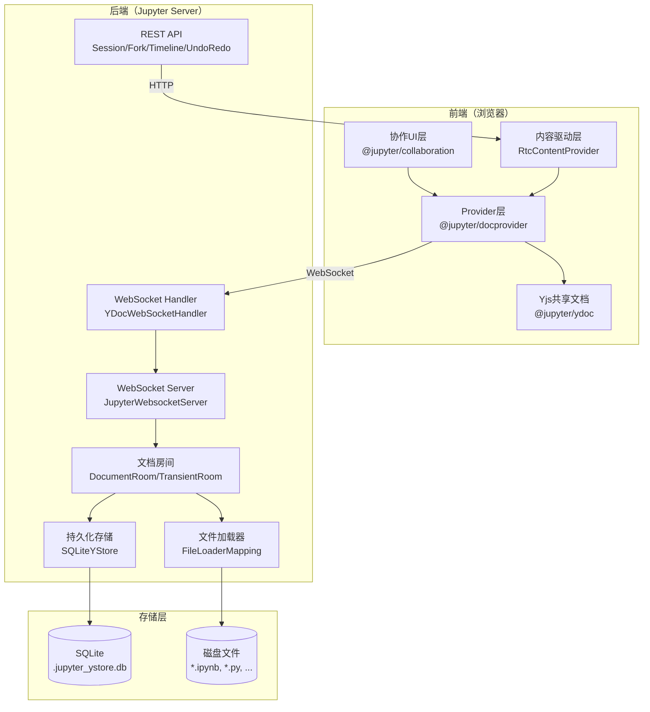
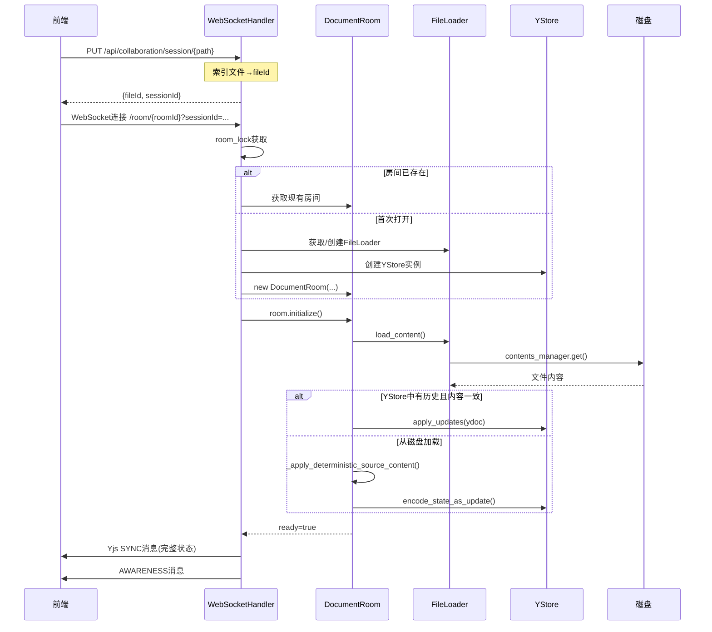
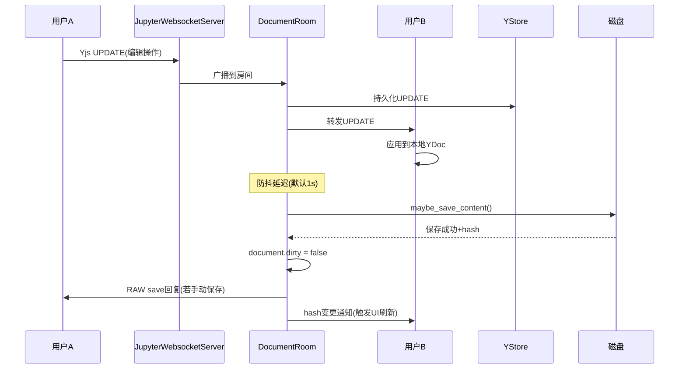
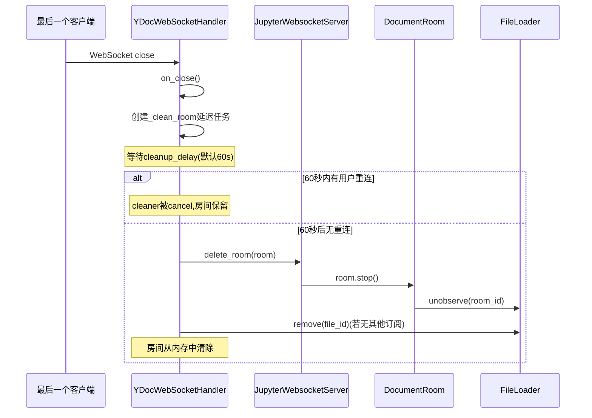

# 整体架构概览

## 架构分层

jupyter-collaboration 采用经典的客户端-服务器架构，分为四个核心层次：



---

## 后端核心组件

### 1. YDocExtension（扩展入口）

**源码**：[app.py](../references/app-source.md)

Jupyter Server ExtensionApp，负责：
- 注册HTTP/WebSocket路由
- 初始化JupyterWebsocketServer单例
- 管理FileLoaderMapping
- 注册Jupyter Events事件schema
- 提供Traitlets配置项

### 2. JupyterWebsocketServer（WebSocket服务器）

**源码**：[websocketserver.py](../references/websocketserver-source.md)

管理所有活跃的YRoom实例：
- 房间的创建、获取、删除
- 消息广播（将一个客户端的更新转发给同房间所有其他客户端）
- 监控任务（每分钟统计补丁数和连接用户数）
- 异常捕获保护（单客户端错误不影响整体服务）

### 3. DocumentRoom（文档房间）

**源码**：[rooms.py](../references/rooms-source.md)

每个被协作编辑的文档对应一个DocumentRoom：
- 持有pycrdt Doc实例（CRDT文档状态）
- 持有Awareness实例（用户状态）
- 管理文档生命周期（初始化、同步、保存、清理）
- 监听CRDT变更触发自动保存
- 处理外带文件变更（磁盘文件被外部修改）
- 冲突检测与通知

### 4. TransientRoom（临时房间）

用于非持久化的共享状态，最重要的是 `JupyterLab:globalAwareness` 房间：
- 跨文档的全局用户在线状态
- 不关联文件、不持久化

### 5. FileLoader / FileLoaderMapping（文件加载器）

**源码**：[loaders.py](../references/loaders-source.md)

封装文件I/O操作：
- 从ContentsManager加载/保存文件内容
- 轮询检测外带文件变更
- 管理多房间订阅关系
- 换行符标准化（CRLF→LF）
- 异步锁保护并发读写

### 6. YStore（持久化存储）

**源码**：[stores.py](../references/stores-source.md)

CRDT更新历史的持久化层：
- 默认使用SQLiteYStore（`.jupyter_ystore.db`）
- 房间初始化时优先从YStore恢复（保留历史）
- 每次CRDT更新自动追加到存储
- 支持历史重放（时间线功能）

### 7. HTTP Handlers（REST处理器）

**源码**：[handlers.py](../references/handlers-source.md)

| Handler | 路由 | 职责 |
|---|---|---|
| `YDocWebSocketHandler` | `/api/collaboration/room/*` | WebSocket主通道（CRDT+Awareness） |
| `DocSessionHandler` | `/api/collaboration/session/*` | 创建/获取文档会话 |
| `DocForkHandler` | `/api/collaboration/fork/*` | Fork创建/删除/合并/查询 |
| `TimelineHandler` | `/api/collaboration/timeline/*` | 时间线版本查询 |
| `UndoRedoHandler` | `/api/collaboration/undoredo/*` | Fork上的撤销/重做/恢复 |

---

## 前端核心组件

### 1. @jupyter/ydoc（共享文档模型）

底层Yjs文档封装：
- `YNotebook`、`YFile`等具体文档类型
- 提供 `YDocument` 抽象基类
- 持有Awareness实例
- 将Yjs CRDT操作映射为Jupyter熟悉的文档变更事件

### 2. @jupyter/docprovider（文档提供者）

**源码**：[yprovider.ts](../references/yprovider-source.md)

连接前端YDoc和后端WebSocket的桥梁：
- `WebSocketProvider`：封装y-websocket，添加会话管理、冲突处理、手动保存
- `WebSocketAwarenessProvider`：全局Awareness同步
- `ForkManager`：Fork的创建、删除、事件管理
- `RtcContentProvider`：实现IContentProvider接口，拦截文件get/save操作

### 3. @jupyter/collaboration（协作UI）

用户界面组件：
- 协作者面板（CollaboratorsPanel）
- 用户信息面板（UserInfoPanel）
- 共享链接对话框（SharedLinkDialog）
- 共享光标渲染（Collaborator Cursors）
- 用户菜单集成

### 4. @jupyter/collaboration-extension（扩展入口）

JupyterLab扩展的注册入口：
- 注册Plugin到JupyterLab
- 绑定Token和工厂类
- 注册命令、菜单项、侧边栏面板

---

## 房间ID编码

文档房间使用 `:` 分隔的三段式编码：

```
{format}:{file_type}:{file_id}
```

- **format**：文件格式（`"text"` 或 `"base64"`）
- **file_type**：内容类型（`"notebook"`、`"file"` 等）
- **file_id**：由FileIdManager生成的唯一文件ID

示例：`text:notebook:abc123-def456`

**编码/解码函数**（定义于 `utils.py`，被handlers.py和rooms.py使用）：
```python
def encode_file_path(format, file_type, file_id) -> str:
    return f"{format}:{file_type}:{file_id}"

def decode_file_path(path) -> tuple[str, str, str]:
    return path.split(":", 2)
```

---

## 数据流详解

### 文档打开流程



### 编辑同步流程



### 最后一个用户离开



---

## 关键设计决策

### 1. 服务端权威状态

与纯P2P方案不同，jupyter-collaboration采用**服务器作为CRDT权威状态持有者**：
- 所有客户端通过WebSocket连接到服务器
- 服务器持有YDoc的完整状态
- 客户端之间的消息经过服务器转发
- 优势：支持离线重启恢复、简化权限控制、支持持久化

### 2. 首次客户端初始化

DocumentRoom使用**lazy initialization**模式：
- 房间对象在第一个WebSocket连接时创建
- 第一个客户端的prepare()调用触发initialize()
- 通过`_update_lock`和`ready`标志确保仅初始化一次
- 后续客户端等待ready后直接开始同步

### 3. YStore优先加载

房间初始化时优先从YStore加载CRDT历史：
- 保持完整的编辑历史（支持时间线/Undo）
- 如果YStore与磁盘不一致，以磁盘为准重新初始化
- 从磁盘加载时使用固定`client_id=0`保证历史确定性

### 4. 自动保存防抖

- 每次文档变更触发保存任务，但通过`save_delay`（默认1s）防抖
- 新变更会取消旧的保存任务
- 至少一个客户端开启autosave才启用自动保存（协商机制）
- 保存使用`asyncio.shield`防止任务取消导致文件损坏

### 5. 外带变更检测

通过FileLoader的轮询机制（默认1s间隔）检测：
- 非协作渠道的文件修改（如git pull、手动编辑）
- 文件重命名（路径变化）
- 检测到外带变更后覆盖房间内容并通知客户端

### 6. 异常隔离

- WebSocketServer使用exception_handler捕获异常，不终止服务
- DocumentRoom有冲突处理机制（block parent错误→发送conflict通知）
- FileLoader轮询有错误抑制和停止机制
- 单个客户端的错误不会影响其他用户

---

## 与JupyterLab的集成点

1. **IContentProvider**：RtcContentProvider替换默认的REST内容提供者
2. **ISharedModelFactory**：SharedModelFactory创建支持协作的共享文档模型
3. **Token注入**：IDocumentProviderFactory、IForkManagerToken等通过Lumino DI注入
4. **PageConfig**：后端通过`page_config_data`注入`disableRTC`、`serverSideExecution`等配置
5. **Events系统**：通过Jupyter Events发射session/awareness/fork事件供扩展监听

## 下一步

- [YDocExtension后端扩展配置](02-ydoc-extension.md) — 了解后端配置项
- [文档房间管理](03-document-room.md) — 深入DocumentRoom
- [CRDT持久化存储](04-ystore-persistence.md) — 了解YStore机制
