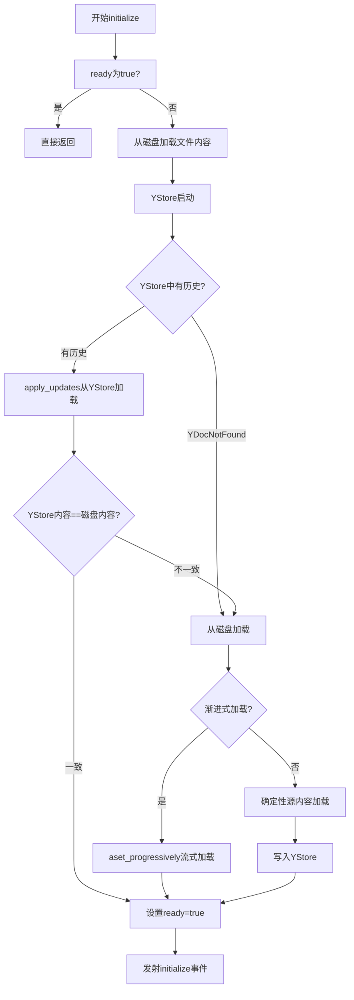

# 文档房间管理

## 什么是 DocumentRoom？

`DocumentRoom` 是 jupyter-collaboration 后端最核心的状态容器。每个被协作编辑的文档（Notebook、Python文件、Markdown文件等）在服务器内存中对应一个 `DocumentRoom` 实例。

DocumentRoom 继承自 `pycrdt.websocket.YRoom`，在其基础上增加了：
- 与磁盘文件的双向同步
- CRDT更新的持久化
- 自动保存机制
- 外带变更检测
- 冲突检测与通知
- 渐进式加载

```python
class DocumentRoom(YRoom):
    """A Y room for a possibly stored document (e.g. a notebook)."""
```

## 房间的生命周期

### 1. 房间创建

房间在第一个客户端WebSocket连接的 `prepare()` 阶段**懒创建**：

```python
# YDocWebSocketHandler.prepare()
if not self._websocket_server.room_exists(self._room_id):
    file = self._file_loaders[file_id]
    ystore = self._ystore_class(path=updates_file_path, log=self.log)
    self.room = DocumentRoom(
        self._room_id,
        file_format,
        file_type,
        file,
        self.event_logger,
        ystore,
        self.log,
        exception_handler=exception_logger,
        save_delay=self._document_save_delay,
        document_load_progressively=self._document_load_progressively,
        notebook_output_delay_threshold_mb=...,
    )
    self._websocket_server.add_room(self._room_id, self.room)
```

关键要点：
- 使用房间锁 `_room_lock(room_id)` 防止并发创建
- 每个房间关联一个FileLoader和一个YStore实例
- YStore路径格式：`.{file_type}:{file_id}.y`

### 2. 房间初始化（initialize）

`initialize()` 在WebSocket `open()` 阶段调用，使用 `_update_lock` 保证线程安全（只有第一个客户端执行）：



#### 确定性源内容加载（关键设计）

当从磁盘初始化文档时，使用特殊方法保证Yjs历史的确定性：

```python
async def _apply_deterministic_source_content(self, content, ...):
    source_ydoc = Doc(client_id=0)  # 固定client_id=0
    source_document = YDOCS.get(self._file_type, YFILE)(source_ydoc)
    await source_document.aset(content)
    self.ydoc.apply_update(source_ydoc.get_update())
```

**为什么固定 `client_id=0`？**

Yjs为每个客户端分配唯一的client_id来标识更新来源。当服务器从磁盘重建文档时，如果使用随机client_id，每次重启会产生不同的更新历史。这会导致：
- 重新连接的客户端因历史分歧（"block parent"错误）无法同步
- 内容重复或丢失

使用固定的 `client_id=0`，相同的源文件总是产生相同的Yjs更新序列，确保幂等性。

> 参考：https://discuss.yjs.dev/t/initial-offline-value-of-a-shared-document/465

### 3. 运行阶段

初始化完成后设置 `self.ready = True`，此时：
- pycrdt的YRoom开始监听ydoc变更并广播给所有客户端
- DocumentRoom的 `_on_document_change` 监听文档变更触发自动保存
- FileLoader的轮询任务检测外带变更
- 客户端之间通过服务器实时转发CRDT更新

### 4. 客户端离开与房间清理

当客户端关闭WebSocket连接时（`on_close`）：

```python
def on_close(self):
    self._message_queue.put_nowait(b"")  # 终止消息迭代
    if isinstance(self.room, DocumentRoom) and self.room.clients == {self}:
        # 是最后一个客户端，调度延迟清理
        self.room.cleaner = asyncio.create_task(self._clean_room())
    self._emit_awareness_event(..., "leave")
```

延迟清理任务 `_clean_room`：

```python
async def _clean_room(self):
    await asyncio.sleep(self._cleanup_delay)  # 默认60秒
    async with self._room_lock(self._room_id):
        await self._websocket_server.delete_room(room=self.room)
        del self.room
        # 如果文件加载器无其他订阅，也清理
        if file.number_of_subscriptions == 0:
            await self._file_loaders.remove(file_id)
        del self._room_locks[self._room_id]
```

**为什么延迟清理？**
- 网络波动可能导致WebSocket短暂断开后立即重连
- 用户在文档间快速切换时避免重复初始化
- 60秒内重连可以复用内存中的YDoc状态，快速同步

**取消清理**：如果在等待期间有新客户端连接，`open()` 会cancel cleaner任务：

```python
if self.room.cleaner is not None:
    self.room.cleaner.cancel()
```

### 5. 房间停止

`room.stop()` 在清理时调用：
```python
async def stop(self):
    await super().stop()  # 停止YRoom的广播循环
    if self._saving_document:
        self._saving_document.cancel()
    self._document.unobserve()      # 取消文档变更监听
    self._file.unobserve(self.room_id)  # 取消文件订阅
```

## 自动保存机制

### 触发条件

文档变更时（`_on_document_change`）：

```python
def _on_document_change(self, target, event):
    # 收集所有客户端的autosave状态
    autosave_states = [
        state.get("autosave", True)
        for state in self.awareness.states.values() if state
    ]
    if not autosave_states:
        autosave_states = [True]
    
    autosave = any(autosave_states)  # 任一客户端启用即保存
    if not autosave:
        return
    if self._update_lock.locked():  # 正在初始化/处理外带变更
        return
    
    # 创建防抖保存任务
    self._saving_document = asyncio.create_task(
        self._maybe_save_document(self._saving_document)
    )
```

### 防抖保存逻辑

```python
async def _maybe_save_document(self, saving_document, save_now=False):
    # 取消之前的保存任务
    if saving_document and not saving_document.done():
        saving_document.cancel()
    
    try:
        # 防抖等待
        if not save_now and self._save_delay:
            await asyncio.sleep(self._save_delay)
        
        # 执行保存
        saved_model = await self._file.maybe_save_content({
            "format": self._file_format,
            "type": self._file_type,
            "content": await self._document.aget(),
        })
        if saved_model:
            async with self._update_lock:
                self._document.dirty = False
                self._document.hash = saved_model["hash"]
    except asyncio.CancelledError:
        return  # 被新变更取消，正常
    except OutOfBandChanges:
        # 外带变更，重新加载
        ...
    except Exception:
        # 记录错误
        ...
```

### 手动保存

当客户端通过RAW消息发送 `save` 请求时，调用 `_save_to_disc()`：

```python
def _save_to_disc(self):
    if self._update_lock.locked():
        return
    self._saving_document = asyncio.create_task(
        self._maybe_save_document(self._saving_document, save_now=True)
    )
    return self._saving_document
```

`save_now=True` 跳过敏感等待，立即保存。前端 `provider.save()` 方法使用此通道。

### Autosave协商机制

autosave不是全局开关，而是通过Awareness协议**逐客户端协商**：
- 每个客户端在awareness中设置 `autosave: true/false`
- 服务器收集所有客户端的autosave状态
- **只要有一个客户端启用autosave**，就执行自动保存
- 所有客户端都关闭autosave时，仅响应手动保存

这确保了即使用户关闭了自己的autosave偏好，其他用户的自动保存仍然生效。

## 外带变更处理

外带变更（Out-of-Band Changes）指协作渠道之外对文件的修改，如：
- 用户在编辑器中直接编辑文件
- git pull 更新了文件
- 其他进程写入文件

### 检测机制

FileLoader通过轮询（默认1秒间隔）检测文件last_modified变化：

```python
async def _watch_file(self):
    while True:
        await asyncio.sleep(self._poll_interval)
        await self.maybe_notify()  # 比较last_modified
```

### 处理流程

当FileLoader检测到变更时，回调DocumentRoom的 `_on_outofband_change`：

```python
async def _on_outofband_change(self):
    model = await self._file.load_content(self._file_format, self._file_type)
    async with self._update_lock:
        if await self._document.aget() != model["content"]:
            await self._document.aset(model["content"])  # 覆盖房间内容
        self._document.dirty = False
```

覆盖房间内容会产生Yjs更新，自动广播给所有连接的客户端。

### 保存时的外带变更

在 `_maybe_save_document` 中，如果FileLoader的 `maybe_save_content` 抛出 `OutOfBandChanges`：

1. 重新加载文件内容
2. 用磁盘内容覆盖房间中的CRDT文档
3. 客户端收到更新后同步到最新磁盘状态
4. 这可能导致用户的未保存更改被覆盖（但配合冲突检测和conflict对话框，用户有机会另存为）

## 冲突处理

### Block Parent 冲突

当客户端尝试发送基于过时状态的更新时，pycrdt会抛出 "block parent" RuntimeError。这通常发生在：
- 服务器重启后房间从磁盘重建，Yjs历史与客户端不同
- 房间被清理后重新创建，但客户端仍持有旧的sessionId
- 网络分区期间客户端和服务器状态分叉

### 冲突检测与通知

DocumentRoom通过 `on_message_error` 处理器拦截这类错误：

```python
async def _handle_sync_message_error(self, exc, message, channel):
    if not message or message[0] != MessageType.SYNC:
        return False
    if not (isinstance(exc, RuntimeError) and "block parent" in str(exc)):
        return False
    
    # 向出错的客户端发送conflict通知
    encoder = Encoder()
    encoder.write_var_uint(MessageType.RAW)
    encoder.write_var_string(json.dumps({"type": "conflict"}))
    await channel.send(encoder.to_bytes())
    return True  # 错误已处理，继续为其他客户端服务
```

返回 `True` 表示错误已被处理，防止WebSocket服务器的serve循环崩溃。

### 前端冲突解决

前端收到 `{"type": "conflict"}` RAW消息后：
1. 显示冲突对话框
2. 提供三个选项：
   - **Save As**（另存为）：保存本地内容到新文件
   - **Revert**（还原）：丢弃本地更改，重新从服务器加载
   - **Show Diff**（显示差异）：对比本地和服务器版本

## 文件路径变更

当文件被重命名时，FileLoader通过 `filepath_callback` 通知DocumentRoom：

```python
def _on_filepath_change(self):
    self._document.path = self._file.path
```

这会更新共享文档的path属性，通过Yjs同步给所有客户端。前端RtcContentProvider监听path变化，更新provider的key和全局Awareness中的文档列表。

## 事件发射

DocumentRoom在关键操作时通过Jupyter Events发射事件：

| action | 触发时机 |
|---|---|
| `load` | 从YStore或磁盘加载内容 |
| `initialize` | 房间初始化完成 |
| `save` | 内容保存到磁盘 |
| `overwrite` | 外带变更覆盖内容 |
| `clean` | 房间清理 |

事件数据包含：
```json
{
  "level": "INFO",
  "room": "text:notebook:abc123",
  "path": "/path/to/notebook.ipynb",
  "action": "save",
  "msg": "Content saved."
}
```

## TransientRoom

```python
class TransientRoom(YRoom):
    """A Y room for sharing state (e.g. awareness)."""
```

TransientRoom是轻量级房间，用于非持久化状态共享：
- 不关联FileLoader
- 不持久化到YStore
- 不自动保存
- 没有初始化流程

最典型的用途是 `JupyterLab:globalAwareness` 房间，用于跨文档的全局用户在线状态。在 `YDocWebSocketHandler.prepare()` 中对这个房间做了特殊处理，监听awareness变化维护connected_users字典。

## 关键设计洞察

1. **懒初始化+线程安全**：第一个客户端触发初始化，通过asyncio.Lock保证单实例初始化
2. **确定性历史重建**：固定client_id=0确保磁盘→CRDT转换的幂等性
3. **防抖自动保存**：1秒防抖减少磁盘I/O，同时保证数据不会太久未持久化
4. **协商式autosave**：通过Awareness收集所有客户端偏好，一个开启即保存
5. **优雅冲突处理**：检测到冲突时通知用户选择解决方案，而非自动选择导致数据丢失
6. **延迟清理**：60秒窗口容忍网络波动，重连无需重新初始化
7. **异常隔离**：单个客户端的同步错误不会终止整个房间或服务器
8. **三层锁保护**：_room_locks（房间创建/清理）+ _update_lock（文档读写）+ FileLoader._lock（文件I/O）

## 相关概念

- [整体架构概览](01-architecture-overview.md)
- [YDocExtension后端扩展配置](02-ydoc-extension.md)
- [CRDT持久化存储](04-ystore-persistence.md)
- [文件加载与变更监听](07-file-loading.md)
- [WebSocket通信协议](05-websocket-protocol.md)
- [用户感知Awareness协议](06-awareness-protocol.md)
