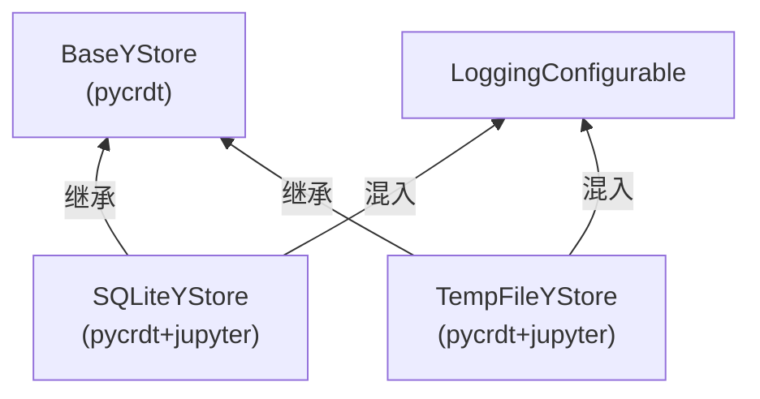
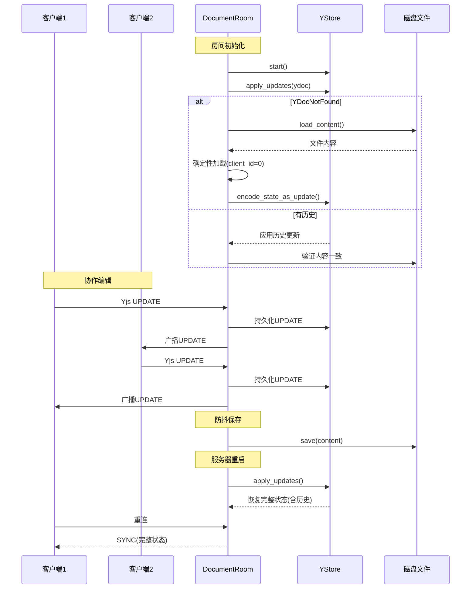

# CRDT 持久化存储

## 为什么需要持久化CRDT更新？

在纯内存CRDT方案中，文档状态仅存在于服务器内存中：
- 服务器重启 → 所有文档状态丢失 → 所有客户端被迫重载
- 房间清理后重连 → 从磁盘重建文档，但丢失编辑历史
- 无法实现时间线/Undo/Redo功能

YStore通过将CRDT更新持久化到磁盘，解决了这些问题。

## YStore 架构

YStore是pycrdt定义的抽象存储接口，jupyter-collaboration提供两个实现：



jupyter-collaboration的YStore类通过多继承混入 `LoggingConfigurable`，使其支持Jupyter的Traitlets配置系统。

### 多重继承与元类

由于 `LoggingConfigurable` 有自定义元类（`MetaHasTraits`），而pycrdt的YStore类也可能有元类，直接多重继承会导致metaclass conflict。解决方案是创建组合元类：

```python
class SQLiteYStoreMetaclass(type(LoggingConfigurable), type(_SQLiteYStore)):
    pass

class SQLiteYStore(LoggingConfigurable, _SQLiteYStore, metaclass=SQLiteYStoreMetaclass):
    db_path = Unicode(".jupyter_ystore.db", config=True)
    squash_after_inactivity_of = Int(None, allow_none=True, config=True)
    document_ttl = Int(None, allow_none=True, config=True)  # 废弃
```

## SQLiteYStore 详解

### 配置项

| 配置项 | 类型 | 默认值 | 说明 |
|---|---|---|---|
| `db_path` | Unicode | `".jupyter_ystore.db"` | SQLite数据库文件路径 |
| `squash_after_inactivity_of` | Int | `None` | 文档不活跃多久后压缩历史（秒），None=不压缩 |
| `document_ttl` | Int | `None` | **已废弃**，使用 `squash_after_inactivity_of` |

### 数据库文件位置

每个DocumentRoom创建YStore时传入独立的path参数：

```python
updates_file_path = f".{file_type}:{file_id}.y"
ystore = self._ystore_class(path=updates_file_path, log=self.log)
```

但实际上SQLiteYStore的数据库位置由 `db_path` Traitlet控制，默认为当前工作目录下的 `.jupyter_ystore.db`。传入的 `path` 参数作为文档标识。

### 工作原理

SQLiteYStore在SQLite数据库中存储CRDT更新记录：

1. **追加写入**：每次CRDT更新作为一条记录插入数据库（append-only）
2. **启动/连接时重放**：通过 `apply_updates(ydoc)` 从数据库读取所有更新并应用到YDoc
3. **状态快照**：`encode_state_as_update(ydoc)` 将完整文档状态编码为更新写入
4. **历史迭代**：`read()` 方法异步迭代所有 `(update, timestamp)` 对，供时间线功能使用

### 房间初始化中的YStore使用

```python
async def initialize(self):
    model = await self._file.load_content(...)
    
    if self.ystore is not None:
        async with self.ystore.start_lock:
            if not self.ystore.started.is_set():
                self.create_task(self.ystore.start())
                await self.ystore.started.wait()
        try:
            await self.ystore.apply_updates(self.ydoc)
            read_from_source = False
        except YDocNotFound:
            pass  # YStore中无此文档，从磁盘加载
    
    if not read_from_source:
        # 验证YStore内容是否与磁盘一致
        if await self._document.aget() != model["content"]:
            read_from_source = True  # 不一致，从磁盘重新加载
    
    if read_from_source:
        # 从磁盘加载...
        if self.ystore:
            await self.ystore.encode_state_as_update(self.ydoc)
```

关键要点：
- YStore使用 `start_lock` 和 `started` 事件确保只启动一次
- `YDocNotFound` 异常表示这是新文档，YStore中没有历史
- YStore优先加载，但内容与磁盘不一致时回退到磁盘
- 从磁盘加载后，将完整状态编码写入YStore，建立持久化基线

### 历史压缩（Squash）

`squash_after_inactivity_of` 配置控制历史压缩：
- 当文档一段时间没有更新后，将所有历史更新压缩为单一状态快照
- 减少数据库大小，加快重放速度
- 代价是丢失细粒度的编辑历史（时间线功能可能受限）

## TempFileYStore

```python
class TempFileYStore(LoggingConfigurable, _TempFileYStore, metaclass=TempFileYStoreMetaclass):
    prefix_dir = "jupyter_ystore_"
```

使用临时文件存储CRDT更新：
- 临时文件在系统临时目录下，前缀为 `jupyter_ystore_`
- 服务重启后临时文件被清理，所有协作历史丢失
- 适用于测试、演示等不需要持久化的场景
- 仍然提供CRDT同步能力（同一会话内的多用户协作）

## YStore 在协作流程中的角色



## YStore 与时间线功能

YStore的 `read()` 方法支持按时间顺序迭代所有更新，这是时间线滑块（Timeline Slider）功能的基础：

```python
# TimelineHandler.get()
ystore = room.ystore
updates_and_timestamps = [(item[0], item[-1]) async for item in ystore.read()]

fork_ydoc = Doc()
undo_manager = FORK_DOCUMENTS[idx].undo_manager

for update, timestamp in updates_and_timestamps:
    undo_stack_len = len(undo_manager.undo_stack)
    fork_ydoc.apply_update(update)
    if len(undo_manager.undo_stack) > undo_stack_len:
        result_timestamps.append(timestamp)
```

工作原理：
1. 创建一个独立的fork YDoc
2. 按时间顺序逐个apply YStore中的更新
3. 每次UndoManager栈增长（表示有新的用户操作）时记录时间戳
4. 返回时间戳列表给前端渲染时间线滑块
5. 用户在滑块上选择时间点时，通过Undo/Redo导航到对应版本

## 配置绑定机制

在YDocExtension初始化时，YStore类通过 `functools.partial` 绑定Jupyter配置：

```python
ystore_class: type[BaseYStore] = partial(self.ystore_class, config=self.config)
```

这是因为：
- YStore实例在Handler中按需创建（每个房间一个）
- 创建时只能传递 `path` 和 `log` 参数
- Traitlets配置需要通过 `config` 对象传递
- partial预设config参数后，Handler可以正常实例化

## 自定义YStore实现

### BaseYStore 接口

要实现自定义YStore，需要继承 `pycrdt.store.BaseYStore` 并实现以下异步方法：

| 方法 | 说明 |
|---|---|
| `start()` | 启动存储（打开连接、初始化表结构等） |
| `apply_updates(ydoc: Doc)` | 读取所有持久化更新并应用到YDoc |
| `encode_state_as_update(ydoc: Doc)` | 将YDoc的完整状态编码并持久化 |
| `read() -> AsyncIterator[tuple[bytes, ...]]` | 异步迭代历史更新和元数据 |
| `write(update: bytes)` | 写入单个更新（由基类在内部调用） |

### Redis YStore 示例

```python
import json
import redis.asyncio as redis
from pycrdt.store import BaseYStore
from traitlets import Unicode
from traitlets.config import LoggingConfigurable

class RedisYStoreMetaclass(type(LoggingConfigurable), type(BaseYStore)):
    pass

class RedisYStore(LoggingConfigurable, BaseYStore, metaclass=RedisYStoreMetaclass):
    """使用Redis存储CRDT更新"""
    
    redis_url = Unicode("redis://localhost:6379", config=True)
    
    def __init__(self, path, log=None, config=None):
        super().__init__(config=config)
        self._path = path
        self._log = log
        self._redis = None
        self.started = asyncio.Event()
        self.start_lock = asyncio.Lock()
    
    async def start(self):
        async with self.start_lock:
            if self.started.is_set():
                return
            self._redis = await redis.from_url(self.redis_url)
            self.started.set()
    
    async def apply_updates(self, ydoc):
        await self.started.wait()
        updates = await self._redis.lrange(f"ystore:{self._path}:updates", 0, -1)
        if not updates:
            from pycrdt.store import YDocNotFound
            raise YDocNotFound
        for update_data in updates:
            update = json.loads(update_data)["update"]
            ydoc.apply_update(bytes.fromhex(update))
    
    async def write(self, update: bytes):
        await self.started.wait()
        import time
        entry = json.dumps({
            "update": update.hex(),
            "timestamp": time.time()
        })
        await self._redis.rpush(f"ystore:{self._path}:updates", entry)
    
    async def read(self):
        await self.started.wait()
        updates = await self._redis.lrange(f"ystore:{self._path}:updates", 0, -1)
        for update_data in updates:
            entry = json.loads(update_data)
            yield (bytes.fromhex(entry["update"]),), {"timestamp": entry["timestamp"]}
```

### 配置使用自定义YStore

```python
# jupyter_server_config.py
c.YDocExtension.ystore_class = RedisYStore
c.RedisYStore.redis_url = "redis://my-redis-server:6379/0"
```

## 性能考虑

### SQLite 优势

- **嵌入式数据库**：无需独立服务，零运维
- **单文件**：易于备份和迁移
- **ACID事务**：保证更新写入的原子性
- **跨平台**：在任何Jupyter支持的平台上工作

### 存储增长

YStore以append-only方式存储更新，数据库会随时间增长：
- 频繁编辑的文档数据库文件会变大
- `squash_after_inactivity_of` 可以压缩历史
- 定期备份后可以清理旧数据库文件

### 并发访问

SQLite支持多读者单写者模式：
- 多个房间可以同时读取不同文档的更新
- 写入是串行的（SQLite写锁）
- 对于Jupyter协作场景（单服务器实例）通常足够

## 关键设计洞察

1. **Append-only日志**：CRDT更新以追加方式写入，类似事件溯源（Event Sourcing）
2. **YStore优先、磁盘兜底**：初始化时优先从CRDT历史恢复，不一致时回退磁盘
3. **配置和实例分离**：YStore类通过partial绑定config，在Handler中按需创建实例
4. **元类组合模式**：解决多继承的metaclass conflict问题
5. **历史重放能力**：持久化的更新不仅用于恢复，还支持时间线浏览和版本导航
6. **抽象接口可扩展**：BaseYStore接口支持多种存储后端（SQLite/Redis/文件等）

## 相关概念

- [文档房间管理](03-document-room.md)
- [YDocExtension后端扩展配置](02-ydoc-extension.md)
- [整体架构概览](01-architecture-overview.md)
- [文档分叉与时间线](08-fork-timeline.md)
- [自定义YStore示例](../examples/02-custom-document-type.md)
