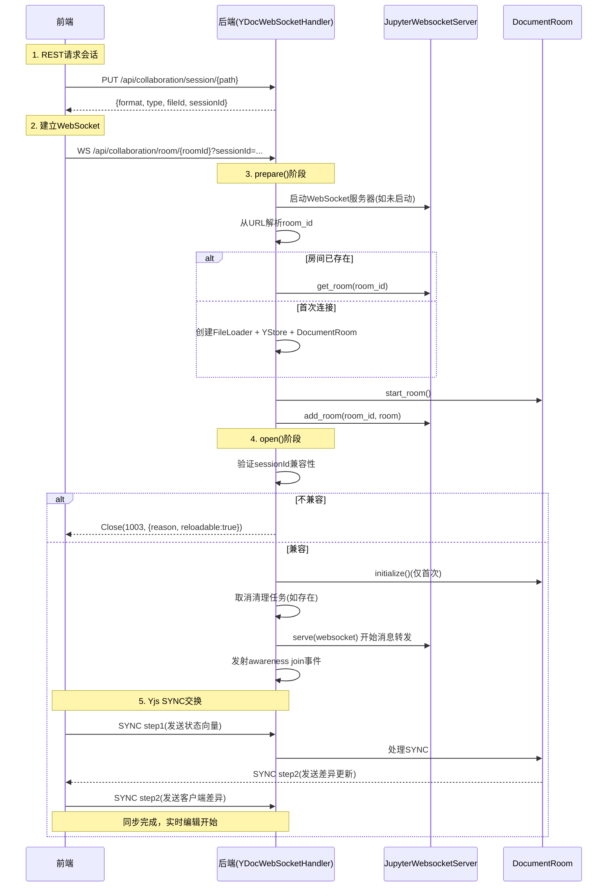

# WebSocket 通信协议

## 协议概述

jupyter-collaboration 的前端和后端通过 **单一WebSocket连接** 进行实时通信，传输Yjs CRDT同步消息、Awareness状态和自定义控制消息。

- **端点**：`ws://{server}/api/collaboration/room/{room_id}?sessionId={session_id}`
- **消息格式**：二进制消息（Uint8Array），使用var_uint变长编码
- **传输层**：标准WebSocket（RFC 6455）
- **最大消息大小**：1GB（`max_message_size = 1024*1024*1024`）

## 消息类型

消息类型由消息体的第一个字节（var_uint编码）标识：

```python
class MessageType(IntEnum):
    SYNC = 0      # Yjs同步消息
    AWARENESS = 1 # Awareness状态更新
    RAW = 2       # 自定义JSON消息（Jupyter扩展）
    CHAT = 125    # 聊天消息（jupyter-chat使用）
```

| 类型 | 值 | 方向 | 说明 |
|---|---|---|---|
| SYNC | 0 | 双向 | Yjs CRDT同步（状态向量、更新、同步步骤） |
| AWARENESS | 1 | 双向 | 用户感知状态（光标位置、用户信息、选区等） |
| RAW | 2 | 双向 | 自定义JSON控制消息（save、conflict等） |
| CHAT | 125 | 双向 | 聊天消息（扩展协议） |

SYNC和AWARENESS是标准的y-websocket协议消息，RAW是jupyter-collaboration扩展的自定义消息类型。

## 连接建立流程



### Tornado WebSocket 适配

pycrdt的 `WebsocketServer` 期望WebSocket对象支持特定的异步迭代器和send接口，但Tornado的WebSocketHandler API不同。`YDocWebSocketHandler` 进行了适配：

```python
# 异步迭代器：从消息队列取出消息
async def __aiter__(self):
    return self

async def __anext__(self):
    message = await self._message_queue.get()
    if not message:
        raise StopAsyncIteration()
    return message

# 异步发送
async def send(self, message: bytes) -> None:
    self.write_message(message, binary=True)

# 异步接收
async def recv(self):
    message = await self._message_queue.get()
    return message

# Tornado回调：消息到达时放入队列
def on_message(self, message):
    decoder = Decoder(message)
    header = decoder.read_var_uint()
    if header == MessageType.RAW:
        self._handle_raw_message(message)  # 处理自定义消息
        return
    self._message_queue.put_nowait(message)
    self._websocket_server.ypatch_nb += 1
```

## SYNC消息（Yjs同步协议）

SYNC消息（type=0）遵循Yjs的同步协议，由y-websocket和pycrdt自动处理：

### 同步三步骤

1. **Sync Step 1**：客户端发送本地状态向量（State Vector）
2. **Sync Step 2**：服务器根据状态向量计算差异更新，发送给客户端
3. **Sync Step 2**：客户端也计算差异更新，发送给服务器

同步完成后，双方进入**增量更新模式**：任何一方的本地CRDT更改都会编码为UPDATE消息发送给对方。

### 编码格式

SYNC消息使用Yjs标准的二进制编码：
```
[var_uint: message_type=0][var_uint: sync_step_type][...sync_data]
```

开发者通常不需要直接构造SYNC消息，Yjs/pycrdt库会自动处理。

## AWARENESS消息（用户感知协议）

AWARENESS消息（type=1）用于传播用户的实时状态信息：

- 用户身份（名称、头像、颜色）
- 光标位置和选区
- 鼠标位置
- 用户状态（在线/离开）
- autosave偏好
- 打开的文档列表

AWARENESS协议由y-protocols定义，使用"last-write-wins"策略，每个客户端定期广播自己的状态。

详见 [用户感知Awareness协议](06-awareness-protocol.md)。

## RAW消息（自定义控制协议）

RAW消息（type=2）是jupyter-collaboration扩展的自定义消息，使用JSON编码。

### 消息编码格式

```
[var_uint: message_type=2][var_string: json_payload]
```

Python编码：
```python
def _encode_json_message(self, message: dict) -> bytes:
    encoder = Encoder()
    encoder.write_var_uint(MessageType.RAW)
    encoder.write_var_string(json.dumps(message))
    return encoder.to_bytes()
```

TypeScript编码：
```typescript
const encoder = encoding.createEncoder();
encoding.writeVarUint(encoder, RAW_MESSAGE_TYPE);
encoding.writeVarString(encoder, JSON.stringify(message));
ws.send(encoding.toUint8Array(encoder));
```

### RAW消息类型

#### 1. save（手动保存请求）

**方向**：客户端→服务器

请求服务器立即保存文档（跳过敏感延迟）：
```json
{"type": "save"}
```

编码时还包含一个var_uint的save_id用于请求-响应匹配：
```
[RAW][var_string:"save"][var_uint:saveId]
```

**响应**（服务器→客户端）：
```json
{"type": "save", "responseTo": 1, "status": "success"}
```

| status | 说明 |
|---|---|
| `"success"` | 保存成功 |
| `"skipped"` | 保存已在进行中，跳过 |
| `"failed"` | 保存失败 |

前端使用PromiseDelegate等待匹配responseTo的回复：
```typescript
async save(): Promise<void> {
  const saveId = ++this._saveCounter;
  const delegate = new PromiseDelegate<void>();
  const handler = (event: MessageEvent) => {
    // 解析消息，查找 responseTo === saveId 的回复
    if (reply.status === 'success') delegate.resolve();
    else delegate.reject(...);
  };
  ws.addEventListener('message', handler);
  // 发送save消息...
  await delegate.promise;
}
```

#### 2. conflict（冲突通知）

**方向**：服务器→客户端

当服务器检测到"block parent"错误（客户端基于过时状态发送更新）时发送：
```json
{"type": "conflict"}
```

前端收到后：
1. 打开冲突解决对话框
2. 提供"另存为"、"还原"、"显示差异"三个选项
3. 用户选择后执行相应操作

## 会话兼容性检查

连接建立时，客户端通过URL查询参数传递 `sessionId`，服务器在 `open()` 中验证：

### sessionId 的作用

- `SERVER_SESSION`：服务器启动时生成的UUID（`str(uuid.uuid4())`），每次重启变化
- 客户端首次连接时从REST API获取当前sessionId
- 重连时携带旧sessionId
- 服务器检查旧sessionId是否兼容

### 兼容性检查逻辑

```python
def check_session_compatibility(root_dir, client_session_id, current_version, ...):
    # 1. 当前会话 → 兼容
    if client_session_id == SERVER_SESSION:
        return False, ""
    
    # 2. sessionId不在历史记录中 → 不兼容(unknown)
    previous_sessions = _load_previous_sessions(root_dir)
    if client_session_id not in previous_sessions:
        return True, "unknown_session"
    
    # 3. 版本号不匹配 → 不兼容(version_mismatch)
    previous = previous_sessions[client_session_id]
    if previous["version"] != current_version:
        return True, "version_mismatch"
    
    # 4. 文档版本不匹配 → 不兼容(version_mismatch)
    if current_document_version and previous.get("document_version") != current_document_version:
        return True, "version_mismatch"
    
    # 5. 全部匹配 → 兼容
    return False, ""
```

### 会话存储

会话信息持久化在 `.jupyter/collaboration_sessions.json`：

```json
{
  "session-uuid-1": {
    "version": "5.0.0",
    "created_at": "2026-04-21T10:00:00+00:00",
    "document_version": null
  }
}
```

- 只保留最近10个会话记录
- 服务器重启时SESSION_SESSION变化，但历史会话仍记录在文件中
- 写入失败时静默回退到 `/dev/null`

### 不兼容时的处理

服务器以WebSocket关闭码1003关闭连接，并在close payload中发送JSON：

```json
{
  "reason": "version_mismatch",
  "sessionId": "old-session-id",
  "reloadable": true
}
```

前端收到后：
- `reloadable: true` → 显示"需要重新加载"对话框，用户确认后刷新页面
- `reloadable: false` → 显示错误信息

## HTTP REST API

除了WebSocket，还有几个REST端点：

### PUT /api/collaboration/session/{path}

创建或获取文档会话。

**请求体**：
```json
{"format": "text", "type": "notebook"}
```

**响应（200/201）**：
```json
{
  "format": "text",
  "type": "notebook",
  "fileId": "abc-def-123",
  "sessionId": "server-session-uuid"
}
```

### GET /api/collaboration/timeline/{path}

获取文档时间线信息。

**查询参数**：`format=...&type=...`

**响应**：
```json
{
  "roomId": "text:notebook:abc123",
  "timestamps": [1713600000, 1713600100, ...],
  "forkRoom": "temp-fork-uuid",
  "sessionId": "server-session-uuid"
}
```

### PUT /api/collaboration/fork/{root_roomid}

创建文档分叉。详见 [文档分叉与时间线](08-fork-timeline.md)。

### DELETE /api/collaboration/fork/{fork_roomid}?merge=true|false

删除分叉（可选合并）。详见 [文档分叉与时间线](08-fork-timeline.md)。

### PUT /api/collaboration/undoredo/{room_id}

在fork上执行撤销/重做/恢复。详见 [文档分叉与时间线](08-fork-timeline.md)。

## 认证与授权

所有端点都使用Jupyter Server的标准认证机制：

### WebSocket认证

```python
@ws_authenticated
@authorized
async def get(self, *args, **kwargs):
    return await super().get(*args, **kwargs)
```

- `@ws_authenticated`：验证WebSocket连接的认证cookie/token
- `@authorized`：验证用户对 `auth_resource = "contents"` 的访问权限

### REST API认证

```python
@web.authenticated
@authorized
async def put(self, path):
    ...
```

使用标准的 `@web.authenticated` 装饰器。

### CORS/Origin

```python
def check_origin(self, origin):
    return True  # 允许所有来源（依赖Jupyter Server的token认证）
```

## 错误码映射

| 场景 | WebSocket关闭码 | Close Payload |
|---|---|---|
| 文件不存在 | 4404 | `"Error initializing: {path}"` |
| 请求错误 | 4400 | `"Error initializing: {path}"` |
| 服务器内部错误 | 4500 | `"Error initializing: {path}"` |
| 会话不兼容/初始化错误 | 1003 | JSON: `{reason, sessionId, reloadable}` |

## 消息处理与转发

JupyterWebsocketServer 的消息转发逻辑（继承自pycrdt）：

```
1. 客户端发送消息到WebSocket
2. YDocWebSocketHandler.on_message()放入队列
3. WebsocketServer.serve()从异步迭代器读取消息
4. 调用YRoom.handle_sync_message()处理SYNC消息
5. YRoom._broadcast_updates()将更新广播给同房间其他客户端
6. 每个客户端的send()方法将消息写入WebSocket
```

### 消息监控

JupyterWebsocketServer启动一个后台监控任务：

```python
async def _monitor(self):
    while True:
        await asyncio.sleep(60)
        clients_nb = sum(len(room.clients) for room in self.rooms.values())
        if self.ypatch_nb:
            self.log.debug("Processed %s Y patches in one minute", self.ypatch_nb)
            self.ypatch_nb = 0
```

每分钟记录一次处理的补丁数和连接用户数，用于性能监控和调试。

## 关键设计洞察

1. **单连接多通道**：一个WebSocket连接承载SYNC、AWARENESS、RAW、CHAT多种消息，通过消息类型字节区分
2. **y-websocket兼容**：SYNC和AWARENESS完全遵循y-websocket协议，可以使用标准Yjs生态工具
3. **会话版本控制**：通过sessionId+版本号防止不兼容的客户端（如服务器升级后）合并脏数据
4. **请求-响应模式**：RAW消息实现了在WebSocket之上的请求-响应模式（save/save回复），使用递增ID匹配
5. **优雅的冲突通知**：不尝试自动解决历史分叉冲突，而是通知用户让其选择
6. **认证委托**：复用Jupyter Server的认证/授权体系，不重复造轮子
7. **消息队列适配**：通过asyncio.Queue桥接Tornado的回调风格和pycrdt的异步迭代器风格

## 相关概念

- [整体架构概览](01-architecture-overview.md)
- [用户感知Awareness协议](06-awareness-protocol.md)
- [文档房间管理](03-document-room.md)
- [前端Provider架构](09-frontend-provider.md)
- [文档分叉与时间线](08-fork-timeline.md)
