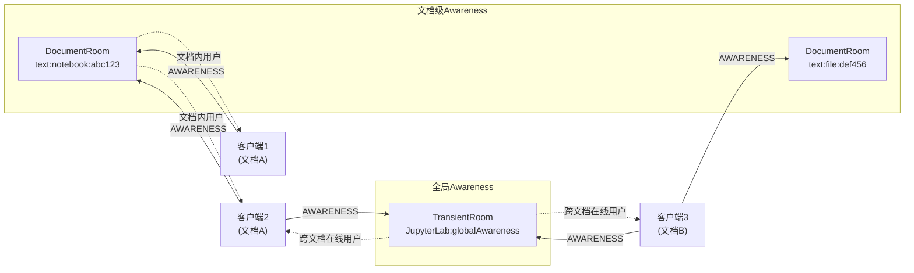

# 用户感知 Awareness 协议

## 什么是 Awareness？

Awareness（感知）是Yjs生态中的一个协议，用于在协作者之间传播**非持久化的实时状态信息**。与CRDT文档内容不同，Awareness状态：

- **不持久化**：用户断开连接后状态自动消失
- **Last-Write-Wins**：使用简单的LWW策略，不需要复杂的冲突合并
- **周期性广播**：客户端定期广播自己的完整状态
- **超时移除**：一定时间未收到更新的客户端状态被标记为离线

Awareness是实现"看到其他用户光标"、"显示在线用户列表"等协作体验的基础。

## Awareness 状态结构

每个客户端在Awareness中有一个唯一的 `clientID`（Yjs分配），其状态是一个JSON对象，可以包含任意字段。jupyter-collaboration使用以下约定字段：

### 用户身份（user）

```json
{
  "user": {
    "name": "张三",
    "display_name": "张三",
    "initials": "ZS",
    "color": "#FF6B6B",
    "avatar_url": "https://...",
    "username": "zhangsan@example.com"
  }
}
```

由 `WebSocketAwarenessProvider._onUserChanged()` 设置：
```typescript
private _onUserChanged(user: User.IManager): void {
  this.awareness.setLocalStateField('user', user.identity);
}
```

### 光标位置（cursor/anchor/head）

由各文档类型的前端扩展设置：
- Notebooks：当前选中的单元格和位置
- 文本编辑器：文本选区的anchor和head位置
- 文件编辑器：光标位置

### Autosave 偏好

```json
{
  "autosave": true
}
```

由 `RtcContentProvider._onCreate()` 设置，并跟随文档管理器的autosave设置变化：

```typescript
sharedModel.awareness.setLocalStateField('autosave', getAutosave());

// 监听autosave设置变化
const handleStateChanged = (_, args) => {
  if (args.name === 'autosave') {
    sharedModel.awareness.setLocalStateField('autosave', getAutosave());
  }
};
```

服务器端收集所有客户端的autosave状态，决定是否执行自动保存：
```python
autosave_states = [
    state.get("autosave", True)
    for state in self.awareness.states.values() if state
]
autosave = any(autosave_states)  # 任一客户端启用即保存
```

### 打开的文档列表（documents）

在全局Awareness中，跟踪当前用户打开的所有文档路径：

```json
{
  "documents": ["/notebooks/analysis.ipynb", "/data/helper.py"]
}
```

由 `RtcContentProvider` 管理：
```typescript
// 打开文档时添加
const documents: string[] = state.documents || [];
if (!documents.includes(options.path)) {
  documents.push(options.path);
  this._globalAwareness?.setLocalStateField('documents', documents);
}

// 关闭文档时移除
const index = documents.indexOf(path);
if (index > -1) {
  documents.splice(index, 1);
  this._globalAwareness?.setLocalStateField('documents', documents);
}
```

## 两个Awareness层面

jupyter-collaboration 维护两个层面的Awareness：



### 1. 文档级Awareness

每个DocumentRoom有独立的Awareness实例：
- 包含该文档的协作者信息
- 传播文档内的光标位置、选区
- 连接到对应文档房间的客户端才能看到
- 随文档房间的生命周期创建/销毁

### 2. 全局Awareness

特殊的 `TransientRoom`，房间ID为 `"JupyterLab:globalAwareness"`：
- 所有连接到服务器的客户端共享
- 传播跨文档的用户在线状态
- 跟踪每个用户打开的文档列表
- 不关联任何文件，不持久化

### 全局Awareness的特殊处理

在 `YDocWebSocketHandler.prepare()` 中，全局Awareness房间有特殊处理：

```python
if self._room_id == "JupyterLab:globalAwareness":
    self.room.awareness.observe(self._on_global_awareness_event)
```

监听awareness变化维护 `connected_users` 字典：

```python
def _on_global_awareness_event(self, topic, changes):
    if topic != "change":
        return
    added_users = changes[0]["added"]
    removed_users = changes[0]["removed"]
    for user in added_users:
        u = self.room.awareness.states[user]
        if "user" in u:
            name = u["user"]["name"]
            self._websocket_server.connected_users[user] = name
    for user in removed_users:
        if user in self._websocket_server.connected_users:
            del self._websocket_server.connected_users[user]
```

## WebSocketAwarenessProvider

```typescript
export class WebSocketAwarenessProvider
  extends YWebsocketProvider
  implements IAwarenessProvider
```

专用于Awareness同步的WebSocket提供者，与 `WebSocketProvider` 分开实现。

### 构造与初始化

```typescript
constructor(options: WebSocketAwarenessProvider.IOptions) {
  super(options.url, options.roomID, options.awareness.doc, {
    awareness: options.awareness
  });
  this._user = options.user;
  
  // 用户信息就绪后设置到awareness
  this._user.ready
    .then(() => this._onUserChanged(this._user))
    .catch(e => console.error(e));
  this._user.userChanged.connect(this._onUserChanged, this);
}
```

### 与WebSocketProvider的区别

| 特性 | WebSocketProvider | WebSocketAwarenessProvider |
|---|---|---|
| 用途 | 文档CRDT同步+Awareness | 仅Awareness同步 |
| 目标房间 | DocumentRoom | TransientRoom(全局Awareness) |
| 同步内容 | 文档YDoc + Awareness | 仅Awareness |
| 冲突处理 | 有（conflict对话框） | 无 |
| 手动保存 | 支持 | 不支持 |

### IAwarenessProvider 接口

```typescript
export interface IAwarenessProvider extends IDisposable {
  readonly awareness: IAwareness;
}
```

工厂接口：
```typescript
export interface IAwarenessProviderFactory {
  create(options: {
    roomID: string;
    awareness: IAwareness;
    user: User.IManager;
    serverSettings: ServerConnection.ISettings;
  }): IAwarenessProvider;
}
```

通过Lumino Token `IAwarenessProviderFactory` 注入。

## Awareness 事件

### 后端事件发射

当用户加入或离开文档房间时，发射Jupyter Events：

```python
def _emit_awareness_event(self, username, action, msg=None):
    data = {"roomid": self._room_id, "username": username, "action": action}
    self.event_logger.emit(
        schema_id=JUPYTER_COLLABORATION_AWARENESS_EVENTS_URI, data=data
    )
```

- `open()` 中：`_emit_awareness_event(username, "join")`
- `on_close()` 中：`_emit_awareness_event(username, "leave")`
- 全局Awareness房间不发射join/leave（避免重复，因为每个文档连接已发射）

### 事件Schema

Awareness事件的Schema URI：
```
https://schema.jupyter.org/jupyter_collaboration/awareness/v1
```

Schema文件位于 `jupyter_server_ydoc/events/awareness.yaml`。

扩展可以监听这些事件来实现：
- 用户活动审计日志
- 协作分析统计
- 在线用户通知

## Awareness 消息格式

AWARENESS消息（type=1）使用y-protocols定义的二进制格式：

```
[var_uint: message_type=1][...awareness_data]
```

编码/解码由 `y-protocols/awareness` 库自动处理，开发者通常不需要手动构造。

### 消息内容

Awareness消息包含：
- 添加/更新的客户端状态（clientID → state JSON）
- 移除的客户端ID列表

每个客户端周期性（约30秒）广播自己的完整状态，如果超过一定时间（约30-60秒）未收到某客户端的更新，则将其标记为离线。

## 协作UI与Awareness

### 协作者面板（CollaboratorsPanel）

`@jupyter/collaboration` 包提供React组件显示当前文档的协作者：

- 读取文档Awareness的states
- 显示每个用户的头像、名称、颜色
- 显示用户的光标位置标识
- 支持点击用户头像跳转到其光标位置

### 共享光标

Awareness中的光标/选区信息被前端扩展用于渲染：
- 彩色的光标指示器（带用户名tooltip）
- 选区的彩色高亮
- 跟随其他用户的视口位置

### 用户信息面板（UserInfoPanel）

显示当前用户的信息和状态：
- 显示名称和头像
- 显示共享链接功能
- 用户颜色选择（部分版本支持）

## 前端Awareness使用示例

### 监听其他用户的Awareness变化

```typescript
import { Awareness } from 'y-protocols/awareness';

function setupAwarenessListeners(awareness: Awareness) {
  awareness.on('change', (changes: { added, updated, removed }) => {
    // 处理新加入的用户
    for (const clientID of changes.added) {
      const state = awareness.getStates().get(clientID);
      if (state?.user) {
        console.log(`用户 ${state.user.name} 加入了协作`);
      }
    }
    
    // 处理离开的用户
    for (const clientID of changes.removed) {
      console.log(`客户端 ${clientID} 离开了`);
    }
    
    // 处理状态更新的用户
    for (const clientID of changes.updated) {
      const state = awareness.getStates().get(clientID);
      // 更新光标位置等
    }
  });
}
```

### 设置本地Awareness状态

```typescript
// 设置用户信息
awareness.setLocalStateField('user', {
  name: '我的名字',
  color: '#00FF00'
});

// 设置光标位置
awareness.setLocalStateField('cursor', {
  line: 42,
  column: 15
});

// 设置autosave偏好
awareness.setLocalStateField('autosave', false);
```

## 关键设计洞察

1. **非持久化设计**：Awareness状态不需要持久化，连接断开即消失，简化了实现
2. **双层Awareness**：文档级（精确光标）+全局级（在线状态）分离，避免不必要的信息泄露
3. **Last-Write-Wins足够**：对于光标位置等即时状态，LWW策略简单且实用，不需要CRDT的复杂合并
4. **autosave协商**：利用Awareness传播客户端偏好，实现"一人生效全房间保存"的协商机制
5. **用户身份委托**：用户信息来自JupyterLab的User.IManager，与JupyterLab的认证体系集成
6. **事件驱动**：Awareness变更通过事件发射，支持扩展监听和审计
7. **文档列表追踪**：全局Awareness的documents字段可用于实现"用户当前在看什么"的协作导航功能

## 相关概念

- [WebSocket通信协议](05-websocket-protocol.md)
- [前端Provider架构](09-frontend-provider.md)
- [整体架构概览](01-architecture-overview.md)
