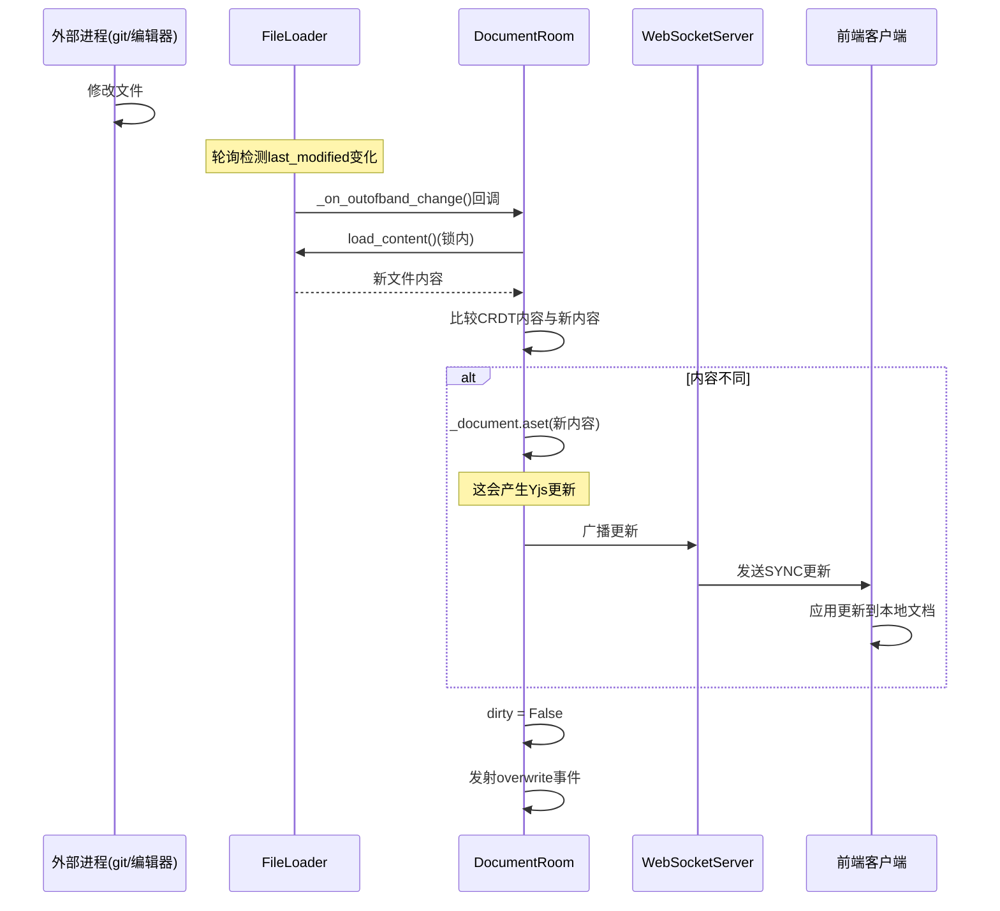

# 文件加载与外带变更检测

## 为什么需要文件加载器？

在CRDT协作场景中，文档的权威状态有两个来源：

1. **内存中的CRDT文档（YDoc）**：反映所有协作者的实时编辑
2. **磁盘上的文件**：持久化存储，可以被协作渠道之外修改

FileLoader 是连接这两个世界的桥梁，负责：
- 从磁盘加载初始文件内容到CRDT
- 将CRDT内容保存回磁盘
- 检测外带变更（Out-of-Band Changes）并同步到CRDT
- 检测文件重命名并通知房间

## FileLoader 类设计

### 核心职责

```python
class FileLoader:
    """A class to centralize all the operation on a file."""
```

每个被协作编辑的文件对应一个FileLoader实例，由FileLoaderMapping管理。

### 订阅模型

FileLoader使用观察者模式通知DocumentRoom文件变更：

```python
def observe(self, id: str, callback, filepath_callback=None):
    """订阅文件外带变更"""
    self._subscriptions[id] = callback
    if filepath_callback:
        self._filepath_subscriptions[id] = filepath_callback

def unobserve(self, id: str):
    """取消订阅"""
    del self._subscriptions[id]
    if id in self._filepath_subscriptions:
        del self._filepath_subscriptions[id]
```

- `id`：订阅者的房间ID
- `callback`：文件内容变更回调
- `filepath_callback`：文件路径变更（重命名）回调

一个FileLoader可以被多个房间订阅（虽然通常每个文件只有一个DocumentRoom，但Fork可能创建额外的房间）。

## 文件加载（load_content）

```python
async def load_content(self, format: str, file_type: str) -> dict:
    async with self._lock:
        model = await ensure_async(
            self._contents_manager.get(
                self.path, format=format, type=file_type, content=True
            )
        )
        # CRLF → LF 换行符标准化
        if (file_type == "file" and "content" in model
            and model["content"] and "\r\n" in model["content"]):
            model["content"] = model["content"].replace("\r\n", "\n")
        self.last_modified = model["last_modified"]
        return model
```

### 换行符标准化

Windows和Unix系统使用不同的换行符（`\r\n` vs `\n`）。如果不统一，相同内容在不同系统上会产生不同的字符串，导致：
- CRDT同步时产生"幽灵变更"
- YStore内容与磁盘内容不匹配
- 不必要的外带变更检测触发

FileLoader在加载文本文件时自动将 `\r\n` 转换为 `\n`。

### 异步锁保护

`load_content` 使用 `self._lock`（asyncio.Lock）保证：
- 同一时间只有一个协程读取文件
- 读取和last_modified更新的原子性
- 防止与保存操作的竞态条件

## 文件保存（maybe_save_content）

```python
async def maybe_save_content(self, model: dict) -> dict | None:
    async with self._lock:
        path = self.path
        
        # 1. 先检查文件元信息
        m = await ensure_async(
            self._contents_manager.get(
                path, format=model["format"], type=model["type"], content=False
            )
        )
        
        # 2. 不可写文件跳过保存
        if not m["writable"]:
            return None
        
        # 3. 版本检查：last_modified一致才保存
        if self.last_modified == m["last_modified"]:
            # 使用shield保护保存任务不被取消
            done_saving = asyncio.Event()
            task = asyncio.create_task(self._save_content(model, done_saving))
            try:
                saved_model = await asyncio.shield(task)
            except asyncio.CancelledError:
                pass
            await done_saving.wait()
            return saved_model
        else:
            # 文件被外部修改
            self.last_modified = m["last_modified"]
            raise OutOfBandChanges()
```

### 写时检查（Copy-on-Write检查）

保存前先检查文件的last_modified时间戳：
- 如果与记录的一致：文件未被外部修改，可以安全保存
- 如果不一致：文件在协作期间被外部修改，抛出 `OutOfBandChanges`

这是一个乐观锁机制，防止协作保存覆盖外部修改。

### 不可取消的保存

```python
done_saving = asyncio.Event()
task = asyncio.create_task(self._save_content(model, done_saving))
try:
    saved_model = await asyncio.shield(task)
except asyncio.CancelledError:
    pass
await done_saving.wait()
```

使用 `asyncio.shield` 保护保存任务：即使调用者取消了等待（如新变更触发防抖取消），底层的文件写入操作仍然完成。这防止：
- 文件写入被中途取消导致文件损坏
- 部分写入的文件格式错误

`_save_content` 完成后设置 `done_saving` 事件，确保写入完成后才继续。

### 保存后获取Hash

```python
async def _save_content(self, model, done_saving):
    try:
        m = await ensure_async(self._contents_manager.save(model, self.path))
        self.last_modified = m["last_modified"]
        # 额外get一次获取hash（upstream issue #1453）
        model_with_hash = await ensure_async(
            self._contents_manager.get(
                self.path, content=False, require_hash=True
            )
        )
        return {**m, "hash": model_with_hash["hash"]}
    finally:
        done_saving.set()
```

保存后额外调用一次get获取文件hash值，用于前端检测"其他协作者已保存"的状态。

TODO注释提到这是为了绕过 jupyter_server 的上游issue #1453（save返回的model不含hash）。

## 外带变更检测（_watch_file）

FileLoader通过后台轮询任务检测外带变更：

```python
async def _watch_file(self):
    while True:
        try:
            await asyncio.sleep(self._poll_interval)
            try:
                await self.maybe_notify()
                consecutive_error_logs = 0
            except HTTPError as e:
                # 404/401错误：计数持续时间，超时后停止轮询
                if e.status_code in {404, 401}:
                    if consecutive_errors_duration > self._stop_poll_on_errors_after:
                        break
                # 日志抑制
                if consecutive_error_logs < self._max_consecutive_logs:
                    self._log.error(...)
                    consecutive_error_logs += 1
        except asyncio.CancelledError:
            break
```

### 错误处理策略

轮询任务的错误处理非常谨慎：

| 错误类型 | 处理方式 |
|---|---|
| 404（文件不存在） | 记录连续错误时间，超过 `stop_poll_on_errors_after`（默认24h）停止轮询 |
| 401（未授权） | 同上 |
| 超时/500等临时错误 | 记录错误，继续轮询（最多3条连续错误后抑制日志） |
| CancelledError | 正常退出循环 |

**日志抑制**：连续错误超过 `max_consecutive_logs`（默认3）后，只记录一条"suppressing further logs"警告，避免日志刷屏。

### 变更通知（maybe_notify）

```python
async def maybe_notify(self):
    do_notify = False
    filepath_change = False
    async with self._lock:
        # 检测路径变化（重命名）
        path = self.path
        if self._current_path != path:
            self._current_path = path
            filepath_change = True
        
        # 获取当前元信息
        model = await ensure_async(self._contents_manager.get(path, content=False))
        
        # 检测内容修改
        if self.last_modified is not None and self.last_modified < model["last_modified"]:
            do_notify = True
        
        self.last_modified = model["last_modified"]
    
    # 锁外通知（防止死锁，因为callback可能需要获取锁加载内容）
    if filepath_change:
        for callback in self._filepath_subscriptions.values():
            await callback()
    if do_notify:
        for callback in self._subscriptions.values():
            await callback()
```

关键设计：**通知回调在锁外执行**。因为回调函数（如DocumentRoom._on_outofband_change）会调用 `load_content()`，需要获取同一把锁。如果在锁内调用回调会导致死锁。

### 路径动态解析

FileLoader的 `path` 属性始终通过FileIdManager动态解析：

```python
@property
def path(self) -> str:
    path = self._file_id_manager.get_path(self.file_id)
    if path is None:
        raise RuntimeError(f"No path found for file ID '{self.file_id}'")
    return path
```

这意味着文件被重命名后，FileLoader自动获取新路径，无需额外通知机制。`_current_path` 跟踪上一次已知路径，用于检测重命名。

## FileLoaderMapping

```python
class FileLoaderMapping:
    """Map rooms to file loaders."""
```

FileLoaderMapping是FileLoader的工厂和容器，管理文件ID→FileLoader的映射。

### 懒加载

```python
def __getitem__(self, file_id: str) -> FileLoader:
    path = self.file_id_manager.get_path(file_id)
    file = self.__dict.get(file_id)
    if file is None:
        self.log.info("Creating FileLoader for: %s", path)
        file = FileLoader(
            file_id, self.file_id_manager, self.contents_manager,
            self.log, self.file_poll_interval,
            stop_poll_on_errors_after=self._stop_poll_on_errors_after,
        )
        self.__dict[file_id] = file
    return file
```

- FileLoader在首次访问时创建（懒加载）
- 同一file_id始终返回同一FileLoader实例
- 创建时自动启动文件轮询任务

### 自动清理

```python
async def remove(self, file_id: str):
    loader = self.__dict.pop(file_id)
    await loader.clean()  # 停止轮询任务
```

当文件的最后一个订阅房间被清理后，FileLoaderMapping.remove()被调用，停止轮询任务并释放资源。

```python
# 在_clean_room中
if file.number_of_subscriptions == 0:
    await self._file_loaders.remove(file_id)
```

### 并发安全

FileLoaderMapping不使用锁保护 `__dict`，因为：
- 所有WebSocket handler在Jupyter Server的事件循环中运行（单线程协程）
- `__getitem__` 和 `remove` 不会在多线程中并发调用
- asyncio的协程切换点（await）之间是原子的

## 外带变更处理流程

当FileLoader检测到磁盘变更时，完整处理链路：



### DocumentRoom的处理

```python
async def _on_outofband_change(self):
    model = await self._file.load_content(self._file_format, self._file_type)
    async with self._update_lock:
        if await self._document.aget() != model["content"]:
            await self._document.aset(model["content"])  # 覆盖CRDT内容
        self._document.dirty = False
```

覆盖CRDT内容会生成Yjs更新，自动广播给所有连接的客户端，实现"外部修改→实时同步到所有协作者"。

### 保存时发现外带变更

在 `_maybe_save_document` 中也可能遇到外带变更：

```python
except OutOfBandChanges:
    # 文件被外部修改，重新加载
    model = await self._file.load_content(...)
    async with self._update_lock:
        if await self._document.aget() != model["content"]:
            await self._document.aset(model["content"])
        self._document.dirty = False
```

这意味着即使在保存过程中文件被外部修改，也不会丢失外部更改——协作中的未保存更改会被覆盖（但冲突检测机制会通知用户）。

## OutOfBandChanges 异常

```python
class OutOfBandChanges(Exception):
    pass
```

这是一个标记异常，表示文件在协作编辑期间被外部修改。DocumentRoom在两个地方捕获：
1. `_maybe_save_document()` 中：保存时发现文件已被修改
2. `on_message` 流程中：通过FileLoader回调间接触发

## 文件重命名处理

文件重命名是特殊的外带变更，通过 `filepath_callback` 处理：

```python
def _on_filepath_change(self):
    self._document.path = self._file.path
```

这更新共享文档模型的path属性：
1. 产生Yjs stateChange事件
2. 前端RtcContentProvider监听path变化
3. 更新provider的key（`format:type:newPath`）
4. 更新全局Awareness中的documents列表
5. 确保后续保存使用新路径

## 配置参数影响

| 配置项 | 对FileLoader的影响 |
|---|---|
| `file_poll_interval` | 轮询间隔，越小检测越快但I/O越高；0=禁用轮询 |
| `file_stop_poll_on_errors_after` | 错误后停止轮询的等待时间 |

### 禁用轮询的场景

设置 `file_poll_interval=0`：
- 仅在保存时检查外带变更
- 外部修改不会实时同步到CRDT
- 保存时如果有外部修改会触发OutOfBandChanges
- 适用于文件不会被外部修改的场景（如容器化部署、临时环境）

## 关键设计洞察

1. **单一职责**：FileLoader集中所有文件I/O操作，DocumentRoom不直接操作ContentsManager
2. **异步锁保护**：所有文件读写在asyncio.Lock保护下进行，防止竞态条件
3. **不可取消写入**：使用asyncio.shield确保文件写入不会因任务取消而中断，防止文件损坏
4. **乐观并发控制**：通过last_modified时间戳检测外带变更，不使用悲观锁
5. **锁外回调**：通知回调在锁外执行，避免死锁
6. **优雅错误处理**：临时错误不终止轮询，日志抑制避免刷屏，长时间错误自动停止
7. **CRLF标准化**：统一换行符避免跨平台假冲突
8. **懒加载+自动清理**：FileLoader按需创建，无人使用时自动停止轮询释放资源
9. **路径动态解析**：通过FileIdManager动态获取路径，天然支持文件重命名

## 相关概念

- [文档房间管理](03-document-room.md)
- [YDocExtension后端扩展配置](02-ydoc-extension.md)
- [WebSocket通信协议](05-websocket-protocol.md)
- [整体架构概览](01-architecture-overview.md)
