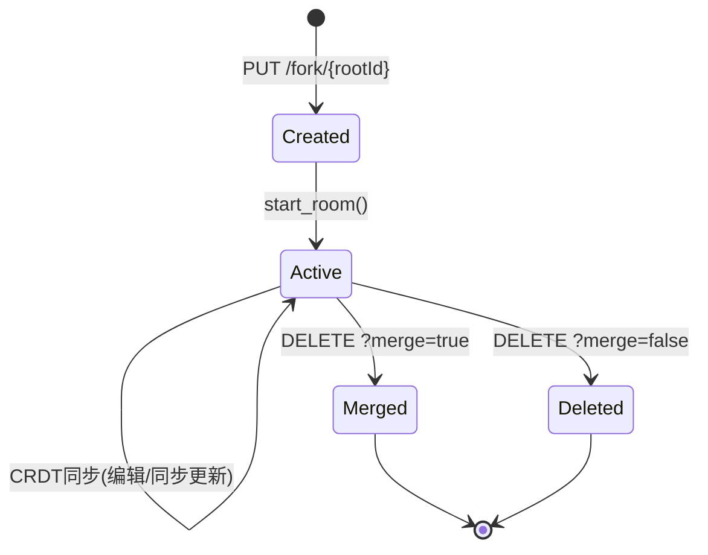

# 文档分叉与时间线

## 为什么需要 Fork 和 Timeline？

在实时协作中，有两个重要需求：

1. **文档分叉（Fork）**：用户想要在不影响主文档的情况下实验性编辑，可以创建文档分叉（类似Git分支）
2. **时间线（Timeline）**：用户想要浏览文档的历史版本，撤销到之前的状态，或恢复误删的内容

jupyter-collaboration 通过 Fork 机制和时间线滑块实现了这两个功能。

## 核心概念

### Fork（分叉）

Fork 是主文档（root document）的独立副本：
- 拥有自己的YDoc和YRoom
- 默认情况下与主文档独立编辑，互不影响
- 支持可选的"同步模式"（synchronize=true），主文档的更改实时同步到fork
- 可以删除fork，可选将fork的更改合并回主文档

### 时间线（Timeline）

时间线利用YStore中持久化的CRDT更新历史，允许用户：
- 查看文档在任意历史时间点的状态
- 在历史版本上进行Undo/Redo操作
- 将文档恢复到之前的版本

## 后端实现

### 全局状态

```python
FORK_DOCUMENTS = {}  # dict[str, YDoc] — fork文档实例
FORK_ROOMS = {}      # dict[str, dict] — fork元信息
```

这些是模块级别的字典，存储所有fork的信息。

### DocForkHandler

**路由**：
- `GET /api/collaboration/fork/{root_roomid}` — 获取根文档的所有fork
- `PUT /api/collaboration/fork/{root_roomid}` — 创建新fork
- `DELETE /api/collaboration/fork/{fork_roomid}?merge=true|false` — 删除fork

#### 创建Fork（PUT）

```python
async def put(self, root_roomid):
    fork_roomid = uuid4().hex  # 生成唯一fork ID
    
    # 1. 获取根文档房间
    root_room = await self._websocket_server.get_room(root_roomid)
    
    # 2. 复制根文档的当前状态
    update = root_room.ydoc.get_update()
    fork_ydoc = Doc()
    fork_ydoc.apply_update(update)
    
    # 3. 解析请求参数
    model = self.get_json_body()
    synchronize = model.get("synchronize", False)
    
    # 4. 如果开启同步，监听根文档变更
    if synchronize:
        root_room.ydoc.observe(
            lambda event: fork_ydoc.apply_update(event.update)
        )
    
    # 5. 记录fork元信息
    FORK_ROOMS[fork_roomid] = {
        "root_roomid": root_roomid,
        "synchronize": synchronize,
        "title": model.get("title", ""),
        "description": model.get("description", ""),
    }
    
    # 6. 创建并启动fork房间
    fork_room = YRoom(ydoc=fork_ydoc)
    self._websocket_server.rooms[fork_roomid] = fork_room
    await self._websocket_server.start_room(fork_room)
    
    # 7. 发射fork事件
    self._emit_fork_event(username, fork_roomid, fork_info, "create")
```

**synchronize模式**：当synchronize=true时，fork会持续接收主文档的更新。这意味着：
- 主文档的新更改会实时出现在fork中
- 但fork的更改不会影响主文档（单向同步）
- 适用于"在最新内容基础上做实验"的场景

#### 删除Fork（DELETE）

```python
async def delete(self, fork_roomid):
    fork_info = FORK_ROOMS.get(fork_roomid)
    root_roomid = fork_info["root_roomid"]
    del FORK_ROOMS[fork_roomid]
    
    # 可选合并
    if self.get_query_argument("merge") == "true":
        root_room = await self._websocket_server.get_room(root_roomid)
        fork_room = await self._websocket_server.get_room(fork_roomid)
        fork_update = fork_room.ydoc.get_update()
        root_room.ydoc.apply_update(fork_update)  # 合并fork到主文档
    
    await self._websocket_server.delete_room(name=fork_roomid)
    self._emit_fork_event(username, fork_roomid, fork_info, "delete")
```

合并操作通过将fork的完整状态作为update应用到主文档来实现，CRDT自动处理冲突合并。

#### 查询Fork列表（GET）

```python
async def get(self, root_roomid):
    self.write({
        fork_roomid: fork_info
        for fork_roomid, fork_info in FORK_ROOMS.items()
        if fork_info["root_roomid"] == root_roomid
    })
```

返回指定根文档的所有fork信息。

### TimelineHandler

**路由**：`GET /api/collaboration/timeline/{path}?format=...&type=...`

时间线处理为文档创建一个临时fork，通过重放YStore历史构建版本时间戳列表：

```python
async def get(self, path: str):
    idx = uuid4().hex
    file_id = file_id_manager.get_id(path)
    encoded_path = encode_file_path(format, content_type, file_id)
    room_id = room_id_from_encoded_path(encoded_path)
    
    room = await self.ywebsocket_server.get_room(room_id)
    fork_ydoc = Doc()
    
    # 创建Y文档包装器（包含UndoManager）
    ydoc_factory = YDOCS.get(content_type)
    FORK_DOCUMENTS[idx] = ydoc_factory(fork_ydoc)
    undo_manager = FORK_DOCUMENTS[idx].undo_manager
    
    # 从YStore读取所有历史更新
    ystore = room.ystore
    updates_and_timestamps = [
        (item[0], item[-1]) async for item in ystore.read()
    ]
    
    # 逐个应用更新，记录Undo栈增长的时间点
    result_timestamps = []
    for update, timestamp in updates_and_timestamps:
        undo_stack_len = len(undo_manager.undo_stack)
        fork_ydoc.apply_update(update)
        if len(undo_manager.undo_stack) > undo_stack_len:
            result_timestamps.append(timestamp)  # 新的可撤销操作
    
    # 创建临时fork房间供前端连接
    fork_room = YRoom(ydoc=fork_ydoc)
    self.ywebsocket_server.add_room(idx, fork_room)
    
    self.finish(json.dumps({
        "roomId": room_id,
        "timestamps": result_timestamps,  # 时间点列表
        "forkRoom": idx,                  # 临时fork房间ID
        "sessionId": SERVER_SESSION,
    }))
```

**关键洞察**：时间线通过UndoManager的栈变化来识别"用户操作"边界。每次apply_update后，如果undo_stack增长了，说明有一个新的用户操作完成，对应的时间戳记录下来。前端可以通过Undo/Redo在这些时间点之间导航。

### UndoRedoHandler

**路由**：`PUT /api/collaboration/undoredo/{room_id}?action=...&steps=...&forkRoom=...`

在时间线fork房间上执行Undo/Redo/Restore操作：

```python
async def put(self, room_id):
    action = query_args["action"]
    steps = int(query_args["steps"])
    fork_room_id = query_args["forkRoom"]
    
    fork_document = FORK_DOCUMENTS.get(fork_room_id)
    undo_manager = fork_document.undo_manager
    
    if action == "undo":
        for _ in range(steps):
            if undo_manager.can_undo():
                undo_manager.undo()
        return self.finish({"status": "undone"})
    
    elif action == "redo":
        for _ in range(steps):
            if undo_manager.can_redo():
                undo_manager.redo()
        return self.finish({"status": "redone"})
    
    elif action == "restore":
        # 清理fork，当前fork_ydoc状态即为恢复状态
        await self._cleanup_undo_manager(fork_room_id)
        return self.finish({"code": 200, "status": "Document restored successfully"})
```

**使用流程**：
1. 前端请求TimelineHandler获取时间戳列表和fork房间ID
2. 用户拖动时间线滑块，前端计算需要undo/redo的步数
3. 调用UndoRedoHandler执行undo/redo，前端连接到fork房间查看结果
4. 用户确认恢复时，调用restore（清理fork，此时fork的YDoc状态即为要恢复的版本）

> **注意**：当前实现中restore仅清理fork文档，实际的"将恢复版本应用到主文档"逻辑可能需要前端通过其他API完成，或者在后续版本中完善。

## 前端实现

### ForkManager

```typescript
export class ForkManager implements IForkManager {
```

ForkManager是前端管理fork的核心类：

#### 创建Fork

```typescript
async createFork(options: {
  rootId: string;
  synchronize: boolean;
  title?: string;
  description?: string;
}): Promise<IForkCreationResponse | undefined> {
  const init: RequestInit = {
    method: 'PUT',
    body: JSON.stringify({ title, description, synchronize })
  };
  const url = URLExt.join(ROOM_FORK_URL, rootId);
  return requestAPI<IForkCreationResponse>(url, init, this._serverSettings);
}
```

#### 删除Fork

```typescript
async deleteFork(options: { forkId: string; merge: boolean }): Promise<void> {
  const url = URLExt.join(ROOM_FORK_URL, forkId);
  const query = URLExt.objectToQueryString({ merge });
  await requestAPI(`${url}${query}`, { method: 'DELETE' }, this._serverSettings);
}
```

#### 获取Fork列表

```typescript
async getAllForks(rootId: string): Promise<IAllForksResponse> {
  const url = URLExt.join(ROOM_FORK_URL, rootId);
  return requestAPI<IAllForksResponse>(url, { method: 'GET' }, this._serverSettings);
}
```

#### 事件监听

ForkManager通过Jupyter Event系统监听fork事件：

```typescript
private _handleEvent(_: Event.IManager, emission: Event.Emission) {
  if (emission.schema_id === JUPYTER_COLLABORATION_FORK_EVENTS_URI) {
    switch (emission.action) {
      case 'create':
        this._forkAddedSignal.emit(emission);
        break;
      case 'delete':
        this._forkDeletedSignal.emit(emission);
        break;
    }
  }
}
```

### IForkProvider 接口

前端的WebSocketProvider实现了IForkProvider接口：

```typescript
export interface IForkProvider {
  connectToForkDoc: (forkRoomId: string, sessionId: string) => Promise<void>;
  reconnect: () => Promise<void>;
  contentType: string;
  format: string;
  save?: () => Promise<void>;
}
```

`connectToForkDoc` 方法允许连接到fork房间查看或编辑fork文档。

### 前端时间线UI

`TimelineSlider.tsx` 组件（在docprovider包中）提供时间线滑块UI：
- 显示时间戳列表
- 允许用户拖动滑块选择历史版本
- 通过Undo/Redo导航历史
- 支持恢复到选定版本

## Fork 的使用场景

### 1. 实验性编辑

用户想尝试一些不确定的更改（如大规模重构、实验性分析），可以创建fork：
1. 创建fork（synchronize=true保持与主文档同步）
2. 在fork中自由编辑
3. 如果满意：删除fork并merge=true
4. 如果不满意：删除fork不合并

### 2. 共享链接协作

通过共享链接功能，访客用户可以在fork中编辑，不直接修改主文档。

### 3. 版本恢复

通过时间线浏览历史版本，找到误删内容之前的版本并恢复。

### 4. 代码审查

为特定更改创建fork，其他人连接到fork房间审查更改，然后合并。

## Fork 房间生命周期



## 事件系统

Fork操作发射Jupyter Events，schema ID为：
```
https://schema.jupyter.org/jupyter_collaboration/fork/v1
```

事件数据：
```json
{
  "username": "user@example.com",
  "fork_roomid": "abc123",
  "fork_info": {
    "root_roomid": "text:notebook:def456",
    "synchronize": false,
    "title": "实验分支",
    "description": "尝试新方法"
  },
  "action": "create"
}
```

扩展可以监听这些事件实现：
- Fork活动审计日志
- Fork通知（通知主文档用户有人创建了fork）
- Fork生命周期管理（自动清理过期fork）

## 关键设计洞察

1. **Fork即房间**：每个fork是一个独立的YRoom，复用现有的CRDT同步基础设施
2. **单向同步选项**：synchronize模式实现主→fork的实时同步，允许在最新基础上实验
3. **CRDT原生合并**：merge操作通过apply_update实现，冲突由CRDT自动解决
4. **UndoManager驱动时间线**：利用Yjs UndoManager的栈结构识别操作边界，不需要额外的操作日志
5. **临时Fork房间**：时间线功能也通过临时fork房间实现，架构统一
6. **事件驱动通知**：通过Jupyter Events发射fork创建/删除事件，支持扩展响应
7. **前端信号机制**：Lumino Signal提供类型安全的事件系统，UI组件可以响应fork变化
8. **全局状态存储**：FORK_DOCUMENTS和FORK_ROOMS是模块级字典，在服务器进程内共享

## 相关概念

- [文档房间管理](03-document-room.md)
- [CRDT持久化存储](04-ystore-persistence.md)
- [WebSocket通信协议](05-websocket-protocol.md)
- [前端Provider架构](09-frontend-provider.md)
