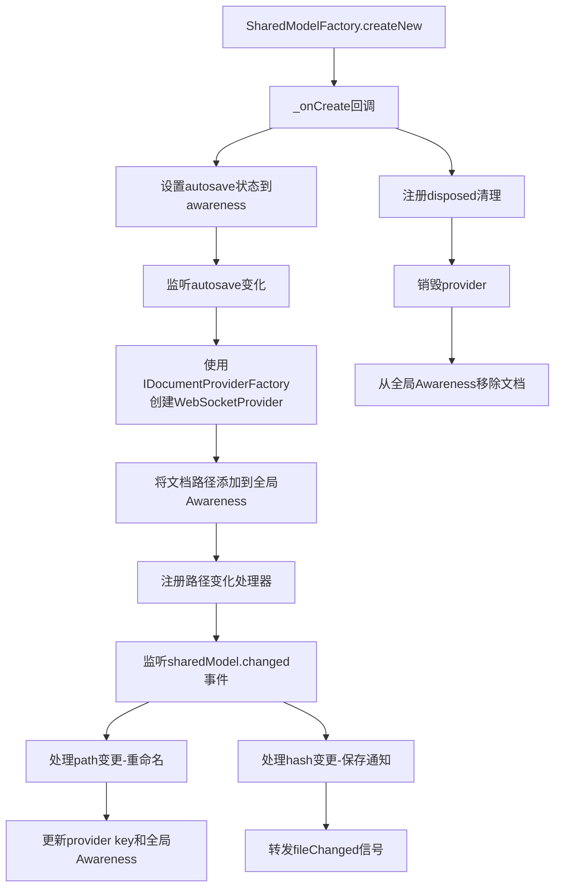
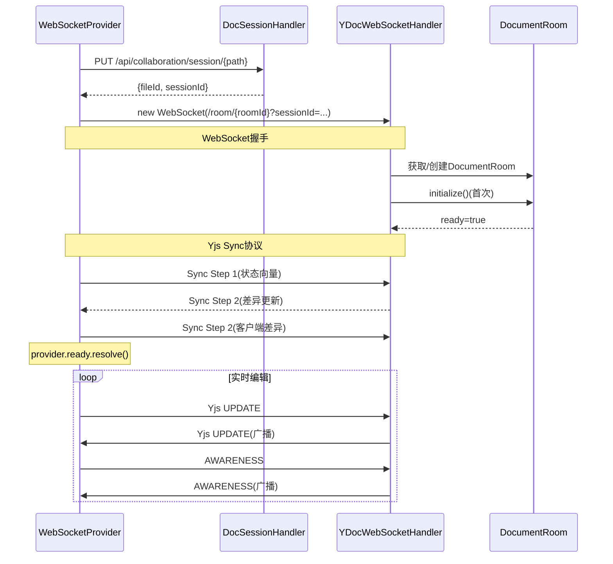

# 前端 Provider 架构

## 前端架构概述

jupyter-collaboration 前端通过多层Provider架构将Yjs CRDT能力集成到JupyterLab的文档系统中：

```mermaid
graph TB
    subgraph JupyterLab Core
        DM[DocumentManager]
        CM[Contents API]
    end
    
    subgraph Collaboration Frontend
        RCP[RtcContentProvider<br/>IContentProvider]
        SMF[SharedModelFactory<br/>ISharedModelFactory]
        PF[ProviderFactory<br/>IDocumentProviderFactory]
        WP[WebSocketProvider<br/>IDocumentProvider]
        WAP[WebSocketAwarenessProvider<br/>IAwarenessProvider]
        FM[ForkManager<br/>IForkManager]
    end
    
    subgraph Yjs Layer
        YDoc[YDocument<br/>@jupyter/ydoc]
        Y[Yjs Doc]
        A[Awareness]
    end
    
    subgraph Backend
        WS[WebSocket /api/collaboration/room/]
        REST[REST /api/collaboration/session/]
    end
    
    DM -->|使用| RCP
    RCP -->|持有| SMF
    SMF -->|创建| YDoc
    RCP -->|使用| PF
    PF -->|创建| WP
    WP -->|包装| Y
    WP -->|使用| A
    YDoc -->|持有| Y
    YDoc -->|持有| A
    WAP -->|使用| A
    WP -->|WebSocket| WS
    WP -->|REST| REST
    WAP -->|WebSocket| WS
    RCP -->|替代| CM
    RCP -->|委托给| CM
```

## RtcContentProvider

`RtcContentProvider` 是前端协作的核心入口，实现了JupyterLab的 `IContentProvider` 接口，替代默认的REST内容提供者。

### IContentProvider 接口拦截

RtcContentProvider拦截JupyterLab的文件get/save操作，将传统的REST请求重定向到CRDT同步通道：

#### get(localPath, options)

```typescript
async get(localPath: string, options?: Contents.IFetchOptions): Promise<Contents.IModel> {
  if (options?.format && options?.type) {
    const key = `${options.format}:${options.type}:${localPath}`;
    const provider = this._providers.get(key);
    
    if (provider) {
      // 并行：从drive获取元信息 + 等待CRDT同步就绪
      const [model] = await Promise.all([
        this._currentDrive.get(localPath, { ...options, content: false }),
        provider.ready  // 等待WebSocket同步完成
      ]);
      return { ...model, format: options.format };
    }
  }
  
  // 非协作文档回退到REST
  return this._currentDrive.get(localPath, { ...options, contentProviderId: undefined });
}
```

关键设计：
- 使用 `Promise.all` 并行获取元信息和等待同步就绪
- 如果provider还没就绪（WebSocket连接中），get会等待
- 非协作文档（无provider）回退到普通REST API
- 传递 `contentProviderId: undefined` 避免无限递归

#### save(localPath, options)

```typescript
async save(localPath: string, options): Promise<Contents.IModel> {
  if (options.format && options.type) {
    const key = `${options.format}:${options.type}:${localPath}`;
    const provider = this._providers.get(key);
    
    if (provider?.save) {
      await provider.save();  // 通过WebSocket发送手动保存消息
    }
    
    // 保存后获取最新元信息
    return this.get(localPath, { type: options.type, format: options.format, content: false });
  }
  
  // 回退到REST save
  return this._currentDrive.save(localPath, { ...options, contentProviderId: undefined });
}
```

对于协作文档，save不通过REST PUT文件，而是发送WebSocket RAW `save` 消息，由后端执行防抖保存。

### SharedModelFactory（内部类）

SharedModelFactory 负责为不同内容类型创建支持协作的共享文档模型：

```typescript
class SharedModelFactory implements ISharedModelFactory {
  documentFactories: Map<Contents.ContentType, SharedDocumentFactory>;
  
  readonly collaborative = !DISABLE_RTC;
  
  registerDocumentFactory(type, factory) {
    if (this.documentFactories.has(type)) {
      throw new Error(`The content type ${type} already exists`);
    }
    this.documentFactories.set(type, factory);
  }
  
  createNew(options): ISharedDocument | undefined {
    if (!this.collaborative || !options.collaborative) {
      return;  // 非协作模式返回undefined，使用默认模型
    }
    if (this.documentFactories.has(options.contentType)) {
      const sharedModel = factory(options);
      this._onCreate(options, sharedModel);  // 关键：创建provider
      return sharedModel;
    }
  }
}
```

关键点：
- `collaborative` 属性由PageConfig的 `disableRTC` 全局控制
- 每种内容类型（notebook/file等）需要注册对应的工厂
- 创建sharedModel后立即调用 `_onCreate` 回调建立WebSocket连接

### _onCreate 回调

当SharedModelFactory创建新的共享模型时，_onCreate执行以下步骤：



#### Autosave状态同步

```typescript
const getAutosave = (): boolean => {
  if (this._documentManager) {
    return this._documentManager.autosave ?? true;
  }
  return (this._docmanagerSettings?.composite?.['autosave'] as boolean) ?? true;
};
sharedModel.awareness.setLocalStateField('autosave', getAutosave());
```

前端用户的autosave偏好通过Awareness传播到后端。

#### 文件重命名处理

RtcContentProvider使用双重机制检测文件重命名：

1. **SharedModel路径变更**：通过后端CRDT同步的path变化
2. **Drive fileChanged信号**：本地或其他用户重命名触发的信号

```typescript
const handlePathChange = (pathChange) => {
  const oldKey = `${format}:${contentType}:${oldPath}`;
  const newKey = `${format}:${contentType}:${newPath}`;
  this._providers.set(newKey, provider);
  this._providers.delete(oldKey);
  
  // 更新全局Awareness中的文档列表
  const documents = state.documents || [];
  documents.splice(documents.indexOf(oldPath), 1);
  documents.push(newPath);
  this._globalAwareness?.setLocalStateField('documents', documents);
};
```

两种机制互补：
- SharedModel变更可能有延迟（需要经过服务器同步）
- Drive信号对于其他协作者的重命名有延迟
- 两者结合确保不遗漏重命名事件

#### 保存通知（hash变更）

```typescript
sharedModel.changed.connect(async (_, change) => {
  const hashChanges = change.stateChange.filter(c => c.name === 'hash');
  if (hashChanges.length > 0) {
    // hash变化意味着服务端完成了保存
    const newPath = sharedModel.state.path ?? options.path;
    const model = await this.get(newPath, { content: false });
    this._providerFileChanged.emit({
      type: 'save',
      newValue: { ...model, hash: hashChange.newValue },
      oldValue: { hash: hashChange.oldValue }
    });
  }
});
```

当后端完成保存并更新document.hash时，前端转发fileChanged信号，通知UI更新保存状态（如移除"未保存更改"指示）。

## WebSocketProvider

WebSocketProvider 是实际处理WebSocket连接和CRDT同步的类。

### 实现接口

```typescript
export class WebSocketProvider implements IDocumentProvider, IForkProvider {
```

- `IDocumentProvider`：来自 `@jupyter/collaborative-drive`，标准文档提供者接口
- `IForkProvider`：Fork功能扩展

### 连接生命周期



### 请求-响应模式（手动保存）

```typescript
async save(): Promise<void> {
  const ws = this._yWebsocketProvider?.ws;
  if (ws) {
    const saveId = ++this._saveCounter;
    const delegate = new PromiseDelegate<void>();
    
    // 一次性消息监听器
    const handler = (event: MessageEvent) => {
      const data = new Uint8Array(event.data);
      const decoder = decoding.createDecoder(data);
      const messageType = decoding.readVarUint(decoder);
      if (messageType === RAW_MESSAGE_TYPE) {
        const rawReply = decoding.readVarString(decoder);
        const reply = JSON.parse(rawReply);
        if (reply.type === 'save' && reply.responseTo === saveId) {
          if (reply.status === 'success') delegate.resolve();
          else delegate.reject(...);
        }
      }
    };
    
    ws.addEventListener('message', handler);
    // 发送RAW save消息...
    ws.send(saveMessage);
    
    try {
      await delegate.promise;
    } finally {
      ws.removeEventListener('message', handler);
    }
  }
}
```

使用递增的saveId和PromiseDelegate实现WebSocket上的请求-响应模式。

### 冲突处理

```typescript
private _handleConflictMessage(data: Uint8Array): void {
  // 解析 {"type": "conflict"} 消息
  // 1. 关闭当前WebSocket
  // 2. 打开conflict WebSocket用于diff
  // 3. 显示冲突对话框
  showDialog({
    title: this._trans.__('Document Conflict'),
    buttons: [
      Dialog.okButton({ label: this._trans.__('Save As') }),
      Dialog.warnButton({ label: this._trans.__('Revert') }),
      Dialog.cancelButton({ label: this._trans.__('Show Diff') }),
    ],
  }).then(result => {
    if (result.button.label === 'Save As') this._onConflictSaveAs?.();
    else if (result.button.label === 'Revert') this.reconnect();
    else if (result.button.label === 'Show Diff') this._onConflictShowDiff?.();
  });
}
```

### 加载超时

```typescript
const LOAD_TIMEOUT = 5000;

private _startLoadTimeout(): void {
  this._loadTimeout = window.setTimeout(() => {
    if (!this._ready.isResolved) {
      // 显示加载对话框
      showDialog({
        title: this._trans.__('Loading...'),
        body: this._trans.__('Document is taking long to synchronize...'),
        buttons: [Dialog.okButton({ label: this._trans.__('Reload') })]
      });
    }
  }, LOAD_TIMEOUT);
}
```

5秒未完成同步时显示加载提示。

## Token 依赖注入

JupyterLab使用Lumino的Token系统进行依赖注入：

### 定义的Token

| Token | 类型 | 说明 |
|---|---|---|
| `IDocumentProviderFactory` | `IDocumentProviderFactory` | 创建WebSocketProvider的工厂 |
| `IAwarenessProviderFactory` | `IAwarenessProviderFactory` | 创建AwarenessProvider的工厂 |
| `IForkManagerToken` | `IForkManager` | Fork管理器实例 |

### Token使用模式

```typescript
// 定义Token
export const IDocumentProviderFactory = new Token<IDocumentProviderFactory>(
  '@jupyter/docprovider:IDocumentProviderFactory'
);

// 在Plugin中提供
const plugin: JupyterFrontEndPlugin<IDocumentProviderFactory> = {
  id: '@jupyter/docprovider:plugin',
  requires: [/* 依赖 */],
  provides: IDocumentProviderFactory,
  activate: (app, ...deps) => {
    const factory = { create: (options) => new WebSocketProvider(options) };
    return factory;
  }
};

// 在其他Plugin中消费
const otherPlugin: JupyterFrontEndPlugin<void> = {
  id: '@jupyter/docprovider-extension:plugin',
  requires: [IDocumentProviderFactory],  // 注入工厂
  activate: (app, providerFactory) => {
    // 使用providerFactory
  }
};
```

### 工厂模式

为什么使用工厂模式而不是直接注入Provider实例？

因为每个打开的文档需要独立的Provider实例：
- 不同文档有不同的path、contentType、model
- Provider的生命周期与文档窗口绑定
- 工厂允许按需创建Provider，而不是全局单例

## DISABLE_RTC 全局开关

```typescript
const DISABLE_RTC = PageConfig.getOption('disableRTC') === 'true';
```

前端通过PageConfig读取后端设置的全局开关。当禁用时：
- `SharedModelFactory.collaborative = false`
- `createNew`返回undefined，使用默认的非协作共享模型
- 不创建WebSocketProvider
- RtcContentProvider将所有操作回退到REST API

## 协作UI包

### @jupyter/collaboration

提供用户可见的协作UI组件：
- `CollaboratorsPanel`：协作者列表面板
- `UserInfoPanel`：用户信息面板
- `CollaboratorCursors`：共享光标渲染
- `SharedLinkDialog`：共享链接对话框
- `UserMenu`：用户菜单集成

### @jupyter/collaboration-extension

JupyterLab扩展入口，注册：
- 命令（分享、协作面板等）
- 侧边栏面板
- 菜单项
- 共享链接UI

### @jupyter/collaborative-drive

提供协作内容驱动的抽象接口：
- `IDocumentProvider` 接口定义
- `ICollaborativeContentProvider` 接口
- 被 `RtcContentProvider` 实现

## 关键设计洞察

1. **IContentProvider替换**：通过实现JupyterLab标准IContentProvider接口，协作功能对上层透明
2. **工厂+Token注入**：Lumino Token系统实现松耦合，Provider可以被替换或mock
3. **REST+WebSocket混合**：会话建立用REST，实时同步用WebSocket，各司其职
4. **ready Promise**：Provider.ready作为同步屏障，确保CRDT状态就绪后才返回内容
5. **双重重命名检测**：SharedModel事件+Drive信号双保险，避免竞态条件
6. **优雅降级**：DISABLE_RTC开关和WebSocket失败回退REST，确保极端情况下基本功能可用
7. **请求-响应 over WebSocket**：使用递增ID+PromiseDelegate在WebSocket上实现RPC模式
8. **全局状态最小化**：除了全局Awareness，每个文档的Provider是独立的，避免状态耦合
9. **冲突用户主导**：检测到冲突时让用户选择解决方案，而非自动合并导致数据丢失
10. **异步屏障模式**：get()方法使用Promise.all等待同步就绪，保证返回时文档已同步

## 相关概念

- [WebSocket通信协议](05-websocket-protocol.md)
- [用户感知Awareness协议](06-awareness-protocol.md)
- [文档分叉与时间线](08-fork-timeline.md)
- [整体架构概览](01-architecture-overview.md)
- [前端扩展示例](../examples/03-collaboration-events.md)
