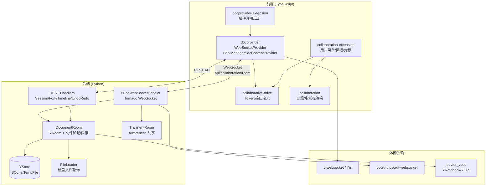

# jupyter-collaboration 洞察

## 架构总览

jupyter-collaboration 是一个基于 Yjs CRDT 的 JupyterLab 实时协作扩展，采用前后端分离架构：前端通过 WebSocket 与 Python 后端通信，后端使用 pycrdt（Yjs 的 Python 绑定）管理共享文档状态。整个系统由 5 个前端包和 4 个 Python 包组成，通过 Token 依赖注入机制解耦。

## 洞察

### I-001: Yjs CRDT 驱动的客户端-服务器同步架构

jupyter-collaboration 采用经典的 Yjs WebSocket Provider 模式，但做了深度定制以适配 JupyterLab 的文档模型。核心设计要点包括：

1. **双层 Room 模型**：后端区分 `DocumentRoom`（持久化文档房间）和 `TransientRoom`（临时 Awareness 房间）。DocumentRoom 关联磁盘文件和 YStore 持久化，TransientRoom 仅用于共享用户状态（如全局 Awareness 房间 `JupyterLab:globalAwareness`）。

2. **确定性文档初始化**：`DocumentRoom._apply_deterministic_source_content()` 使用 `Doc(client_id=0)` 创建源文档并应用到房间，确保从磁盘重建房间时产生完全一致的 Yjs 更新历史。这是关键设计——若不固定 client_id，服务器重启或房间驱逐后重连的客户端会因历史分叉而产生重复内容。

3. **YStore 优先加载策略**：房间初始化时优先从 YStore（SQLite 数据库）加载 Y 更新，仅当 YDocNotFound 或内容与磁盘不同步时才从磁盘重建。这平衡了恢复速度和数据一致性。

4. **防抖自动保存**：文档变更触发防抖保存（默认 1 秒延迟），autosave 开关从所有客户端的 Awareness 状态聚合——任一客户端开启即启用自动保存。手动保存通过 RAW 消息类型直接触发，跳过防抖延迟。

### I-002: 多通道路径变更检测与冲突恢复机制

协作编辑中文件重命名和编辑冲突是两个核心难题，系统通过双通道检测和显式冲突处理解决：

1. **双路径变更检测**：`RtcContentProvider._onCreate` 同时监听 `sharedModel.changed`（Yjs 状态变更）和 `drive.fileChanged`（文件系统信号）来检测文件重命名。两种方式各有缺陷——Yjs 路径变更需要经过服务器回传有延迟，fileChanged 信号对协作者重命名延迟更大——因此两个通道互补以消除竞态条件。Provider 的 key 格式为 `${format}:${contentType}:${path}`，重命名时需要更新 Map 中的 key 和全局 Awareness 的 documents 列表。

2. **冲突检测与用户干预**：当过期客户端（房间被驱逐后从磁盘重建）重连导致 "block parent" 错误时，`DocumentRoom._handle_sync_message_error()` 捕获该异常并发送 RAW 类型的 conflict 通知，客户端可弹出冲突解决对话框（另存为/还原/查看差异），而非静默丢弃更改或崩溃。

3. **会话版本兼容性检查**：通过 `SERVER_SESSION`（启动时生成的 UUID）和 `YDOC_SERVER_VERSION` 双重验证，扩展更新后强制客户端刷新页面，避免协议不匹配导致的数据损坏。关闭码 1003 配合 reloadable 字段提示客户端是否可恢复。

4. **带外变更处理**：`FileLoader` 轮询磁盘文件变更（默认 1 秒间隔），外部直接修改文件时触发 `_on_outofband_change`，从磁盘重新加载覆盖房间内容。保存过程中遇到带外变更也会触发重载，防止覆盖外部更改。

### I-003: 分叉-时间线-服务端执行的扩展协作能力

除基础实时同步外，系统提供了三层高级协作能力：

1. **文档分叉（Fork）**：支持创建文档分叉进行实验性编辑，可选保持与根文档同步（通过 Yjs observe 实时转发更新）。分叉删除时可选择将更改合并回根文档（`apply_update`）。前端 `ForkManager` 通过 Jupyter Events 系统监听分叉创建/删除事件，实现跨客户端的分叉状态同步。

2. **时间线滑块（Timeline）**：`TimelineHandler` 通过重放 YStore 中的更新记录构建文档历史版本，利用 UndoManager 的 undo_stack 增长作为"有意义变更"的标记点，返回时间戳列表。前端 `TimelineSlider` 组件允许用户在历史版本间滑动浏览，选择版本后通过 UndoRedoHandler 执行 undo/redo/restore 操作。

3. **渐进式加载**：大 notebook 启用 `document_load_progressively` 后，服务端使用 `aset_progressively` 逐步加载内容，可延迟加载超过阈值（默认 100MB）的输出单元格。客户端在 initialized 事件后即可开始交互，finish 事件表示加载完成。加载期间若用户产生编辑，加载完成后自动触发保存以保留用户更改。

4. **服务端单元格执行**：`server_side_execution` 配置启用后，`NotebookCellServerExecutor` 通过 REST API 在服务端执行 notebook 单元格，前端仅通过共享模型交互，不直接使用内核 WebSocket 协议。这为无内核连接的协作场景（如只读查看、异步执行）提供了可能。
