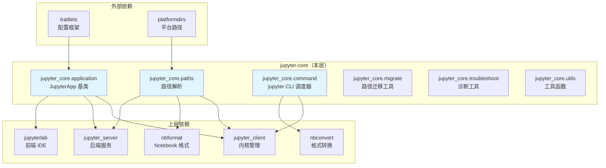

# Jupyter Core 架构洞察

> I阶段产出：核心洞察四元组（陈述/证据/反常识/行动）+ 知识地图

## 洞察1：四层路径搜索模型——JUPYTER_PATH > 环境/用户 > 系统，所有 Jupyter 包共享同一套路径约定

**陈述**：jupyter-core 定义了 Jupyter 生态统一的路径搜索机制，所有 Jupyter 应用（jupyter_server、jupyterlab、nbconvert 等）都依赖此模块定位配置文件、数据文件、内核规格和运行时文件。路径搜索遵循四级优先级：(1) `JUPYTER_PATH`/`JUPYTER_CONFIG_PATH` 环境变量最高优先级；(2) 虚拟环境/conda 环境路径或用户目录（由 venv/conda 检测自动决定谁优先）；(3) Python user site 目录；(4) 系统级路径（/usr/share/jupyter 等）最低优先级。

**证据**：
- F-046/F-049：`jupyter_path()` 和 `jupyter_config_path()` 均实现此四级优先级模型
- F-039：`prefer_environment_over_user()` 通过检测 `sys.prefix != sys.base_prefix`（venv）和 `CONDA_PREFIX` 且非 base 环境来自动判断 env 优先
- F-040/F-041/F-042：配置/数据/运行时三个独立目录各自有对应的环境变量覆盖（JUPYTER_CONFIG_DIR、JUPYTER_DATA_DIR、JUPYTER_RUNTIME_DIR）
- F-065/F-067：JupyterApp 将路径系统作为 trait 属性暴露，子类可覆盖
- F-006：所有高层 Jupyter 包（jupyter_server、notebook、jupyterlab）都依赖 traitlets 和 jupyter_core

**反常识**：
- Jupyter 历史上使用 `~/.jupyter` 作为配置目录，现在通过 `JUPYTER_PLATFORM_DIRS` 环境变量切换到 platformdirs 标准（XDG on Linux、%APPDATA% on Windows、~/Library on macOS），但默认仍用旧路径以保证向后兼容。
- 虚拟环境检测不仅检查 `sys.prefix != sys.base_prefix`（PEP 405 venv），还额外检查 `_do_i_own(sys.prefix)`——即当前用户是否拥有虚拟环境目录的所有权，避免在系统级 venv（如 root 创建的）中错误地优先 env 路径。
- Windows 上默认不使用 `%PROGRAMDATA%` 作为系统路径（需显式设置 `JUPYTER_USE_PROGRAMDATA=1`），因为多用户机器上 PROGRAMDATA 默认权限不安全。
- `jupyter_runtime_dir()` 返回 `jupyter_data_dir()/runtime` 而非 `XDG_RUNTIME_DIR`——因为 XDG_RUNTIME_DIR 在某些系统（容器、WSL）不可靠，runtime 文件（kernel-*.json）现在统一放在 data_dir/runtime 下。

**行动**：
- 查找内核规格（kernelspecs）时，按 `jupyter_path('kernels')` 的顺序搜索
- 自定义配置位置：设置 `JUPYTER_CONFIG_DIR` 环境变量
- 容器部署中要安全写入文件，使用 `secure_write()` 上下文管理器
- 希望遵循 XDG 标准：设置 `JUPYTER_PLATFORM_DIRS=1`

## 洞察2：安全写入模型——secure_write 在 Windows 上必须用 DACL 而非 chmod，0o0600 权限在 CIFS 网络挂载上会误判

**陈述**：`secure_write()` 是 Jupyter 写入敏感文件（connection file、token 文件等）的标准方式。它在 POSIX 上使用 `os.open(..., 0o0600)` 创建文件并验证权限；在 Windows 上因为 Python 的 chmod 不设置 NTFS ACL，必须通过 win32 API（或 ctypes 降级）设置 DACL 限制为当前用户和管理员可读可写。此外，`get_file_mode()` 屏蔽了 CIFS 网络文件系统自动设置的执行位（0o6677 mask），避免在挂载卷上误判权限失败。

**证据**：
- F-055：secure_write 先删除旧文件、用 `os.open(fname, O_CREAT|O_WRONLY|O_TRUNC, 0o0600)` 创建、Windows 上调用 win32_restrict_file_to_user
- F-056：win32_restrict_file_to_user 优先使用 pywin32，ImportError 时通过 ctypes 直接调用 advapi32.dll/secur32.dll（~370 行 ctypes 代码）
- F-057：get_file_mode 使用 `S_IMODE & 0o6677` 屏蔽 group/other 的执行位和 sticky bit
- F-058：JUPYTER_ALLOW_INSECURE_WRITES 环境变量可禁用权限检查，用于网络挂载等无法正确设置权限的环境

**反常识**：
- `win32_restrict_file_to_user` 的 ctypes 降级实现长达 370 行，手动定义了 Windows 安全结构体（ACL、SID、SECURITY_DESCRIPTOR）和 API 签名，这是为了不强制依赖 pywin32 包。
- secure_write 在 Windows 上会先 `open` 文件再关闭（`fd = os.open(..., 0o0600); os.close(fd)`），然后才设置 DACL 并重新打开——这是为了避免在已打开文件句柄上修改权限导致的问题。
- `issue_insecure_write_warning()` 会替换 `warnings.formatwarning` 以去除警告中的多余代码行信息，使警告消息更干净。

**行动**：
- 写入内核连接文件（kernel-*.json）、token、cookie secret 等必须使用 secure_write
- Windows 环境若无法安装 pywin32，ctypes 降级方案可正常工作
- Docker/CIFS 挂载卷上设置 JUPYTER_ALLOW_INSECURE_WRITES=true 避免权限误报

## 洞察3：JupyterApp 基类——基于 traitlets 的配置应用框架，为整个 Jupyter 生态提供统一的 CLI/配置/日志模型

**陈述**：`JupyterApp` 继承自 `traitlets.config.application.Application`，提供了 Jupyter 生态中所有应用（ServerApp、LabApp、NotebookApp 等）共享的基础能力：配置文件加载路径（config_file_paths）、数据路径（jupyter_path trait）、配置目录（config_dir trait）、数据目录（data_dir trait）、运行时目录（runtime_dir trait）、通用 CLI flags（--debug、--generate-config、-y、--config）、日志级别默认 INFO。

**证据**：
- F-060/F-061：JupyterApp 定义 name="jupyter"、description="A Jupyter Application"，子类覆盖 name
- F-062：base_aliases 和 base_flags 在模块加载时合并 traitlets 默认值与 Jupyter 特有选项
- F-065-F-067：所有路径相关属性都是 traitlets trait，支持配置文件和命令行覆盖
- F-068：导入 ensure_dir_exists 和 ensure_event_loop 供子类使用
- F-079-F-080：默认日志级别为 INFO（而非 DEBUG）

**反常识**：
- base_aliases 和 base_flags 的合并逻辑使用 `isinstance(Application.aliases, dict)` 判断 traitlets 版本（traitlets 5 使用 dict，旧版本可能使用其他类型），这是一个版本兼容 hack。
- config_file_paths 属性将 self.config_dir 插入到 jupyter_config_path() 结果的最前面——这意味着应用实例级别的 config_dir 优先级高于所有其他路径，包括 JUPYTER_CONFIG_PATH 环境变量。
- JupyterApp 不直接实现 start()/initialize() 的完整逻辑，这些由子类（如 jupyter_server 的 ServerApp）实现。

**行动**：
- 开发 Jupyter 扩展/应用时，继承 JupyterApp 或其子类
- 添加自定义 CLI 选项：扩展 aliases 和 flags 类属性
- 配置文件生成：使用 `--generate-config` 生成默认配置模板

## 洞察4：jupyter 命令——PATH 上的子命令调度器，通过 `jupyter-*` 命名约定发现所有子命令

**陈述**：`jupyter` 命令本身不实现任何功能，它是一个调度器。`list_subcommands()` 遍历 PATH 环境变量中的所有目录，查找所有以 `jupyter-` 开头的可执行文件（如 jupyter-lab、jupyter-notebook、jupyter-nbconvert），将其作为子命令。执行 `jupyter <subcommand>` 时，通过 subprocess 调用对应的 `jupyter-<subcommand>` 程序。

**证据**：
- F-080/F-081：JupyterParser.epilog 动态生成 "Available subcommands: ..." 列表，仅在 --help 时调用 list_subcommands() 避免 PATH 搜索开销
- F-083/F-084/F-085：jupyter_parser() 创建参数解析器，支持 --version、--config-dir、--data-dir、--runtime-dir、--paths 等信息查询选项
- F-086：argcomplete 自动补全支持（可选）
- F-007：pyproject.toml 中定义 jupyter 入口点为 jupyter_core.command:main

**反常识**：
- epilog 属性在 argparse 中通常是静态字符串，但 JupyterParser 将其实现为 property，仅在访问时（即 --help 输出时）才执行 PATH 搜索——这避免了每次正常执行子命令时都遍历 PATH。
- `--version` 不是使用 argparse 内置的 version action（因为 Python 2 时代它输出到 stderr），而是自定义 action。
- `jupyter.py` shim 文件被 hatch 强制包含在 wheel 中（F-011），这是为了兼容旧版 setuptools 的 `jupyter` 命令入口——因为某些旧工具期望包根目录有 jupyter.py。

**行动**：
- 安装新的 Jupyter 子命令（如 jupyterlab），只需在 PATH 中放置 `jupyter-lab` 可执行文件，无需注册
- 查询路径信息：`jupyter --paths`（文本）或 `jupyter --paths --json`（JSON）
- Shell 补全：使用 examples/ 目录下的 jupyter-completion.bash 或 completions-zsh

## 洞察5：platformdirs 迁移——从自管理路径到标准库路径的渐进过渡，双轨制共存

**陈述**：jupyter_core 5.x 引入了 platformdirs 作为可选路径后端，但默认仍使用历史路径（~/.jupyter、~/.local/share/jupyter）。用户需显式设置 JUPYTER_PLATFORM_DIRS=1 才启用 XDG 等平台标准路径。这是一个渐进式迁移策略：先提供选项→让下游适配→未来版本可能切换默认值。

**证据**：
- F-035：use_platform_dirs() 默认 False，读取 JUPYTER_PLATFORM_DIRS 环境变量
- F-135（pyproject.toml L135）：测试配置中预期 DeprecationWarning "Jupyter is migrating its paths to use standard platformdirs"
- F-020：路径函数中每个都有 if use_platform_dirs() 分支

**反常识**：
- APPNAME 常量在 platformdirs 模式和传统模式下使用不同大小写（"Jupyter" vs "jupyter"），这是因为 macOS Finder 和 Windows 资源管理器显示大写的应用名文件夹更美观，而 Linux 约定小写目录名。
- Apple Silicon Homebrew 检测（/opt/homebrew 前缀）不仅影响系统路径，还影响 APPNAME 大小写——Homebrew 安装的 Jupyter 使用小写 "jupyter" 遵循 Unix 惯例。

**行动**：
- 新部署建议设置 JUPYTER_PLATFORM_DIRS=1 以遵循平台标准
- 旧系统迁移可使用 `jupyter-migrate` 命令
- 编写跨平台脚本时，始终通过 jupyter_core.paths 的函数获取路径，不要硬编码 ~/.jupyter

## 知识地图：jupyter-core 在 Jupyter 生态中的位置

## 核心模式提炼

1. **路径提供者模式**：paths.py 作为整个生态的唯一路径真值来源，所有其他包通过 import 获取路径而非自行计算。通过环境变量实现运行时覆盖，通过 trait 实现应用级覆盖。
2. **安全降级链**：Windows 文件权限从 pywin32 到 ctypes 的双级降级（F-056），保证在无 pywin32 的环境中安全功能仍可工作。
3. **约定优于注册**：`jupyter` 命令通过 PATH 上的 `jupyter-*` 命名约定发现子命令，无需集中注册表，新子命令安装即用。
4. **渐进迁移模式**：platformdirs 迁移采用环境变量开关 + DeprecationWarning 的双轨策略，不破坏向后兼容性。
