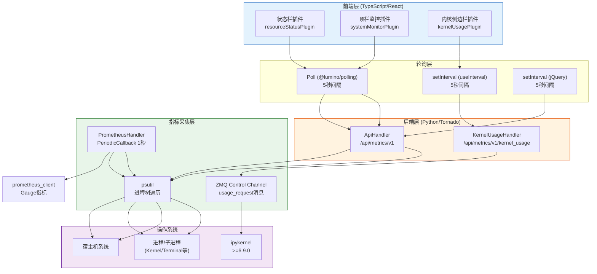

# 架构总览

jupyter-resource-usage 采用经典的 **Jupyter 前后端分离架构**：Python 后端（tornado + psutil）负责采集系统指标，TypeScript/React 前端负责展示。整体可以分为四层：

## 整体架构图



## 后端架构

后端是一个标准的 Jupyter Server Extension，核心由以下模块组成：

### 入口模块（server_extension.py）

`load_jupyter_server_extension(server_app)` 是扩展的入口点，Jupyter Server 启动时自动调用。它完成三件事：

1. 创建 `ResourceUseDisplay` 配置实例，存入 `settings["jupyter_resource_usage_display_config"]`
2. 注册两个 tornado 路由
3. 启动 Prometheus 指标定时更新（如未禁用）

### API 层（api.py）

两个 tornado RequestHandler：

- **ApiHandler**：处理 `/api/metrics/v1`，采集服务器进程树的内存/CPU/磁盘指标
- **KernelUsageHandler**：处理 `/api/metrics/v1/kernel_usage/get_usage/{kernel_id}`，通过ZMQ向单个内核发送usage_request

### 配置层（config.py）

`ResourceUseDisplay` 类继承 `traitlets.config.Configurable`，定义所有可配置项。支持通过配置文件、命令行参数、环境变量三种方式配置。

### 指标采集引擎（metrics.py）

`PSUtilMetricsLoader` 封装 psutil 调用，支持两类指标：
- **process 指标**：遍历当前进程及其所有子进程（recursive=True），求和
- **system 指标**：调用 psutil 模块级函数（如 `psutil.cpu_count()`, `psutil.virtual_memory()`）

通过 `PSUtilMetric` 自定义 TraitType，用户可以灵活配置要采集的 psutil 指标（函数名、参数、named tuple 属性选择）。

### Prometheus 集成（prometheus.py）

`PrometheusHandler` 实现 tornado 的 Callable 接口，被 `ioloop.PeriodicCallback` 每秒调用一次，更新 prometheus_client 的 Gauge 指标值。

## 前端架构

前端导出三个独立的 JupyterFrontEndPlugin，各有不同的UI定位：

### 1. 状态栏插件（resourceStatusPlugin）

- **ID**：`@jupyter-server/resource-usage:status-item`
- **核心类**：`ResourceUsageStatus`（继承 VDomRenderer）
- **模型**：`ResourceUsage.Model`（继承 VDomModel）
- **展示**：纯文本，在底部状态栏左侧显示
- **轮询**：使用 `@lumino/polling` 的 Poll，5秒间隔，支持 backoff 和 standby（页面隐藏时暂停）

### 2. 顶栏监控插件（systemMonitorPlugin）

- **ID**：`@jupyter-server/resource-usage:topbar-item`
- **核心组件**：`CpuView`, `MemoryView`, `DiskView`（React组件，通过 ReactWidget.create 包装）
- **展示**：彩色进度条，点击可切换为 Sparklines 趋势图
- **启用**：默认关闭，需通过 JupyterLab Settings Editor 启用
- **设置**：可配置标签文本和刷新频率（通过 ISettingRegistry）

### 3. 内核侧边栏插件（kernelUsagePlugin）

- **ID**：`@jupyter-server/resource-usage:kernel-panel-item`
- **核心类**：`KernelUsagePanel`（StackedPanel）+ `KernelUsageWidget`（ReactWidget）
- **展示**：右侧边栏面板，显示单个内核的详细资源信息
- **跟踪**：`KernelWidgetTracker` 跟踪当前活动的 Notebook/Console
- **轮询**：自定义 `useInterval` Hook，5秒间隔

### 经典 Notebook 前端（static/main.js）

对于 Notebook <7.0，使用 RequireJS + jQuery 实现，DOM 注入到顶部工具栏 `#maintoolbar-container`。

## 双 API 端点：服务器 vs 内核

理解架构的关键是区分两个API端点的不同职责：

| 维度 | `/api/metrics/v1` | `/api/metrics/v1/kernel_usage/...` |
|------|-------------------|-----------------------------------|
| **采集对象** | 服务器进程树（Server + 所有Kernel + Terminal） | 单个 ipykernel 进程 |
| **采集方式** | psutil 遍历进程树 | ZMQ control channel 发送 usage_request |
| **数据范围** | RSS/PSS内存、CPU%、磁盘用量 | kernel_cpu、kernel_memory、宿主机信息 |
| **ipykernel要求** | 无 | >= 6.9.0 |
| **超时** | 无（psutil本地调用） | 10秒 ZMQ Poller 超时 |
| **认证** | @web.authenticated | @web.authenticated |
| **线程池** | ThreadPoolExecutor(max_workers=5) | 无（asyncio + ZMQ） |

## 数据流路径

### 服务器指标数据流（状态栏/顶栏）

```
前端Poll每5秒触发
  → HTTP GET /api/metrics/v1
    → tornado路由到ApiHandler.get()
      → psutil.Process()获取当前进程+children(recursive=True)
      → 缓存Process实例（_cached_processes）用于cpu_percent()比较
      → 遍历进程调用memory_full_info()累加rss/pss
      → 如启用CPU：线程池调用cpu_percent()求和
      → 如启用磁盘：psutil.disk_usage()
      → 计算warning状态
      → 返回JSON
    → 前端Model._updateMetricsValues()解析响应
    → 单位自动转换（B→KB→MB→GB...）
    → 更新环形缓冲区（20个历史值）
    → stateChanged信号触发React重渲染
```

### 内核指标数据流（侧边栏）

```
用户切换Notebook/Console标签
  → KernelWidgetTracker.currentChanged信号
  → widget.tsx连接sessionContext.kernelChanged
  → 获取新kernel_id
  → useInterval每5秒触发
    → HTTP GET /api/metrics/v1/kernel_usage/get_usage/{kernel_id}
      → KernelUsageHandler.get(kernel_id)
      → 检查ipykernel版本（>=6.9.0）
      → 通过ZMQ control channel发送usage_request消息
      → zmq.asyncio.Poller等待10秒超时
      → 解析响应，注入host_usage_flag
      → 返回JSON
    → React组件更新Kernel Usage数据显示
```

### Prometheus指标数据流

```
ioloop.PeriodicCallback每秒触发
  → PrometheusHandler.__call__()
    → PSUtilMetricsLoader.memory_metrics()
    → PSUtilMetricsLoader.cpu_metrics()（如启用）
    → PSUtilMetricsLoader.disk_metrics()（如启用）
    → Gauge.set()更新prometheus_client指标值
  → Prometheus抓取端点/metrics时暴露最新值
```

## 关键设计决策

1. **CPU采集使用线程池**：`psutil.Process.cpu_percent()` 是阻塞调用（需比较两次时间点的CPU时间），放在 `ThreadPoolExecutor(max_workers=5)` 中通过 `@run_on_executor` 装饰器异步执行
2. **Process实例缓存**：`cpu_percent()` 首次调用返回0，需要缓存Process实例以便下次调用时有可比较的基准值
3. **PSS优先于RSS**：在Linux上PSS（Proportional Set Size）按比例分摊共享内存，比RSS更准确反映进程实际内存占用
4. **Poll backoff机制**：前端Poll使用 `@lumino/polling` 的backoff功能，请求失败时自动增加间隔（最大300秒），避免服务不可达时持续请求
5. **Standby暂停**：当页面不可见（`when-hidden`）时暂停轮询，减少不必要的资源消耗

## 相关概念

- [后端API与指标采集](03-backend-api.md) — ApiHandler详解、psutil采集逻辑
- [内核资源监控](04-kernel-usage.md) — ZMQ usage_request、KernelUsageHandler
- [配置系统详解](05-configuration.md) — ResourceUseDisplay配置项
- [状态栏显示](06-statusbar.md) — ResourceUsageStatus文本渲染
- [顶栏监控面板](07-topbar-monitor.md) — 进度条/Sparklines组件
