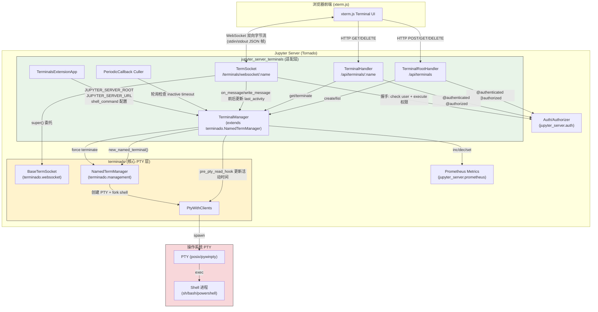

# jupyter_server_terminals 架构洞察（I阶段）

## 核心洞察

### 洞察 I-1：薄层委托架构——jupyter_server_terminals 作为 terminado 的 Jupyter 适配层

- **陈述**：jupyter_server_terminals 本身仅约 360 行核心 Python 代码（7 个文件），它不直接实现 PTY 进程管理或终端仿真逻辑——所有底层 PTY 创建、进程生命周期、WebSocket 字节流转发均委托给 `terminado` 库。jupyter_server_terminals 的真正职责是做三件事：①将 terminado 的 `NamedTermManager` 适配为 Jupyter Server 的 ExtensionApp + Configurable 体系；②注入 Jupyter 的认证/授权层（`@web.authenticated`、`@authorized`、`authorizer.is_authorized`）；③补充 Jupyter 生态需要的 REST API 模型、Prometheus 指标和闲置终端 Culler。
- **证据**：F-036（TerminalManager 继承 terminado 的 NamedTermManager）、F-040/F-042（create/terminate 均委托 super()）、F-051（TermSocket 继承 terminado 的 BaseTermSocket）、F-053（initialize 委托 BaseTermSocket.initialize）、F-054（origin_check 直接返回 True，因为 Tornado 已处理，terminado 的检查冗余）、F-058/F-059（on_message/write_message 先 super() 转发再更新活动时间）、F-005（terminado>=0.8.3 是核心依赖）
- **反常识**：初看源码会疑惑"终端逻辑在哪里"——答案是不在这个包里。TerminalManager.create() 只做了三件事：调用 terminado 的 new_named_terminal() 启动 PTY 进程 → monkey-patch last_activity 属性 → 递增 Prometheus 计数器。WebSocket 的字节流读写、终端 resize、stdin/stdout 转发全部由 terminado.websocket.TermSocket 和 terminado.management 内部完成。jupyter_server_terminals 在消息收发的"前后"各插入一个 _update_activity() 钩子（F-058/F-059）和 pre_pty_read_hook（F-050），实现双层活动追踪。这种"装饰器式"的扩展方式比继承重写更轻量。
- **行动**：概念文档需清晰区分"哪些逻辑在 jupyter_server_terminals 中"和"哪些逻辑委托给 terminado"，重点讲解适配层的三个职责（ExtensionApp 集成、认证注入、Jupyter 特有补充功能）。讲 WebSocket 时要说明双向字节流路径 terminado → WebSocket → 浏览器（xterm.js），以及 jupyter_server_terminals 仅在消息前后打活动时间戳。

### 洞察 I-2：为什么终端从 jupyter_server 核心拆分为独立扩展——可选依赖 + 平台 PTY 差异 + 安全边界

- **陈述**：终端功能在 Jupyter Server 2.0 之前是核心内置功能，之后被拆分为独立扩展包 jupyter_server_terminals。这一拆分有三个架构驱动因素：①**可选依赖**——PTY 功能需要 terminado + pywinpty（Windows），这些依赖较重且涉及原生编译，不是所有 Jupyter Server 部署场景都需要终端（如仅提供 Kernel 执行的 API 网关、nbconvert 服务、Jupyter Enterprise Gateway 等）；②**平台 PTY 差异**——Unix 使用 pty/posix openpty，Windows 需要 pywinpty 提供的 ConPTY 绑定（F-005），将平台特定逻辑隔离在独立包中可简化核心 jupyter_server 的跨平台测试矩阵；③**安全边界**——终端是直接访问服务器 shell 的最高权限接口，将其作为可禁用的扩展（通过 `terminals_enabled` 配置开关，F-022/F-024）使得安全加固部署可以完全不加载终端代码路径，减小攻击面。
- **证据**：F-005（pywinpty Windows-only 依赖）、F-015/F-016（强制 jupyter_server>=2.0 版本检查）、F-022（terminals_enabled 为 False 时整个终端功能短路返回）、F-055/F-056（WebSocket 握手需要 execute 权限）、F-024（禁用时兼容 nbclassic 的 settings 同步）、F-013（jupyter-config 默认启用扩展，但可通过配置关闭）、F-021（terminals_available 双重标志区分"配置启用"和"初始化成功"）
- **反常识**：从核心拆分为扩展包并不意味着功能降级——jupyter-config 默认自动启用（F-013），普通用户无感知。拆分的真正受益者是：①嵌入式部署（如 JupyterHub spawner 管理远程终端时不需要本地 PTY）、②安全敏感环境（关闭 terminals_enabled 后终端路由和管理器完全不初始化，F-025 证明 TermSocket 和 API handlers 都在 terminals_enabled 为 True 的分支内才注册）、③无 PTY 支持的容器/平台（如某些精简 Linux 容器无 /dev/ptmx）。此外，F-021 中 `terminals_available` 类变量的注释明确区分了"配置启用"和"实际可用"两个状态——即使 terminado 已安装，终端服务初始化也可能失败（如 PTY 设备不可用），此时 terminals_available 保持 False，不会导致整个 Server 启动失败。
- **行动**：概念文档应在简介中解释拆分动机，在扩展生命周期部分详细说明 terminals_enabled → initialize_settings → initialize_handlers 的三级开关机制，以及 terminals_available 双重标志的语义。Shell 配置部分需重点讲平台差异（Windows PowerShell vs Unix sh/login shell）。

## 架构图

### PTY 进程管理与 WebSocket 双向转发模型

### 扩展生命周期与三级开关

```mermaid
sequenceDiagram
    participant JS as Jupyter Server
    participant App as TerminalsExtensionApp
    participant TM as TerminalManager
    participant Culler as PeriodicCuller
    participant HDL as Handlers (WS + REST)

    Note over JS: 加载扩展 (_jupyter_server_extension_points)
    JS->>App: initialize_settings()
    alt terminals_enabled == False
        App-->>JS: terminals_available = False, 直接返回
    else terminals_enabled == True
        App->>App: initialize_configurables()
        Note over App: 确定 shell 命令<br/>设置 JUPYTER_SERVER_ROOT/URL
        App->>TM: TerminalManager(shell_command, extra_env, parent)
        App-->>JS: terminals_available = True<br/>terminal_manager 注册到 settings
    end

    JS->>App: initialize_handlers()
    alt terminals_enabled == False
        App-->>JS: 仅同步 terminals_available 到 web_app.settings<br/>(兼容 nbclassic)
    else terminals_enabled == True
        App->>HDL: 注册 /terminals/websocket/(\w+) → TermSocket
        App->>HDL: 注册 /api/terminals, /api/terminals/(\w+) → API Handlers
        App->>JS: terminal_manager & terminals_available → web_app.settings
    end

    Note over JS,HDL: === 运行期 ===
    HDL->>TM: POST /api/terminals → create()
    TM->>TM: new_named_terminal() → monkey-patch last_activity
    TM->>Culler: _initialize_culler() (首次创建时)
    Note over Culler: PeriodicCallback 每 cull_interval 秒<br/>检查 inactive timeout
    HDL->>TM: GET /api/terminals → list()
    HDL->>TM: DELETE /api/terminals/:name → terminate()
    Note over HDL,TM: WebSocket on_message/write_message<br/>→ _update_activity()
    TM->>TM: pre_pty_read_hook → 更新 last_activity

    Note over JS,HDL: === 关闭期 ===
    JS->>App: stop_extension()
    App->>App: cleanup_terminals()
    App->>TM: terminate_all() (force=True)
    TM->>TM: 遍历所有终端逐个 terminate
```

