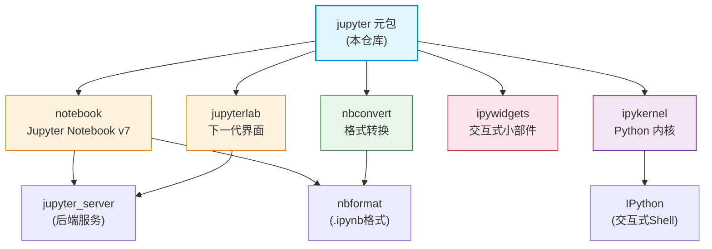

# Jupyter 元包与 Project Jupyter 简介

## 什么是 Project Jupyter

**Project Jupyter** 是一个大型的伞形项目（umbrella project），涵盖众多软件工具和标准，全部围绕**交互式计算（interactive computing）**与**计算笔记本（computational notebooks）**展开。

"Jupyter" 这个名称来源于项目最初支持的三种编程语言：**Ju**lia、**Pyt**hon、**R**。虽然名字来源于这三种语言，但 Jupyter 如今已支持数百种编程语言内核。

当人们说"Jupyter"时，可能指代不同的东西，这经常造成混淆：

| 指代 | 说明 |
|------|------|
| Project Jupyter | 整个伞形开源项目及其社区 |
| Jupyter Notebook | 经典的 Notebook Web 应用 |
| JupyterLab | 下一代可扩展的 Notebook 界面 |
| `.ipynb` 文件 | Jupyter Notebook 文件格式 |
| `jupyter` 命令 | 命令行入口工具 |
| `jupyter` PyPI 包 | 本文讨论的元包（metapackage） |

## jupyter 元包是什么

`pip install jupyter` 安装的 **jupyter 包**（即本教程分析的 jupyter/jupyter 仓库）是一个**元包（metapackage）**——它本身**不包含任何 Python 源代码**，只通过 `install_requires` 声明对其他五个核心组件的依赖，实现"一次安装，获取全套"的便捷体验。

元包的 `setup.py` 中 `py_modules = []`（空列表），不发布任何可 import 的模块。它的核心价值有两方面：

1. **一站式安装入口**：通过依赖声明拉取 notebook、nbconvert、ipykernel、ipywidgets、jupyterlab 五个核心包
2. **文档门户**：仓库的 `docs/` 目录是整个 Jupyter 生态的官方文档中心，使用 Sphinx + MyST Markdown 构建，发布在 [docs.jupyter.org](https://docs.jupyter.org)

## 计算笔记本（Computational Notebook）

计算笔记本是 Jupyter 的核心概念，源自 Donald Knuth 提出的**文学编程（literate programming）**理念——将解释性文本与计算机代码结合，让程序和复杂思想能被更广泛的人群理解。

一个 Notebook 文件（`.ipynb` 格式）可以包含：

- **可执行代码单元**（Code Cells）：Python/R/Julia 等语言代码
- **Markdown 文本单元**（Markdown Cells）：叙述性文字、公式、标题
- **富媒体输出**：图表、图片、3D 模型、交互式小部件、HTML
- **元数据**：内核信息、单元格标签、执行计数

与传统脚本编程相比，Notebook 的核心差异在于**REPL 驱动的交互式工作流**：你可以逐单元执行代码、查看中间结果、修改变量后继续执行，而不需要每次从头运行整个程序。

## 为什么 jupyter 元包值得学习

虽然 jupyter 元包没有实现代码，但它是理解整个 Jupyter 生态的**最佳入口**：

- **全局视野**：仓库文档系统性地介绍了 Jupyter 的架构、子项目关系、配置系统、目录规范
- **架构权威来源**：`docs/source/projects/architecture/` 目录包含官方架构说明
- **配置统一入口**：`jupyter` 命令、配置系统、目录结构等跨子项目的通用概念在此定义
- **选型决策指南**：`use/using.rst` 包含决策树图，帮助用户根据需求选择子项目

直接阅读 jupyter-core、jupyter-client 等实现包容易"只见树木不见森林"，先从元包文档建立全局认知是更高效的学习路径。

## 元包的依赖关系

虚线框外的 jupyter-core、jupyter-client 等基础包不直接被元包依赖，但通过 notebook、ipykernel 等传递安装。

## 本教程的学习路径

本教程基于 jupyter/jupyter 仓库（v1.2.0.dev0）的文档与配置深度阅读生成，按以下路径组织：

### 入门基础

1. [什么是计算笔记本与 Jupyter 架构](01-what-is-jupyter.md) — 计算笔记本理念、REPL、Kernel、客户端-服务器架构
2. [Jupyter 生态架构总览](02-ecosystem-architecture.md) — 核心组件、子项目分类、架构图解读
3. [jupyter 命令与子命令发现](03-jupyter-command.md) — jupyter 命令行工具、子命令机制、路径查询

### 核心机制

4. [通用配置系统](04-config-system.md) — traitlets 配置、配置文件生成、命令行覆盖
5. [目录结构与文件位置](05-directories.md) — config/data/runtime 三类分离、环境变量、搜索路径
6. [Kernel 架构](06-kernel-architecture.md) — IPython 内核、三种内核开发方式、多前端连接
7. [Notebook 文件格式](07-notebook-format.md) — .ipynb JSON 结构、nbformat、信任签名
8. [客户端-服务器架构详解](08-client-server.md) — Server 角色、ZMQ 通信、Jupyter Protocol

### 交互与输出

9. [交互式控件与富显示（ipywidgets）](09-widgets-display.md) — Widget 架构、interact 装饰器、富显示协议、Voilà
10. [Notebook 作为文档与转换（nbconvert）](10-notebook-doc-convert.md) — 六阶段转换流程、输出格式、模板系统、papermill 参数化

### 部署与管理

11. [JupyterHub 多用户部署](11-jupyterhub.md) — Hub/Proxy/Authenticator/Spawner 四组件、部署模式
12. [安装与环境管理](12-installation.md) — pip/conda 安装、虚拟环境与 Kernel 关系、多 Kernel 工作流

### 实战示例

- [创建你的第一个 Notebook](../examples/01-first-notebook.md)
- [配置基础操作](../examples/02-config-basics.md)
- [多环境 Kernel 管理](../examples/03-multi-env-kernels.md)

## 前置知识

阅读本教程需要以下基础：

- **Python 基础**：能使用 Python 进行基本编程，理解包安装（pip/conda）
- **命令行基础**：能在终端执行命令，理解环境变量概念
- **Web 基础概念**：了解客户端-服务器模式、HTTP、浏览器基本工作原理

## 相关概念

- [什么是计算笔记本与 Jupyter 架构](01-what-is-jupyter.md) — 理解 Jupyter 的第一步
- [Jupyter 生态架构总览](02-ecosystem-architecture.md) — 建立全局视野
- [Jupyter 元包源码信源登记](../references/jupyter-metasource.md) — 源码路径、版本信息、文件清单
