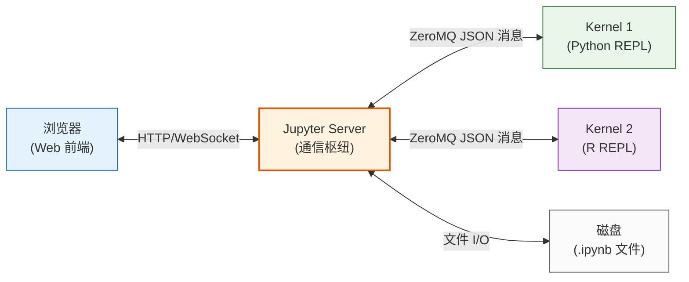

# 什么是计算笔记本与 Jupyter 核心架构

## 从文学编程到计算笔记本

计算笔记本（Computational Notebook）的思想根源是 Donald Knuth 提出的**文学编程（Literate Programming）**——将解释性自然语言文本与可执行计算机代码交织在一起，让程序不仅能被机器执行，也能被人类阅读理解。

传统编程模式中，代码和文档是分离的：源代码文件给机器执行，注释和外部文档给人看。而笔记本模式将两者融合在同一个文档中，形成**叙事+代码+输出**三位一体的可复现文档。

现代数字笔记本文件（`.ipynb`）在此基础上进一步支持富媒体：图片、交互式图表、3D 模型、HTML 组件、数学公式等都可以嵌入笔记本中。Jupyter 笔记本被广泛用于：

- **科学研究**：处理 JWST 太空望远镜数据、生成黑洞照片、分析引力波
- **数据科学**：数据清洗、可视化、建模、报告一体化
- **教育教学**：交互式编程教学、可执行教材
- **企业分析**：商业智能报告、自动化报表
- **个人笔记**：学习记录、可复现实验

## REPL：交互式编程的核心

Jupyter Notebook 的交互体验建立在 **REPL（Read-Eval-Print-Loop，读取-求值-输出-循环）** 之上。

REPL 是一种编程环境，它：

1. **Read（读取）**：等待用户输入代码片段
2. **Eval（求值）**：执行输入的代码
3. **Print（输出）**：将执行结果打印显示
4. **Loop（循环）**：回到第一步，等待下一次输入

```
用户输入代码 → 读取 → 执行 → 显示结果 → 保留变量在内存中 → 等待下一次输入
```

REPL 的关键特性是**状态保持**：前一次执行创建的变量、导入的模块、定义的函数在后续执行中依然可用。这与传统"编写完整程序→编译→运行→退出"的模式形成鲜明对比——你可以逐步构建解决方案，每一步都基于之前的结果。

终端中的 `python` 或 `ipython` 命令就是典型的 REPL，而 Jupyter 将 REPL 体验提升到了 Web 浏览器中，支持富文本和可视化输出。

## Kernel：笔记本背后的执行引擎

在 Jupyter 架构中，每个打开的 Notebook 对应一个独立运行的 **Kernel（内核）**。Kernel 本质上是一个**编程语言专属的 REPL 进程**：

- 它是操作系统层面的独立进程
- 它持有用户代码创建的所有变量和对象（保持在内存中）
- 它负责执行用户发送的代码单元
- 它由 Jupyter Server 创建、管理和销毁

> **关键理解**：Kernel 不知道 Notebook 文档的存在。它只接收独立的代码单元并执行，将结果返回。Notebook 文件的保存/加载完全由 Server 负责，与 Kernel 无关。

这意味着即使没有对应语言的 Kernel，你仍然可以**编辑** Notebook 文件（查看代码、文本、输出），只是无法**运行**代码。

### IPython：默认 Python 内核

Jupyter 的默认 Python 内核是 **ipykernel**，它包装了 **IPython** 的执行引擎。IPython 提供了增强的 REPL 功能：

- **Magic Commands（魔法命令）**：以 `%` 或 `%%` 开头的特殊命令，如 `%timeit`、`%matplotlib inline`
- **Tab 自动补全**：智能代码补全
- **富对象显示**：HTML、图片、图表的内联渲染
- **历史记录**：跨会话的输入历史
- **调试器集成**：`%debug` 交互式调试

### 一个 Kernel 可以连接多个前端

Jupyter 架构支持一个 Kernel 同时被多个前端连接。这意味着你可以：

- 在 JupyterLab 中打开一个 Notebook
- 同时在终端中用 `jupyter console --existing` 连接同一个 Kernel
- 两边共享同一组变量，一边修改变量，另一边立即看到效果

## 客户端-服务器架构

Jupyter 采用**客户端-服务器（Client-Server）架构**，这与许多人对"Notebook 只是一个网页"的直觉不同。当你在本地运行 `jupyter notebook` 或 `jupyter lab` 时，实际上有多个独立进程协同工作：



### 三个角色的职责

| 组件 | 职责 | 典型实现 |
|------|------|---------|
| **前端（Client）** | 提供用户界面：代码编辑、输出渲染、Notebook 组织 | JupyterLab、Notebook v7、Jupyter Console、QtConsole |
| **Server** | 通信枢纽：管理 Kernel 生命周期、代理消息、读写 Notebook 文件 | jupyter_server |
| **Kernel** | 执行代码：语言专属的 REPL 进程，持有计算状态 | ipykernel、IRkernel、IJulia、xeus-cling 等 |

**重要细节**：浏览器前端、Kernel、磁盘上的 .ipynb 文件三者之间**不能直接通信**，所有交互都必须经过 Jupyter Server。Server 是唯一的"中间人"：

- 浏览器 → Server → Kernel：发送代码执行请求
- Kernel → Server → 浏览器：返回执行结果
- 浏览器 → Server → 磁盘：保存 Notebook
- 磁盘 → Server → 浏览器：加载 Notebook

这种解耦设计带来了极大的灵活性：

1. **多前端支持**：同一 Kernel 可以被 Web 界面、终端、IDE 插件等不同前端共享
2. **远程执行**：Server 和 Kernel 可以运行在远程服务器上，浏览器只需访问 URL
3. **多语言支持**：前端不关心 Kernel 用什么语言，只要遵循协议即可
4. **可扩展性**：第三方可以开发新的前端、新的 Kernel、新的 Server 扩展

## Jupyter Protocol：标准化通信

前端与 Kernel 之间的通信遵循 **Jupyter Protocol**（Jupyter 消息协议），这是 Jupyter 生态互操作性的基石。

协议定义在 [jupyter-client](https://jupyter-client.readthedocs.io/en/latest/messaging.html) 包中，核心内容包括：

- **传输层**：使用 ZeroMQ（ZMQ）套接字进行进程间通信
- **消息格式**：JSON 格式的标准化消息结构
- **通道模型**：五个独立的通信通道
  - **Shell 通道**：代码执行请求/响应（主通道）
  - **IOPub 通道**：广播输出（stdout、stderr、显示数据、Kernel 状态）
  - **Stdin 通道**：Kernel 请求用户输入（如 `input()`）
  - **Control 通道**：控制命令（中断、关闭等）
  - **Heartbeat 通道**：心跳检测，监控 Kernel 存活
- **消息类型**：execute_request、execute_reply、stream、display_data、error 等

任何实现了该协议的程序都可以成为 Jupyter 前端或 Kernel，无需依赖 Jupyter 官方代码。这是 Jupyter 生态能支持 100+ 种语言内核的根本原因。

## 反直觉要点

以下几点经常让初学者困惑：

1. **"安装 Jupyter"不等于安装了一个程序**：`pip install jupyter` 安装的是一组协同工作的包，不是单一应用
2. **关闭浏览器标签页不会丢失变量**：Kernel 是独立进程，关闭浏览器后 Kernel 继续运行，重新连接可以恢复
3. **Notebook 文件不包含活动状态**：`.ipynb` 文件保存的是代码、文本和已有的输出，但不保存 Kernel 内存中的变量（重新打开需要重新运行代码）
4. **Server 不执行代码**：Jupyter Server 只负责消息路由和文件管理，代码执行完全在 Kernel 进程中
5. **编辑 Notebook 不需要 Kernel**：你可以用任何文本编辑器编辑 .ipynb JSON 文件，或在没有 Kernel 的情况下查看 Notebook

## 相关概念

- [Jupyter 生态架构总览](02-ecosystem-architecture.md) — 了解各子项目如何在这个架构中定位
- [Kernel 架构详解](06-kernel-architecture.md) — 深入 Kernel 三种开发方式和通信细节
- [客户端-服务器架构详解](08-client-server.md) — Server 角色、ZMQ 五通道、消息流程
- [Notebook 文件格式](07-notebook-format.md) — .ipynb 的 JSON 结构
