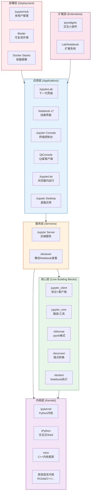

# Jupyter 生态架构总览

Jupyter 不是单一软件，而是一个由数十个子项目组成的生态系统。理解这个生态的关键是掌握其**分层架构**和**分类体系**。

## 架构分层

Jupyter 生态可以按从底到顶的方式分为五层：



### 核心构建块（Core Building Blocks）

这是 Jupyter 架构的地基，其他一切都构建在它们之上：

| 项目 | 职责 | PyPI 包 |
|------|------|---------|
| jupyter_core | 核心工具函数、路径发现、配置系统基础 | `jupyter_core` |
| jupyter_client | Jupyter Protocol 实现、Kernel 管理、ZMQ 通信 | `jupyter_client` |
| nbformat | `.ipynb` 文件格式的读写、验证、数据模型 | `nbformat` |
| nbconvert | Notebook 格式转换（HTML/PDF/Markdown/LaTeX/RST） | `nbconvert` |
| nbclient | Notebook 编程式执行客户端（命令行 `jupyter execute`） | `nbclient` |
| traitlets | 配置系统基础（所有 Jupyter 应用共用） | `traitlets` |

### 内核层（Kernels）

Kernel 是代码执行的实际引擎：

| 项目 | 类型 | 说明 |
|------|------|------|
| IPython | 交互式 Shell | 增强 Python REPL，提供魔法命令、自动补全等 |
| ipykernel | Python 内核 | IPython 的 Jupyter 内核包装器，默认 Python 内核 |
| xeus | C++ 内核框架 | 原生实现 Jupyter Protocol，不依赖 Python 运行时 |
| ipyparallel | 并行计算 | 基于 IPython 内核的轻量级并行计算框架 |

社区维护了数百种语言的内核，包括 R（IRkernel）、Julia（IJulia）、C++（xeus-cling）、SQL（xeus-sql）、Bash 等。

### 内核开发的三种模式

根据 jupyter 元包文档，开发新语言内核有三种路径：

| 模式 | 说明 | 适用场景 | 示例 |
|------|------|---------|------|
| **Wrapper Kernel** | 复用 ipykernel 的通信机制，只实现核心执行部分 | 有 Python 包装器的语言 | octave_kernel、bash_kernel |
| **Native Kernel** | 在目标语言中从头实现执行和通信 | 社区维护的成熟语言内核 | IJulia、IHaskell |
| **Xeus Kernel** | 基于 xeus C++ 库实现，仅实现语言解释器部分 | 有 C/C++ API 的语言 | xeus-cling、xeus-sql |

### 服务层（Services）

| 项目 | 职责 |
|------|------|
| Jupyter Server | 后端服务：Kernel 生命周期管理、REST API、WebSocket 代理、文件服务 |
| nbviewer | 将 URL 指向的 Notebook 用 nbconvert 转为静态 HTML 展示 |

### 应用层（User Interfaces）

Jupyter 提供多种用户界面适应不同场景：

| 应用 | 特点 | 适用场景 |
|------|------|---------|
| **JupyterLab** | 可扩展、多标签页、丰富布局、集成终端/调试器 | 日常开发、复杂工作流 |
| **Notebook v7** | 基于 JupyterLab 后端的简化界面 | 教学、简单使用、偏好经典界面的用户 |
| **Jupyter Console** | 终端 REPL 界面 | 服务器环境、快速交互 |
| **QtConsole** | Qt 富客户端界面，支持富输出 | 喜欢 GUI 但不需要浏览器的场景 |
| **JupyterLite** | 完全在浏览器中运行（WebAssembly），无需安装 | 快速试用、静态网站嵌入 |
| **Jupyter Desktop** | Electron 封装的桌面应用 | 偏好原生应用体验 |

### 部署层（Deployment & Infrastructure）

| 项目 | 职责 |
|------|------|
| JupyterHub | 多用户 Hub：认证、Spawner、代理，支持单机/Kubernetes/云 |
| Binder/BinderHub | 将 Git 仓库转为可交互 Notebook 环境 |
| Docker Stacks | 官方维护的 Jupyter Docker 镜像层级体系 |
| dockerspawner | JupyterHub 的 Docker Spawner 插件 |
| kernel_gateway | Jupyter Kernel 的 HTTP/WebSocket 网关 |

### 扩展层

| 项目 | 职责 |
|------|------|
| ipywidgets | 交互式小部件（滑块、按钮、图表等），前后端双向通信 |
| JupyterLab Extensions | JupyterLab 的扩展系统（TypeScript/JavaScript） |
| voila | 将 Notebook 转为独立 Web 仪表盘应用 |

## 子项目分类体系

jupyter 元包文档使用以下分类组织子项目：

```
Jupyter 子项目
├── 用户界面 (User Interfaces)
│   ├── JupyterLab
│   ├── Jupyter Notebook
│   ├── Jupyter Desktop
│   ├── JupyterLite
│   ├── Jupyter Console
│   └── QtConsole
├── 内核 (Kernels)
│   ├── IPython / ipykernel
│   ├── xeus 系列
│   └── 社区语言内核（100+）
├── 核心构建块 (Core)
│   ├── jupyter_client
│   └── jupyter_core
├── 格式与转换 (Formatting & Conversion)
│   ├── nbconvert
│   └── nbformat
├── 执行 (Execution)
│   └── nbclient
├── 部署与基础设施 (Deployment)
│   ├── JupyterHub
│   ├── Binder
│   ├── nbviewer
│   ├── dockerspawner
│   └── docker-stacks
├── 教育 (Education)
│   └── nbgrader
├── IPython 子项目
│   ├── ipykernel
│   ├── ipyparallel
│   └── ipywidgets
└── 孵化器 (Incubator)
    └── sparkmagic
```

## nbconvert 转换流程

Notebook 转其他格式由 nbconvert 完成，采用三步流水线：


1. **Preprocessors**：在内存中修改 Notebook。例如 `ExecutePreprocessor` 运行代码并更新输出
2. **Exporter**：使用模板将 Notebook 转换为目标格式。大多数导出器使用 Jinja2 模板
3. **Postprocessors**：对导出的文件进行后处理

nbviewer 网站就是使用 nbconvert 的 HTML Exporter 实现的。

## 如何选择需要的包

jupyter 文档提供了一个决策树帮助用户选择工具：

- **想在线试用、不想安装** → [try.jupyter.org](https://try.jupyter.org)（基于 Binder）
- **个人本地使用 Notebook** → 安装 JupyterLab 或 Notebook（`pip install jupyter`）
- **团队/班级/多用户部署** → JupyterHub
- **转换 Notebook 为其他格式** → nbconvert
- **使用其他编程语言** → 安装对应语言的内核
- **定制交互组件** → ipywidgets + JupyterLab 扩展
- **分享静态 Notebook** → nbviewer

## 元包包含的组件 vs 生态全景

需要注意，`pip install jupyter`（即本元包）只安装五个核心依赖：

| 包含 | 不包含但属于生态 |
|------|-----------------|
| notebook | JupyterHub |
| jupyterlab | Jupyter Console / QtConsole |
| nbconvert | JupyterLite |
| ipykernel | xeus 内核 |
| ipywidgets | voila / nbgrader |
| （传递安装 jupyter_core, jupyter_client, nbformat, nbclient, jupyter_server, traitlets, IPython） | docker-stacks / Binder |

这是刻意设计——元包只包含"开箱即用"所需的最小组合集，其他工具按需安装。

## 治理结构

Jupyter 项目采用分布式治理：

- **Jupyter Executive Council（执行委员会）**：负责项目级目标和策略决策
- **子项目自治**：各子项目有独立的维护团队和发布节奏
- **横向团队**：Accessibility（无障碍）、Security（安全）、Community（社区）、Documentation（文档）等跨子项目团队
- **开源社区**：全球志愿者和贡献者驱动开发

## 相关概念

- [什么是计算笔记本与 Jupyter 核心架构](01-what-is-jupyter.md) — REPL/Kernel/Client-Server 基础
- [Kernel 架构详解](06-kernel-architecture.md) — 内核开发三种模式深入
- [客户端-服务器架构详解](08-client-server.md) — ZMQ 五通道通信细节
- [Notebook 作为文档与转换](10-notebook-doc-convert.md) — nbconvert 转换工具链
- [安装与环境管理](12-installation.md) — 安装与环境配置实战
