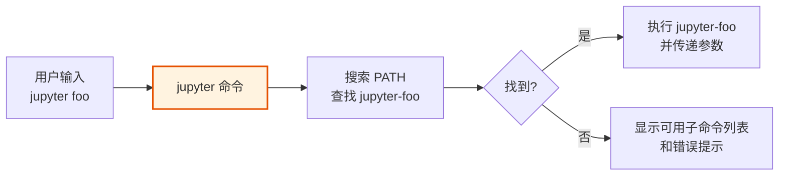

# jupyter 命令与子命令发现机制

## 命令概述

`jupyter` 命令是 Jupyter 生态的统一命令行入口。它的基本语法是：

```bash
jupyter <subcommand> [options]
```

例如：

```bash
jupyter notebook      # 启动 Notebook Server
jupyter lab           # 启动 JupyterLab
jupyter console       # 启动终端控制台
jupyter nbconvert     # 转换 Notebook 格式
jupyter execute       # 命令行执行 Notebook
```

## 子命令动态发现机制

`jupyter` 命令最核心的设计特点是：**它本身不实现任何子命令的功能，而是作为子命令的命名空间路由器**。

子命令的发现规则是：当你在系统 `PATH` 中存在一个名为 `jupyter-foo` 的可执行文件时，它就会自动成为 `jupyter foo` 子命令。



这意味着：

- **安装新包会自动添加子命令**：`pip install jupyterlab` 后，`jupyter lab` 立即可用，无需注册
- **第三方可以扩展**：任何包都可以通过提供 `jupyter-xxx` 入口点添加新子命令
- **子命令不是硬编码的**：`jupyter --help` 的输出取决于当前安装了哪些 Jupyter 相关包

这种设计类似于 `git` 命令的子命令机制（`git-foo` 可执行文件自动成为 `git foo`），是 Unix 哲学中"做一件事并做好"的体现——`jupyter` 命令只负责路由，具体功能由各子命令包实现。

## 全局选项

无论运行哪个子命令，`jupyter` 命令本身提供以下全局选项：

| 选项 | 说明 |
|------|------|
| `-h`, `--help` | 显示帮助信息，包括当前可用的子命令列表 |
| `--config-dir` | 显示 Jupyter 配置目录路径 |
| `--data-dir` | 显示 Jupyter 数据目录路径 |
| `--runtime-dir` | 显示 Jupyter 运行时目录路径 |
| `--paths` | 显示所有 Jupyter 目录和搜索路径（详细列表） |
| `--json` | 以机器可读的 JSON 格式输出目录和搜索路径 |

### 常用路径查询示例

```bash
# 查看配置目录
jupyter --config-dir
# 输出示例: /home/user/.jupyter

# 查看数据目录
jupyter --data-dir
# 输出示例: /home/user/.local/share/jupyter

# 查看所有路径（配置、数据、运行时及搜索路径）
jupyter --paths

# JSON 格式输出（适合脚本解析）
jupyter --paths --json
```

这些路径查询选项由 jupyter_core 包提供实现，不依赖任何子应用。

## 启动 Notebook Server

最常用的子命令是启动 Notebook Server：

```bash
# 基本启动
jupyter notebook

# 指定端口（默认 8888）
jupyter notebook --port 9999

# 不打开浏览器
jupyter notebook --no-browser

# 启动 JupyterLab
jupyter lab

# 启动时打开特定 Notebook
jupyter notebook my_notebook.ipynb
```

启动后，终端会显示类似以下信息：

```
[I 08:58:24.417 NotebookApp] Serving notebooks from local directory: /Users/user
[I 08:58:24.417 NotebookApp] 0 active kernels
[I 08:58:24.417 NotebookApp] The Jupyter Notebook is running at: http://localhost:8888/
[I 08:58:24.417 NotebookApp] Use Control-C to stop this server and shut down all kernels (twice to skip confirmation).
```

Server 启动后会自动打开默认浏览器访问 `http://localhost:8888`，显示 **Notebook Dashboard**（文件浏览器界面），列出启动目录中的 Notebook、文件和子目录。

> **最佳实践**：通常在包含 Notebook 的最高层目录启动 Server（通常是项目根目录或 home 目录），这样可以浏览和访问该目录下的所有文件。

### 端口自动搜索

默认端口是 8888。如果该端口被占用（例如已在运行另一个 Server），Jupyter 会自动搜索下一个可用端口（8889、8890...）。

## 命令行执行 Notebook

`jupyter execute` 子命令允许在终端中直接执行 Notebook 文件，无需启动 Web 界面：

```bash
# 执行单个 Notebook
jupyter execute notebook.ipynb

# 执行多个 Notebook
jupyter execute notebook1.ipynb notebook2.ipynb

# 允许错误（遇到错误不中断，继续执行后续单元）
jupyter execute notebook.ipynb --allow-errors
```

默认情况下，Notebook 中的错误会引发异常并打印到终端。`--allow-errors` 标志会抑制错误，继续执行所有单元。

对于更复杂的 Notebook 参数化执行需求（如传递参数、批量运行），推荐使用 [papermill](https://pypi.org/project/papermill/) 库。

## 内核相关命令

内核管理也是通过 jupyter 子命令完成的（这些子命令由 jupyter_client 和 ipykernel 包提供）：

```bash
# 列出已安装的内核
jupyter kernelspec list

# 安装新内核
jupyter kernelspec install /path/to/kernel

# 启动控制台连接已有内核
jupyter console --existing
```

## 帮助系统

查看帮助信息是了解可用子命令和选项的最佳方式：

```bash
# 查看 jupyter 命令的通用帮助和可用子命令
jupyter --help

# 查看特定子命令的帮助
jupyter notebook --help

# 查看所有配置选项（包括没有短名的选项）
jupyter notebook --help-all
```

`--help-all` 会列出所有可配置项，包括配置类名和属性名，这对于编写配置文件很有用。

## 子命令的实现入口点

从打包角度看，`jupyter-xxx` 子命令通常通过 Python 包的 `console_scripts` 入口点（entry points）注册。例如：

- `jupyter notebook` → notebook 包注册的 `jupyter-notebook` 入口点
- `jupyter lab` → jupyterlab 包注册的 `jupyter-lab` 入口点
- `jupyter nbconvert` → nbconvert 包注册的 `jupyter-nbconvert` 入口点

这种机制基于 Python packaging 的 entry points 规范，由 jupyter_core 的命令发现逻辑处理。

## 反直觉要点

1. **jupyter 命令不知道子命令的存在**：它只是 PATH 搜索器，子命令由独立包提供
2. **`jupyter notebook` 和 `jupyter-notebook` 是一样的**：后者可以直接在命令行调用
3. **PATH 顺序很重要**：如果 PATH 中有多个同名的 `jupyter-foo`，第一个被找到的会被使用
4. **安装后不需要额外注册**：pip 安装后入口点自动放入 Python 环境的 bin 目录

## 相关概念

- [通用配置系统](04-config-system.md) — 了解如何配置各子命令的行为
- [目录结构与文件位置](05-directories.md) — --config-dir/--data-dir/--runtime-dir 对应的目录详解
- [Jupyter 生态架构总览](02-ecosystem-architecture.md) — 各子命令对应的子项目
- [创建你的第一个 Notebook](../examples/01-first-notebook.md) — 实战：启动和使用 Notebook
- [多环境 Kernel 管理](../examples/03-multi-env-kernels.md) — 更多命令行实用技巧
