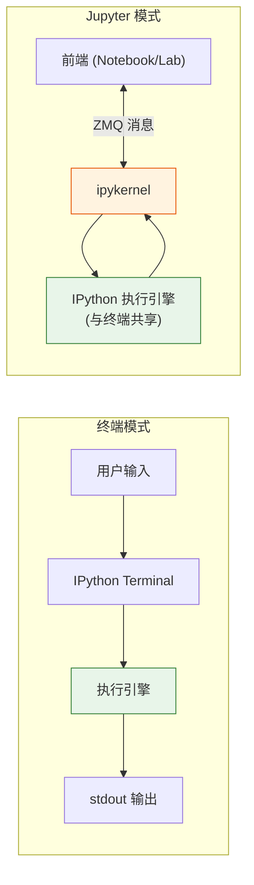
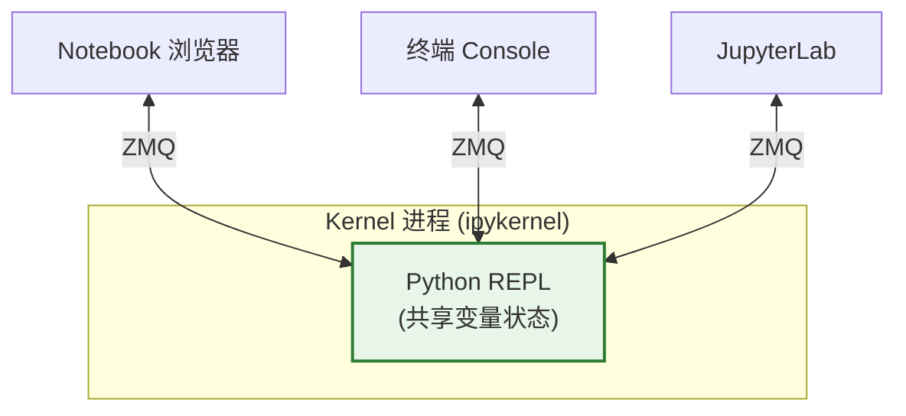
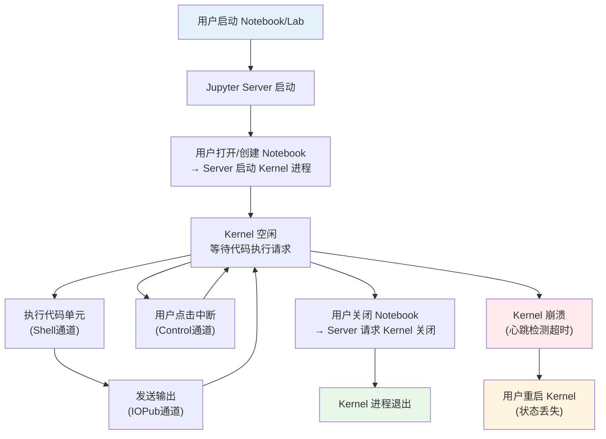

# Kernel 架构

Kernel（内核）是 Jupyter 架构中负责执行代码的独立进程。理解 Kernel 的角色、类型和通信机制是深入 Jupyter 的关键。

## Kernel 的本质

Kernel 是一个**编程语言专属的 REPL 进程**，它：

1. 是操作系统级别的独立进程（OS process）
2. 实现了 Jupyter 消息协议（Jupyter Protocol）
3. 持有用户代码创建的变量和对象（状态保持在内存中）
4. 接收代码执行请求，返回执行结果
5. 可以被多个前端同时连接

### Kernel 不知道 Notebook

这是 Jupyter 架构中一个关键的设计决策：**Kernel 对 Notebook 文档一无所知**。它不会读写 `.ipynb` 文件，不知道单元格的概念，也不关心输出最终如何呈现。Kernel 只做一件事：接收代码片段并执行，返回结果。

Notebook 文件的保存、加载、单元格管理完全由 Jupyter Server 和前端负责。代码单元被从 Notebook 中提取出来，通过 Server 发送给 Kernel，Kernel 返回的输出再由 Server 传回前端并嵌入 Notebook 文档。

这种职责分离使得：

- Kernel 可以专注于语言执行，不需要关心文档格式
- 前端可以在没有 Kernel 的情况下编辑和查看 Notebook
- 同一个 Kernel 可以被 Notebook、Console、IDE 插件等不同前端共享

## IPython 与 ipykernel

Jupyter 的默认 Python 内核由两个项目协作提供：

### IPython：增强的 Python REPL

[IPython](https://ipython.org) 是 Jupyter 的前身，提供强大的交互式 Python 环境：

- **增强 Shell**：语法高亮、自动缩进、Tab 补全
- **Magic Commands（魔法命令）**：以 `%`（行魔法）或 `%%`（单元格魔法）开头的特殊命令
  - `%timeit`：测量代码执行时间
  - `%matplotlib inline`：Matplotlib 图表内联显示
  - `%debug`：进入交互式调试器
  - `%run script.py`：运行外部脚本
  - `%pwd`、`%cd`：文件系统导航
  - `%%bash`/`%%script`：运行其他语言的代码
- **富对象显示**：HTML、图片、音频、视频、LaTeX 等的内联渲染
- **历史记录**：跨会话的输入历史，支持 `_`、`__`、`___` 访问最近三个输出
- **`?` 和 `??`**：对象帮助和源码查看

### ipykernel：IPython 的 Jupyter 内核包装

[ipykernel](https://ipykernel.readthedocs.io) 将 IPython 的执行引擎包装为符合 Jupyter Protocol 的 Kernel：

- 启动 IPython 解释器作为执行引擎
- 通过 ZeroMQ 套接字与前端通信
- 处理 Jupyter Protocol 消息（execute_request、complete_request 等）
- 将 IPython 的输出（stdout/stderr/display_data）转为 Jupyter 消息发送给前端

终端中的 `ipython` 命令和 Notebook 中的 Python Kernel 共享同一套核心执行代码，区别仅在于通信方式：终端使用 stdin/stdout，Kernel 使用 ZeroMQ。



## 三种内核开发模式

Jupyter 支持三种方式开发新语言的内核：

### 1. Wrapper Kernel（包装内核）

复用 ipykernel 的通信机制，只实现核心的代码执行部分。

**适用场景**：目标语言有良好的 Python 包装器，或者实现完整通信协议成本太高。

**工作方式**：继承 `ipykernel.kernelbase.Kernel`，实现 `do_execute()` 等方法。ipykernel 处理 ZMQ 通信、消息解析、心跳等所有协议细节。

**示例**：`bash_kernel`（Bash）、`octave_kernel`（Octave）

```python
# Wrapper Kernel 最小示例（概念演示）
from ipykernel.kernelbase import Kernel

class MyKernel(Kernel):
    implementation = 'MyKernel'
    implementation_version = '1.0'
    language = 'mylang'
    language_version = '1.0'
    language_info = {'name': 'mylang', 'mimetype': 'text/plain'}
    banner = "My Custom Kernel"

    def do_execute(self, code, silent, store_history=True,
                   user_expressions=None, allow_stdin=False):
        # 在这里执行 code 并发送输出
        # ...
        return {'status': 'ok', 'execution_count': self.execution_count,
                'payload': [], 'user_expressions': {}}
```

### 2. Native Kernel（原生内核）

在目标语言中从头实现执行引擎和通信协议。

**适用场景**：语言社区维护的成熟内核，性能和控制力最优。

**示例**：
- **IJulia**（Julia）：在 Julia 中实现 ZMQ 通信
- **IRkernel**（R）：在 R 中实现
- **IHaskell**（Haskell）

**优点**：不依赖 Python 运行时，性能好，与语言生态深度集成。
**缺点**：需要完整实现 Jupyter Protocol，开发工作量大。

### 3. Xeus Kernel（C++ 内核框架）

基于 [xeus](https://github.com/jupyter-xeus/xeus) C++ 库实现。xeus 原生实现了 Jupyter Protocol，内核开发者只需实现语言解释器部分。

**适用场景**：目标语言有 C 或 C++ API（如 C++、SQL、Python 本身等）。

**示例**：
- **xeus-cling**（C++，基于 Cling C++ 解释器）
- **xeus-sql**（SQL）
- **xeus-python**（Python 的替代内核）

**优点**：
- 不依赖 Python 运行时
- 比 wrapper 方式性能更好
- 比 native 方式开发量更小（xeus 处理协议）
- 易于支持丰富的 MIME 类型输出

## 内核多前端连接

Jupyter 架构允许多个前端同时连接到同一个 Kernel：



这意味着：

- 在 Notebook 中定义了变量 `x = 42`
- 然后用 `jupyter console --existing` 连接到同一 Kernel
- 在 Console 中输入 `print(x)` 会输出 `42`
- 在一边修改变量，另一边立即看到变化

典型使用场景：
- Notebook 做主要开发，Console 做快速调试
- 多人共享一个 Kernel 做实时协作
- Notebook 中运行长时间任务，Console 连接检查状态

## 内核生命周期



### 启动流程

1. 用户打开 Notebook 或在 Launcher 中选择 Kernel
2. Jupyter Server 查找对应 kernelspec（JSON 描述文件）
3. Server 根据 kernelspec 中的 `argv` 启动 Kernel 进程
4. Kernel 进程绑定 ZMQ 端口，写入连接文件（JSON）到运行时目录
5. Server 读取连接文件，建立与 Kernel 的 ZMQ 连接
6. Kernel 发送 `status: idle` 消息，进入就绪状态

### 中断与重启

- **中断（Interrupt）**：发送 Control 通道消息，Kernel 收到后抛出 `KeyboardInterrupt`，不丢失变量状态
- **重启（Restart）**：终止当前 Kernel 进程，启动新进程，**所有变量状态丢失**
- **关闭（Shutdown）**：发送 shutdown 请求，Kernel 优雅退出

### Kernelspec

每个 Kernel 通过一个 kernelspec 描述自己，这是一个 JSON 文件，通常位于数据目录的 `kernels/<kernel-name>/kernel.json`：

```json
{
  "argv": ["python", "-m", "ipykernel_launcher", "-f", "{connection_file}"],
  "display_name": "Python 3",
  "language": "python",
  "metadata": {"debugger": true}
}
```

- `argv`：启动 Kernel 的命令行，`{connection_file}` 是占位符，Server 会替换为实际连接文件路径
- `display_name`：在前端界面中显示的名称
- `language`：语言标识符
- `metadata`：额外元数据（如是否支持调试器）

```bash
# 列出所有已安装的 kernelspec
jupyter kernelspec list

# 安装自定义 kernel
jupyter kernelspec install /path/to/kernel/spec

# 删除 kernel
jupyter kernelspec remove <kernel-name>
```

## 通信通道

Kernel 与前端通过五个 ZeroMQ 通道通信：

| 通道 | 方向 | 用途 |
|------|------|------|
| **Shell** | 请求/响应 | 代码执行、补全、检查、代码补全 |
| **IOPub** | 广播 | stdout/stderr 输出、显示数据、Kernel 状态 |
| **Stdin** | 请求/响应 | Kernel 请求用户输入（`input()`） |
| **Control** | 请求/响应 | 中断、关闭等控制命令（与 Shell 分离避免阻塞） |
| **Heartbeat** | 心跳 | 前端检测 Kernel 是否存活 |

详细通信机制见 [客户端-服务器架构详解](08-client-server.md)。

## 相关概念

- [什么是计算笔记本与 Jupyter 核心架构](01-what-is-jupyter.md) — Kernel 在 C/S 架构中的角色
- [客户端-服务器架构详解](08-client-server.md) — ZMQ 五通道通信细节
- [目录结构与文件位置](05-directories.md) — kernelspec 存放位置与运行时目录
- [Jupyter 生态架构总览](02-ecosystem-architecture.md) — xeus 等内核框架
