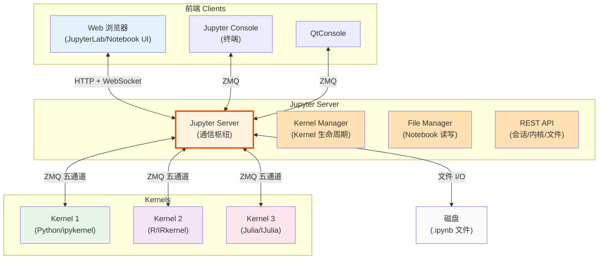
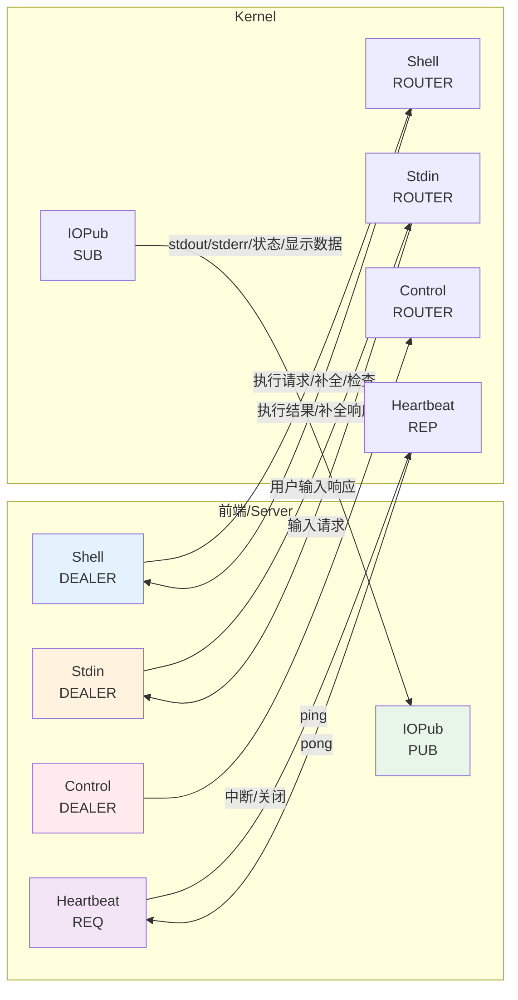
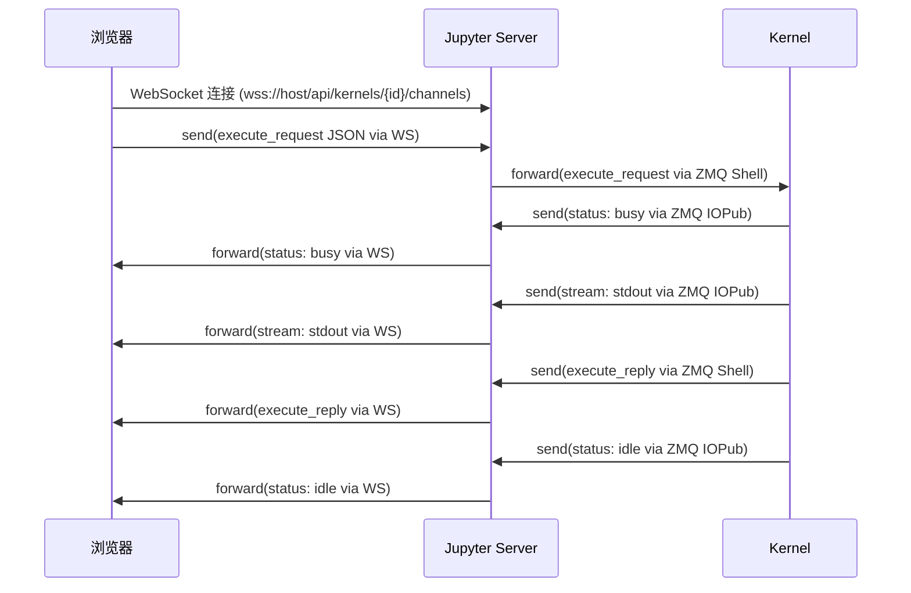
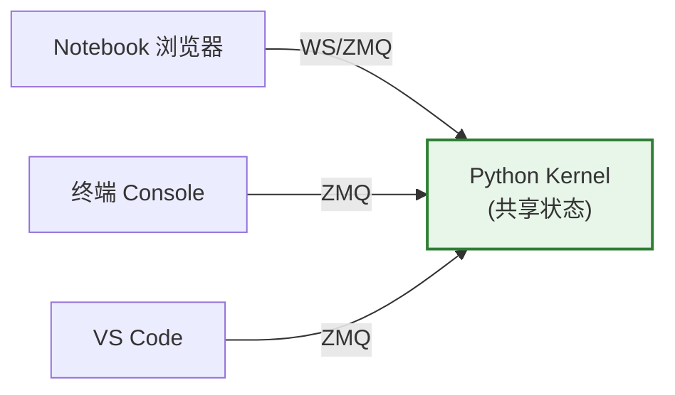

# 客户端-服务器架构详解

Jupyter 的客户端-服务器（Client-Server）架构是其灵活性和可扩展性的根基。理解这个架构的关键是认识到 Jupyter Server 是一个"通信枢纽"而非"执行引擎"。

## 三角色模型

Jupyter 架构中有三个明确分离的角色，三者之间不能直接通信，必须经过 Server 中转：



### 三者不能直接通信

这是架构的核心约束：

1. **浏览器 ↔ Kernel**：浏览器不能直接与 Kernel 对话。浏览器用 HTTP/WebSocket，Kernel 用 ZMQ，协议不同
2. **浏览器 ↔ 磁盘**：浏览器不能直接读写服务器文件系统（安全限制）
3. **Kernel ↔ 磁盘**：Kernel 不知道 Notebook 文件的存在，Kernel 工作目录由 Server 设置但 Kernel 本身不解析 .ipynb

所有交互都必须经过 Server 中转。

### Server 的职责

Jupyter Server 是整个系统的中枢，负责：

| 职责 | 模块 | 说明 |
|------|------|------|
| **Kernel 生命周期管理** | KernelManager | 启动、关闭、重启 Kernel，维护 Kernel 注册表 |
| **消息路由** | KernelWebsocket | WebSocket ↔ ZMQ 协议转换和消息转发 |
| **Notebook 文件管理** | ContentsManager | 读写 .ipynb 文件、目录列表、检查点 |
| **会话管理** | Session Manager | 追踪 Notebook 与 Kernel 的关联 |
| **REST API** | API Handlers | 提供 HTTP API 给前端调用 |
| **认证与安全** | Auth | Token/密码认证、CORS、来源校验 |
| **静态文件服务** | Static Files | 提供前端 HTML/CSS/JS |

### Server 不执行代码

一个重要的认知点：**Jupyter Server 本身不执行任何用户代码**。代码执行完全在 Kernel 进程中。Server 只负责：

- 启动 Kernel 进程
- 将前端发来的代码转发给 Kernel
- 将 Kernel 的输出转发给前端
- 管理文件和会话

这也是为什么 Jupyter Server 崩溃不会丢失 Kernel 中的变量——只要 Kernel 进程还在，重启 Server 后可以重新连接到现有 Kernel。

## ZeroMQ 五通道通信

Kernel 与 Server（及其他前端）之间通过 [ZeroMQ](http://zeromq.org/)（ZMQ）套接字通信，使用五个独立的通道：



### Shell 通道（请求-响应）

Shell 通道是主要的交互通道，用于代码执行和代码内省请求：

| 请求消息 | 说明 |
|---------|------|
| `execute_request` | 请求执行一段代码 |
| `complete_request` | 代码补全请求（Tab 补全） |
| `inspect_request` | 对象内省（`?`/`??` 帮助） |
| `history_request` | 获取历史输入 |
| `kernel_info_request` | 获取 Kernel 信息 |
| `comm_info_request` | 获取 Comm（通信通道）信息 |

每个 Shell 请求都有对应的 `_reply` 响应。

### IOPub 通道（广播）

IOPub 是发布-订阅（Pub-Sub）通道，Kernel 广播所有输出和状态更新，所有订阅者都会收到：

| 消息类型 | 说明 |
|---------|------|
| `stream` | stdout/stderr 输出文本 |
| `display_data` | 富媒体显示数据（图表、HTML等） |
| `execute_result` | 执行结果（最后一个表达式的值） |
| `error` | 异常和错误信息 |
| `status` | Kernel 状态变化（`busy`/`idle`/`starting`） |
| `clear_output` | 清除前端显示的输出 |

当你在 Notebook 中看到 `In [*]:`（执行中），是因为 Kernel 发送了 `status: busy`；执行完成后变为 `In [1]:` 是因为收到了 `status: idle`。

### Stdin 通道（标准输入）

当代码调用 `input()` 函数时，Kernel 通过 Stdin 通道向前端请求用户输入：

1. Kernel 发送 `input_request` 到前端
2. 前端显示输入框
3. 用户输入后，前端发送 `input_reply` 返回给 Kernel

### Control 通道（控制命令）

Control 通道与 Shell 通道类似，但优先级更高，用于控制命令：

- 中断 Kernel 执行（`interrupt_request`，类似 Ctrl+C）
- 关闭 Kernel（`shutdown_request`）
- 调试器请求（`debug_request`）

Control 通道与 Shell 分离，是为了确保即使 Shell 通道被长耗时代码阻塞，控制命令（如中断）仍能到达 Kernel。

### Heartbeat 通道（心跳）

Heartbeat 是简单的请求-响应通道，用于检测 Kernel 是否存活：

- 前端/Server 定期发送 ping
- Kernel 立即回复 pong
- 如果超时无响应，判定 Kernel 已崩溃或无响应

## 消息格式

所有 Jupyter 消息都是 JSON 对象，统一信封格式：

```json
{
  "header": {
    "msg_id": "unique-message-id",
    "username": "username",
    "session": "session-id",
    "date": "2024-01-01T00:00:00Z",
    "msg_type": "execute_request",
    "version": "5.4"
  },
  "parent_header": {},
  "metadata": {},
  "content": {},
  "buffers": []
}
```

| 字段 | 说明 |
|------|------|
| `header` | 消息元数据：唯一ID、消息类型、会话ID、协议版本 |
| `parent_header` | 对于响应消息，引用触发此响应的请求的 header |
| `metadata` | 附加元数据 |
| `content` | 消息体内容（因消息类型而异） |
| `buffers` | 二进制数据缓冲区（如图像二进制数据） |

### execute_request 示例

```json
{
  "header": {
    "msg_id": "execute-1",
    "msg_type": "execute_request"
  },
  "content": {
    "code": "print('hello')",
    "silent": false,
    "store_history": true,
    "user_expressions": {},
    "allow_stdin": true,
    "stop_on_error": true
  }
}
```

## WebSocket 代理

Web 浏览器通过 WebSocket 与 Jupyter Server 通信（不是直接使用 ZMQ）。Server 的 WebSocket Handler 负责协议转换：



WebSocket 连接将五个 ZMQ 通道复用到单一 WebSocket 连接上，通过消息的 `channel` 字段区分。

## REST API

除了 WebSocket 消息通道，Jupyter Server 还提供 REST API：

| 端点 | 方法 | 说明 |
|------|------|------|
| `/api/kernels` | GET/POST | 列出/启动 Kernel |
| `/api/kernels/{id}` | GET/DELETE | 获取/关闭 Kernel |
| `/api/kernels/{id}/channels` | WebSocket | 建立消息通道 |
| `/api/sessions` | GET/POST/PATCH | 会话管理（Notebook↔Kernel 关联） |
| `/api/contents/{path}` | GET/PUT/POST/DELETE | 文件/目录操作 |
| `/api/terminals` | GET/POST | 终端管理 |

```bash
# 示例：通过 API 列出运行中的 Kernel
curl http://localhost:8888/api/kernels?token=<token>
```

## 一个内核，多个前端

由于 ZMQ 的 ROUTER-DEALER 模式支持多对一通信，一个 Kernel 可以同时连接多个前端：



使用场景：

1. 在 Notebook 中运行代码后，用 `jupyter console --existing` 在终端中检查变量
2. 用 IDE 连接到远程服务器上的 Kernel 进行调试
3. 多人协作场景中，多个用户连接到同一个 Kernel

## 安全与认证

Jupyter Server 内置安全机制：

- **Token 认证**：默认生成随机 token，通过 URL 参数或 `?token=` 传递
- **密码认证**：使用 `jupyter server password` 设置密码，密码以哈希形式存储
- **CORS 控制**：`allow_origin` 配置允许的来源
- **HTTPS**：可配置 SSL 证书启用加密连接
- **禁用功能**：可配置禁用文件下载、终端等功能

## 相关概念

- [什么是计算笔记本与 Jupyter 核心架构](01-what-is-jupyter.md) — C/S 架构基本概念
- [Kernel 架构](06-kernel-architecture.md) — Kernel 端的实现细节
- [通用配置系统](04-config-system.md) — Server 配置（ServerApp 配置项）
- [目录结构与文件位置](05-directories.md) — 连接文件与运行时目录
