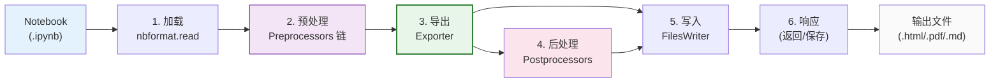

# Notebook 作为文档与转换（nbconvert）

Jupyter Notebook 不只是一个编程工具，它遵循 Donald Knuth 提出的 **Literate Computing（文学化编程/文学化计算）** 理念——代码、叙述性文本、数学公式、可视化结果交织在同一个文档中。[nbconvert](https://nbconvert.readthedocs.io) 包让 Notebook 可以转换为多种输出格式，用于分享、出版、报告和协作。

## Literate Computing 理念

Literate Computing 的核心思想是：**计算过程应该像文学作品一样被人类阅读和理解**，而不仅是被机器执行。

在 Notebook 中，这体现为：

- **Markdown 单元格**提供叙述、解释、背景知识（相当于"散文"）
- **Code 单元格**提供可执行的计算（相当于"代码"）
- **输出**（图表、表格、数值结果）提供计算证据
- 三者交织，形成一份完整的"计算叙述"（computational narrative）

这使得 Notebook 成为以下场景的理想工具：

- **可复现的科学研究**：论文中的每个图表都可以追溯到生成它的代码
- **数据科学报告**：数据分析过程和结果在同一个文档中
- **教学材料**：理论解释和可执行示例结合
- **技术博客**：教程、演示、技术文章
- **书籍**：使用 [Jupyter Book](https://jupyterbook.org) 构建完整书籍

## nbconvert 六阶段执行流程

nbconvert 将 Notebook 转换为其他格式的过程分为六个顺序执行的阶段：



| 阶段 | 模块 | 说明 |
|------|------|------|
| 1. 加载 | `nbformat.read()` | 将 .ipynb JSON 加载为 NotebookNode 对象 |
| 2. 预处理 | Preprocessor 链 | 按顺序应用一系列预处理操作（执行代码、移除单元格、标记等） |
| 3. 导出 | Exporter | 使用 Jinja2 模板将 Notebook 渲染为目标格式 |
| 4. 后处理 | Postprocessor | 对导出结果做后处理（如 PDF 后处理调用 LaTeX 编译） |
| 5. 写入 | FilesWriter | 将结果写入磁盘，提取图片等资源到子目录 |
| 6. 响应 | 返回输出 | 返回转换后的文件路径或内容 |

## 支持的输出格式

| 格式 | `--to` 参数 | Exporter | 说明 |
|------|-----------|----------|------|
| HTML | `html` | HTMLExporter | 静态 HTML 网页 |
| LaTeX | `latex` | LatexExporter | LaTeX 源文件（可编译为 PDF） |
| PDF | `pdf` | PDFExporter | 通过 LaTeX 编译生成 PDF |
| Markdown | `markdown` | MarkdownExporter | Markdown 文档 |
| reStructuredText | `rst` | RSTExporter | Sphinx 文档 |
| 执行 Notebook | `notebook` | NotebookExporter | 执行后的 .ipynb（输出已填充） |
| Python 脚本 | `script` | PythonExporter | 提取代码为 .py 文件 |
| ASCIIDoc | `asciidoc` | ASCIIDocExporter | AsciiDoc 格式 |
| 自定义 | 自定义 Exporter | 自定义 | 用户定义的 Exporter |

## 命令行使用

```bash
# 基本转换
jupyter nbconvert --to html notebook.ipynb

# 指定输出文件名
jupyter nbconvert --to html --output report.html notebook.ipynb

# 转换为 PDF（需要 LaTeX 安装）
jupyter nbconvert --to pdf notebook.ipynb

# 执行 Notebook 后再转换（包含最新输出）
jupyter nbconvert --to html --execute notebook.ipynb

# 指定执行超时（秒）
jupyter nbconvert --to html --execute --ExecutePreprocessor.timeout=120 notebook.ipynb

# 转换为 Markdown（图片提取到 files/ 子目录）
jupyter nbconvert --to markdown notebook.ipynb

# 转换为 Python 脚本
jupyter nbconvert --to script notebook.ipynb
# 输出 notebook.py，Markdown 单元格变为注释
```

### 常用选项

| 选项 | 说明 |
|------|------|
| `--execute` | 转换前执行所有代码单元格 |
| `--inplace` | 原地执行 Notebook（覆盖原文件，用于更新输出） |
| `--allow-errors` | 执行出错时继续（默认遇到错误停止） |
| `--no-input` | 隐藏代码单元格（只显示输出） |
| `--no-prompt` | 隐藏 In [ ]/Out [ ] 提示 |
| `--template <name>` | 使用自定义模板 |
| `--template-file <file>` | 指定模板文件 |
| `--output-dir <dir>` | 输出目录 |

## Exporter 与模板系统

Exporter 是 nbconvert 的核心，它使用 Jinja2 模板引擎渲染 Notebook。

### 模板层级

nbconvert 使用三层模板继承结构：

```
base.tplx（骨架：定义单元格、输出的基础结构）
  └── <format>/base.tpln.tplx（格式基础：HTML/LaTeX/Markdown 特有标签）
      └── <format>/<style>.tplx（风格模板：lab/classic 等）
          └── 用户自定义模板
```

- `.tplx` 模板使用 Jinja2 语法
- 模板可以通过 block 覆盖来定制输出
- JupyterLab 和 classic Notebook 有不同的默认样式模板

### 自定义模板示例

创建 `mytemplate.tpl`：

```html+jinja



{{ super() }}
<style>
/* 自定义 CSS */
body { max-width: 900px; margin: auto; }
</style>



{# 隐藏包含 "hide" 标签的代码单元格 #}

{{ super() }}


```

使用自定义模板：

```bash
jupyter nbconvert --to html --template-file mytemplate.tpl notebook.ipynb
```

## Preprocessor 预处理链

Preprocessor 在导出之前按顺序对 Notebook 进行修改。默认的 Preprocessor 链：

| Preprocessor | 作用 |
|-------------|------|
| `ExecutePreprocessor` | 执行所有代码单元格（`--execute` 时启用） |
| `TagRemovePreprocessor` | 根据标签移除单元格/输入/输出 |
| `ClearOutputPreprocessor` | 清除所有输出 |
| `RegexRemovePreprocessor` | 按正则模式移除单元格 |
| `CSSHTMLHeaderPreprocessor` | 注入 CSS 样式到 HTML 输出 |
| `HighlightMagicsPreprocessor` | 处理 IPython magic 命令语法高亮 |
| `ExtractOutputPreprocessor` | 提取图片等二进制输出为单独文件 |

### 使用单元格标签控制输出

在单元格元数据中设置 `tags`，nbconvert 会根据标签处理：

```json
{
  "cell_type": "code",
  "metadata": {"tags": ["hide-input"]}
}
```

```bash
# 隐藏所有标记为 hide-input 的代码单元格
jupyter nbconvert --to html \
  --TagRemovePreprocessor.remove_input_tags='{"hide-input"}' \
  notebook.ipynb

# 隐藏所有标记为 hide-output 的输出
jupyter nbconvert --to html \
  --TagRemovePreprocessor.remove_output_tags='{"hide-output"}' \
  notebook.ipynb

# 隐藏标记为 remove-cell 的整个单元格
jupyter nbconvert --to html \
  --TagRemovePreprocessor.remove_cell_tags='{"remove-cell"}' \
  notebook.ipynb
```

### papermill：参数化 Notebook

[papermill](https://papermill.readthedocs.io) 是一个基于 nbconvert 的工具，支持 Notebook 参数化执行：

1. 在 Notebook 中标记参数单元格（添加 `parameters` 标签）
2. 命令行传入不同参数值
3. papermill 将参数注入 Notebook，执行并保存结果

```bash
# 参数化执行
papermill input.ipynb output.ipynb -p name "World" -p threshold 0.5
```

这对于批量生成报告、自动化数据管道非常有用。

## Python API

nbconvert 也提供 Python API 用于编程式转换：

```python
import nbformat
from nbconvert import HTMLExporter

# 读取 Notebook
nb = nbformat.read('notebook.ipynb', as_version=4)

# 创建 Exporter
html_exporter = HTMLExporter()
html_exporter.exclude_input_prompt = True  # 隐藏 In[1] 提示

# 转换
(body, resources) = html_exporter.from_notebook_node(nb)

# body 是 HTML 字符串
# resources 包含图片等资源
with open('output.html', 'w', encoding='utf-8') as f:
    f.write(body)

# 保存关联资源（图片等）
from nbconvert.writers import FilesWriter
writer = FilesWriter(build_directory='output')
writer.write(body, resources, notebook_name='output')
```

### 执行 + 转换

```python
from nbconvert.preprocessors import ExecutePreprocessor
import nbformat

nb = nbformat.read('notebook.ipynb', as_version=4)
ep = ExecutePreprocessor(timeout=60, kernel_name='python3')
ep.preprocess(nb, {'metadata': {'path': '.'}})

# 执行后转换为 HTML
html_exporter = HTMLExporter()
body, resources = html_exporter.from_notebook_node(nb)
```

## PDF 导出的依赖

PDF 导出需要 LaTeX 环境，因为 nbconvert 的 PDF 流程是：

```
Notebook → LaTeX (.tex) → xelatex/pdflatex → PDF (.pdf)
```

需要安装 TeX 发行版：
- Linux: TeX Live（`sudo apt install texlive-xetex texlive-fonts-recommended texlive-plain-generic`）
- macOS: MacTeX
- Windows: MiKTeX 或 TeX Live

如果 LaTeX 安装有困难，也可以通过浏览器打印 HTML 版本为 PDF，或使用 [webpdf 导出](https://nbconvert.readthedocs.io/en/latest/usage.html#webpdf)（通过 Chromium headless 渲染）：

```bash
jupyter nbconvert --to webpdf notebook.ipynb
```

## 相关概念

- [Notebook 文件格式（.ipynb）](07-notebook-format.md) — Notebook 数据结构
- [Jupyter 生态架构总览](02-ecosystem-architecture.md) — nbconvert 在生态中的位置
- [Kernel 架构](06-kernel-architecture.md) — ExecutePreprocessor 如何执行代码
- [交互式控件与富显示](09-widgets-display.md) — Widget 输出在转换中的处理
