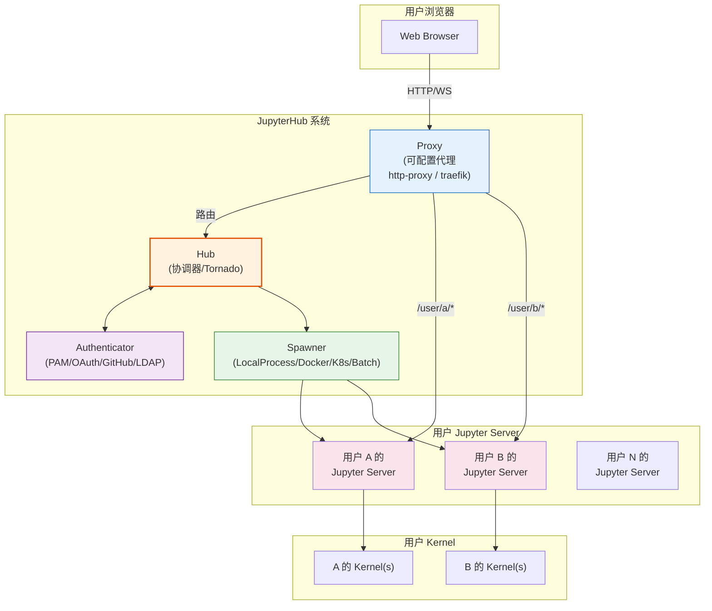
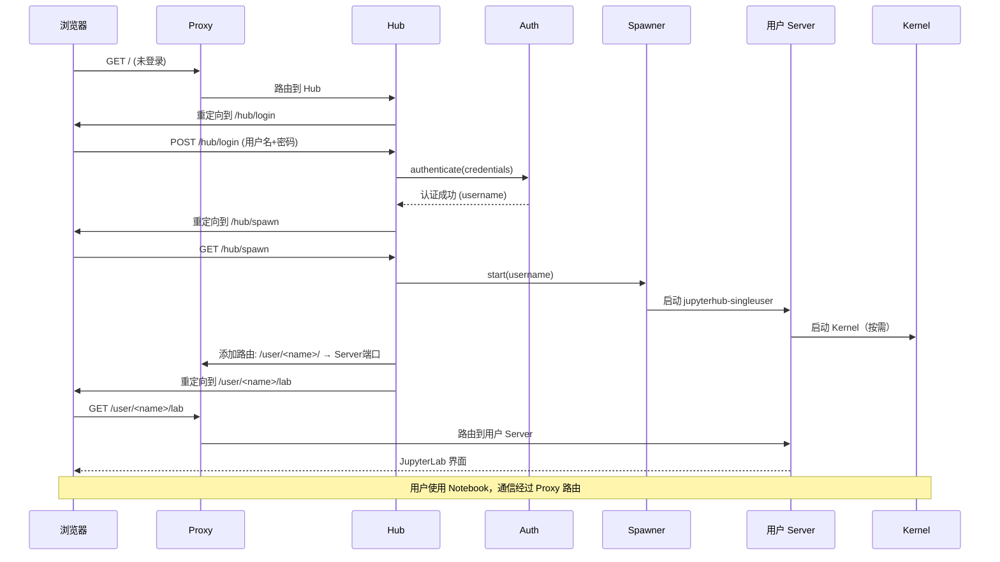
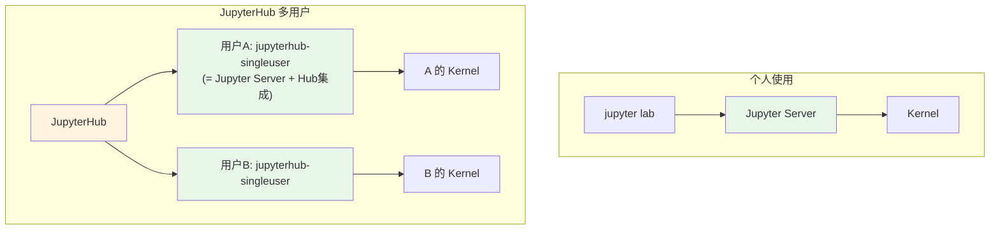

# JupyterHub 多用户部署

[JupyterHub](https://jupyterhub.readthedocs.io) 为多个用户提供 Jupyter Notebook/Lab 环境，解决"如何让一组用户（学生、团队成员、研究人员）在同一台服务器或集群上使用 Jupyter"的问题。

## 为什么需要 JupyterHub

单机运行的 `jupyter notebook` / `jupyter lab` 适合个人使用，但在以下场景中不够用：

- **教学班级**：50 个学生同时使用 Notebook，每人需要独立的环境
- **团队协作**：团队成员需要访问共享计算资源
- **企业/研究机构**：需要集中管理用户、资源和访问控制
- **HPC/集群**：需要在计算集群上启动 Notebook 会话
- **云服务**：Jupyter 作为云服务提供（如 Google Colab、AWS SageMaker 类似模式）

JupyterHub 解决的核心问题：

1. **用户认证**：支持 Linux 系统用户、OAuth、GitHub、LDAP 等多种认证方式
2. **会话管理**：为每个登录用户启动独立的 Jupyter Server 实例
3. **资源隔离**：用户之间互不干扰，可配置资源限制
4. **URL 路由**：通过代理将请求路由到正确用户的 Server
5. **生命周期管理**：空闲会话自动关闭、用户数据持久化

## 四个核心子系统

JupyterHub 由四个核心组件构成：



### 1. Hub（协调器）

Hub 是 JupyterHub 的中央协调器，基于 Tornado Web 框架：

- 处理用户登录、认证流程
- 管理用户会话和 Server 实例
- 协调 Proxy 更新路由表
- 提供管理 API 和管理界面
- 处理事件（Server 启动、停止、用户活动等）

Hub 本身**不执行用户代码**，也不直接服务 Notebook UI，它只负责协调。

### 2. Proxy（代理）

Proxy 是所有用户请求的入口点：

- 监听公共端口（通常是 80/443 或 8000）
- 将 `/user/<username>/...` 路径的请求路由到对应 Web 浏览器的 Server
- 将 `/hub/...` 路径的请求路由到 Hub 本身
- 支持动态添加/删除路由（用户登录/登出时）

可配置的代理实现：

| Proxy | 适用场景 |
|-------|---------|
| **configurable-http-proxy** | 默认，基于 Node.js，适合中小型部署 |
| **traefik-proxy** | 基于 Traefik，支持 etcd/Consul，适合 Docker/K8s 部署 |
| **kube-proxy** | Kubernetes Ingress |

### 3. Authenticator（认证器）

Authenticator 负责用户身份验证：

| Authenticator | 认证方式 |
|--------------|---------|
| **PAM**（默认） | Linux 系统用户认证 |
| **Dummy** | 测试用，任意用户名+密码 |
| **OAuthenticator** | OAuth2/OIDC（GitHub、Google、Azure AD 等） |
| **LDAP** | LDAP/Active Directory |
| **LTI** | 学习工具互操作性（LMS 集成如 Canvas、Moodle） |
| **FirstUse** | 首次登录设置密码 |
| **Native** | 内置用户注册和密码管理 |
| **GenericOAuthenticator** | 通用 OAuth2 提供商 |

自定义 Authenticator 只需继承 `Authenticator` 类并实现 `authenticate()` 方法。

### 4. Spawner（启动器）

Spawner 负责为用户启动和管理单用户 Jupyter Server 实例，是部署架构中最灵活的组件：

| Spawner | 启动方式 | 适用场景 |
|---------|---------|---------|
| **LocalProcessSpawner**（默认） | 本地进程 | 单服务器、简单部署 |
| **DockerSpawner** | Docker 容器 | 每个用户一个容器，环境隔离 |
| **DockerSpawner (systemd)** | Docker + systemd | 本地 Docker 部署 |
| **KubeSpawner** | Kubernetes Pod | 云原生/大规模集群部署 |
| **BatchSpawner** | HPC 批处理系统（SLURM/PBS） | 超算/HPC 环境 |
| **SSH Spawner** | SSH 远程启动 | 远程服务器部署 |
| **Custom** | 自定义 | 按需实现 |

Spawner 的关键职责：
- 创建用户环境（进程/容器/Pod）
- 启动 `jupyterhub-singleuser` 命令（一个扩展的 Jupyter Server）
- 等待 Server 就绪
- 监控 Server 状态
- 停止/清理 Server

## 架构流程：用户登录到使用



## 部署模式

### 1. 单机部署（The Littlest JupyterHub, TLJH）

适合 0-100 用户的小团队或班级：

- 单台虚拟机/物理机
- 每个用户是一个 Linux 系统用户
- 使用 LocalProcessSpawner 或 DockerSpawner
- 一键安装脚本：

```bash
curl -L https://tljh.jupyter.org/bootstrap.py | sudo python3 -
```

### 2. Docker 部署（DockerSpawner）

每个用户一个 Docker 容器，环境完全隔离：

- 用户环境由 Docker 镜像定义
- 支持持久化卷存储用户数据
- DockerSpawner 或 DockerSpawner（Swarm 模式）

### 3. Kubernetes 部署（Zero to JupyterHub, Z2JH）

适合大规模（数百到数千用户）生产部署：

- 基于 Kubernetes 的 Helm Chart
- 每个用户一个 Pod
- 弹性伸缩、资源配额、GPU 支持
- 与云存储（S3/GCS/PVC）集成
- 这是企业级部署的推荐方案

```bash
# 使用 Helm 安装
helm repo add jupyterhub https://jupyterhub.github.io/helm-chart/
helm install jupyterhub jupyterhub/jupyterhub --version=<version> -f config.yaml
```

### 4. HPC 部署（BatchSpawner）

与 SLURM、PBS/TORQUE、LSF、Grid Engine 等 HPC 调度系统集成：

- 用户登录后在计算节点上启动 Jupyter
- 作业结束后自动关闭
- 适合学术超算中心

## 关键配置概念

### 用户隔离

JupyterHub 的核心安全承诺是**用户隔离**：

- 用户 A 不能访问用户 B 的 Notebook 或 Kernel
- 每个用户的 Server 进程以该用户身份运行（LocalProcessSpawner）
- Docker/K8s 模式下通过容器/Pod 实现更强隔离
- 用户数据通过文件系统权限或持久卷隔离

### 资源限制

| Spawner | 资源限制方式 |
|---------|------------|
| LocalProcess | cgroups/systemd |
| Docker | `--memory`、`--cpus` 等容器参数 |
| Kubernetes | Pod resources (CPU/memory/GPU limits) |
| BatchSpawner | 批处理队列配置 |

### 持久化存储

- **单机部署**：用户的 home 目录 `/home/<username>/` 自动持久化
- **Docker**：挂载 Docker Volume 或绑定挂载主机目录
- **Kubernetes**：PersistentVolumeClaim (PVC) 挂载到 `/home/jovyan/`

### 空闲回收

JupyterHub 可以自动关闭空闲的 Server 以释放资源：

```python
# jupyterhub_config.py
c.JupyterHub.services = []
# 1小时无活动后关闭 Server
c.JupyterHub.server_shutdown_timeout = 3600
c.MappingKernelManager.cull_idle_timeout = 3600
```

## 与单用户 Jupyter Server 的关系

重要的是理解 JupyterHub 与普通 `jupyter lab` 的关系：

- JupyterHub **不替代** Jupyter Server/Lab/Notebook
- JupyterHub 是**多用户管理层**，为每个用户启动独立的 Jupyter Server
- 每个用户看到的就是标准的 JupyterLab/Notebook 界面
- `jupyterhub-singleuser` 是 Jupyter Server 的扩展版本，增加了与 Hub 的通信能力



## 反直觉要点

1. **Hub 不执行代码**：Hub 只做协调和路由，用户代码在独立的 Server 进程中执行
2. **Proxy 是唯一入口**：所有流量（包括 Hub 自身）都经过 Proxy
3. **每个用户独立 Server**：不是共享 Server 实例，而是每人一个完整的 Jupyter Server
4. **Spawner 是最灵活的组件**：从本地进程到 Kubernetes 集群，只需换一个 Spawner
5. **Docker/K8s 部署时用户数据不丢失**：容器/Pod 是临时的，但用户数据通过持久卷存储
6. **JupyterHub 不包含 Notebook/Lab**：Hub 只依赖 jupyter_core/tornado，不依赖 notebook/jupyterlab；用户镜像需要单独安装这些包
7. **认证≠授权**：认证（你是谁）和授权（你能做什么）是分开的，Authenticator 处理认证，Spawner 配置和 admin_users 处理授权

## 相关概念

- [Jupyter 生态架构总览](02-ecosystem-architecture.md) — JupyterHub 在生态中的位置
- [客户端-服务器架构详解](08-client-server.md) — 单用户 Server 的架构
- [目录结构与文件位置](05-directories.md) — 用户数据目录在 JupyterHub 中的布局
