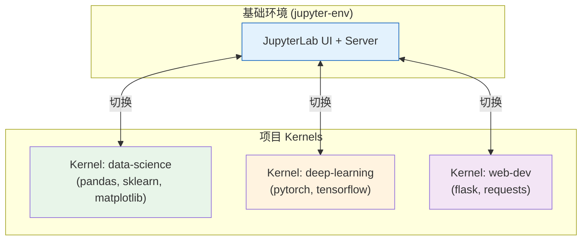

# 多环境 Kernel 管理

本示例演示如何在多个 Python 虚拟环境（venv/conda）之间切换 Jupyter Kernel，实现"一个 JupyterLab，多项目环境"的工作流。

## 前置条件

- 已安装 Python 3.9+
- 了解 [安装与环境管理](../concepts/12-installation.md) 中的概念
- 已在基础环境中安装 JupyterLab：`pip install jupyterlab`

## 工作流概述

推荐的工作流是：**在一个环境中安装 JupyterLab（UI 和 Server），为每个项目创建独立的虚拟环境并注册为 Kernel**。这样做的好处：

1. JupyterLab 只安装一次，节省磁盘空间
2. 每个项目环境独立，包版本互不冲突
3. 在 JupyterLab 中可以随时切换 Kernel，无需重启
4. 新团队成员只需安装 JupyterLab 一次



## 步骤 1：创建基础 Jupyter 环境

如果你还没有安装 JupyterLab 的环境，先创建一个：

### 使用 venv

```bash
# 创建基础环境
python -m venv ~/jupyter-env

# 激活
# Linux/macOS:
source ~/jupyter-env/bin/activate
# Windows:
# ~\jupyter-env\Scripts\activate

# 安装 JupyterLab
pip install jupyterlab

# 验证
jupyter lab --version
```

### 使用 conda

```bash
# 创建 conda 环境
conda create -n jupyter-env python=3.12 jupyterlab
conda activate jupyter-env
```

## 步骤 2：为项目创建虚拟环境并注册 Kernel

假设你有两个项目：一个数据分析项目，一个深度学习项目。

### 项目 1：数据分析环境（venv）

```bash
# 创建项目环境
python -m venv ~/envs/data-science
source ~/envs/data-science/bin/activate  # Windows: ~\envs\data-science\Scripts\activate

# 安装项目依赖和 ipykernel
pip install ipykernel pandas numpy scikit-learn matplotlib seaborn

# 将此环境注册为 Jupyter Kernel
python -m ipykernel install --user --name data-science --display-name "Python (Data Science)"

deactivate
```

### 项目 2：深度学习环境（conda）

```bash
# 创建 conda 环境
conda create -n deep-learning python=3.12
conda activate deep-learning

# 安装依赖
conda install pytorch torchvision pytorch-cuda=12.1 -c pytorch -c nvidia
pip install ipykernel jupyter  # ipykernel 用于注册 kernel

# 注册 Kernel
python -m ipykernel install --user --name deep-learning --display-name "Python (Deep Learning)"

conda deactivate
```

### 项目 3：最小测试环境

```bash
python -m venv ~/envs/minimal-test
source ~/envs/minimal-test/bin/activate
pip install ipykernel
python -m ipykernel install --user --name minimal-test --display-name "Python (Minimal)"
deactivate
```

## 步骤 3：验证 Kernel 注册

查看所有已注册的 Kernel：

```bash
# 在基础环境（或任何环境）中
jupyter kernelspec list
```

输出类似：

```
Available kernels:
  data-science       /home/user/.local/share/jupyter/kernels/data-science
  deep-learning      /home/user/.local/share/jupyter/kernels/deep-learning
  jupyter-env        /home/user/.local/share/jupyter/kernels/python3
  minimal-test       /home/user/.local/share/jupyter/kernels/minimal-test
```

查看某个 Kernel 的 kernelspec 内容：

```bash
cat ~/.local/share/jupyter/kernels/data-science/kernel.json
```

输出示例：

```json
{
  "argv": ["/home/user/envs/data-science/bin/python", "-m", "ipykernel_launcher", "-f", "{connection_file}"],
  "display_name": "Python (Data Science)",
  "language": "python",
  "metadata": {"debugger": true}
}
```

注意 `argv[0]` 指向项目环境的 Python 解释器——这是 Kernel 正确运行在项目环境中的关键。

## 步骤 4：在 JupyterLab 中切换 Kernel

1. 启动 JupyterLab（在基础环境中）：

```bash
# 激活基础环境
source ~/jupyter-env/bin/activate
jupyter lab
```

2. 创建或打开一个 Notebook
3. 切换 Kernel：
   - 点击右上角的 Kernel 名称（如 "Python 3"）
   - 在弹出菜单中选择目标 Kernel（如 "Python (Data Science)"）
   - 或通过菜单：Kernel → Change Kernel

4. 验证当前 Kernel：在 Notebook 中执行：

```python
import sys
print(f"Python 路径: {sys.executable}")
print(f"Python 版本: {sys.version}")

# 验证包是否可用
import pandas; print(f"pandas: {pandas.__version__}")
```

`sys.executable` 应该指向对应项目环境的 Python 路径。

## 步骤 5：在同一个 Notebook 中使用不同 Kernel

你可以同时打开多个 Notebook，每个使用不同的 Kernel：

- Notebook `analysis.ipynb` → Kernel "Python (Data Science)"
- Notebook `model.ipynb` → Kernel "Python (Deep Learning)"
- Notebook `test.ipynb` → Kernel "Python (Minimal)"

每个 Notebook 的变量和状态独立（因为每个 Kernel 是独立进程）。

## 步骤 6：使用 %pip 和 %conda 魔法命令安装包

在 Notebook 中安装包时，使用 `%pip` 或 `%conda` 魔法命令（而非 `!pip`），确保包安装到**当前 Kernel 对应的环境**：

```python
# ✅ 正确：安装到当前 Kernel 环境
%pip install requests

# ✅ 正确：使用 conda 安装（conda 环境中）
%conda install pandas

# ❌ 不推荐：!pip 可能安装到错误的环境
# !pip install requests
```

这是因为 `%pip` 会自动使用 `sys.executable`（当前 Kernel 的 Python）来安装包。

## 步骤 7：删除不需要的 Kernel

当一个项目环境不再需要时，删除对应的 Kernel 注册：

```bash
# 删除 Kernel（不会删除虚拟环境或包）
jupyter kernelspec remove minimal-test
```

验证：

```bash
jupyter kernelspec list
# minimal-test 不再出现在列表中
```

> **注意**：`kernelspec remove` 只删除 kernelspec JSON 文件，不会删除虚拟环境或已安装的包。如果你想完全删除环境，还需要手动删除环境目录（venv）或运行 `conda remove -n deep-learning --all`（conda）。

## 使用 nb_conda_kernels 自动发现 Conda 环境

如果你主要使用 conda，可以安装 `nb_conda_kernels` 自动发现所有 conda 环境中的 Kernel，无需手动注册：

```bash
# 在基础环境（运行 JupyterLab 的环境）安装
conda install nb_conda_kernels
```

安装后，**所有包含 ipykernel 的 conda 环境**自动出现在 Kernel 列表中，无需运行 `ipykernel install`。

确保每个想作为 Kernel 使用的 conda 环境都安装了 ipykernel：

```bash
conda activate my-env
conda install ipykernel
# 无需运行 python -m ipykernel install
conda deactivate
```

## 常见问题排查

### 问题 1：Kernel 列表中看不到我注册的 Kernel

```bash
# 1. 确认 kernelspec 存在
jupyter kernelspec list

# 2. 如果不存在，重新注册（激活环境后运行）
python -m ipykernel install --user --name my-env --display-name "My Env"

# 3. 如果存在但 JupyterLab 看不到，刷新浏览器页面
```

### 问题 2：Kernel 启动失败，显示 "Kernel died"

```bash
# 1. 检查 kernel.json 中的 Python 路径是否存在
cat ~/.local/share/jupyter/kernels/my-env/kernel.json
# 验证 argv[0] 的 Python 路径有效：
/path/to/my-env/bin/python --version

# 2. 如果环境已被删除，移除无效 kernelspec
jupyter kernelspec remove my-env

# 3. 如果环境存在但缺 ipykernel，安装它
source /path/to/my-env/bin/activate
pip install ipykernel
```

### 问题 3：import 包失败但已 pip install

在 Notebook 中检查：

```python
import sys
print(sys.executable)  # 确认这是正确的环境路径
print(sys.path)        # 检查包搜索路径
```

如果 `sys.executable` 不是期望的环境路径，切换到正确的 Kernel。如果路径正确但仍 import 失败，用 `%pip install <package>` 重新安装到当前环境。

### 问题 4：环境太多，Kernel 列表很乱

定期清理不用的 Kernel：

```bash
# 列出所有 Kernel 及其路径
jupyter kernelspec list

# 删除不用的
jupyter kernelspec remove old-env1 old-env2
```

## 验证清单

完成本示例后，验证以下事项：

- [ ] 基础环境安装了 JupyterLab
- [ ] 创建了至少两个项目虚拟环境
- [ ] 每个环境安装了 ipykernel 并注册为 Kernel
- [ ] `jupyter kernelspec list` 显示所有已注册的 Kernel
- [ ] 在 JupyterLab 中可以切换不同 Kernel
- [ ] 切换 Kernel 后 `sys.executable` 指向正确的环境
- [ ] 使用 `%pip` 在当前 Kernel 中安装包成功
- [ ] 可以删除不需要的 Kernel

## 相关概念

- [安装与环境管理](../concepts/12-installation.md) — 安装方法和环境概念
- [Kernel 架构](../concepts/06-kernel-architecture.md) — Kernel 启动和生命周期
- [目录结构与文件位置](../concepts/05-directories.md) — kernelspec 存放路径
