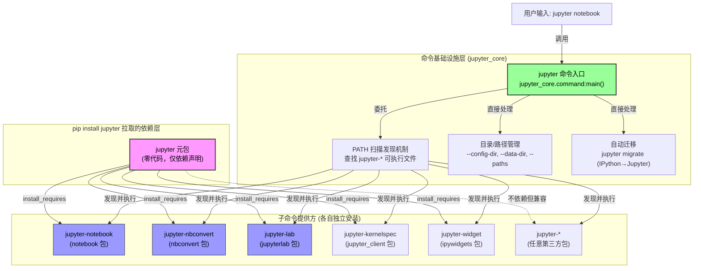

## 洞察一：Big Split 后的"空壳锚点"策略——为什么保留一个零代码包

### 发现

对源码的审查揭示了一个反直觉的事实：`jupyter` 包（版本 1.2.0.dev0）**不包含任何 Python 代码**。`setup.py` 中 `py_modules = []`（F-015），仓库中不存在 `__init__.py`、`__main__.py` 或任何 Python 源文件（F-014），也未定义 `console_scripts` 入口点（F-016）。这个包的全部内容就是一组 `install_requires` 依赖声明（F-028）和文档。

这与通常理解的"兼容性 shim"不同——它不做导入转发，不做命令委托，不提供任何运行时逻辑。它是一个纯粹的**依赖聚合器（dependency aggregator）**，在 `long_description.md` 中甚至明确警告："`jupyter` should not be used as a dependency for any packages"（F-030）。

### 深层分析

Big Split（F-039）将 IPython 3.x 的单体代码库拆分为多个独立可安装的包：

| IPython 3 模块 | 拆分后归属 |
|---|---|
| `IPython.kernel`（客户端部分） | `jupyter_client` |
| `IPython.kernel`（内核执行部分） | `ipykernel` |
| `IPython.html` | `notebook` |
| `IPython.html.widgets` | `ipywidgets` |
| `IPython.qt.console` | `qtconsole` |
| `IPython.utils.traitlets` | `traitlets` |
| 命令行入口、路径管理 | `jupyter_core` |

拆分后面临一个严峻的用户体验问题：数百万教程、书籍、课程、CI/CD 脚本中都写着 `pip install jupyter` 和 `jupyter notebook`。如果直接删除这个包名，用户输入 `pip install jupyter` 将得到"包不存在"的错误，这会造成巨大的生态断裂。

元包的存在解决了这个问题，但采用了**极简主义策略**：

1. **零代码负担**：不写 shim 代码意味着不需要维护兼容性逻辑，不存在代码腐烂风险。当子包 API 变更时，元包无需同步更新。
2. **依赖即接口**：通过 `install_requires` 列表隐式定义"Jupyter 完整安装"的含义。v1.1 加入 `jupyterlab`、移除 `qtconsole`（F-031, F-032），反映了生态重心的转移。
3. **双重角色**：此仓库同时承担元包发布和 Jupyter 官方文档站点（docs/source/）的双重职责（F-047），使得文档和依赖集合可以同步演进。
4. **低频发布**：README 明确说元包发布"happens very rarely"（F-048），因为只有当推荐的核心组件组合发生变化时才需要发版。

### 核心模式

**Facade Metapackage（外观元包）模式**：不同于 GoF Facade 模式中用一个类封装子系统接口，这里用一个零代码的 PyPI 包名作为"安装外观"，将用户从子系统的组件化复杂性中隔离出来。用户只需记住 `pip install jupyter`，无需了解 Big Split 后的包依赖图。

---

## 洞察二：命令命名空间委托——`jupyter` CLI 的去中心化架构

### 发现

`jupyter` 命令并非由此元包提供（F-035），而是由 `jupyter_core` 包定义。根据文档（F-036, F-037），`jupyter` 命令的本质是一个**subcommand 命名空间调度器**：

> Commands like `jupyter notebook` start Jupyter applications. The `jupyter` command is primarily a namespace for subcommands. A command like `jupyter-foo` found on your PATH will be available as a subcommand `jupyter foo`.

这意味着 `jupyter` CLI 采用了一种**去中心化的插件发现机制**：它不硬编码子命令列表，而是扫描 PATH 上所有 `jupyter-*` 前缀的可执行文件，自动将它们注册为子命令。

### 架构关系图

### 深层分析

这个架构有几个精妙的设计决策：

1. **命令入口与包名解耦**：名为 `jupyter` 的 PyPI 包不提供 `jupyter` 命令。提供命令的 `jupyter_core` 在包名上是"核心"角色，但在命令行上以 `jupyter` 命名空间出现。这种分离使得：
   - 卸载 notebook 但保留 jupyter_core 时，`jupyter --paths` 仍然可用（路径查询是核心功能，F-037）
   - 第三方包无需依赖 `jupyter` 元包就能注册子命令（只需将可执行文件命名为 `jupyter-xxx` 放到 PATH 上）

2. **PATH 扫描优于 setuptools entry points**：传统 Python CLI 插件通过 setuptools entry points（如 `console_scripts`）注册，这要求包必须安装在同一 Python 环境中。而 PATH 扫描机制允许：
   - 非 Python 编写的 Jupyter 工具也能注册为子命令
   - 不同环境安装的工具在同一 shell 中统一通过 `jupyter` 命名空间访问
   - 与 Unix "命令前缀即命名空间"的哲学一致（类似 `git-*` 子命令的早期实现）

3. **迁移命令内置在核心**：`jupyter migrate`（F-044）做 IPython→Jupyter 的配置文件复制，这是核心基础设施职责，而非任何单个子应用的职责，因此放在 jupyter_core 中是合理的。

4. **元包只保证"默认集合"**：元包的 5 个依赖（F-028）覆盖了最常用的子命令提供者（notebook→jupyter-notebook, nbconvert→jupyter-nbconvert, jupyterlab→jupyter-lab），但用户安装第三方扩展（如 jupyter-server, jupyter-book）后，新的 `jupyter-*` 命令会自动可用，无需元包更新。

### 核心模式

**Command Namespace Delegation（命令命名空间委托）模式**：一个轻量级的命令入口点不硬编码子命令实现，而是通过约定（可执行文件命名前缀 `{namespace}-*`）动态发现并委托给独立安装的子命令提供方。这与微内核架构（Microkernel Pattern）的思想一致——核心只提供最小基础设施（调度、路径管理、迁移），功能通过插件机制扩展。

---

## 总结

`jupyter` 元包是 Python 生态系统中"以退为进"设计哲学的典型案例：

- **代码量为零**，但价值不在代码而在于**名字的稳定性**（`pip install jupyter`）和**文档的权威性**（此仓库是 docs.jupyter.org 的源）。
- **命令不在此处**，但通过 `install_requires` 保证了默认安装的组件集合会在 PATH 上注册它们的 `jupyter-*` 子命令，使得 `jupyter notebook`、`jupyter lab` 开箱即用。
- **Big Split 的终点不是删除旧名，而是让旧名成为新架构的稳定入口**——这是开源项目在大规模重构中保护用户投资的经典策略。
