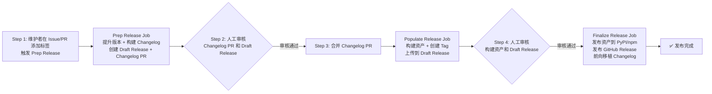

# jupyter_releaser 简介

## 一句话定义

jupyter_releaser 是一个基于 GitHub Actions 的 Python/npm 包发布工具，将复杂的发布流程拆分为三个可审核阶段（prep → populate → finalize），自动处理版本提升、changelog 生成、资产构建、PyPI/npm 上传等环节。

## 它解决什么问题

开源项目发布涉及多个容易出错的环节：
- 版本号提升需要同步多个文件（pyproject.toml、package.json、__init__.py 等）
- Changelog 需要从 PR 自动聚合，处理 backport PR 和贡献者
- Python 和 npm 包需要各自构建、校验、上传
- 发布权限需要精细控制（谁有权触发、谁有权发布到 PyPI/npm）
- 整个流程需要可审计、可回滚、可测试

jupyter_releaser 将这些环节封装为标准化的三阶段流水线，每阶段产生可审核的中间产物（draft release、构建资产、published release），支持人工干预和自动化结合。

## 两种部署模式

### 模式一：Fork 模式（推荐，安全隔离）

发布工作流运行在 `jupyter-releaser` 的 fork 仓库中，目标仓库的 admin 仅需添加标签触发。优点是 NPM_TOKEN、PYPI_TOKEN 等密钥存储在 fork 仓库，目标仓库无需配置敏感 secrets，且 `pull_request` 事件有 write 权限（可触发发布 check）。

### 模式二：仓库内模式（简单直接）

所有工作流直接运行在目标仓库中，需要手动配置 secrets 和工作流文件。适合信任度高的内部项目。

## 核心能力清单

| 能力 | 说明 |
|------|------|
| 版本提升 | 支持 tbump、hatch、bump2version、npm version，便捷指定符 next/patch/minor/dev |
| Changelog 管理 | 从 GitHub PR 自动聚合、HTML标记插入、backport PR 解析、占位符延迟填充 |
| Python 包构建 | 自动检测构建后端（hatchling/setuptools/flit等），构建 sdist + wheel |
| Python 包检查 | pip 安装验证、twine check、可选 piplite 检查 |
| npm 包构建 | npm pack，支持 workspace monorepo |
| npm 包检查 | npm pkg --dry-run + install -g 验证 |
| 资产上传 | 本地资产 + GitHub release 资产统一上传到 PyPI/npm |
| 发布 | GitHub release 从 draft 转为 published，自动处理 prerelease tag |
| Changelog 前向移植 | 将 release 分支上的 changelog 自动同步回默认分支 |
| Dry-run 测试 | 完整流程在本地 Mock 服务器上跑通，不触碰真实服务 |

## 三阶段流水线概览

**关键点**：
- 阶段之间有人工审核环节，不是全自动黑箱
- 每个阶段是独立的 GitHub Actions Job，可以运行在不同权限上下文中
- Populate 阶段需要能 push 到 main 分支，Finalize 阶段需要 PyPI/npm 发布权限

## 相关文档

- [快速开始](01-getting-started.md)
- [架构总览](02-architecture-overview.md)
- [发布流水线详解](05-release-pipeline.md)
