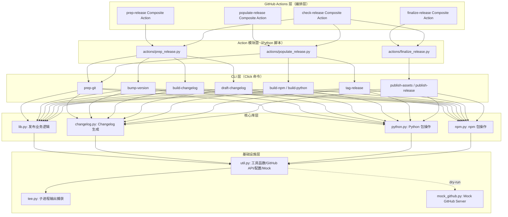
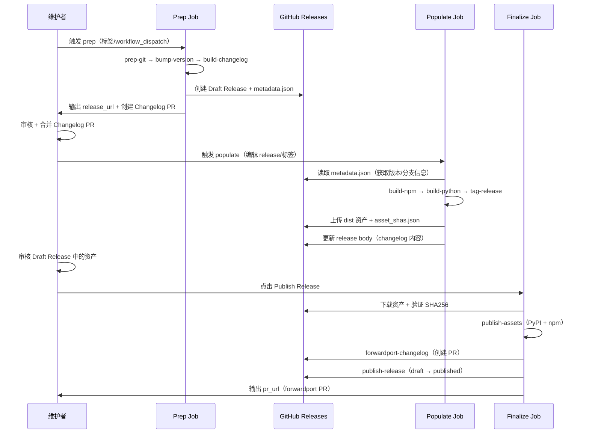

# 架构总览

## 双层架构

jupyter_releaser 采用"CLI 原语 + Actions 编排"的双层架构：



## 各层职责

### 1. GitHub Actions 层（Composite Actions）

位于 `.github/actions/`，是最终用户的主要入口。每个 composite action 是 YAML 配置，安装 jupyter-releaser 后调用对应的 Python action 模块。

| Action | 入口 YAML | 调用模块 |
|--------|----------|---------|
| `prep-release` | `action.yml`（runs: using: composite） | `python -m jupyter_releaser.actions.prep_release` |
| `populate-release` | `action.yml` | `python -m jupyter_releaser.actions.populate_release` |
| `finalize-release` | `action.yml` | `python -m jupyter_releaser.actions.finalize_release` |
| `check-release` | `action.yml` | 串联 prep + populate + finalize |

### 2. Action 模块层（Python 脚本）

位于 `jupyter_releaser/actions/`，每个模块是一个 Python 脚本，通过 `run_action()` 按顺序调用 CLI 命令，并处理阶段间的参数传递（环境变量、GitHub Actions outputs）。

```python
# prep_release.py 的典型模式
setup(fetch_draft_release=False)
run_action("jupyter-releaser prep-git")
run_action("jupyter-releaser bump-version")
run_action("jupyter-releaser build-changelog")
run_action("jupyter-releaser draft-changelog")
```

### 3. CLI 层（Click 命令）

位于 `jupyter_releaser/cli.py`，定义 19 个 `jupyter-releaser` 子命令。核心类 `ReleaseHelperGroup` 在命令调用前自动完成：

1. 切换到 checkout 工作目录
2. 读取配置（hooks/skip/options）
3. 处理 `--force` 和 `RH_STEPS_TO_SKIP`
4. 三层参数优先级解析
5. 执行 before-hooks
6. 命令执行后执行 after-hooks

### 4. 核心库层

| 模块 | 行数 | 职责 |
|------|------|------|
| `lib.py` | ~678 | 发布业务逻辑：版本提升、changelog 草稿、资产上传、release 发布等 |
| `changelog.py` | ~465 | Changelog entry 生成、PR 活动聚合、backport 处理、占位符管理 |
| `python.py` | ~197 | Python 分发包构建（build）、检查（twine check）、PyPI上传、Trusted Publishing、本地PyPI服务器 |
| `npm.py` | ~244 | npm 包构建（pack）、检查（publish --dry-run）、发布（publish）、workspace 支持 |

### 5. 基础设施层

| 模块 | 行数 | 职责 |
|------|------|------|
| `util.py` | ~753 | 子进程执行、路径常量、Git 操作、版本管理、GitHub API 封装（ghapi）、配置读取、Mock 服务 |
| `tee.py` | ~162 | 异步子进程执行，同时捕获 stdout/stderr（subprocess-tee 的修改版） |
| `mock_github.py` | ~276 | FastAPI Mock GitHub API 服务器，dry-run 模式使用 |

## 数据流方向

发布过程中，关键数据在三个阶段间流动：



### metadata.json：阶段间的关键数据载体

`metadata.json` 是 prep 阶段上传到 draft release 的 JSON 文件，populate/finalize 阶段通过 `extract_metadata_from_release_url()` 读取它并设置 `RH_*` 环境变量：

- `RH_VERSION`：版本号
- `RH_REF`：git ref（commit SHA）
- `RH_BRANCH`：分支名
- `RH_REPOSITORY`：owner/repo
- `RH_SINCE`：since 标签/提交

这就是为什么 populate 和 finalize 阶段不需要重新指定这些参数——它们从 draft release 的 metadata.json 中恢复。

## 环境变量体系

jupyter_releaser 通过环境变量传递所有配置，这是 GitHub Actions 的标准模式。核心环境变量：

| 变量 | 来源 | 用途 |
|------|------|------|
| `RH_REPOSITORY` | workflow input / metadata.json | 目标仓库 owner/name |
| `RH_BRANCH` | workflow input / metadata.json | 发布分支 |
| `RH_VERSION` | metadata.json | 当前发布版本 |
| `RH_REF` | metadata.json | 目标 commit SHA |
| `RH_DIST_DIR` | 默认 "dist" | 资产输出目录 |
| `RH_DRY_RUN` | `--dry-run` flag | Dry-run 模式开关 |
| `RH_RELEASE_URL` | prep 输出 / 手动输入 | Draft release URL |
| `GITHUB_ACCESS_TOKEN` | secrets.ADMIN_GITHUB_TOKEN | GitHub API 认证 |
| `NPM_TOKEN` | secrets.NPM_TOKEN | npm 发布令牌 |
| `PYPI_TOKEN` / `PYPI_TOKEN_MAP` | secrets | PyPI 认证 |
| `ACTIONS_ID_TOKEN_REQUEST_TOKEN` | GitHub Actions 自动注入 | OIDC Trusted Publishing |
| `GITHUB_OUTPUT` | GitHub Actions 自动注入 | 工作流输出文件路径 |
| `GITHUB_SERVER_URL` / `GITHUB_REPOSITORY` | GitHub Actions 自动注入 | 仓库上下文 |

## 相关文档

- [CLI命令详解](03-cli-commands.md)
- [配置与Hooks系统](04-config-and-hooks.md)
- [发布流水线详解](05-release-pipeline.md)
- [源码信源：cli.py](/references/cli-source.md)
