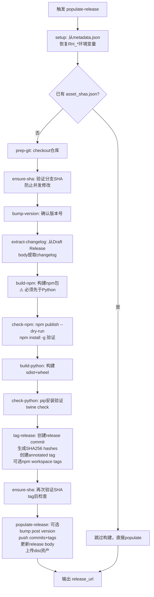
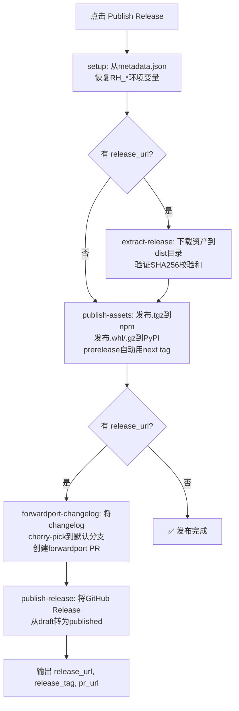

# 发布流水线详解

jupyter_releaser 将发布拆分为三个独立阶段，每个阶段是独立的 GitHub Actions Job，可以配置不同的权限和 secrets。

## 阶段总览

| 阶段 | GitHub Action | Python 模块 | 触发方式 | 主要输出 |
|------|--------------|------------|---------|---------|
| Prep | `prep-release` | `actions.prep_release` | 标签/workflow_dispatch | Draft Release + Changelog PR |
| Populate | `populate-release` | `actions.populate_release` | Release edited/标签 | 带资产的 Draft Release |
| Finalize | `finalize-release` | `actions.finalize_release` | Release published | PyPI/npm 发布 + Forwardport PR |

## 阶段一：Prep Release（准备发布）

### 执行步骤详解

```mermaid
flowchart TD
    START[触发 prep-release] --> SETUP[setup: 准备环境变量<br/>获取GitHub API连接]
    SETUP --> PG[prep-git: clone/checkout仓库<br/>配置git user/remote]
    PG --> BRANCH{RH_BRANCH 已设置?}
    BRANCH -->|否| GB[get_default_branch<br/>检测默认分支]
    BRANCH -->|是| HS
    GB --> HS[handle_since: 捕获RH_SINCE变量]
    HS --> BV[bump-version: 提升版本号<br/>更新所有版本文件]
    BV --> BC[build-changelog: 生成changelog entry<br/>插入CHANGELOG.md]
    BC --> DC[draft-changelog: 创建GitHub Draft Release<br/>上传metadata.json<br/>清理旧draft]
    DC --> OUT[输出 release_url]
    DC --> PR[创建 Changelog PR<br/>分支名: changelog-{uuid}]
```

### 关键细节

**metadata.json 内容**：
- `version`：新版本号
- `ref`：当前 commit SHA
- `branch`：分支名
- `repo`：owner/name
- `since`：起始 tag/commit

**旧 Draft 清理**：`draft_changelog()` 会自动删除超过 24 小时的非 silent draft release，避免积累垃圾 draft。

**Changelog PR**：创建一个以 UUID 后缀命名的分支（如 `changelog-a1b2c3d4`），包含 changelog 更新，提交 PR 后打上 "documentation" 标签。维护者审核这个 PR。

### Prep 阶段结束后的人工审核

- 检查 Changelog PR 中的内容是否正确
- 检查 GitHub Draft Release 的 body（changelog 预览）
- 确认版本号正确
- 确认后合并 Changelog PR

## 阶段二：Populate Release（填充发布资产）

### 执行步骤详解



### 关键细节

**为什么 build-npm 在 build-python 之前？**
Jupyter 生态中，Python 包经常包含由前端构建产生的文件（如 labextension 的静态资源）。npm 构建步骤可能产出 Python 包需要的文件，因此必须先构建 npm。

**为什么两次 ensure-sha？**
- 第一次在构建前：确保 checkout 的分支状态与 metadata.json 中的 ref 一致
- 第二次在 tag-release 后：确保从 bump-version 到 tag-release 之间没有其他人推送了新 commit（虽然概率低，但在 populate 运行期间理论上可能有新 commit）

**post version（dev 版本）**：
如果指定了 `RH_POST_VERSION_SPEC`（如 `"dev"`），populate-release 会在创建 release tag 后再 bump 一个 dev 版本（如 `1.0.0.dev0`），并将这个 commit push 到 main 分支。这样 tag 指向正式版本，main 分支继续开发。

**asset_shas.json 断点续传**：
如果 dist 目录中已有 `asset_shas.json`（说明之前已经构建过），populate 会跳过整个构建流程，直接执行 populate-release 步骤上传资产。这支持在本地手动构建后再触发 populate 的场景。

### Populate 阶段结束后的人工审核

- 检查 GitHub Draft Release 中的资产（.whl、.tar.gz、.tgz 文件）
- 下载资产验证内容
- 确认 tag 已正确创建
- 确认后点击 GitHub 的 "Publish release" 按钮

## 阶段三：Finalize Release（完成发布）

### 执行步骤详解



### 关键细节

**extract-release 的作用**：
在 publish-assets 之前先下载资产并验证 SHA256，确保即将发布到 PyPI/npm 的文件与 Draft Release 中的资产完全一致。这是一个安全检查——防止资产在 populate 和 finalize 之间被篡改。

**Forwardport Changelog**：
Release tag 上有 changelog entry 的 commit（由 tag-release 创建），但默认分支上可能没有。forwardport-changelog 将这个 changelog commit cherry-pick 到默认分支，并创建一个 PR。这样默认分支的 CHANGELOG.md 也会包含新版本的记录。

**Silent 模式**：
如果 prep 阶段使用了 `--silent` 标志（changelog 占位符模式），finalize 阶段后需要额外运行 `publish-changelog` action 来移除占位符并填充实际 changelog。

## Check Release：Dry-Run 完整检查

`check-release` composite action 串联三个阶段，但在 dry-run 模式下运行：

1. Prep（dry-run）：使用 Mock GitHub + 本地 bare 仓库
2. Populate（dry-run）：构建和验证，但不推送到真实仓库
3. Finalize（dry-run）：启动本地 PyPI 服务器，模拟发布

这用于在 PR 中验证发布流程是否正常，不触碰任何真实服务。

## 跨阶段数据传递机制

### metadata.json → 环境变量

每个阶段开始时，`setup()` → `util.prepare_environment()` → `extract_metadata_from_release_url()` 读取 draft release 中的 metadata.json，将值设置到 `RH_*` 环境变量：

```python
# util.py extract_metadata_from_release_url 逻辑
metadata = fetch_release_asset_data(metadata_asset, auth)
for key, value in metadata.items():
    env_val = os.environ.setdefault(f"RH_{key.upper()}", value)
```

这意味着 prep 阶段设置的版本、分支、SHA 等参数，populate 和 finalize 阶段不需要重新指定。

### GitHub Actions outputs

各阶段通过 `util.actions_output()` 设置 GitHub Actions outputs，写入 `$GITHUB_OUTPUT` 文件：

| 阶段 | 输出 | 用途 |
|------|------|------|
| prep | `release_url` | 下阶段需要 |
| populate | `release_url` | 下阶段需要 |
| finalize | `release_url`, `release_tag`, `pr_url` | 通知和后续操作 |

## 相关文档

- [Python与npm双生态发布](06-python-npm-dual.md)
- [Changelog系统](07-changelog-system.md)
- [GitHub Actions集成](09-github-actions.md)
- [认证体系](10-authentication.md)
